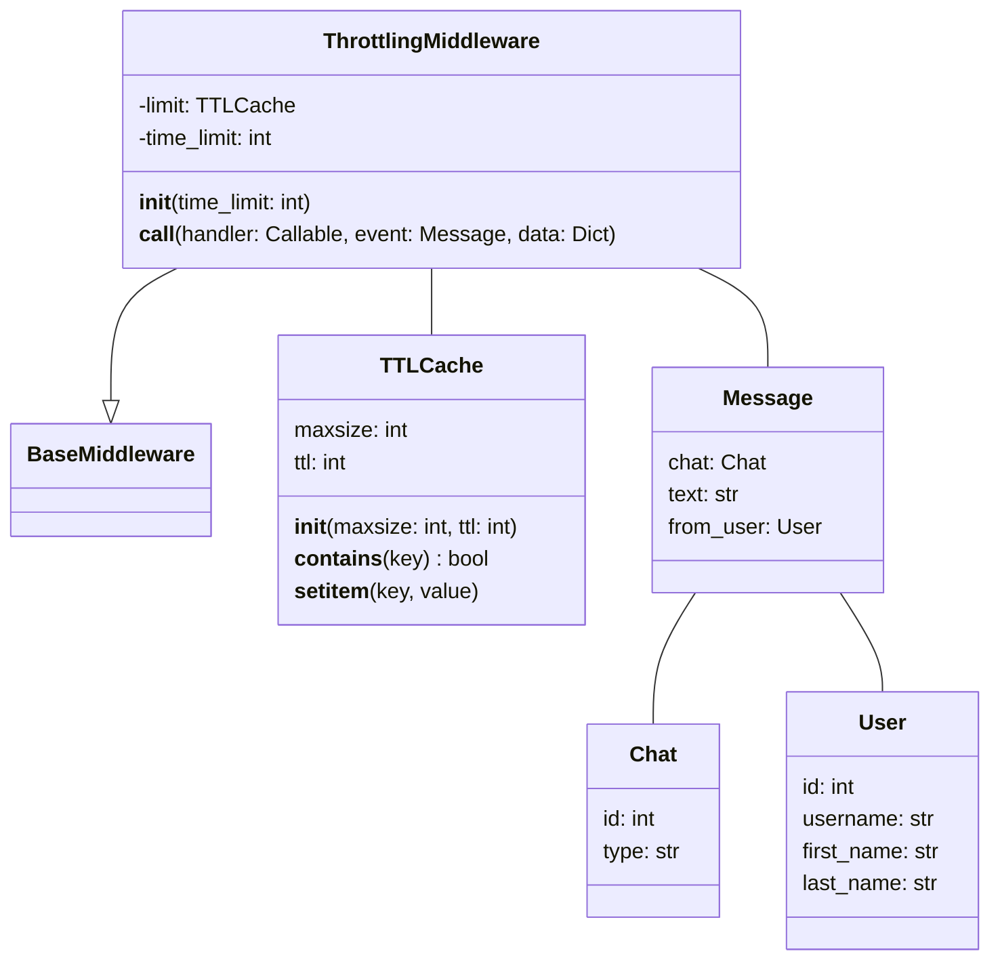

### **Анализ кода проекта `hypotez`**

=========================================================================================

**Расположение файла в проекте:** `hypotez/src/endpoints/bots/telegram/movie_bot-main/middlewares/throttling.py`

Данный файл содержит класс `ThrottlingMiddleware`, который предназначен для реализации механизма ограничения скорости обработки сообщений в Telegram-боте. Это необходимо для предотвращения злоупотреблений и защиты от перегрузки бота.

---

### **1. Блок-схема**

```mermaid
graph LR
    A[Начало обработки сообщения] --> B{Проверка наличия chat.id в кэше `self.limit`}
    B -- Да --> C[Прекращение обработки сообщения]
    B -- Нет --> D[Добавление chat.id в кэш `self.limit`]
    D --> E[Обработка сообщения handler(event, data)]
    E --> F[Конец обработки сообщения]
    C --> G[Сообщение проигнорировано из-за превышения лимита]
    G --> H[Конец]
```

**Примеры для каждого логического блока:**

- **A (Начало обработки сообщения):** Пользователь отправляет сообщение боту.
- **B (Проверка наличия chat.id в кэше `self.limit`):**
    - `Да`: Если `chat.id` пользователя уже есть в кэше, значит, с момента последнего сообщения прошло слишком мало времени.
    - `Нет`: Если `chat.id` пользователя отсутствует в кэше, значит, можно обработать сообщение.
- **C (Прекращение обработки сообщения):** Сообщение не обрабатывается, чтобы не превышать лимит.
- **D (Добавление chat.id в кэш `self.limit`):** `chat.id` пользователя добавляется в кэш, чтобы зафиксировать факт обработки сообщения.
- **E (Обработка сообщения handler(event, data)):** Вызывается обработчик сообщения.
- **F (Конец обработки сообщения):** Обработка сообщения завершена.
- **G (Сообщение проигнорировано из-за превышения лимита):** Бот игнорирует сообщение пользователя, так как он отправляет сообщения слишком часто.
- **H (Конец):**  Завершение процесса.

### **2. Диаграмма**



**Зависимости:**

- `aiogram.BaseMiddleware`: Базовый класс для создания middleware в aiogram.
- `aiogram.types.Message`: Класс, представляющий сообщение в Telegram.
- `cachetools.TTLCache`: Класс для создания кэша с автоматическим удалением элементов по истечении времени жизни (TTL).

### **3. Объяснение**

#### **Импорты:**

- `typing.Any`: Используется для обозначения типа, который может быть любым.
- `typing.Awaitable`: Используется для обозначения типа, который можно "дождаться" (например, корутина).
- `typing.Callable`: Используется для обозначения типа, который можно вызвать (например, функция).
- `typing.Dict`: Используется для обозначения типа "словарь".
- `aiogram.BaseMiddleware`: Базовый класс для создания middleware в aiogram. Middleware - это компоненты, которые перехватывают и обрабатывают события (например, сообщения) до того, как они попадут в основной обработчик.
- `aiogram.types.Message`: Класс, представляющий сообщение в Telegram. Содержит информацию об отправителе, тексте сообщения, идентификаторе чата и т.д.
- `cachetools.TTLCache`: Класс, предоставляющий реализацию кэша с ограничением по времени жизни (TTL). Элементы в кэше автоматически удаляются по истечении заданного времени.

#### **Класс `ThrottlingMiddleware`:**

- **Роль:** Реализует механизм ограничения скорости обработки сообщений.
- **Атрибуты:**
    - `limit`: Объект класса `TTLCache`, который хранит идентификаторы чатов, для которых недавно были обработаны сообщения.
    - `time_limit`: Время в секундах, в течение которого повторные сообщения от одного и того же чата будут игнорироваться. По умолчанию 2 секунды.
- **Методы:**
    - `__init__(self, time_limit: int = 2) -> None`: Конструктор класса. Инициализирует атрибут `limit` объектом `TTLCache` с заданным временем жизни.
    - `__call__(self, handler: Callable[[Message, Dict[str, Any]], Awaitable[Any]], event: Message, data: Dict[str, Any]) -> Any`:  Основной метод middleware. Вызывается при каждом получении сообщения.
        - `handler`: Функция, которая будет вызвана для обработки сообщения, если оно не было отклонено из-за превышения лимита.
        - `event`: Объект класса `Message`, представляющий полученное сообщение.
        - `data`: Дополнительные данные, которые могут быть переданы в обработчик сообщения.
        - **Логика работы:**
            1. Проверяет, есть ли идентификатор чата (`event.chat.id`) в кэше `self.limit`.
            2. Если идентификатор чата есть в кэше, значит, с момента последнего сообщения прошло слишком мало времени, и сообщение игнорируется (возвращается `None`).
            3. Если идентификатора чата нет в кэше, значит, можно обработать сообщение. Идентификатор чата добавляется в кэш, и вызывается обработчик сообщения (`handler(event, data)`).

#### **Переменные:**

- `self.limit`: Объект `TTLCache`, хранящий идентификаторы чатов и используемый для проверки, не превышен ли лимит сообщений.
- `self.time_limit`: Время в секундах, в течение которого сообщения от одного и того же чата будут ограничены.
- `handler`: Функция-обработчик сообщения.
- `event`: Объект `Message`, представляющий полученное сообщение.
- `data`: Словарь с дополнительными данными.

#### **Пример использования:**

```python
from aiogram import Dispatcher
from aiogram import Bot

# Создаем экземпляры бота и диспетчера
bot = Bot(token="YOUR_BOT_TOKEN")
dp = Dispatcher()

# Регистрируем middleware
dp.message.middleware(ThrottlingMiddleware(time_limit=3))

# Обработчик сообщений
@dp.message()
async def echo(message: Message):
    await message.answer(message.text)
```

#### **Потенциальные ошибки и области для улучшения:**

- **Обработка ошибок:** В текущей реализации middleware просто игнорирует сообщения, если превышен лимит. Можно добавить более информативную обработку, например, отправлять пользователю сообщение о том, что он отправляет сообщения слишком часто.
- **Конфигурируемость:** Можно сделать `time_limit` настраиваемым параметром для каждого чата или пользователя.
- **Логирование:**  Добавить логирование для отслеживания случаев, когда сообщения были отклонены из-за превышения лимита. В данном коде отсутствует логирование, поэтому необходимо добавить `logger.error` во все `except` блоки.

#### **Взаимосвязи с другими частями проекта:**

- Этот middleware используется в Telegram-боте (`movie_bot-main`) для ограничения скорости обработки сообщений. Он подключается к диспетчеру `aiogram` и перехватывает все входящие сообщения.
- `aiogram` используется для взаимодействия с Telegram API.
- `cachetools` используется для реализации кэша.