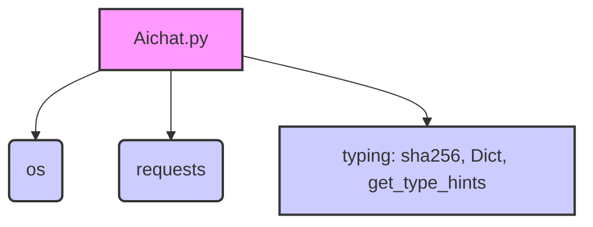

### **Системные инструкции для обработки кода проекта `hypotez`**

=========================================================================================

Описание функциональности и правил для генерации, анализа и улучшения кода. Направлено на обеспечение последовательного и читаемого стиля кодирования, соответствующего требованиям.

---

### **Основные принципы**

#### **1. Общие указания**:
- Соблюдай четкий и понятный стиль кодирования.
- Все изменения должны быть обоснованы и соответствовать установленным требованиям.

#### **2. Комментарии**:
- Используй `#` для внутренних комментариев.
- Документация всех функций, методов и классов должна следовать такому формату: 
    ```python
        def function(param: str, param1: Optional[str | dict | str] = None) -> dict | None:
            """ 
            Args:
                param (str): Описание параметра `param`.
                param1 (Optional[str | dict | str], optional): Описание параметра `param1`. По умолчанию `None`.
    
            Returns:
                dict | None: Описание возвращаемого значения. Возвращает словарь или `None`.
    
            Raises:
                SomeError: Описание ситуации, в которой возникает исключение `SomeError`.

            Ехаmple:
                >>> function('param', 'param1')
                {'param': 'param1'}
            """
    ```
- Комментарии и документация должны быть четкими, лаконичными и точными.

#### **3. Форматирование кода**:
- Используй одинарные кавычки. `a:str = 'value'`, `print('Hello World!')`;
- Добавляй пробелы вокруг операторов. Например, `x = 5`;
- Все параметры должны быть аннотированы типами. `def function(param: str, param1: Optional[str | dict | str] = None) -> dict | None:`;
- Не используй `Union`. Вместо этого используй `|`.

#### **4. Логирование**:
- Для логгирования Всегда Используй модуль `logger` из `src.logger.logger`.
- Ошибки должны логироваться с использованием `logger.error`.
Пример:
    ```python
        try:
            ...
        except Exception as ex:
            logger.error('Error while processing data', ех, exc_info=True)
    ```
#### **5 Не используй `Union[]` в коде. Вместо него используй `|`
Например:
```python
x: str | int ...
```


---

### **Основные требования**:

#### **1. Формат ответов в Markdown**:
- Все ответы должны быть выполнены в формате **Markdown**.

#### **2. Формат комментариев**:
- Используй указанный стиль для комментариев и документации в коде.
- Пример:

```python
from typing import Generator, Optional, List
from pathlib import Path


def read_text_file(
    file_path: str | Path,
    as_list: bool = False,
    extensions: Optional[List[str]] = None,
    chunk_size: int = 8192,
) -> Generator[str, None, None] | str | None:
    """
    Считывает содержимое файла (или файлов из каталога) с использованием генератора для экономии памяти.

    Args:
        file_path (str | Path): Путь к файлу или каталогу.
        as_list (bool): Если `True`, возвращает генератор строк.
        extensions (Optional[List[str]]): Список расширений файлов для чтения из каталога.
        chunk_size (int): Размер чанков для чтения файла в байтах.

    Returns:
        Generator[str, None, None] | str | None: Генератор строк, объединенная строка или `None` в случае ошибки.

    Raises:
        Exception: Если возникает ошибка при чтении файла.

    Example:
        >>> from pathlib import Path
        >>> file_path = Path('example.txt')
        >>> content = read_text_file(file_path)
        >>> if content:
        ...    print(f'File content: {content[:100]}...')
        File content: Example text...
    """
    ...
```
- Всегда делай подробные объяснения в комментариях. Избегай расплывчатых терминов, 
- таких как *«получить»* или *«делать»*. Вместо этого используйте точные термины, такие как *«извлечь»*, *«проверить»*, *«выполнить»*.
- Вместо: *«получаем»*, *«возвращаем»*, *«преобразовываем»* используй имя объекта *«функция получае»*, *«переменная возвращает»*, *«код преобразовывает»* 
- Комментарии должны непосредственно предшествовать описываемому блоку кода и объяснять его назначение.

#### **3. Пробелы вокруг операторов присваивания**:
- Всегда добавляйте пробелы вокруг оператора `=`, чтобы повысить читаемость.
- Примеры:
  - **Неправильно**: `x=5`
  - **Правильно**: `x = 5`

#### **4. Использование `j_loads` или `j_loads_ns`**:
- Для чтения JSON или конфигурационных файлов замените стандартное использование `open` и `json.load` на `j_loads` или `j_loads_ns`.
- Пример:

```python
# Неправильно:
with open('config.json', 'r', encoding='utf-8') as f:
    data = json.load(f)

# Правильно:
data = j_loads('config.json')
```

#### **5. Сохранение комментариев**:
- Все существующие комментарии, начинающиеся с `#`, должны быть сохранены без изменений в разделе «Улучшенный код».
- Если комментарий кажется устаревшим или неясным, не изменяйте его. Вместо этого отметьте его в разделе «Изменения».

#### **6. Обработка `...` в коде**:
- Оставляйте `...` как указатели в коде без изменений.
- Не документируйте строки с `...`.
```

#### **7. Аннотации**
Для всех переменных должны быть определены аннотации типа. 
Для всех функций все входные и выходные параметры аннотириваны
Для все параметров должны быть аннотации типа.


### **8. webdriver**
В коде используется webdriver. Он импртируется из модуля `webdriver` проекта `hypotez`
```python
from src.webdirver import Driver, Chrome, Firefox, Playwright, ...
driver = Driver(Firefox)

Пoсле чего может использоваться как

close_banner = {
  "attribute": null,
  "by": "XPATH",
  "selector": "//button[@id = 'closeXButton']",
  "if_list": "first",
  "use_mouse": false,
  "mandatory": false,
  "timeout": 0,
  "timeout_for_event": "presence_of_element_located",
  "event": "click()",
  "locator_description": "Закрываю pop-up окно, если оно не появилось - не страшно (`mandatory`:`false`)"
}

result = driver.execute_locator(close_banner)
```

## Анализ кода файла `hypotez/src/endpoints/freegpt-webui-ru/g4f/Provider/Providers/Aichat.py`

### 1. Блок-схема

```mermaid
graph LR
    A[Начало] --> B{Подготовка данных для запроса}
    B --> C{Формирование строки запроса из сообщений}
    C --> D{Установка заголовков HTTP-запроса}
    D --> E{Формирование JSON-данных для запроса}
    E --> F{Выполнение POST-запроса к API}
    F --> G{Обработка ответа API}
    G --> H{Извлечение сообщения из JSON-ответа}
    H --> I{Генерация сообщения}
    I --> J[Конец]

    subgraph Пример логических блоков
    style A fill:#f9f,stroke:#333,stroke-width:2px
    style B fill:#ccf,stroke:#333,stroke-width:2px
    style C fill:#ccf,stroke:#333,stroke-width:2px
    style D fill:#ccf,stroke:#333,stroke-width:2px
    style E fill:#ccf,stroke:#333,stroke-width:2px
    style F fill:#ccf,stroke:#333,stroke-width:2px
    style G fill:#ccf,stroke:#333,stroke-width:2px
    style H fill:#ccf,stroke:#333,stroke-width:2px
    style I fill:#ccf,stroke:#333,stroke-width:2px
    style J fill:#f9f,stroke:#333,stroke-width:2px
    end

    style B fill:#ccf,stroke:#333,stroke-width:2px
    B_example1[model: 'gpt-3.5-turbo']
    B_example2[messages: [{'role': 'user', 'content': 'Привет'}] ]
    B --> B_example1
    B --> B_example2

    style C fill:#ccf,stroke:#333,stroke-width:2px
    C_example1["user: Привет\nassistant:"]
    C --> C_example1

    style E fill:#ccf,stroke:#333,stroke-width:2px
    E_example1["'message': 'user: Привет\\nassistant:'"]
    E --> E_example1
    
    style F fill:#ccf,stroke:#333,stroke-width:2px
    F_example1["Выполнение POST-запроса к 'https://chat-gpt.org/api/text'"]
    F --> F_example1

    style H fill:#ccf,stroke:#333,stroke-width:2px
    H_example1["Получение значения ключа 'message' из JSON-ответа"]
    H --> H_example1

    style I fill:#ccf,stroke:#333,stroke-width:2px
    I_example1["Генерация текста сообщения"]
    I --> I_example1
```

### 2. Диаграмма



#### Объяснение зависимостей:

-   **os**: Используется для работы с операционной системой, в частности, для получения имени файла.
-   **requests**: Используется для отправки HTTP-запросов к API.
-   **typing**: Используется для аннотации типов, таких как `sha256`, `Dict`, и для получения информации о типах аргументов функции с помощью `get_type_hints`.

### 3. Объяснение

#### Импорты:

-   `import os`: Модуль `os` используется для взаимодействия с операционной системой. В данном коде он используется для получения имени файла скрипта, чтобы сформировать параметр `params`.
-   `import requests`: Модуль `requests` используется для выполнения HTTP-запросов. Здесь он используется для отправки `POST`-запроса к API `chat-gpt.org` и получения ответа.
-   `from ...typing import sha256, Dict, get_type_hints`: Импортирует типы `sha256`, `Dict` и функцию `get_type_hints` из модуля `typing`, расположенного на два уровня выше в иерархии пакетов. `get_type_hints` используется для получения аннотаций типов аргументов функции `_create_completion`. `Dict` используется для типизации словарей. `sha256` не используется в данном коде.

#### Переменные:

-   `url: str = 'https://chat-gpt.org/chat'`: URL веб-интерфейса.
-   `model: list = ['gpt-3.5-turbo']`: Список поддерживаемых моделей.
-   `supports_stream: bool = False`: Указывает, поддерживается ли потоковая передача.
-   `needs_auth: bool = False`: Указывает, требуется ли аутентификация.

#### Функция `_create_completion`:

```python
def _create_completion(model: str, messages: list, stream: bool, **kwargs):
    """
    Args:
        model (str): Модель для использования.
        messages (list): Список сообщений для отправки.
        stream (bool): Указывает, использовать ли потоковую передачу.
        **kwargs: Дополнительные параметры.

    Returns:
        Generator: Генератор текста ответа.

    Raises:
        Exception: Если возникает ошибка при выполнении запроса.

    Example:
        >>> _create_completion(model='gpt-3.5-turbo', messages=[{'role': 'user', 'content': 'Привет'}], stream=False)
        <generator object _create_completion at 0x...>
    """
    base = ''
    for message in messages:
        base += '%s: %s\n' % (message['role'], message['content'])
    base += 'assistant:'

    headers = {
        'authority': 'chat-gpt.org',
        'accept': '*/*',
        'cache-control': 'no-cache',
        'content-type': 'application/json',
        'origin': 'https://chat-gpt.org',
        'pragma': 'no-cache',
        'referer': 'https://chat-gpt.org/chat',
        'sec-ch-ua-mobile': '?0',
        'sec-ch-ua-platform': '"macOS"',
        'sec-fetch-dest': 'empty',
        'sec-fetch-mode': 'cors',
        'sec-fetch-site': 'same-origin',
        'user-agent': 'Mozilla/5.0 (Macintosh; Intel Mac OS X 10_15_7) AppleWebKit/537.36 (KHTML, like Gecko) Chrome/113.0.0.0 Safari/537.36',
    }

    json_data = {
        'message': base,
        'temperature': 1,
        'presence_penalty': 0,
        'top_p': 1,
        'frequency_penalty': 0
    }

    response = requests.post('https://chat-gpt.org/api/text', headers=headers, json=json_data)
    yield response.json()['message']
```

-   **Аргументы**:
    -   `model` (str): Модель для использования (например, `"gpt-3.5-turbo"`).
    -   `messages` (list): Список сообщений, где каждое сообщение представляет собой словарь с ключами `"role"` (например, `"user"` или `"assistant"`) и `"content"` (текст сообщения).
    -   `stream` (bool): Флаг, указывающий, следует ли использовать потоковый режим.
    -   `**kwargs`: Дополнительные аргументы, которые могут быть переданы.
-   **Возвращаемое значение**:
    -   `Generator[str, None, None]`: Функция является генератором, возвращающим текст ответа от API.
-   **Назначение**:
    -   Формирует строку запроса `base` из списка сообщений, объединяя роль и содержимое каждого сообщения.
    -   Определяет заголовки HTTP-запроса, включая `user-agent`, `content-type` и другие метаданные.
    -   Формирует JSON-данные для отправки в теле `POST`-запроса, включая строку запроса `base` и параметры, такие как `temperature`, `presence_penalty`, `top_p` и `frequency_penalty`.
    -   Выполняет `POST`-запрос к API `chat-gpt.org/api/text` с использованием библиотеки `requests`.
    -   Извлекает сообщение из JSON-ответа и возвращает его с помощью `yield`, делая функцию генератором.

#### Переменная `params`:

-   `params = f'g4f.Providers.{os.path.basename(__file__)[:-3]} supports: ' + \' (%s)\' % \', \'.join([f"{name}: {get_type_hints(_create_completion)[name].__name__}" for name in _create_completion.__code__.co_varnames[:_create_completion.__code__.co_argcount]])`:

    -   Формирует строку с информацией о поддерживаемых типах аргументов для функции `_create_completion`.
    -   `os.path.basename(__file__)[:-3]` извлекает имя файла скрипта (например, `"Aichat.py"`) и удаляет расширение `".py"` (получается `"Aichat"`).
    -   `get_type_hints(_create_completion)` возвращает словарь с типами аргументов функции `_create_completion`.
    -   `_create_completion.__code__.co_varnames[:_create_completion.__code__.co_argcount]` получает имена аргументов функции `_create_completion`.
    -   В итоге, `params` будет содержать строку, например: `"g4f.Providers.Aichat supports: (model: str, messages: list, stream: bool)"`.

#### Потенциальные ошибки и области для улучшения:

1.  **Обработка ошибок**: Код не содержит явной обработки ошибок при выполнении HTTP-запроса. В случае ошибки запроса (например, сетевые проблемы или неверный URL) может возникнуть исключение, которое не обрабатывается. Рекомендуется добавить блок `try...except` для обработки возможных исключений и логирования ошибок с использованием `logger.error`.
2.  **Параметризация URL**: URL API (`https://chat-gpt.org/api/text`) жестко закодирован в коде. Рекомендуется вынести его в переменную или конфигурационный файл для облегчения изменения и управления.
3.  **Поддержка потоковой передачи**: Переменная `supports_stream` установлена в `False`, хотя функция `_create_completion` использует `yield`, что предполагает возможность потоковой передачи. Необходимо либо реализовать потоковую передачу, либо убрать `yield`, если она не поддерживается.
4.  **Аннотации типов**: В коде отсутствуют аннотации типов для переменных `base`, `headers`, `json_data` и `response`. Добавление аннотаций типов улучшит читаемость и поддерживаемость кода.

#### Взаимосвязи с другими частями проекта:

-   Этот файл (`Aichat.py`) является частью модуля `g4f.Provider.Providers`, что указывает на то, что он предоставляет реализацию для работы с определенным API (в данном случае, `chat-gpt.org`). Он используется другими частями проекта для получения ответов от этого API.
-   Использует модуль `typing` для аннотации типов, что обеспечивает лучшую типизацию и проверку кода.
-   Строка `params` предназначена для отображения информации о поддерживаемых типах аргументов, что может использоваться для автоматической генерации документации или проверки совместимости.