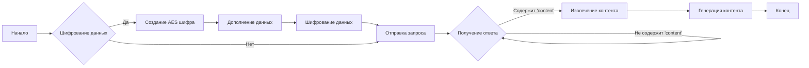
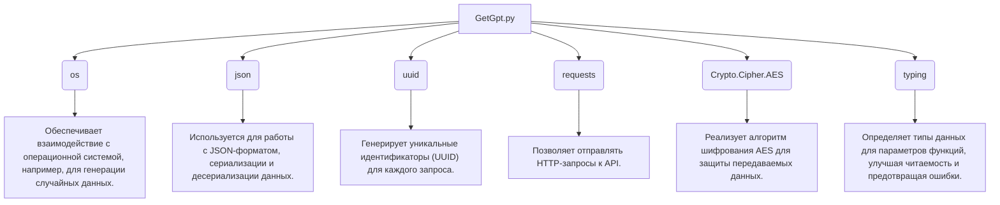
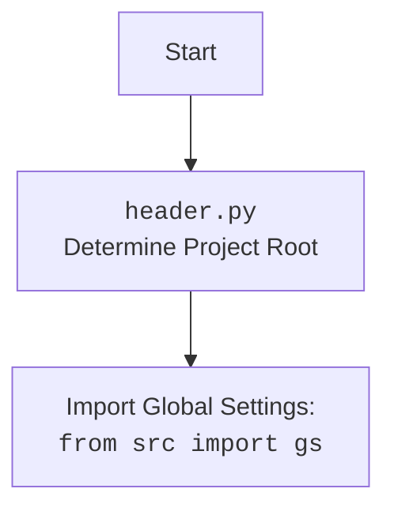

### **Анализ кода проекта `hypotez`**

=========================================================================================

#### **1. Блок-схема**



1.  **Начало**: Начало выполнения функции `_create_completion`.
2.  **Шифрование данных**: Проверка необходимости шифрования данных.
    *   **Пример**: Данные для отправки на сервер `chat.getgpt.world` шифруются с использованием AES.
3.  **Создание AES шифра**: Создание шифра AES с использованием случайного ключа и вектора инициализации.
    *   **Пример**:
        ```python
        cipher = AES.new(t, AES.MODE_CBC, n)
        ```
4.  **Дополнение данных**: Дополнение данных до размера, кратного размеру блока AES.
    *   **Пример**:
        ```python
        padding = bytes([padding_size] * padding_size)
        ```
5.  **Шифрование данных**: Шифрование дополненных данных.
    *   **Пример**:
        ```python
        ciphertext = cipher.encrypt(pad_data(r))
        ```
6.  **Отправка запроса**: Отправка POST запроса на сервер `chat.getgpt.world` с зашифрованными данными.
    *   **Пример**:
        ```python
        res = requests.post('https://chat.getgpt.world/api/chat/stream', headers=headers, json={'signature': encrypt(data)}, stream=True)
        ```
7.  **Получение ответа**: Получение потокового ответа от сервера.
    *   **Пример**:
        ```python
        for line in res.iter_lines():
        ```
8.  **Проверка наличия 'content'**: Проверка наличия ключа `'content'` в полученной строке ответа.
    *   **Пример**:
        ```python
        if b'content' in line:
        ```
9.  **Извлечение контента**: Извлечение контента из JSON-форматированной строки ответа.
    *   **Пример**:
        ```python
        line_json = json.loads(line.decode('utf-8').split('data: ')[1])
        yield (line_json['choices'][0]['delta']['content'])
        ```
10. **Генерация контента**: Генерация контента на основе полученных данных.
    *   **Пример**: `yield (line_json['choices'][0]['delta']['content'])`
11. **Конец**: Завершение выполнения функции.

#### **2. Диаграмма зависимостей**



**Объяснение зависимостей:**

*   **os**: Модуль `os` используется для взаимодействия с операционной системой. В данном коде он применяется для генерации случайных данных (`os.urandom`) при создании ключа и вектора инициализации для шифра AES.
*   **json**: Модуль `json` используется для работы с данными в формате JSON. Он применяется для сериализации данных (`json.dumps`) перед отправкой запроса и десериализации данных (`json.loads`) при получении ответа.
*   **uuid**: Модуль `uuid` используется для генерации уникальных идентификаторов. В данном коде он применяется для создания уникального идентификатора (`uuid.uuid4()`) для каждого запроса.
*   **requests**: Модуль `requests` используется для отправки HTTP-запросов. В данном коде он применяется для отправки POST-запроса к API `chat.getgpt.world`.
*   **Crypto.Cipher.AES**: Модуль `Crypto.Cipher.AES` используется для шифрования данных с использованием алгоритма AES. Он применяется для защиты передаваемых данных.
*   **typing**: Модуль `typing` используется для определения типов данных. В данном коде он применяется для аннотации типов параметров функций, что улучшает читаемость и помогает предотвратить ошибки.



#### **3. Объяснение**

*   **Импорты**:
    *   `os`: Используется для генерации случайных данных для шифрования.
    *   `json`: Используется для сериализации и десериализации данных в формате JSON.
    *   `uuid`: Используется для генерации уникальных идентификаторов запросов.
    *   `requests`: Используется для отправки HTTP-запросов к API.
    *   `Crypto.Cipher.AES`: Используется для шифрования данных алгоритмом AES.
    *   `...typing`:  Используются типы `sha256`, `Dict` и `get_type_hints` для аннотации типов и получения информации о типах параметров функций.
*   **Переменные**:
    *   `url`: URL адрес API `chat.getgpt.world`.
        *   Тип: `str`
        *   Использование: Определяет базовый URL для запросов к API.
    *   `model`: Список поддерживаемых моделей.
        *   Тип: `list`
        *   Использование: Указывает, какие модели поддерживает данный провайдер.
    *   `supports_stream`: Поддержка потоковой передачи данных.
        *   Тип: `bool`
        *   Использование: Определяет, поддерживает ли провайдер потоковую передачу данных.
    *   `needs_auth`: Необходимость аутентификации.
        *   Тип: `bool`
        *   Использование: Указывает, требуется ли аутентификация для использования данного провайдера.
*   **Функции**:
    *   `_create_completion(model: str, messages: list, stream: bool, **kwargs)`:
        *   Аргументы:
            *   `model` (`str`): Модель для использования.
            *   `messages` (`list`): Список сообщений для отправки.
            *   `stream` (`bool`): Флаг потоковой передачи данных.
            *   `**kwargs`: Дополнительные параметры.
        *   Возвращаемое значение: Генератор, выдающий части ответа от API.
        *   Назначение: Отправляет запрос к API `chat.getgpt.world` и возвращает ответ в потоковом режиме.
        *   Пример:
            ```python
            for chunk in _create_completion(model='gpt-3.5-turbo', messages=[{'role': 'user', 'content': 'Hello'}], stream=True):
                print(chunk)
            ```
        *   Вложенные функции:
            *   `encrypt(e)`:
                *   Аргументы:
                    *   `e` (`str`): Данные для шифрования.
                *   Возвращаемое значение: Зашифрованные данные в виде строки.
                *   Назначение: Шифрует данные с использованием AES.
                *   Пример:
                    ```python
                    encrypted_data = encrypt('Sensitive data')
                    ```
            *   `pad_data(data: bytes) -> bytes`:
                *   Аргументы:
                    *   `data` (`bytes`): Данные для дополнения.
                *   Возвращаемое значение: Дополненные данные.
                *   Назначение: Дополняет данные до размера, кратного размеру блока AES.
                *   Пример:
                    ```python
                    padded_data = pad_data(b'Data')
                    ```

*   **Описание работы функции `_create_completion`**:
    1.  Определяются заголовки запроса, включая `Content-Type`, `Referer` и `user-agent`.
    2.  Данные запроса формируются в формате JSON, включая сообщения, параметры (`frequency_penalty`, `max_tokens`, `presence_penalty`, `temperature`, `top_p`) и `uuid`.
    3.  Данные шифруются с использованием функции `encrypt`.
    4.  POST-запрос отправляется на `https://chat.getgpt.world/api/chat/stream` с зашифрованными данными.
    5.  Ответ обрабатывается построчно, из каждой строки извлекается содержимое (`content`) и возвращается через генератор.
*   **Описание работы функции `encrypt`**:
    1.  Генерируются случайные ключ и вектор инициализации.
    2.  Создается шифр AES в режиме CBC.
    3.  Данные дополняются до размера, кратного размеру блока AES, с использованием функции `pad_data`.
    4.  Данные шифруются, и результат возвращается в виде шестнадцатеричной строки, к которой добавлены ключ и вектор инициализации.
*   **Описание работы функции `pad_data`**:
    1.  Определяется размер необходимого дополнения.
    2.  Создается байтовая строка, содержащая байты с кодом размера дополнения.
    3.  Данные дополняются этой строкой и возвращаются.

*   **Переменная `params`**:
    *   Содержит строку с информацией о поддерживаемых типах параметров функции `_create_completion`.
    *   Использует `os.path.basename(__file__)[:-3]` для получения имени текущего файла без расширения `.py`.
    *   Использует `get_type_hints` для получения аннотаций типов параметров функции `_create_completion`.

**Потенциальные ошибки и области для улучшения:**

1.  **Обработка ошибок**: В коде отсутствует явная обработка ошибок при отправке запроса и обработке ответа. Следует добавить блоки `try-except` для обработки возможных исключений, таких как `requests.exceptions.RequestException` и `json.JSONDecodeError`.
2.  **Логирование**: В коде отсутствует логирование. Следует добавить логирование для отладки и мониторинга работы программы. Особенно важно логировать ошибки и исключения.
3.  **Безопасность**: Шифрование AES реализовано с использованием случайных ключей и векторов инициализации, которые генерируются для каждого запроса. Однако, ключ и вектор инициализации передаются вместе с зашифрованными данными, что снижает безопасность. Следует рассмотреть возможность использования более надежных методов шифрования и управления ключами.
4.  **Улучшение читаемости**: Код можно улучшить, разбив функцию `_create_completion` на более мелкие, логически связанные функции. Это улучшит читаемость и упростит тестирование.
5.  **Удаление неиспользуемого импорта `sha256`**: Тип `sha256` импортируется из `...typing`, но нигде не используется. Следует удалить этот импорт.

**Взаимосвязи с другими частями проекта:**

*   Данный код является частью модуля `g4f.Provider.Providers` проекта `hypotez` и предоставляет конкретную реализацию провайдера `GetGpt` для работы с API `chat.getgpt.world`.
*   Он использует модуль `typing` для аннотации типов, что соответствует общей практике в проекте `hypotez`.
*   Он использует `requests` для выполнения HTTP-запросов, что является стандартным подходом для взаимодействия с внешними API в проекте.