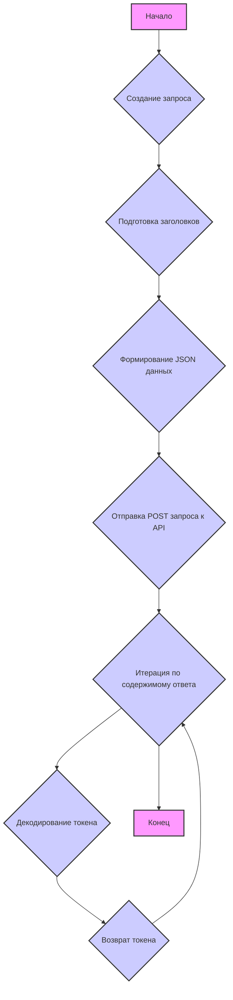
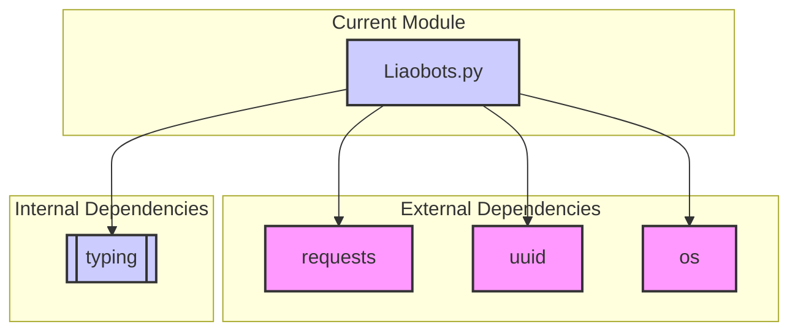

### **Анализ кода проекта `hypotez`**

=========================================================================================

#### **Расположение файла в проекте**:
`hypotez/src/endpoints/freegpt-webui-ru/g4f/Provider/Providers/Liaobots.py`

Файл расположен в каталоге `Providers` и, вероятно, представляет собой реализацию провайдера Liaobots для доступа к моделям GPT.

---

### **1. Блок-схема**



1.  **Начало**: Начало выполнения функции `_create_completion`.
2.  **Создание запроса**: Подготовка данных для запроса к API Liaobots.
    *   *Пример*: Подготовка данных модели, сообщений и параметров запроса.
3.  **Подготовка заголовков**: Формирование заголовков HTTP запроса.
    *   *Пример*: Установка `authority`, `content-type`, `origin`, `referer`, `user-agent` и `x-auth-code`.
4.  **Формирование JSON данных**: Создание JSON-структуры тела запроса.
    *   *Пример*: Включение `conversationId`, `model`, `messages`, `key` и `prompt` в JSON.
5.  **Отправка POST запроса к API**: Отправка запроса к `https://liaobots.com/api/chat`.
    *   *Пример*: Отправка данных с использованием `requests.post`.
6.  **Итерация по содержимому ответа**: Чтение ответа чанками.
    *   *Пример*: Использование `response.iter_content(chunk_size=2046)` для потоковой обработки.
7.  **Декодирование токена**: Декодирование полученного чанка в строку.
    *   *Пример*: Преобразование байтов в строку с использованием `token.decode('utf-8')`.
8.  **Возврат токена**: Отправка декодированного токена.
    *   *Пример*: Использование `yield` для возврата токена.
9.  **Конец**: Завершение работы генератора.

---

### **2. Диаграмма зависимостей**



*   `requests`: Используется для отправки HTTP-запросов к API Liaobots. Позволяет отправлять POST-запросы с JSON-данными и потоково обрабатывать ответ.
*   `uuid`: Применяется для генерации уникальных идентификаторов разговоров (`conversationId`). Это помогает отслеживать и управлять сессиями с API.
*   `os`: Используется для получения имени файла и формирования строки с параметрами.
*   `typing`:  Используется для аннотации типов, что улучшает читаемость и помогает предотвратить ошибки.

---

### **3. Объяснение**

#### **Импорты**:

*   `os`: Предоставляет функции для взаимодействия с операционной системой, используется для получения имени файла.
*   `uuid`: Используется для генерации уникальных идентификаторов.
*   `requests`: Используется для выполнения HTTP-запросов.
*   `sha256, Dict, get_type_hints`: Импортируются из `...typing`. `sha256` вероятно для хеширования, `Dict` для аннотации типов словарей, `get_type_hints` для получения информации о типах.

#### **Переменные**:

*   `url: str = 'https://liaobots.com'`: URL API Liaobots.
*   `model: list = ['gpt-3.5-turbo', 'gpt-4']`: Список поддерживаемых моделей.
*   `supports_stream: bool = True`: Указывает, что провайдер поддерживает потоковую передачу данных.
*   `needs_auth: bool = True`: Указывает, что для использования провайдера требуется аутентификация.
*   `models: dict`:  Словарь, содержащий информацию о каждой модели (ID, имя, максимальная длина, лимит токенов).

#### **Функции**:

*   `_create_completion(model: str, messages: list, stream: bool, **kwargs)`:
    *   **Аргументы**:
        *   `model (str)`: Идентификатор модели (например, 'gpt-3.5-turbo').
        *   `messages (list)`: Список сообщений для отправки в API.
        *   `stream (bool)`: Флаг, указывающий, следует ли использовать потоковую передачу.
        *   `**kwargs`: Дополнительные аргументы, такие как ключ аутентификации.
    *   **Возвращаемое значение**:
        *   `Generator[str, None, None]`: Генератор, возвращающий токены (части текста) из ответа API.
    *   **Назначение**:
        *   Отправляет запрос к API Liaobots и возвращает ответ в виде потока токенов.
    *   **Пример**:

    ```python
    for token in _create_completion(model='gpt-3.5-turbo', messages=[{'role': 'user', 'content': 'Hello' }], stream=True, auth='ключ_аутентификации'):
        print(token)
    ```

#### **Потенциальные ошибки и области для улучшения**:

*   **Обработка ошибок**: В коде отсутствует явная обработка ошибок при выполнении запроса к API. Следует добавить обработку исключений для ситуаций, когда запрос завершается неудачно (например, из-за проблем с сетью или неверного ключа аутентификации).
*   **Логирование**: Отсутствует логирование запросов и ответов, что затрудняет отладку и анализ работы провайдера.
*   **Безопасность**: Следует убедиться, что ключ аутентификации передается и обрабатывается безопасно.
*   **Аннотации типов**: Добавить аннотации типов для всех переменных.

#### **Взаимосвязи с другими частями проекта**:

*   Этот файл является частью системы `g4f` в проекте `hypotez`, которая предоставляет интерфейс для работы с различными провайдерами GPT. Он использует общие типы данных и, возможно, общие функции для аутентификации и обработки ошибок.

```python
params = f\'g4f.Providers.{os.path.basename(__file__)[:-3]} supports: \' + \\\n    \'(%s)\' % \', \'.join([f"{name}: {get_type_hints(_create_completion)[name].__name__}" for name in _create_completion.__code__.co_varnames[:_create_completion.__code__.co_argcount]])
```

Эта строка формирует строку с информацией о поддерживаемых типах данных для функции `_create_completion`.

---