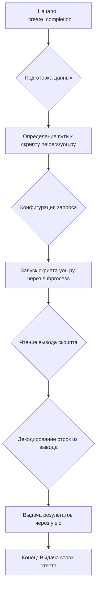
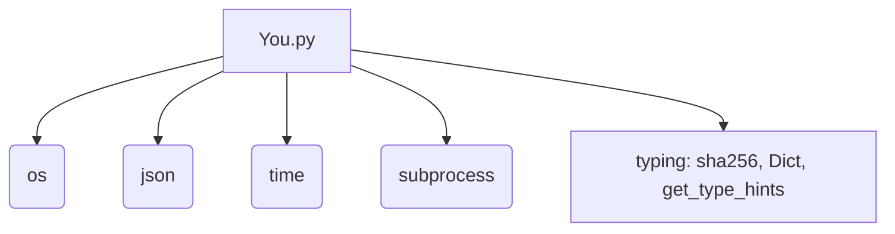

### **Анализ кода проекта `hypotez`**

=========================================================================================

Файл: `hypotez/src/endpoints/freegpt-webui-ru/g4f/Provider/Providers/You.py`

**Обзор**: Этот файл определяет провайдера `You.com` для использования в проекте `freegpt-webui-ru`. Он предоставляет функции для создания запросов к `You.com` и обработки ответов.

---

### **1. Блок-схема**



**Пояснения к блок-схеме:**

1.  **Начало: `_create_completion`**: Функция принимает параметры модели, сообщения и другие параметры.
2.  **Подготовка данных**: Преобразование входных данных, таких как `messages`, в нужный формат.
3.  **Определение пути к скрипту `helpers/you.py`**: Получение абсолютного пути к скрипту-помощнику.
4.  **Конфигурация запроса**: Подготовка JSON-конфигурации с сообщениями.
5.  **Запуск скрипта `you.py` через `subprocess`**: Запуск дочернего процесса для выполнения скрипта `you.py` с переданной конфигурацией.
6.  **Чтение вывода скрипта**: Чтение построчно данных из стандартного вывода запущенного процесса.
7.  **Декодирование строк из вывода**: Декодирование полученных байтовых строк в кодировку UTF-8.
8.  **Выдача результатов через `yield`**: Генерация строк ответа для последующей обработки.
9.  **Конец: Выдача строк ответа**: Завершение работы функции с возвратом обработанных данных.

**Примеры для каждого логического блока:**

*   **A**: `_create_completion(model='gpt-3.5-turbo', messages=[{'role': 'user', 'content': 'Hello'}], stream=True)`
*   **B**: Подготовка `messages` для передачи в `you.py`.
*   **C**: Определение пути к `helpers/you.py` на основе текущего файла.
*   **D**: `config = json.dumps({'messages': messages}, separators=(',', ':'))`
*   **E**: `cmd = ['python3', f'{path}/helpers/you.py', config]` и последующий запуск через `subprocess.Popen`.
*   **F**: Чтение строк из `p.stdout`.
*   **G**: `line.decode('utf-8')`
*   **H**: `yield line.decode('utf-8')`
*   **I**: Возврат сгенерированных строк.

### **2. Диаграмма зависимостей**



**Пояснения к диаграмме:**

*   `You.py`: Основной файл, определяющий провайдера `You.com`.
*   `os`: Используется для работы с путями к файлам и директориям.
*   `json`: Используется для сериализации и десериализации данных в формате JSON.
*   `time`: Может использоваться для измерения времени выполнения операций (хотя в текущем коде не используется напрямую).
*   `subprocess`: Используется для запуска внешних процессов, таких как скрипт `you.py`.
*   `typing`: Используется для аннотации типов, таких как `sha256`, `Dict`, и для получения информации о типах с помощью `get_type_hints`.

### **3. Объяснение**

#### **Импорты:**

*   `os`: Модуль для работы с операционной системой, используется для определения пути к скрипту `helpers/you.py`.
*   `json`: Модуль для работы с данными в формате JSON, используется для кодирования конфигурации запроса.
*   `time`: Модуль для работы со временем, в предоставленном коде непосредственно не используется.
*   `subprocess`: Модуль для запуска дочерних процессов, используется для запуска скрипта `helpers/you.py`.
*   `typing`: Модуль для аннотации типов.
    *   `sha256`: Тип, вероятно, представляющий SHA256-хеш. В данном коде не используется.
    *   `Dict`: Тип для обозначения словарей.
    *   `get_type_hints`: Функция для получения информации о типах параметров функций.

#### **Переменные:**

*   `url: str = 'https://you.com'`: URL, используемый для доступа к `You.com`.
*   `model: str = 'gpt-3.5-turbo'`: Имя используемой модели.
*   `supports_stream: bool = True`: Флаг, указывающий на поддержку потоковой передачи данных.
*   `needs_auth: bool = False`: Флаг, указывающий на необходимость аутентификации.

#### **Функции:**

*   `_create_completion(model: str, messages: list, stream: bool, **kwargs)`:
    *   **Аргументы**:
        *   `model (str)`: Имя модели для использования.
        *   `messages (list)`: Список сообщений для отправки.
        *   `stream (bool)`: Флаг, указывающий, использовать ли потоковую передачу.
        *   `**kwargs`: Дополнительные аргументы.
    *   **Возвращаемое значение**: Генератор, выдающий строки ответа.
    *   **Назначение**: Функция создает запрос к `You.com` через запуск дочернего процесса `helpers/you.py` и возвращает ответ в виде потока строк.
    *   **Пример**:
        ```python
        response = _create_completion(model='gpt-3.5-turbo', messages=[{'role': 'user', 'content': 'Hello'}], stream=True)
        for chunk in response:
            print(chunk)
        ```

#### **Потенциальные ошибки и области для улучшения:**

1.  **Обработка ошибок**: Отсутствует явная обработка ошибок, которые могут возникнуть при запуске `subprocess` или при чтении вывода.
2.  **Безопасность**: Передача конфигурации через командную строку может быть небезопасной. Рассмотреть альтернативные способы передачи данных.
3.  **Зависимости**: Жесткая зависимость от наличия `python3` в системе. Можно добавить проверку наличия.
4.  **Логирование**: Отсутствует логирование действий, что затрудняет отладку и мониторинг.

#### **Взаимосвязи с другими частями проекта:**

*   Данный файл является частью модуля `g4f`, который, вероятно, предоставляет интерфейс к различным провайдерам, включая `You.com`.
*   Функция `_create_completion` использует скрипт `helpers/you.py` для фактического взаимодействия с `You.com`.
*   Типы данных из `...typing` используются для аннотации параметров и возвращаемых значений, что способствует улучшению читаемости и надежности кода.

---