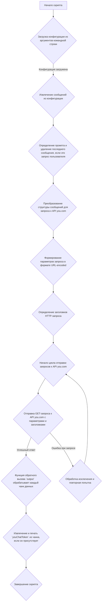
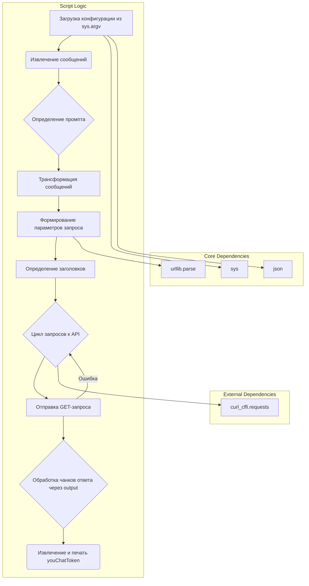

### **Системные инструкции для обработки кода проекта `hypotez`**

=========================================================================================

Описание функциональности и правил для генерации, анализа и улучшения кода. Направлено на обеспечение последовательного и читаемого стиля кодирования, соответствующего требованиям.

---

### **Основные принципы**

#### **1. Общие указания**:
- Соблюдай четкий и понятный стиль кодирования.
- Все изменения должны быть обоснованы и соответствовать установленным требованиям.

#### **2. Комментарии**:
- Используй `#` для внутренних комментариев.
- Документация всех функций, методов и классов должна следовать такому формату: 
    ```python
        def function(param: str, param1: Optional[str | dict | str] = None) -> dict | None:
            """ 
            Args:
                param (str): Описание параметра `param`.
                param1 (Optional[str | dict | str], optional): Описание параметра `param1`. По умолчанию `None`.
    
            Returns:
                dict | None: Описание возвращаемого значения. Возвращает словарь или `None`.
    
            Raises:
                SomeError: Описание ситуации, в которой возникает исключение `SomeError`.

            Ехаmple:
                >>> function('param', 'param1')
                {'param': 'param1'}
            """
    ```
- Комментарии и документация должны быть четкими, лаконичными и точными.

#### **3. Форматирование кода**:
- Используй одинарные кавычки. `a:str = 'value'`, `print('Hello World!')`;
- Добавляй пробелы вокруг операторов. Например, `x = 5`;
- Все параметры должны быть аннотированы типами. `def function(param: str, param1: Optional[str | dict | str] = None) -> dict | None:`;
- Не используй `Union`. Вместо этого используй `|`.

#### **4. Логирование**:
- Для логгирования Всегда Используй модуль `logger` из `src.logger.logger`.
- Ошибки должны логироваться с использованием `logger.error`.
Пример:
    ```python
        try:
            ...
        except Exception as ex:
            logger.error('Error while processing data', ех, exc_info=True)
    ```
#### **5 Не используй `Union[]` в коде. Вместо него используй `|`
Например:
```python
x: str | int ...
```


---

### **Основные требования**:

#### **1. Формат ответов в Markdown**:
- Все ответы должны быть выполнены в формате **Markdown**.

#### **2. Формат комментариев**:
- Используй указанный стиль для комментариев и документации в коде.
- Пример:

```python
from typing import Generator, Optional, List
from pathlib import Path


def read_text_file(
    file_path: str | Path,
    as_list: bool = False,
    extensions: Optional[List[str]] = None,
    chunk_size: int = 8192,
) -> Generator[str, None, None] | str | None:
    """
    Считывает содержимое файла (или файлов из каталога) с использованием генератора для экономии памяти.

    Args:
        file_path (str | Path): Путь к файлу или каталогу.
        as_list (bool): Если `True`, возвращает генератор строк.
        extensions (Optional[List[str]]): Список расширений файлов для чтения из каталога.
        chunk_size (int): Размер чанков для чтения файла в байтах.

    Returns:
        Generator[str, None, None] | str | None: Генератор строк, объединенная строка или `None` в случае ошибки.

    Raises:
        Exception: Если возникает ошибка при чтении файла.

    Example:
        >>> from pathlib import Path
        >>> file_path = Path('example.txt')
        >>> content = read_text_file(file_path)
        >>> if content:
        ...    print(f'File content: {content[:100]}...')
        File content: Example text...
    """
    ...
```
- Всегда делай подробные объяснения в комментариях. Избегай расплывчатых терминов, 
- таких как *«получить»* или *«делать»*. Вместо этого используйте точные термины, такие как *«извлечь»*, *«проверить»*, *«выполнить»*.
- Вместо: *«получаем»*, *«возвращаем»*, *«преобразовываем»* используй имя объекта *«функция получае»*, *«переменная возвращает»*, *«код преобразовывает»* 
- Комментарии должны непосредственно предшествовать описываемому блоку кода и объяснять его назначение.

#### **3. Пробелы вокруг операторов присваивания**:
- Всегда добавляйте пробелы вокруг оператора `=`, чтобы повысить читаемость.
- Примеры:
  - **Неправильно**: `x=5`
  - **Правильно**: `x = 5`

#### **4. Использование `j_loads` или `j_loads_ns`**:
- Для чтения JSON или конфигурационных файлов замените стандартное использование `open` и `json.load` на `j_loads` или `j_loads_ns`.
- Пример:

```python
# Неправильно:
with open('config.json', 'r', encoding='utf-8') as f:
    data = json.load(f)

# Правильно:
data = j_loads('config.json')
```

#### **5. Сохранение комментариев**:
- Все существующие комментарии, начинающиеся с `#`, должны быть сохранены без изменений в разделе «Улучшенный код».
- Если комментарий кажется устаревшим или неясным, не изменяйте его. Вместо этого отметьте его в разделе «Изменения».

#### **6. Обработка `...` в коде**:
- Оставляйте `...` как указатели в коде без изменений.
- Не документируйте строки с `...`.
```

#### **7. Аннотации**
Для всех переменных должны быть определены аннотации типа. 
Для всех функций все входные и выходные параметры аннотириваны
Для все параметров должны быть аннотации типа.


### **8. webdriver**
В коде используется webdriver. Он импртируется из модуля `webdriver` проекта `hypotez`
```python
from src.webdirver import Driver, Chrome, Firefox, Playwright, ...
driver = Driver(Firefox)

Пoсле чего может использоваться как

close_banner = {
  "attribute": null,
  "by": "XPATH",
  "selector": "//button[@id = 'closeXButton']",
  "if_list": "first",
  "use_mouse": false,
  "mandatory": false,
  "timeout": 0,
  "timeout_for_event": "presence_of_element_located",
  "event": "click()",
  "locator_description": "Закрываю pop-up окно, если оно не появилось - не страшно (`mandatory`:`false`)"
}

result = driver.execute_locator(close_banner)
```

## Анализ кода

### 1. Блок-схема



**Пример блока B:**

```python
config = json.loads(sys.argv[1])
# Допустим, sys.argv[1] содержит '{"messages": [{"role": "user", "content": "Привет"}]}'
# Тогда config будет: {'messages': [{'role': 'user', 'content': 'Привет'}]}
```

**Пример блока E:**

```python
def transform(messages: list) -> list:
    result = []
    i = 0

    while i < len(messages):
        if messages[i]['role'] == 'user':
            question = messages[i]['content']
            i += 1

            if i < len(messages) and messages[i]['role'] == 'assistant':
                answer = messages[i]['content']
                i += 1
            else:
                answer = ''

            result.append({'question': question, 'answer': answer})

        elif messages[i]['role'] == 'assistant':
            result.append({'question': '', 'answer': messages[i]['content']})
            i += 1

        elif messages[i]['role'] == 'system':
            result.append({'question': messages[i]['content'], 'answer': ''})
            i += 1
            
    return result

# Пример:
# messages = [{'role': 'user', 'content': 'Привет'}, {'role': 'assistant', 'content': 'Здравствуйте'}]
# transform(messages) вернет: [{'question': 'Привет', 'answer': 'Здравствуйте'}]
```

### 2. Диаграмма



**Объяснение зависимостей:**

-   **`sys`**: Используется для получения аргументов командной строки, в частности, для чтения JSON-конфигурации, переданной скрипту.
-   **`json`**: Используется для десериализации JSON-строки, полученной из аргументов командной строки, в Python-словарь.
-   **`urllib.parse`**: Используется для кодирования параметров запроса в формате URL (например, для передачи данных в GET-запросе).
-   **`curl_cffi.requests`**:  Используется для выполнения HTTP-запросов к API `you.com`.

### 3. Объяснение

#### Импорты:

*   **`import sys`**: Этот модуль предоставляет доступ к некоторым переменным и функциям, взаимодействующим с интерпретатором Python. В данном случае используется для доступа к аргументам командной строки через `sys.argv`.
*   **`import json`**: Этот модуль используется для работы с данными в формате JSON. Здесь он применяется для десериализации JSON-строки, передаваемой в качестве аргумента командной строки, в Python-объект (словарь).
*   **`import urllib.parse`**: Этот модуль предоставляет функции для работы с URL-адресами, в частности, для кодирования параметров запроса в формате `application/x-www-form-urlencoded`, который обычно используется в HTTP-запросах.
*   **`from curl_cffi import requests`**:  Этот модуль, вероятно, используется для выполнения HTTP-запросов с использованием библиотеки `curl_cffi`. Он может предоставлять более низкоуровневый контроль над запросами, чем стандартная библиотека `requests`.

#### Функция `transform(messages: list) -> list`

*   **Аргументы**:
    *   `messages`: Список сообщений, где каждое сообщение представляет собой словарь с ключами `'role'` (роль отправителя: `'user'`, `'assistant'` или `'system'`) и `'content'` (содержимое сообщения).
*   **Возвращаемое значение**:
    *   `list`: Список словарей, где каждый словарь содержит ключи `'question'` и `'answer'`. Эта функция преобразует исходный формат сообщений в формат, ожидаемый API `you.com`.

    Пример:

    ```python
    messages = [
        {'role': 'user', 'content': 'Привет'},
        {'role': 'assistant', 'content': 'Здравствуйте'},
        {'role': 'user', 'content': 'Как дела?'},
        {'role': 'assistant', 'content': 'Хорошо, спасибо'}
    ]
    transformed_messages = transform(messages)
    print(transformed_messages)
    # Вывод:
    # [{'question': 'Привет', 'answer': 'Здравствуйте'}, {'question': 'Как дела?', 'answer': 'Хорошо, спасибо'}]
    ```

*   **Назначение**: Функция `transform` преобразует список сообщений в формат, подходящий для отправки в API `you.com`. Она объединяет вопросы пользователя и ответы ассистента в пары `{'question': вопрос, 'answer': ответ}`.

#### Переменные:

*   **`config`**: Словарь, полученный в результате десериализации JSON-строки из аргументов командной строки. Содержит конфигурацию для запроса к API.
*   **`messages`**: Список сообщений, извлеченный из конфигурации.
*   **`prompt`**: Строка, содержащая последний вопрос пользователя. Если последнее сообщение в `messages` от пользователя, оно извлекается в `prompt`, и `messages` усекается.
*   **`headers`**: Словарь, содержащий заголовки HTTP-запроса. Эти заголовки включают информацию о типе контента, User-Agent, Referer и другие метаданные, необходимые для успешного выполнения запроса.
*   **`params`**: Строка, содержащая параметры запроса, закодированные в формате URL. Эти параметры включают вопрос пользователя (`q`), домен (`domain`) и историю чата (`chat`), преобразованную функцией `transform`.
*   **`response`**: Объект ответа, полученный от API `you.com`.

#### Потенциальные ошибки и области для улучшения:

*   **Обработка ошибок**: В цикле `while True` есть обработка исключений, но она просто печатает сообщение об ошибке и повторяет попытку. Желательно добавить более продвинутую логику обработки ошибок, например, логирование ошибок с использованием модуля `logger` из `src.logger.logger`, ограничение количества повторных попыток и, возможно, уведомление пользователя об ошибке.
*   **Отсутствие документации**: Код не содержит документации (docstrings) для функций и классов, что затрудняет понимание его работы.
*   **Жёстко закодированные заголовки**: Заголовки HTTP-запроса жёстко закодированы в коде. Было бы лучше вынести их в конфигурационный файл или сделать более гибкими, чтобы их можно было легко изменять.
*   **Использование `curl_cffi`**:  Использование `curl_cffi` может быть оправдано, если требуется специфическая функциональность, отсутствующая в стандартной библиотеке `requests`. Однако, если это не так, стоит рассмотреть возможность использования `requests`, так как она более распространена и проще в использовании.

#### Связи с другими частями проекта:

*   Этот скрипт является частью `freegpt-webui-ru`, что указывает на его использование в веб-интерфейсе для взаимодействия с API `you.com`.
*   Он использует аргументы командной строки (`sys.argv`) для получения конфигурации, что подразумевает, что он вызывается из другой части проекта, которая формирует эту конфигурацию.