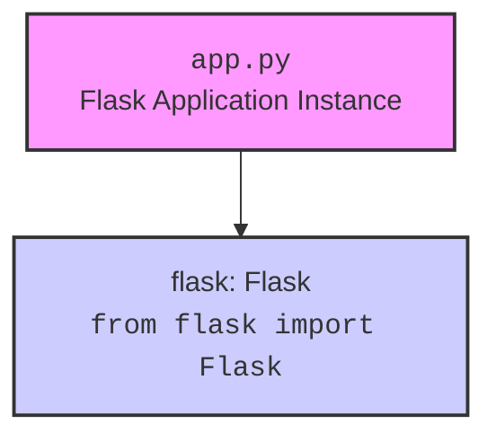

### **Анализ кода проекта `hypotez`**

=========================================================================================

#### **Расположение файла в проекте**:
`hypotez/src/endpoints/freegpt-webui-ru/server/app.py`

#### **Назначение файла**:
Этот файл создает экземпляр Flask-приложения, используемого для веб-интерфейса freegpt-webui-ru.

---

### **1. Блок-схема**:

```mermaid
graph TD
    A[Начало] --> B{Создание экземпляра Flask-приложения};
    B --> C[Указание папки с шаблонами];
    C --> D[Конец];

    style A fill:#f9f,stroke:#333,stroke-width:2px
    style D fill:#f9f,stroke:#333,stroke-width:2px

    subgraph Пример создания Flask-приложения
        E[Импорт Flask из flask] --> F[app = Flask(__name__, template_folder='./../client/html')]
    end

    style E fill:#ccf,stroke:#333,stroke-width:2px
    style F fill:#ccf,stroke:#333,stroke-width:2px
```

1.  **Начало**: Процесс начинается с импорта необходимых модулей.
2.  **Создание экземпляра Flask-приложения**: Создается экземпляр класса `Flask`, который является основным компонентом веб-приложения.
    *   Пример: `app = Flask(__name__, template_folder='./../client/html')`
3.  **Указание папки с шаблонами**: Указывается папка, где Flask будет искать HTML-шаблоны для рендеринга веб-страниц. В данном случае, папка находится на уровень выше (`./../`) в каталоге `client` в подкаталоге `html`.
4.  **Конец**: Приложение Flask инициализировано и готово к дальнейшей настройке (добавление маршрутов, обработчиков и т.д.).

---

### **2. Диаграмма**:



**Объяснение диаграммы**:

*   `A` представляет файл `app.py`, который создает экземпляр Flask-приложения.
*   `B` представляет модуль `Flask` из библиотеки `flask`, который импортируется для создания веб-приложения.

**Зависимости**:
`flask`: Используется для создания веб-приложения. `Flask` - это микрофреймворк для Python, который предоставляет инструменты и библиотеки для создания веб-приложений, API и т. д.

---

### **3. Объяснение**:

*   **Импорты**:
    *   `from flask import Flask`: Импортирует класс `Flask` из библиотеки `flask`. Этот класс используется для создания экземпляра веб-приложения.
*   **Классы**:
    *   `Flask`: Класс из библиотеки `flask`, используемый для создания веб-приложения.
        *   Атрибуты:
            *   `__name__`: Специальная переменная Python, которая содержит имя текущего модуля.
            *   `template_folder`: Указывает папку, в которой находятся HTML-шаблоны.
        *   Методы:
            *   `__init__(self, import_name, **kwargs)`: Конструктор класса, который инициализирует экземпляр Flask-приложения.
*   **Функции**:
    *   `Flask(__name__, template_folder='./../client/html')`: Функция, которая создает экземпляр Flask-приложения.
        *   Аргументы:
            *   `__name__` (str): Имя текущего модуля.
            *   `template_folder` (str): Путь к папке с шаблонами.
        *   Возвращаемое значение:
            *   `app` (Flask): Экземпляр Flask-приложения.
*   **Переменные**:
    *   `app`: Экземпляр Flask-приложения.
        *   Тип: `Flask`
        *   Использование: Используется для настройки маршрутов, обработчиков и запуска веб-приложения.

**Потенциальные ошибки и области для улучшения**:

*   **Относительный путь к шаблонам**: Использование относительного пути `./../client/html` может привести к проблемам, если структура каталогов изменится. Рекомендуется использовать абсолютные пути или переменные окружения для указания пути к шаблонам.
*   **Отсутствие обработки ошибок**: В коде отсутствует обработка ошибок. Необходимо добавить обработку исключений для обеспечения стабильной работы приложения.

**Взаимосвязь с другими частями проекта**:

Этот файл является точкой входа для веб-интерфейса `freegpt-webui-ru`. Он взаимодействует с другими частями проекта, такими как:

*   `client/html`: Папка, содержащая HTML-шаблоны для веб-страниц.
*   Другие модули проекта, которые обрабатывают запросы и возвращают данные для отображения в веб-интерфейсе.