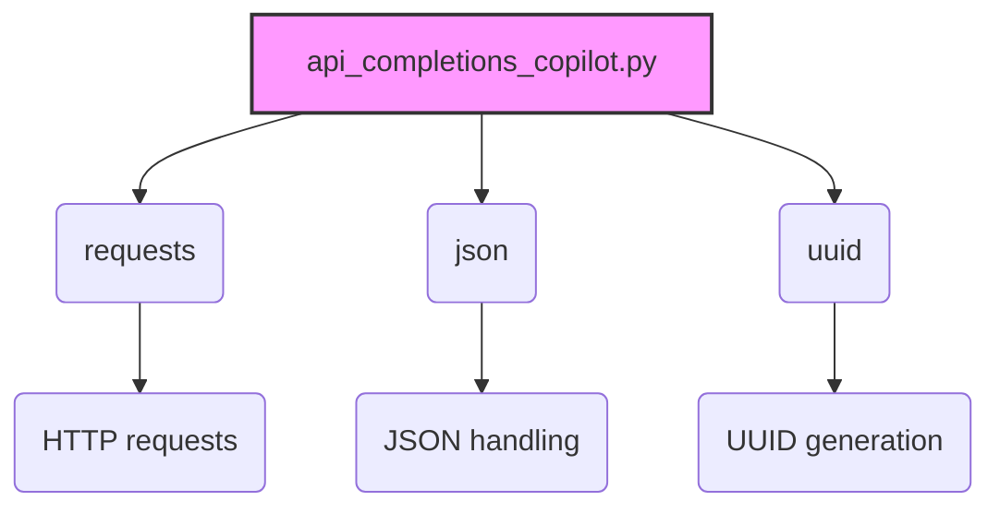

### **Анализ кода проекта `hypotez`**

=========================================================================================

#### **Расположение файла в проекте**:
`hypotez/src/endpoints/gpt4free/etc/examples/api_completions_copilot.py`

Файл является примером использования API для взаимодействия с моделью Copilot через локальный сервер.

---

### **1. Блок-схема**:

```mermaid
graph TD
    A[Начало] --> B{Определение URL и conversation_id}
    B --> C{Формирование тела запроса (body)}
    C --> D{Отправка POST запроса к API}
    D --> E{Обработка потоковых ответов}
    E --> F{Проверка начала строки с "data: "}
    F -- Да --> G{Извлечение JSON данных из строки}
    F -- Нет --> H{Переход к следующей строке}
    G --> I{Обработка ошибок JSON}
    I -- Ошибка --> H
    I -- Нет ошибки --> J{Проверка наличия ошибки в JSON}
    J -- Ошибка есть --> K{Вывод сообщения об ошибке и завершение}
    J -- Нет ошибки --> L{Извлечение контента из JSON}
    L --> M{Проверка наличия контента}
    M -- Контент есть --> N{Вывод контента}
    M -- Контента нет --> H
    N --> H
    H --> O{Повторение для всех строк ответа}
    O --> P{Формирование тела запроса (body) для второго запроса}
    P --> Q{Отправка POST запроса к API для второго запроса}
    Q --> R{Обработка потоковых ответов для второго запроса}
    R --> S{Проверка начала строки с "data: "}
    S -- Да --> T{Извлечение JSON данных из строки}
    S -- Нет --> U{Переход к следующей строке}
    T --> V{Обработка ошибок JSON}
    V -- Ошибка --> U
    V -- Нет ошибки --> W{Проверка наличия ошибки в JSON}
    W -- Ошибка есть --> X{Вывод сообщения об ошибке и завершение}
    W -- Нет ошибки --> Y{Извлечение контента из JSON}
    Y --> Z{Проверка наличия контента}
    Z -- Контент есть --> AA{Вывод контента}
    Z -- Контента нет --> U
    AA --> U
    U --> BB{Конец}
    K --> BB
```

### **2. Диаграмма зависимостей**:



#### **Объяснение зависимостей**:

-   `requests`: Используется для отправки HTTP-запросов к API Copilot.
-   `json`: Используется для обработки JSON-данных, полученных в ответе от API.
-   `uuid`: Используется для генерации уникального идентификатора разговора (`conversation_id`).

### **3. Объяснение кода**:

#### **Импорты**:

-   `requests`: Отправка HTTP-запросов.
-   `json`: Работа с JSON-данными.
-   `uuid`: Генерация уникальных идентификаторов.

#### **Переменные**:

-   `url`: URL-адрес API для запросов.
-   `conversation_id`: Уникальный идентификатор для отслеживания разговора.
-   `body`: Тело запроса, содержащее параметры для API (модель, провайдер, сообщения и т. д.).
-   `response`: Объект ответа от API.
-   `line`: Строка данных, полученная из потокового ответа.
-   `json_data`: JSON-данные, извлеченные из строки.
-   `content`: Текстовое содержимое, извлеченное из JSON-данных.

#### **Функциональность**:

1.  **Формирование тела запроса**:

    *   Создается словарь `body`, содержащий параметры запроса, включая `model`, `provider`, `stream`, `messages` и `conversation_id`.
    *   `messages` содержит список сообщений, где каждое сообщение имеет `role` (например, "user") и `content` (текст сообщения).
2.  **Отправка POST-запроса**:

    *   Используется `requests.post` для отправки POST-запроса к API, передавая `url`, `body` (в формате JSON) и `stream=True` для получения потокового ответа.
    *   Вызывается `response.raise_for_status()` для проверки, что запрос выполнен успешно (код 200). Если возникает HTTPError, скрипт завершается с исключением.
3.  **Обработка потокового ответа**:

    *   `response.iter_lines()` используется для итерации по строкам потокового ответа.
    *   Каждая строка проверяется на наличие префикса `b"data: "`.
    *   Если префикс найден, извлекаются JSON-данные из строки (удаляется префикс `b"data: "`).
    *   JSON-данные десериализуются с помощью `json.loads()`.
    *   Проверяется наличие ключа `"error"` в JSON-данных. Если ошибка обнаружена, она выводится в консоль, и цикл прерывается.
    *   Извлекается содержимое сообщения из JSON-данных, используя цепочку вызовов `json_data.get("choices", [{"delta": {}}])[0]["delta"].get("content", "")`.
    *   Если содержимое не пустое, оно выводится в консоль.
    *   Обрабатываются исключения `json.JSONDecodeError`, которые могут возникнуть при попытке десериализации неверного JSON.
4.  **Повторение процесса**:

    *   Шаги 1-3 повторяются для второго запроса с другим сообщением (`"Tell me somethings about my name"`).

#### **Потенциальные ошибки и улучшения**:

*   **Обработка ошибок**:
    *   Обработка ошибок `json.JSONDecodeError` выполняется с помощью `pass`, что может скрыть важные проблемы. Логирование ошибки с использованием `logger.error` было бы более информативным.
    *   Нет общей обработки исключений для `requests.post`. Следует добавить блок `try...except` для обработки возможных ошибок сети или сервера.
*   **Улучшения**:
    *   Код повторяется для двух запросов. Можно вынести логику запроса в отдельную функцию, чтобы избежать дублирования.
    *   Не используются аннотации типов. Добавление аннотаций улучшит читаемость и поддерживаемость кода.
    *   Не используется `logger` из `src.logger.logger` для логирования. Логирование через `logger` позволит лучше контролировать и фильтровать сообщения.

#### **Пример улучшенного кода**:

```python
import requests
import json
import uuid
from typing import Optional
from src.logger.logger import logger

def send_message(url: str, conversation_id: str, content: str) -> None:
    """
    Отправляет сообщение к API и обрабатывает потоковый ответ.

    Args:
        url (str): URL-адрес API.
        conversation_id (str): Уникальный идентификатор разговора.
        content (str): Текст сообщения для отправки.

    Returns:
        None
    """
    body = {
        "model": "",
        "provider": "Copilot",
        "stream": True,
        "messages": [
            {"role": "user", "content": content}
        ],
        "conversation_id": conversation_id
    }
    try:
        response = requests.post(url, json=body, stream=True)
        response.raise_for_status()
        for line in response.iter_lines():
            if line.startswith(b"data: "):
                try:
                    json_data = json.loads(line[6:])
                    if json_data.get("error"):
                        logger.error(f"Ошибка в ответе API: {json_data}")
                        break
                    content = json_data.get("choices", [{"delta": {}}])[0]["delta"].get("content", "")
                    if content:
                        print(content, end="")
                except json.JSONDecodeError as e:
                    logger.error(f"Ошибка декодирования JSON: {e}", exc_info=True)
    except requests.exceptions.RequestException as e:
        logger.error(f"Ошибка при отправке запроса: {e}", exc_info=True)
    print()

if __name__ == "__main__":
    url = "http://localhost:1337/v1/chat/completions"
    conversation_id = str(uuid.uuid4())
    send_message(url, conversation_id, "Hello, i am Heiner. How are you?")
    send_message(url, conversation_id, "Tell me somethings about my name")
```

**Изменения**:

*   Добавлена функция `send_message` для избежания дублирования кода.
*   Добавлена обработка исключений для `requests.post`.
*   Использован `logger.error` для логирования ошибок.
*   Добавлены аннотации типов.

#### **Взаимосвязи с другими частями проекта**:

Файл `api_completions_copilot.py` взаимодействует с локальным сервером, который, вероятно, является частью `hypotez`, для доступа к модели Copilot. Он также использует модуль `src.logger.logger` для логирования, если его подключить.