### **Анализ кода проекта `hypotez`**

=========================================================================================

#### **Расположение файла в проекте**:
Файл расположен в `hypotez/src/endpoints/gpt4free/g4f/errors.py`. Это указывает на то, что файл содержит определения пользовательских исключений, специфичных для обработки ошибок в модуле `g4f` (GPT4Free), который, вероятно, используется для работы с бесплатными или ограниченными версиями GPT-подобных моделей.

---

### **1. Блок-схема**:

```mermaid
graph TD
    A[Начало] --> B{Возникла ли ошибка?};
    B -- Да --> C{Тип ошибки?};
    C -- ProviderNotFoundError --> D[Вызвать ProviderNotFoundError];
    C -- ProviderNotWorkingError --> E[Вызвать ProviderNotWorkingError];
    C -- StreamNotSupportedError --> F[Вызвать StreamNotSupportedError];
    C -- ModelNotFoundError --> G[Вызвать ModelNotFoundError];
    C -- ModelNotAllowedError --> H[Вызвать ModelNotAllowedError];
    C -- RetryProviderError --> I[Вызвать RetryProviderError];
    C -- RetryNoProviderError --> J[Вызвать RetryNoProviderError];
    C -- VersionNotFoundError --> K[Вызвать VersionNotFoundError];
    C -- ModelNotSupportedError --> L[Вызвать ModelNotSupportedError];
    C -- MissingRequirementsError --> M[Вызвать MissingRequirementsError];
    C -- NestAsyncioError --> N[Вызвать NestAsyncioError];
    C -- MissingAuthError --> O[Вызвать MissingAuthError];
    C -- PaymentRequiredError --> P[Вызвать PaymentRequiredError];
    C -- NoMediaResponseError --> Q[Вызвать NoMediaResponseError];
    C -- ResponseError --> R[Вызвать ResponseError];
    C -- ResponseStatusError --> S[Вызвать ResponseStatusError];
    C -- RateLimitError --> T[Вызвать RateLimitError];
    C -- NoValidHarFileError --> U[Вызвать NoValidHarFileError];
    C -- TimeoutError --> V[Вызвать TimeoutError];
    C -- ConversationLimitError --> W[Вызвать ConversationLimitError];
    B -- Нет --> End[Конец];
    D --> End;
    E --> End;
    F --> End;
    G --> End;
    H --> End;
    I --> End;
    J --> End;
    K --> End;
    L --> End;
    M --> End;
    N --> End;
    O --> End;
    P --> End;
    Q --> End;
    R --> End;
    S --> End;
    T --> End;
    U --> End;
    V --> End;
    W --> End;
```

**Примеры для каждого логического блока**:
- **ProviderNotFoundError**: Попытка использовать несуществующего провайдера.
- **ProviderNotWorkingError**: Провайдер не отвечает или выдает ошибку.
- **StreamNotSupportedError**: Попытка потоковой передачи не поддерживается.
- **ModelNotFoundError**: Модель не найдена.
- **ModelNotAllowedError**: Модель не разрешена для использования.
- **RetryProviderError**: Необходимость повторить запрос к провайдеру.
- **RetryNoProviderError**: Нет доступных провайдеров для повтора.
- **VersionNotFoundError**: Версия не найдена.
- **ModelNotSupportedError**: Модель не поддерживается.
- **MissingRequirementsError**: Отсутствуют необходимые зависимости.
- **NestAsyncioError**: Ошибка, связанная с асинхронностью.
- **MissingAuthError**: Отсутствует аутентификация.
- **PaymentRequiredError**: Требуется оплата.
- **NoMediaResponseError**: Нет ответа от медиа-источника.
- **ResponseError**: Общая ошибка ответа.
- **ResponseStatusError**: Ошибка статуса ответа.
- **RateLimitError**: Превышен лимит запросов.
- **NoValidHarFileError**: Недопустимый файл HAR.
- **TimeoutError**: Превышено время ожидания API-запроса.
- **ConversationLimitError**: Превышен лимит диалогов при запросах к конечной точке AI.

---

### **2. Диаграмма**:

```mermaid
classDiagram
    Exception <|-- ProviderNotFoundError
    Exception <|-- ProviderNotWorkingError
    Exception <|-- StreamNotSupportedError
    Exception <|-- ModelNotFoundError
    Exception <|-- ModelNotAllowedError
    Exception <|-- RetryProviderError
    Exception <|-- RetryNoProviderError
    Exception <|-- VersionNotFoundError
    Exception <|-- ModelNotSupportedError
    Exception <|-- MissingRequirementsError
    Exception <|-- MissingAuthError
    Exception <|-- PaymentRequiredError
    Exception <|-- NoMediaResponseError
    Exception <|-- ResponseError
    Exception <|-- ResponseStatusError
    Exception <|-- NoValidHarFileError
    Exception <|-- TimeoutError
    Exception <|-- ConversationLimitError
    MissingRequirementsError <|-- NestAsyncioError
    ResponseStatusError <|-- RateLimitError

    class Exception{
        + __init__()
        + __str__()
    }
    class ProviderNotFoundError{
    }
    class ProviderNotWorkingError{
    }
    class StreamNotSupportedError{
    }
    class ModelNotFoundError{
    }
    class ModelNotAllowedError{
    }
    class RetryProviderError{
    }
    class RetryNoProviderError{
    }
    class VersionNotFoundError{
    }
    class ModelNotSupportedError{
    }
    class MissingRequirementsError{
    }
     class MissingAuthError{
    }
    class PaymentRequiredError{
    }
    class NoMediaResponseError{
    }
    class ResponseError{
    }
    class ResponseStatusError{
    }
    class NoValidHarFileError{
    }
    class TimeoutError{
      + __init__()
    }
    class ConversationLimitError{
      + __init__()
    }
    class NestAsyncioError{
    }
    class RateLimitError{
    }
```

**Объяснение зависимостей**:
- Все классы ошибок наследуются от базового класса `Exception`.
- `NestAsyncioError` наследуется от `MissingRequirementsError`.
- `RateLimitError` наследуется от `ResponseStatusError`.

---

### **3. Объяснение**:

#### **Импорты**:
- Нет импортов в данном файле.

#### **Классы**:
- **`ProviderNotFoundError`**:
  - Роль: Исключение, которое выбрасывается, когда провайдер не найден.
  - Атрибуты: Нет.
  - Методы: Нет.
- **`ProviderNotWorkingError`**:
  - Роль: Исключение, которое выбрасывается, когда провайдер не работает.
  - Атрибуты: Нет.
  - Методы: Нет.
- **`StreamNotSupportedError`**:
  - Роль: Исключение, которое выбрасывается, когда потоковая передача не поддерживается.
  - Атрибуты: Нет.
  - Методы: Нет.
- **`ModelNotFoundError`**:
  - Роль: Исключение, которое выбрасывается, когда модель не найдена.
  - Атрибуты: Нет.
  - Методы: Нет.
- **`ModelNotAllowedError`**:
  - Роль: Исключение, которое выбрасывается, когда модель не разрешена для использования.
  - Атрибуты: Нет.
  - Методы: Нет.
- **`RetryProviderError`**:
  - Роль: Исключение, которое выбрасывается, когда необходимо повторить запрос к провайдеру.
  - Атрибуты: Нет.
  - Методы: Нет.
- **`RetryNoProviderError`**:
  - Роль: Исключение, которое выбрасывается, когда нет доступных провайдеров для повтора.
  - Атрибуты: Нет.
  - Методы: Нет.
- **`VersionNotFoundError`**:
  - Роль: Исключение, которое выбрасывается, когда версия не найдена.
  - Атрибуты: Нет.
  - Методы: Нет.
- **`ModelNotSupportedError`**:
  - Роль: Исключение, которое выбрасывается, когда модель не поддерживается.
  - Атрибуты: Нет.
  - Методы: Нет.
- **`MissingRequirementsError`**:
  - Роль: Исключение, которое выбрасывается, когда отсутствуют необходимые зависимости.
  - Атрибуты: Нет.
  - Методы: Нет.
- **`NestAsyncioError`**:
  - Роль: Исключение, которое выбрасывается, когда возникает ошибка, связанная с асинхронностью.
  - Атрибуты: Нет.
  - Методы: Нет.
- **`MissingAuthError`**:
  - Роль: Исключение, которое выбрасывается, когда отсутствует аутентификация.
  - Атрибуты: Нет.
  - Методы: Нет.
- **`PaymentRequiredError`**:
  - Роль: Исключение, которое выбрасывается, когда требуется оплата.
  - Атрибуты: Нет.
  - Методы: Нет.
- **`NoMediaResponseError`**:
  - Роль: Исключение, которое выбрасывается, когда нет ответа от медиа-источника.
  - Атрибуты: Нет.
  - Методы: Нет.
- **`ResponseError`**:
  - Роль: Исключение, которое выбрасывается, когда возникает общая ошибка ответа.
  - Атрибуты: Нет.
  - Методы: Нет.
- **`ResponseStatusError`**:
  - Роль: Исключение, которое выбрасывается, когда возникает ошибка статуса ответа.
  - Атрибуты: Нет.
  - Методы: Нет.
- **`RateLimitError`**:
  - Роль: Исключение, которое выбрасывается, когда превышен лимит запросов.
  - Атрибуты: Нет.
  - Методы: Нет.
- **`NoValidHarFileError`**:
  - Роль: Исключение, которое выбрасывается, когда предоставлен недопустимый файл HAR.
  - Атрибуты: Нет.
  - Методы: Нет.
- **`TimeoutError`**:
  - Роль: Исключение, которое выбрасывается, когда превышено время ожидания API-запроса.
  - Атрибуты: Нет.
  - Методы: Нет.
- **`ConversationLimitError`**:
  - Роль: Исключение, которое выбрасывается, когда превышен лимит диалогов при запросах к конечной точке AI.
  - Атрибуты: Нет.
  - Методы: Нет.

#### **Функции**:
- В данном файле нет функций.

#### **Переменные**:
- Все классы являются пользовательскими исключениями.

#### **Потенциальные ошибки или области для улучшения**:
- Отсутствие документации для каждого класса.
- Отсутствие обработки исключений в коде, где они могут быть выброшены.
- Нет конкретных атрибутов или методов, которые могли бы предоставить дополнительную информацию об ошибке.

#### **Взаимосвязи с другими частями проекта**:
- Эти исключения, вероятно, используются в модулях, связанных с `gpt4free`, для обработки различных сценариев ошибок при взаимодействии с API и моделями GPT.