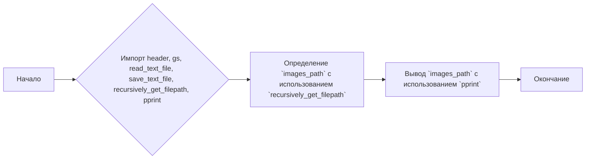
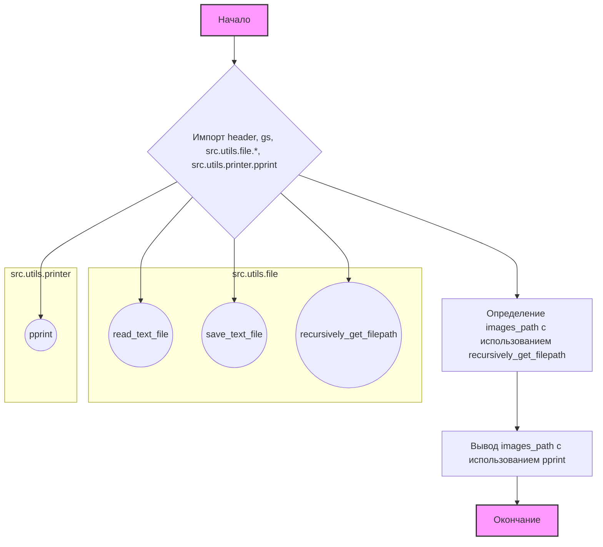
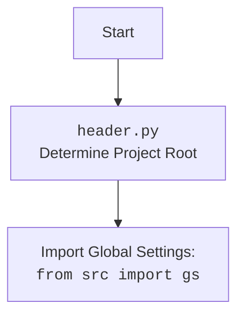

### Анализ кода файла `hypotez/src/endpoints/kazarinov/_experiments/get_images.py`

#### 1. Блок-схема

**Описание блоков:**

-   **A (Начало)**: Начало выполнения скрипта.
-   **B (Импорт)**: Импортируются необходимые модули и функции:
    -   `header`: Кастомный модуль для определения корневой директории проекта.
    -   `src.gs`: Глобальные настройки проекта.
    -   `src.utils.file.read_text_file`, `src.utils.file.save_text_file`, `src.utils.file.recursively_get_filepath`: Функции для работы с файлами.
    -   `src.utils.printer.pprint`: Функция для "красивого" вывода в консоль.
-   **C (Определение `images_path`)**: Используется функция `recursively_get_filepath` для поиска файлов с расширениями `.jpeg`, `.jpg`, `.png` в указанной директории (`gs.path.external_data / 'kazarinov' / 'converted_images' / 'pastel'`).
    Пример: если директория `gs.path.external_data / 'kazarinov' / 'converted_images' / 'pastel'` содержит файлы `image1.jpg`, `image2.png` и `subdir/image3.jpeg`, то `images_path` будет списком этих файлов.
-   **D (Вывод `images_path`)**: Выводит список найденных файлов с использованием функции `pprint`. Это удобно для отладки и просмотра результатов.
-   **E (Окончание)**: Завершение выполнения скрипта.

#### 2. Диаграмма

**Объяснение зависимостей:**

-   `header`: Определяет корневую директорию проекта.
-   `src.gs`: Содержит глобальные настройки проекта, включая пути к директориям.
-   `src.utils.file`: Предоставляет утилиты для работы с файлами, такие как чтение, запись и рекурсивный поиск файлов.
-   `src.utils.printer`: Содержит утилиты для форматированного вывода данных.

#### 3. Объяснение

**Импорты:**

-   `import header`: Импортирует модуль `header.py`, который, вероятно, определяет корневую директорию проекта. Это важно для определения абсолютных путей к файлам и директориям.
-   `from src import gs`: Импортирует глобальные настройки проекта из модуля `gs` в пакете `src`. `gs` может содержать пути к различным директориям, используемым в проекте.
-   `from src.utils.file import read_text_file, save_text_file, recursively_get_filepath`: Импортирует функции для работы с файлами:
    -   `read_text_file`: Чтение текстового файла.
    -   `save_text_file`: Сохранение текста в файл.
    -   `recursively_get_filepath`: Рекурсивный поиск файлов в директории с заданными расширениями.
-   `from src.utils.printer import pprint`: Импортирует функцию `pprint` для "красивого" вывода данных в консоль, что облегчает отладку.

**Переменные:**

-   `images_path`: Список путей к изображениям, полученный с помощью функции `recursively_get_filepath`.  Он содержит пути ко всем найденным файлам с расширениями `.jpeg`, `.jpg`, `.png` в директории `gs.path.external_data / 'kazarinov' / 'converted_images' / 'pastel'` и её поддиректориях.

**Функции:**

-   `recursively_get_filepath(path, extensions)`: Рекурсивно ищет файлы с заданными расширениями в указанной директории и её поддиректориях.
    -   `path`: Путь к директории для поиска.
    -   `extensions`: Список расширений файлов для поиска.
    -   Возвращает список абсолютных путей к найденным файлам.
-   `pprint(object)`: Выводит объект в консоль в удобочитаемом формате.

**Пример:**

Предположим, что `gs.path.external_data` указывает на `/path/to/external_data`, и в директории `/path/to/external_data/kazarinov/converted_images/pastel` есть следующие файлы:

-   `image1.jpg`
-   `subdir/image2.png`

Тогда `images_path` будет содержать список: `['/path/to/external_data/kazarinov/converted_images/pastel/image1.jpg', '/path/to/external_data/kazarinov/converted_images/pastel/subdir/image2.png']`.

**Потенциальные области для улучшения:**

1.  **Обработка ошибок**: Отсутствует обработка ошибок при поиске файлов.  Если директория не существует или нет прав на чтение, возникнет исключение.  Стоит добавить обработку исключений.
2.  **Логирование**:  Не хватает логирования. Было бы полезно добавить логирование процесса поиска файлов, чтобы отслеживать, какие файлы были найдены и какие ошибки возникли.
3.  **Типизация**: В коде отсутствуют аннотации типов.  Добавление аннотаций типов улучшит читаемость и поможет выявлять ошибки на ранних стадиях разработки.