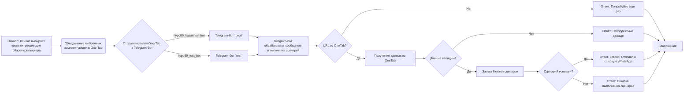
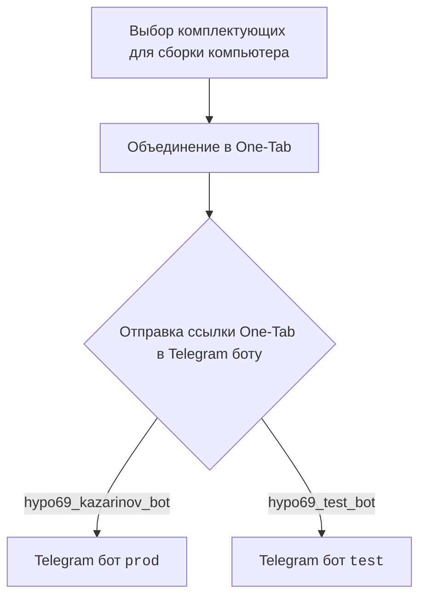
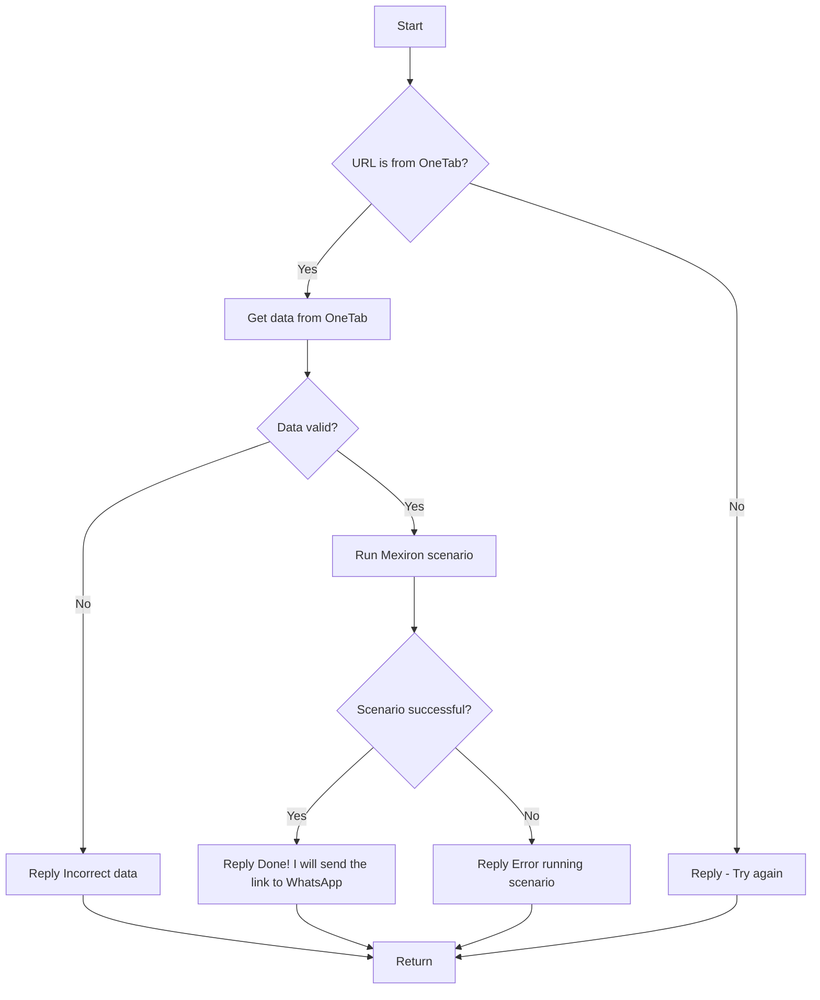

### **Системные инструкции для обработки кода проекта `hypotez`**

=========================================================================================

Описание функциональности и правил для генерации, анализа и улучшения кода. Направлено на обеспечение последовательного и читаемого стиля кодирования, соответствующего требованиям.

---

### **Основные принципы**

#### **1. Общие указания**:
- Соблюдай четкий и понятный стиль кодирования.
- Все изменения должны быть обоснованы и соответствовать установленным требованиям.

#### **2. Комментарии**:
- Используй `#` для внутренних комментариев.
- Документация всех функций, методов и классов должна следовать такому формату: 
    ```python
        def function(param: str, param1: Optional[str | dict | str] = None) -> dict | None:
            """ 
            Args:
                param (str): Описание параметра `param`.
                param1 (Optional[str | dict | str], optional): Описание параметра `param1`. По умолчанию `None`.
    
            Returns:
                dict | None: Описание возвращаемого значения. Возвращает словарь или `None`.
    
            Raises:
                SomeError: Описание ситуации, в которой возникает исключение `SomeError`.

            Ехаmple:
                >>> function('param', 'param1')
                {'param': 'param1'}
            """
    ```
- Комментарии и документация должны быть четкими, лаконичными и точными.

#### **3. Форматирование кода**:
- Используй одинарные кавычки. `a:str = 'value'`, `print('Hello World!')`;
- Добавляй пробелы вокруг операторов. Например, `x = 5`;
- Все параметры должны быть аннотированы типами. `def function(param: str, param1: Optional[str | dict | str] = None) -> dict | None:`;
- Не используй `Union`. Вместо этого используй `|`.

#### **4. Логирование**:
- Для логгирования Всегда Используй модуль `logger` из `src.logger.logger`.
- Ошибки должны логироваться с использованием `logger.error`.
Пример:
    ```python
        try:
            ...
        except Exception as ex:
            logger.error('Error while processing data', ех, exc_info=True)
    ```
#### **5 Не используй `Union[]` в коде. Вместо него используй `|`
Например:
```python
x: str | int ...
```


---

### **Основные требования**:

#### **1. Формат ответов в Markdown**:
- Все ответы должны быть выполнены в формате **Markdown**.

#### **2. Формат комментариев**:
- Используй указанный стиль для комментариев и документации в коде.
- Пример:

```python
from typing import Generator, Optional, List
from pathlib import Path


def read_text_file(
    file_path: str | Path,
    as_list: bool = False,
    extensions: Optional[List[str]] = None,
    chunk_size: int = 8192,
) -> Generator[str, None, None] | str | None:
    """
    Считывает содержимое файла (или файлов из каталога) с использованием генератора для экономии памяти.

    Args:
        file_path (str | Path): Путь к файлу или каталогу.
        as_list (bool): Если `True`, возвращает генератор строк.
        extensions (Optional[List[str]]): Список расширений файлов для чтения из каталога.
        chunk_size (int): Размер чанков для чтения файла в байтах.

    Returns:
        Generator[str, None, None] | str | None: Генератор строк, объединенная строка или `None` в случае ошибки.

    Raises:
        Exception: Если возникает ошибка при чтении файла.

    Example:
        >>> from pathlib import Path
        >>> file_path = Path('example.txt')
        >>> content = read_text_file(file_path)
        >>> if content:
        ...    print(f'File content: {content[:100]}...')
        File content: Example text...
    """
    ...
```
- Всегда делай подробные объяснения в комментариях. Избегай расплывчатых терминов, 
- таких как *«получить»* или *«делать»*. Вместо этого используйте точные термины, такие как *«извлечь»*, *«проверить»*, *«выполнить»*.
- Вместо: *«получаем»*, *«возвращаем»*, *«преобразовываем»* используй имя объекта *«функция получае»*, *«переменная возвращает»*, *«код преобразовывает»* 
- Комментарии должны непосредственно предшествовать описываемому блоку кода и объяснять его назначение.

#### **3. Пробелы вокруг операторов присваивания**:
- Всегда добавляйте пробелы вокруг оператора `=`, чтобы повысить читаемость.
- Примеры:
  - **Неправильно**: `x=5`
  - **Правильно**: `x = 5`

#### **4. Использование `j_loads` или `j_loads_ns`**:
- Для чтения JSON или конфигурационных файлов замените стандартное использование `open` и `json.load` на `j_loads` или `j_loads_ns`.
- Пример:

```python
# Неправильно:
with open('config.json', 'r', encoding='utf-8') as f:
    data = json.load(f)

# Правильно:
data = j_loads('config.json')
```

#### **5. Сохранение комментариев**:
- Все существующие комментарии, начинающиеся с `#`, должны быть сохранены без изменений в разделе «Улучшенный код».
- Если комментарий кажется устаревшим или неясным, не изменяйте его. Вместо этого отметьте его в разделе «Изменения».

#### **6. Обработка `...` в коде**:
- Оставляйте `...` как указатели в коде без изменений.
- Не документируйте строки с `...`.
```

#### **7. Аннотации**
Для всех переменных должны быть определены аннотации типа. 
Для всех функций все входные и выходные параметры аннотириваны
Для все параметров должны быть аннотации типа.


### **8. webdriver**
В коде используется webdriver. Он импртируется из модуля `webdriver` проекта `hypotez`
```python
from src.webdirver import Driver, Chrome, Firefox, Playwright, ...
driver = Driver(Firefox)

Пoсле чего может использоваться как

close_banner = {
  "attribute": null,
  "by": "XPATH",
  "selector": "//button[@id = 'closeXButton']",
  "if_list": "first",
  "use_mouse": false,
  "mandatory": false,
  "timeout": 0,
  "timeout_for_event": "presence_of_element_located",
  "event": "click()",
  "locator_description": "Закрываю pop-up окно, если оно не появилось - не страшно (`mandatory`:`false`)"
}

result = driver.execute_locator(close_banner)
```

## Анализ кода `hypotez/src/endpoints/kazarinov/readme.ru.md`

Этот файл представляет собой README на русском языке для поддиректории `kazarinov`, описывающей создание прайслиста для Казаринова и взаимодействие с Telegram-ботом.

**1. Блок-схема**



**Примеры для каждого логического блока:**

*   **A**: Пользователь выбирает процессор, материнскую плату, оперативную память и другие компоненты на сайтах интернет-магазинов.
*   **B**: Пользователь использует расширение OneTab для объединения вкладок с выбранными комплектующими в одну ссылку.
*   **C**: Пользователь отправляет ссылку OneTab боту в Telegram (`hypo69_kazarinov_bot` для production, `hypo69_test_bot` для тестирования).
*   **D**: Production Telegram-бот принимает ссылку.
*   **E**: Test Telegram-бот принимает ссылку.
*   **F**: Бот обрабатывает ссылку, проверяет валидность данных и запускает сценарий.
*   **G**: Бот проверяет, является ли предоставленная ссылка ссылкой OneTab.
*   **H**: Бот извлекает данные о комплектующих из OneTab.
*   **I**: Бот возвращает сообщение об ошибке, если ссылка не является ссылкой OneTab.
*   **J**: Бот проверяет, являются ли полученные данные о комплектующих валидными.
*   **K**: Бот возвращает сообщение об ошибке, если данные не валидны.
*   **L**: Бот запускает сценарий для генерации прайслиста Mexiron на основе полученных данных.
*   **M**: Бот проверяет, успешно ли выполнен сценарий.
*   **N**: Бот возвращает сообщение об успехе и сообщает, что ссылка будет отправлена в WhatsApp.
*   **O**: Бот возвращает сообщение об ошибке, если сценарий не был выполнен успешно.
*   **P**: Завершение процесса.

**2. Диаграмма**





*   `StartProcess`: Начало процесса обработки запроса.
*   `IsOneTabURL`: Проверка, является ли URL ссылкой OneTab.
*   `GetDataFromOneTab`: Получение данных из OneTab, если URL является ссылкой OneTab.
*   `ReplyTryAgain`: Ответ пользователю с просьбой повторить попытку, если URL не является ссылкой OneTab.
*   `IsDataValid`: Проверка валидности полученных данных.
*   `ReplyIncorrectData`: Ответ пользователю об некорректных данных, если данные не валидны.
*   `RunMexironScenario`: Запуск сценария Mexiron, если данные валидны.
*   `IsScenarioSuccessful`: Проверка успешности выполнения сценария.
*   `ReplyDone`: Ответ пользователю об успешном выполнении сценария и отправке ссылки в WhatsApp.
*   `ReplyError`: Ответ пользователю об ошибке выполнения сценария.
*   `EndProcess`: Завершение процесса.

**3. Объяснение**

Этот файл описывает логику взаимодействия пользователя с Telegram-ботом для создания прайслиста.

*   **Ссылки**:
    *   `https://one-tab.co.il`, `https://morlevi.co.il`, `https://grandavance.co.il`, `https://ivory.co.il`, `https://ksp.co.il` - примеры сайтов, с которых пользователь может собирать комплектующие.
*   **KazarinovTelegramBot**: Ссылка на документацию по боту.
*   **BotHandler**: Обработчик сообщений от бота.
*   **Поток данных на стороне клиента**:
    1.  Пользователь выбирает комплектующие на разных сайтах.
    2.  Пользователь объединяет вкладки с комплектующими в One-Tab.
    3.  Пользователь отправляет ссылку One-Tab боту в Telegram (`hypo69_kazarinov_bot` или `hypo69_test_bot`).
*   **Поток данных на стороне кода**:
    1.  `kazarinov_bot.handle_message()`: Функция обработки сообщения от пользователя.
    2.  `kazarinov.scenarios.run_scenario()`: Функция запуска сценария для генерации прайслиста.
*   **Логика работы `kazarinov.scenarios.run_scenario()`:**
    1.  Проверяется, является ли URL ссылкой OneTab.
    2.  Если да, то извлекаются данные о комплектующих.
    3.  Проверяется валидность данных.
    4.  Если данные валидны, то запускается сценарий Mexiron для генерации прайслиста.
    5.  В зависимости от успеха выполнения сценария, пользователю отправляется соответствующее сообщение.

**Потенциальные области для улучшения:**

*   Более подробное описание формата данных, ожидаемых от OneTab, и процесса валидации данных.
*   Описание структуры сценария Mexiron и используемых библиотек/модулей.
*   Обработка ошибок и логирование для облегчения отладки и мониторинга.
*   Добавить описание форматов передаваемых данных между компонентами.