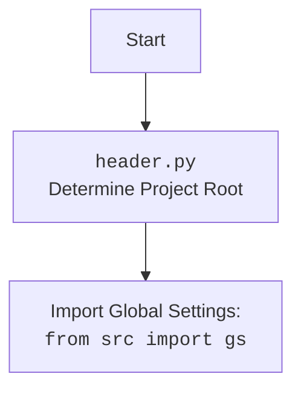

### **Системные инструкции для обработки кода проекта `hypotez`**

=========================================================================================

Описание функциональности и правил для генерации, анализа и улучшения кода. Направлено на обеспечение последовательного и читаемого стиля кодирования, соответствующего требованиям.

---

### **Основные принципы**

#### **1. Общие указания**:
- Соблюдай четкий и понятный стиль кодирования.
- Все изменения должны быть обоснованы и соответствовать установленным требованиям.

#### **2. Комментарии**:
- Используй `#` для внутренних комментариев.
- Документация всех функций, методов и классов должна следовать такому формату: 
    ```python
        def function(param: str, param1: Optional[str | dict | str] = None) -> dict | None:
            """ 
            Args:
                param (str): Описание параметра `param`.
                param1 (Optional[str | dict | str], optional): Описание параметра `param1`. По умолчанию `None`.
    
            Returns:
                dict | None: Описание возвращаемого значения. Возвращает словарь или `None`.
    
            Raises:
                SomeError: Описание ситуации, в которой возникает исключение `SomeError`.

            Ехаmple:
                >>> function('param', 'param1')
                {'param': 'param1'}
            """
    ```
- Комментарии и документация должны быть четкими, лаконичными и точными.

#### **3. Форматирование кода**:
- Используй одинарные кавычки. `a:str = 'value'`, `print('Hello World!')`;
- Добавляй пробелы вокруг операторов. Например, `x = 5`;
- Все параметры должны быть аннотированы типами. `def function(param: str, param1: Optional[str | dict | str] = None) -> dict | None:`;
- Не используй `Union`. Вместо этого используй `|`.

#### **4. Логирование**:
- Для логгирования Всегда Используй модуль `logger` из `src.logger.logger`.
- Ошибки должны логироваться с использованием `logger.error`.
Пример:
    ```python
        try:
            ...
        except Exception as ex:
            logger.error('Error while processing data', ех, exc_info=True)
    ```
#### **5 Не используй `Union[]` в коде. Вместо него используй `|`
Например:
```python
x: str | int ...
```


---

### **Основные требования**:

#### **1. Формат ответов в Markdown**:
- Все ответы должны быть выполнены в формате **Markdown**.

#### **2. Формат комментариев**:
- Используй указанный стиль для комментариев и документации в коде.
- Пример:

```python
from typing import Generator, Optional, List
from pathlib import Path


def read_text_file(
    file_path: str | Path,
    as_list: bool = False,
    extensions: Optional[List[str]] = None,
    chunk_size: int = 8192,
) -> Generator[str, None, None] | str | None:
    """
    Считывает содержимое файла (или файлов из каталога) с использованием генератора для экономии памяти.

    Args:
        file_path (str | Path): Путь к файлу или каталогу.
        as_list (bool): Если `True`, возвращает генератор строк.
        extensions (Optional[List[str]]): Список расширений файлов для чтения из каталога.
        chunk_size (int): Размер чанков для чтения файла в байтах.

    Returns:
        Generator[str, None, None] | str | None: Генератор строк, объединенная строка или `None` в случае ошибки.

    Raises:
        Exception: Если возникает ошибка при чтении файла.

    Example:
        >>> from pathlib import Path
        >>> file_path = Path('example.txt')
        >>> content = read_text_file(file_path)
        >>> if content:
        ...    print(f'File content: {content[:100]}...')
        File content: Example text...
    """
    ...
```
- Всегда делай подробные объяснения в комментариях. Избегай расплывчатых терминов, 
- таких как *«получить»* или *«делать»*
-  . Вместо этого используйте точные термины, такие как *«извлечь»*, *«проверить»*, *«выполнить»*.
- Вместо: *«получаем»*, *«возвращаем»*, *«преобразовываем»* используй имя объекта *«функция получае»*, *«переменная возвращает»*, *«код преобразовывает»* 
- Комментарии должны непосредственно предшествовать описываемому блоку кода и объяснять его назначение.

#### **3. Пробелы вокруг операторов присваивания**:
- Всегда добавляйте пробелы вокруг оператора `=`, чтобы повысить читаемость.
- Примеры:
  - **Неправильно**: `x=5`
  - **Правильно**: `x = 5`

#### **4. Использование `j_loads` или `j_loads_ns`**:
- Для чтения JSON или конфигурационных файлов замените стандартное использование `open` и `json.load` на `j_loads` или `j_loads_ns`.
- Пример:

```python
# Неправильно:
with open('config.json', 'r', encoding='utf-8') as f:
    data = json.load(f)

# Правильно:
data = j_loads('config.json')
```

#### **5. Сохранение комментариев**:
- Все существующие комментарии, начинающиеся с `#`, должны быть сохранены без изменений в разделе «Улучшенный код».
- Если комментарий кажется устаревшим или неясным, не изменяйте его. Вместо этого отметьте его в разделе «Изменения».

#### **6. Обработка `...` в коде**:
- Оставляйте `...` как указатели в коде без изменений.
- Не документируйте строки с `...`.
```

#### **7. Аннотации**
Для всех переменных должны быть определены аннотации типа. 
Для всех функций все входные и выходные параметры аннотириваны
Для все параметров должны быть аннотации типа.


### **8. webdriver**
В коде используется webdriver. Он импртируется из модуля `webdriver` проекта `hypotez`
```python
from src.webdirver import Driver, Chrome, Firefox, Playwright, ...
driver = Driver(Firefox)

Пoсле чего может использоваться как

close_banner = {
  "attribute": null,
  "by": "XPATH",
  "selector": "//button[@id = 'closeXButton']",
  "if_list": "first",
  "use_mouse": false,
  "mandatory": false,
  "timeout": 0,
  "timeout_for_event": "presence_of_element_located",
  "event": "click()",
  "locator_description": "Закрываю pop-up окно, если оно не появилось - не страшно (`mandatory`:`false`)"
}

result = driver.execute_locator(close_banner)
```

## Анализ кода `hypotez/src/endpoints/prestashop/pricelist.py`

### 1. Блок-схема

```mermaid
graph TD
    A[Начало] --> B{Инициализация PriceListRequester};
    B --> C{Запрос цен (request_prices)};
    C --> D{Обновление источника (update_source)};
    D --> E{Изменение цены продукта (modify_product_price)};
    E --> F[Конец];

    subgraph PriceListRequester
    B --> B1[Инициализация API PrestaShop];
    C --> C1[Отправка запроса на получение цен];
    C1 --> C2[Обработка ответа API];
    C2 --> C3[Формирование словаря цен];
    D --> D1[Обновление атрибута source];
    E --> E1[Изменение цены товара в источнике];
    end

    style A fill:#f9f,stroke:#333,stroke-width:2px
    style F fill:#f9f,stroke:#333,stroke-width:2px
```

**Примеры для каждого логического блока:**

-   **Инициализация `PriceListRequester`**:

    ```python
    api_credentials = {'api_domain': 'your_domain', 'api_key': 'your_key'}
    price_requester = PriceListRequester(api_credentials)
    ```

-   **Запрос цен (`request_prices`)**:

    ```python
    products = ['product1', 'product2']
    prices = price_requester.request_prices(products)
    print(prices)  # Output: {'product1': 10.99, 'product2': 5.99} (пример)
    ```

-   **Обновление источника (`update_source`)**:

    ```python
    new_source = 'new_data_source'
    price_requester.update_source(new_source)
    ```

-   **Изменение цены продукта (`modify_product_price`)**:

    ```python
    product = 'product1'
    new_price = 12.99
    price_requester.modify_product_price(product, new_price)
    ```

### 2. Диаграмма

```mermaid
flowchart TD
    A[PriceListRequester] --> B(PrestaShop);
    A --> C{api_credentials: Dict[str, str]};
    A --> D{products: List[str]};
    A --> E{new_source: str};
    A --> F{product: str};
    A --> G{new_price: float};

    B --> H{api_domain: str};
    B --> I{api_key: str};

    C --> H;
    C --> I;

    A -- request_prices --> J{Dict[str, float]};
    D --> J;

    A -- update_source --> K;
    E --> K{self.source};

    A -- modify_product_price --> L;
    F --> L;
    G --> L;

    style A fill:#f9f,stroke:#333,stroke-width:2px
```

**Объяснение зависимостей:**

-   `PriceListRequester` наследуется от `PrestaShop`, указывая на то, что он использует функциональность для работы с API PrestaShop.
-   `api_credentials` (словарь с учетными данными) передаются в `PriceListRequester` для инициализации `PrestaShop`.
-   `products` (список товаров) передаются в метод `request_prices` для получения цен.
-   `new_source` (новый источник данных) передается в метод `update_source` для обновления источника.
-   `product` (название товара) и `new_price` (новая цена) передаются в метод `modify_product_price` для изменения цены товара.



### 3. Объяснение

**Импорты:**

-   `sys`, `os`: Стандартные модули Python для работы с системными переменными и операционной системой.
-   `attr`, `attrs`: Из модуля `attr` для определения классов с меньшим объемом кода (не используется в предоставленном коде, но импортирован).
-   `pathlib.Path`: Для работы с путями к файлам и директориям.
-   `typing.Union`, `typing.Dict`, `typing.Any`, `typing.List`: Для аннотации типов.
-   `header`: Кастомный модуль для определения корневой директории проекта.
-   `src.gs`: Глобальные настройки проекта.
-   `src.logger.logger`: Модуль для логирования.
-   `src.utils.jjson`: Модуль с функциями `j_loads` и `j_loads_ns` для загрузки JSON-файлов.
-   `.api.PrestaShop`: Базовый класс для работы с API PrestaShop.
-   `types.SimpleNamespace`: Для создания объектов с атрибутами, доступными через точку (не используется непосредственно в коде, но импортирован).

**Классы:**

-   `PriceListRequester(PrestaShop)`:
    -   **Роль**: Класс для запроса списка цен из PrestaShop.
    -   **Атрибуты**:
        -   `api_domain` (унаследован от `PrestaShop`): Доменное имя API PrestaShop.
        -   `api_key` (унаследован от `PrestaShop`): Ключ API PrestaShop.
        -   `source`: Источник данных для запроса цен.
    -   **Методы**:
        -   `__init__(self, api_credentials: Dict[str, str])`: Инициализирует объект класса, принимая словарь с учетными данными API.
        -   `request_prices(self, products: List[str]) -> Dict[str, float]`: Запрашивает список цен для указанных товаров.
        -   `update_source(self, new_source: str) -> None`: Обновляет источник данных для запроса цен.
        -   `modify_product_price(self, product: str, new_price: float) -> None`: Модифицирует цену указанного товара.
    -   **Взаимодействие**:
        -   Наследуется от класса `PrestaShop`, что позволяет использовать методы для работы с API PrestaShop.

**Функции:**

-   `__init__(self, api_credentials: Dict[str, str]) -> None`:
    -   **Аргументы**:
        -   `api_credentials` (Dict[str, str]): Словарь, содержащий `api_domain` и `api_key`.
    -   **Возвращаемое значение**: `None`.
    -   **Назначение**: Инициализирует объект `PriceListRequester` с учетными данными API.
    -   **Пример**:

        ```python
        api_credentials = {'api_domain': 'your_domain', 'api_key': 'your_api_key'}
        price_list_requester = PriceListRequester(api_credentials)
        ```

-   `request_prices(self, products: List[str]) -> Dict[str, float]`:
    -   **Аргументы**:
        -   `products` (List[str]): Список товаров для запроса цен.
    -   **Возвращаемое значение**: `Dict[str, float]`: Словарь, где ключи - товары, значения - их цены.
    -   **Назначение**: Запрашивает цены для указанных товаров.
    -   **Пример**:

        ```python
        products = ['product1', 'product2']
        prices = price_list_requester.request_prices(products)
        print(prices)
        ```

-   `update_source(self, new_source: str) -> None`:
    -   **Аргументы**:
        -   `new_source` (str): Новый источник данных.
    -   **Возвращаемое значение**: `None`.
    -   **Назначение**: Обновляет источник данных для запроса цен.
    -   **Пример**:

        ```python
        new_source = 'http://example.com/new_prices'
        price_list_requester.update_source(new_source)
        ```

-   `modify_product_price(self, product: str, new_price: float) -> None`:
    -   **Аргументы**:
        -   `product` (str): Название товара.
        -   `new_price` (float): Новая цена товара.
    -   **Возвращаемое значение**: `None`.
    -   **Назначение**: Изменяет цену указанного товара в источнике данных.
    -   **Пример**:

        ```python
        product = 'product1'
        new_price = 19.99
        price_list_requester.modify_product_price(product, new_price)
        ```

**Переменные:**

-   `api_credentials` (Dict[str, str]): Словарь с учетными данными API.
-   `products` (List[str]): Список товаров.
-   `prices` (Dict[str, float]): Словарь с ценами товаров.
-   `new_source` (str): Новый источник данных.
-   `product` (str): Название товара.
-   `new_price` (float): Новая цена товара.

**Потенциальные ошибки и области для улучшения:**

-   Методы `request_prices` и `modify_product_price` содержат заглушки (`...`), что означает, что фактическая логика запроса цен и изменения цен отсутствует. Необходимо реализовать взаимодействие с источником данных.
-   Не хватает обработки исключений. Следует добавить блоки `try...except` для обработки возможных ошибок при запросе данных.
-   Отсутствует логирование. Необходимо добавить логирование для отслеживания работы методов и выявления возможных проблем.

**Взаимосвязи с другими частями проекта:**

-   Использует `header` для определения корневой директории проекта, что позволяет корректно загружать глобальные настройки из `src.gs`.
-   Использует `src.logger.logger` для логирования событий и ошибок.
-   Использует `src.utils.jjson` для загрузки JSON-файлов с конфигурацией или данными.
-   Наследуется от `.api.PrestaShop`, что подразумевает использование общих методов для взаимодействия с API PrestaShop.