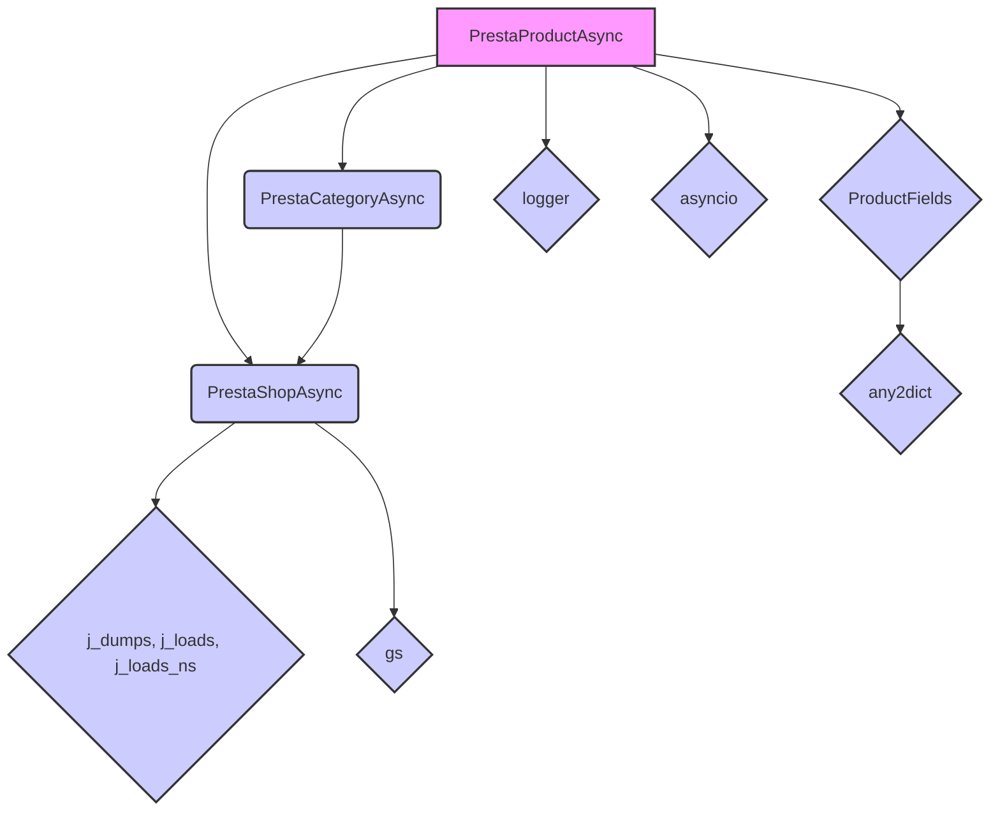
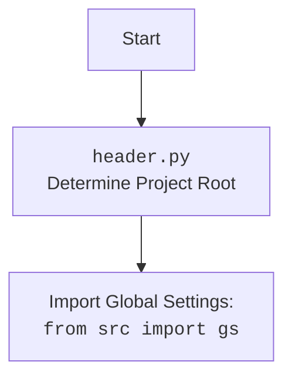

### **Системные инструкции для обработки кода проекта `hypotez`**

=========================================================================================

Описание функциональности и правил для генерации, анализа и улучшения кода. Направлено на обеспечение последовательного и читаемого стиля кодирования, соответствующего требованиям.

---

### **Основные принципы**

#### **1. Общие указания**:
- Соблюдай четкий и понятный стиль кодирования.
- Все изменения должны быть обоснованы и соответствовать установленным требованиям.

#### **2. Комментарии**:
- Используй `#` для внутренних комментариев.
- Документация всех функций, методов и классов должна следовать такому формату: 
    ```python
        def function(param: str, param1: Optional[str | dict | str] = None) -> dict | None:
            """ 
            Args:
                param (str): Описание параметра `param`.
                param1 (Optional[str | dict | str], optional): Описание параметра `param1`. По умолчанию `None`.
    
            Returns:
                dict | None: Описание возвращаемого значения. Возвращает словарь или `None`.
    
            Raises:
                SomeError: Описание ситуации, в которой возникает исключение `SomeError`.

            Ехаmple:
                >>> function('param', 'param1')
                {'param': 'param1'}
            """
    ```
- Комментарии и документация должны быть четкими, лаконичными и точными.

#### **3. Форматирование кода**:
- Используй одинарные кавычки. `a:str = 'value'`, `print('Hello World!')`;
- Добавляй пробелы вокруг операторов. Например, `x = 5`;
- Все параметры должны быть аннотированы типами. `def function(param: str, param1: Optional[str | dict | str] = None) -> dict | None:`;
- Не используй `Union`. Вместо этого используй `|`.

#### **4. Логирование**:
- Для логгирования Всегда Используй модуль `logger` из `src.logger.logger`.
- Ошибки должны логироваться с использованием `logger.error`.
Пример:
    ```python
        try:
            ...
        except Exception as ex:
            logger.error('Error while processing data', ех, exc_info=True)
    ```
#### **5 Не используй `Union[]` в коде. Вместо него используй `|`
Например:
```python
x: str | int ...
```


---

### **Основные требования**:

#### **1. Формат ответов в Markdown**:
- Все ответы должны быть выполнены в формате **Markdown**.

#### **2. Формат комментариев**:
- Используй указанный стиль для комментариев и документации в коде.
- Пример:

```python
from typing import Generator, Optional, List
from pathlib import Path


def read_text_file(
    file_path: str | Path,
    as_list: bool = False,
    extensions: Optional[List[str]] = None,
    chunk_size: int = 8192,
) -> Generator[str, None, None] | str | None:
    """
    Считывает содержимое файла (или файлов из каталога) с использованием генератора для экономии памяти.

    Args:
        file_path (str | Path): Путь к файлу или каталогу.
        as_list (bool): Если `True`, возвращает генератор строк.
        extensions (Optional[List[str]]): Список расширений файлов для чтения из каталога.
        chunk_size (int): Размер чанков для чтения файла в байтах.

    Returns:
        Generator[str, None, None] | str | None: Генератор строк, объединенная строка или `None` в случае ошибки.

    Raises:
        Exception: Если возникает ошибка при чтении файла.

    Example:
        >>> from pathlib import Path
        >>> file_path = Path('example.txt')
        >>> content = read_text_file(file_path)
        >>> if content:
        ...    print(f'File content: {content[:100]}...')
        File content: Example text...
    """
    ...
```
- Всегда делай подробные объяснения в комментариях. Избегай расплывчатых терминов, 
- таких как *«получить»* или *«делать»*. Вместо этого используйте точные термины, такие как *«извлечь»*, *«проверить»*, *«выполнить»*.
- Вместо: *«получаем»*, *«возвращаем»*, *«преобразовываем»* используй имя объекта *«функция получае»*, *«переменная возвращает»*, *«код преобразовывает»* 
- Комментарии должны непосредственно предшествовать описываемому блоку кода и объяснять его назначение.

#### **3. Пробелы вокруг операторов присваивания**:
- Всегда добавляйте пробелы вокруг оператора `=`, чтобы повысить читаемость.
- Примеры:
  - **Неправильно**: `x=5`
  - **Правильно**: `x = 5`

#### **4. Использование `j_loads` или `j_loads_ns`**:
- Для чтения JSON или конфигурационных файлов замените стандартное использование `open` и `json.load` на `j_loads` или `j_loads_ns`.
- Пример:

```python
# Неправильно:
with open('config.json', 'r', encoding='utf-8') as f:
    data = json.load(f)

# Правильно:
data = j_loads('config.json')
```

#### **5. Сохранение комментариев**:
- Все существующие комментарии, начинающиеся с `#`, должны быть сохранены без изменений в разделе «Улучшенный код».
- Если комментарий кажется устаревшим или неясным, не изменяйте его. Вместо этого отметьте его в разделе «Изменения».

#### **6. Обработка `...` в коде**:
- Оставляйте `...` как указатели в коде без изменений.
- Не документируйте строки с `...`.
```

#### **7. Аннотации**
Для всех переменных должны быть определены аннотации типа. 
Для всех функций все входные и выходные параметры аннотириваны
Для все параметров должны быть аннотации типа.


### **8. webdriver**
В коде используется webdriver. Он импртируется из модуля `webdriver` проекта `hypotez`
```python
from src.webdirver import Driver, Chrome, Firefox, Playwright, ...
driver = Driver(Firefox)

Пoсле чего может использоваться как

close_banner = {
  "attribute": null,
  "by": "XPATH",
  "selector": "//button[@id = 'closeXButton']",
  "if_list": "first",
  "use_mouse": false,
  "mandatory": false,
  "timeout": 0,
  "timeout_for_event": "presence_of_element_located",
  "event": "click()",
  "locator_description": "Закрываю pop-up окно, если оно не появилось - не страшно (`mandatory`:`false`)"
}

result = driver.execute_locator(close_banner)
```

## Анализ кода `hypotez/src/endpoints/prestashop/product_async.py`

### 1. Блок-схема

```mermaid
graph LR
    A[Начало] --> B(Инициализация PrestaProductAsync);
    B --> C{Получение дополнительных категорий?};
    C -- Да --> D(Вызов presta_category_async.get_parent_categories_list);
    D --> E(Преобразование ProductFields в словарь);
    C -- Нет --> E;
    E --> F(Вызов create для добавления продукта);
    F --> G{Успешно добавлен продукт?};
    G -- Да --> H{Загрузка изображения?};
    H -- Да --> I(Вызов create_binary для загрузки изображения);
    I --> J(Успешная загрузка изображения);
    J --> K[Конец (Успех)];
    H -- Нет --> L(Логирование ошибки загрузки изображения);
    L --> M[Конец (Ошибка)];
    G -- Нет --> N(Логирование ошибки добавления продукта);
    N --> M;
    I -- Нет --> L;
    B --> O{Инициализация PrestaCategoryAsync}
    O --> C
```

**Примеры для каждого логического блока:**

-   **A (Начало)**: Запуск скрипта, инициирующего добавление нового продукта.
-   **B (Инициализация PrestaProductAsync)**: `product = PrestaProductAsync(*args, **kwargs)`
-   **C (Получение дополнительных категорий?)**: Проверка, нужно ли получить дополнительные категории для продукта.  Например, `if f.id_category_default:`
-   **D (Вызов `presta_category_async.get_parent_categories_list`)**: `f.additional_categories = await self.presta_category_async.get_parent_categories_list(f.id_category_default)`
-   **E (Преобразование ProductFields в словарь)**: `presta_product_dict: dict = f.to_dict()`
-   **F (Вызов `create` для добавления продукта)**: `new_f: ProductFields = await self.create('products', presta_product_dict)`
-   **G (Успешно добавлен продукт?)**: Проверка, был ли успешно добавлен продукт в базу данных PrestaShop. Например, `if not new_f:`
-   **H (Загрузка изображения?)**: Проверка, нужно ли загружать изображение для продукта.  Например, `if f.local_image_path:`
-   **I (Вызов `create_binary` для загрузки изображения)**: `await self.create_binary(f'images/products/{new_f.id_product}', f.local_image_path, new_f.id_product)`
-   **J (Успешная загрузка изображения)**: Изображение успешно загружено на сервер.
-   **K (Конец (Успех))**: Продукт успешно добавлен со всеми деталями.
-   **L (Логирование ошибки загрузки изображения)**: `logger.error(f"Не подналось изображение")`
-   **M (Конец (Ошибка))**: Произошла ошибка в процессе добавления продукта.
-   **N (Логирование ошибки добавления продукта)**: `logger.error(f"Товар не был добавлен в базу данных Presyashop")`
-   **O (Инициализация PrestaCategoryAsync)**: `self.presta_category_async = PrestaCategoryAsync(*args, **kwargs)`

### 2. Диаграмма



**Анализ зависимостей:**

-   **PrestaProductAsync**: Основной класс, который манипулирует продуктами, взаимодействует с PrestaShop API и получает данные о продуктах.
    -   Зависит от **PrestaShopAsync** для выполнения асинхронных запросов к PrestaShop.
    -   Зависит от **PrestaCategoryAsync** для получения информации о категориях продукта.
    -   Использует **ProductFields** для представления данных о продукте.
    -   Использует **logger** для логирования ошибок и отладочной информации.
    -   Использует **asyncio** для поддержки асинхронных операций.
-   **PrestaShopAsync**: Класс для асинхронного взаимодействия с PrestaShop API.
    -   Использует **j\_dumps**, **j\_loads**, **j\_loads\_ns** для работы с JSON.
    -   Использует **gs** для доступа к глобальным настройкам.
-   **PrestaCategoryAsync**: Класс для асинхронного взаимодействия с категориями PrestaShop.
    -   Зависит от **PrestaShopAsync** для выполнения асинхронных запросов.
-   **ProductFields**: dataclass, представляющий поля продукта.
    -   Использует **any2dict** для преобразования данных в словарь.
-   **logger**: Модуль для логирования.
-   **asyncio**: Модуль для асинхронного программирования.



### 3. Объяснение

#### Импорты:

-   `import asyncio`: Используется для асинхронного программирования, позволяя функциям выполняться параллельно.
-   `from dataclasses import dataclass, field`: Используется для создания классов данных, упрощая создание классов, основная цель которых - хранение данных.
-   `from typing import List, Dict, Any, Optional`: Используется для статической типизации, что помогает улучшить читаемость и предотвратить ошибки.
-   `import header`: Предположительно, содержит общие функции или настройки для проекта.
-   `from src import gs`: Импортирует глобальные настройки проекта.
-   `from src.endpoints.prestashop.api import PrestaShopAsync`: Импортирует класс для взаимодействия с PrestaShop API.
-   `from src.endpoints.prestashop.category_async import PrestaCategoryAsync`: Импортирует класс для работы с категориями PrestaShop.
-   `from src.endpoints.prestashop.product_fields import ProductFields`: Импортирует класс данных для представления полей продукта.
-   `from src.utils.convertors.any import any2dict`: Импортирует функцию для преобразования любого типа данных в словарь.
-   `from src.utils.jjson import j_dumps, j_loads, j_loads_ns`: Импортирует функции для работы с JSON.
-   `from src.utils.printer import pprint as print`: Импортирует функцию для красивого вывода данных.
-   `from src.logger import logger`: Импортирует модуль для логирования.

#### Классы:

-   **`PrestaProductAsync(PrestaShopAsync)`**:
    -   **Роль**: Предоставляет методы для работы с продуктами в PrestaShop, такие как добавление новых продуктов, обновление существующих и получение информации о продуктах.
    -   **Атрибуты**:
        -   `presta_category_async`: Экземпляр класса `PrestaCategoryAsync` для работы с категориями.
    -   **Методы**:
        -   `__init__(self, *args, **kwargs)`: Конструктор класса, инициализирует экземпляр `PrestaCategoryAsync`.
        -   `add_new_product_async(self, f: ProductFields) -> ProductFields | None`: Асинхронно добавляет новый продукт в PrestaShop.  Возвращает объект `ProductFields` с установленным `id_product` в случае успеха, `None` в случае неудачи.

#### Функции:

-   `async def add_new_product_async(self, f: ProductFields) -> ProductFields | None:`
    -   **Аргументы**:
        -   `f (ProductFields)`: Объект класса `ProductFields`, содержащий информацию о продукте.
    -   **Возвращаемое значение**:
        -   `ProductFields | None`: Объект `ProductFields` с установленным `id_product`, если продукт был успешно добавлен, или `None` в противном случае.
    -   **Назначение**:
        1.  Получает дополнительные категории для продукта, вызывая `self.presta_category_async.get_parent_categories_list(f.id_category_default)`.
        2.  Преобразует объект `ProductFields` в словарь `presta_product_dict`.
        3.  Вызывает метод `create` для добавления продукта в PrestaShop.
        4.  Проверяет, был ли продукт успешно добавлен.  Если нет, логирует ошибку и возвращает `None`.
        5.  Загружает изображение продукта, вызывая `self.create_binary`.
        6.  Если загрузка изображения прошла успешно, возвращает `True`.  В противном случае логирует ошибку и возвращает `None`.

#### Переменные:

-   `presta_category_async`: Экземпляр класса `PrestaCategoryAsync`, используется для работы с категориями PrestaShop.
-   `f (ProductFields)`: Объект класса `ProductFields`, содержащий информацию о продукте.
-   `presta_product_dict (dict)`: Словарь, содержащий информацию о продукте для отправки в PrestaShop API.
-   `new_f (ProductFields)`: Объект класса `ProductFields`, возвращенный после добавления продукта в PrestaShop.

#### Потенциальные ошибки и области для улучшения:

1.  **Обработка ошибок**: В коде есть логирование ошибок, но отсутствует полная обработка исключений.  Рекомендуется добавить блоки `try...except` для обработки возможных исключений при взаимодействии с PrestaShop API и при загрузке изображений.
2.  **Возврат значений**: Функция `add_new_product_async` возвращает `True` после успешной загрузки изображения, но не возвращает сам объект `ProductFields`.  Было бы полезнее возвращать объект `ProductFields` с обновленными данными (например, с `id_product`).
3.  **Асинхронность**: В коде используются асинхронные функции, но пример использования (`main`) выглядит синхронным.  Необходимо убедиться, что все вызовы асинхронных функций выполняются с использованием `await`.
4.  **Логирование**: Можно добавить больше логирования для отслеживания процесса добавления продукта, например, логировать начало и конец каждой операции.
5.  **Комментарии**: Добавить аннотации типов в функцию `main`
6.  **Обработка `...`**: Необходимо реализовать обработку ошибок и логику, которая сейчас скрыта за `...`.

#### Взаимосвязи с другими частями проекта:

-   `src.endpoints.prestashop.api.PrestaShopAsync`: Предоставляет базовый класс для взаимодействия с PrestaShop API, который используется для выполнения HTTP-запросов и обработки ответов.
-   `src.endpoints.prestashop.category_async.PrestaCategoryAsync`: Используется для получения информации о категориях продукта, что необходимо для правильной организации продукта в PrestaShop.
-   `src.endpoints.prestashop.product_fields.ProductFields`: Определяет структуру данных для представления продукта, что обеспечивает согласованность данных между различными частями системы.
-   `src.utils.jjson`: Предоставляет функции для работы с JSON, что необходимо для сериализации и десериализации данных при взаимодействии с PrestaShop API.
-   `src.logger`: Предоставляет механизм логирования, позволяющий отслеживать ошибки и предупреждения в процессе работы системы.