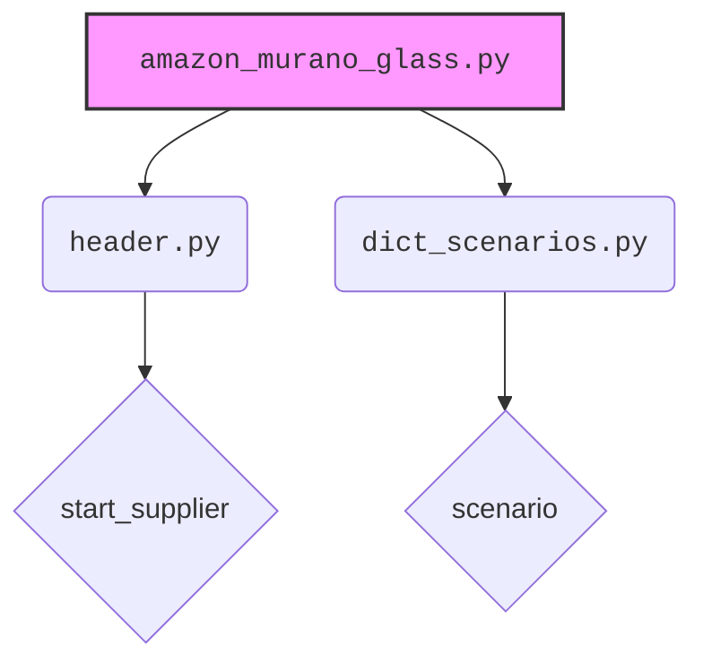
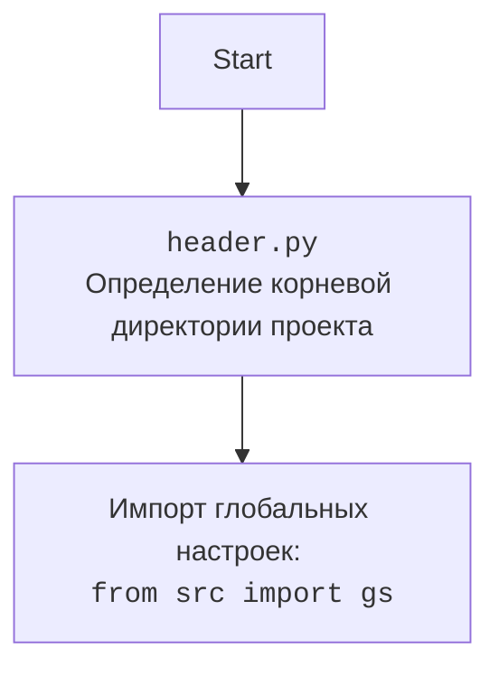

### **Анализ кода проекта `hypotez`**

=========================================================================================

#### **Расположение файла в проекте**:
Файл расположен по пути `/src/suppliers/scenario/_experiments/amazon_murano_glass.py`, что указывает на его принадлежность к экспериментальным сценариям для поставщика `amazon`.

---

### **1. Блок-схема**

```mermaid
graph TD
    A[Начало: start_supplier('amazon')] --> B{Инициализация Supplier};
    B -- Успешно --> C{Запуск сценария: s.run_scenario(scenario['Murano Glass'])};
    C --> D{Получение ключа категории: k = list(s.current_scenario['presta_categories']['default_category'].keys())[0]};
    D --> E[Конец];
    B -- Ошибка --> F[Обработка ошибки];
    F --> E;
```

**Примеры для каждого логического блока:**

- **A: `start_supplier('amazon')`**: Инициализация поставщика `amazon`. Например, создается объект класса `Supplier` для работы с `amazon`.
- **B: `Инициализация Supplier`**: Проверка успешности инициализации. В случае ошибки, переход к блоку обработки ошибок.
- **C: `s.run_scenario(scenario['Murano Glass'])`**: Запуск сценария `Murano Glass`. Пример: загрузка конфигурации, выполнение шагов сценария.
- **D: `k = list(s.current_scenario['presta_categories']['default_category'].keys())[0]`**: Получение первого ключа из `default_category` сценария. Пример: извлечение ID категории.
- **E: `Конец`**: Завершение выполнения кода.
- **F: `Обработка ошибки`**: Логирование ошибки и завершение работы.

### **2. Диаграмма**



**Описание зависимостей:**

- `amazon_murano_glass.py` зависит от `header.py` для инициализации поставщика и от `dict_scenarios.py` для получения сценария.

**Дополнительный блок `mermaid` для `header.py`:**



### **3. Объяснение**

#### **Импорты:**

- `header`: Содержит общие функции и классы, используемые в проекте, такие как инициализация поставщика (`start_supplier`).
    - Взаимосвязь: `header` обеспечивает базовую функциональность для работы сценариев.
- `dict_scenarios`: Содержит словарь сценариев (`scenario`), используемых в различных тестах.
    - Взаимосвязь: `dict_scenarios` предоставляет данные для выполнения сценариев.

#### **Переменные:**

- `s`: Объект класса `Supplier`, созданный с помощью `start_supplier('amazon')`.
    - Тип: `Supplier`
    - Использование: Представляет поставщика `amazon` и используется для выполнения сценариев.
- `scenario`: Словарь, содержащий сценарии. Используется для передачи данных в `s.run_scenario`.
    - Тип: `dict`
    - Использование: Хранит сценарии для выполнения.
- `k`: Ключ из словаря `presta_categories`, полученный из текущего сценария.
    - Тип: `str`
    - Использование: Используется для доступа к данным категории.

#### **Функции:**

- `start_supplier(supplier_name: str) -> Supplier`: Функция инициализации поставщика. Возвращает объект класса `Supplier`.
    - Аргументы: `supplier_name` (str) - название поставщика.
    - Возвращаемое значение: Объект класса `Supplier`.
    - Назначение: Создает и возвращает объект поставщика.
    - Пример:
    ```python
    s = start_supplier('amazon')
    ```
- `s.run_scenario(scenario: dict) -> None`: Метод класса `Supplier`, запускающий сценарий.
    - Аргументы: `scenario` (dict) - словарь с описанием сценария.
    - Возвращаемое значение: `None`.
    - Назначение: Выполняет шаги, описанные в сценарии.
    - Пример:
    ```python
    s.run_scenario(scenario['Murano Glass'])
    ```

#### **Области для улучшения:**

1.  **Обработка ошибок**: Отсутствует явная обработка ошибок. Желательно добавить блоки `try-except` для перехвата возможных исключений.
2.  **Логирование**: Добавить логирование для отслеживания хода выполнения сценария и возможных ошибок.
3.  **Комментарии**: Добавить больше комментариев для пояснения логики работы кода, особенно в сложных участках.

#### **Взаимосвязи с другими частями проекта:**

- Данный скрипт является частью экспериментальных сценариев, поэтому он может использоваться для тестирования и отладки основных функций проекта. Он взаимодействует с модулями `header` и `dict_scenarios`, а также с классом `Supplier`, который может находиться в другом модуле (например, `src/suppliers/supplier.py`).