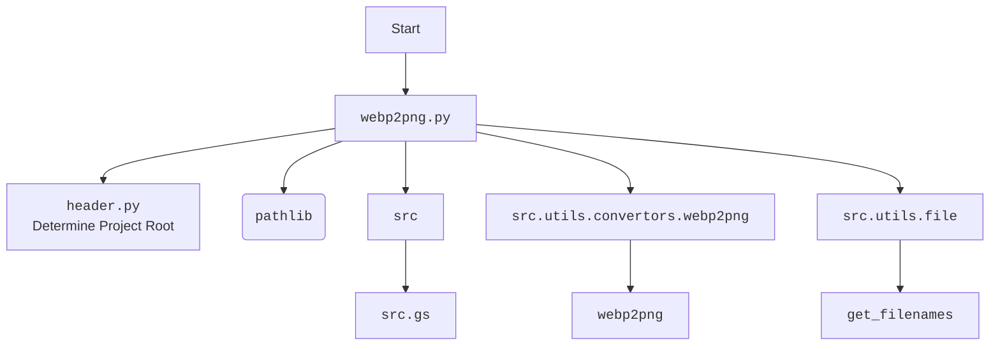
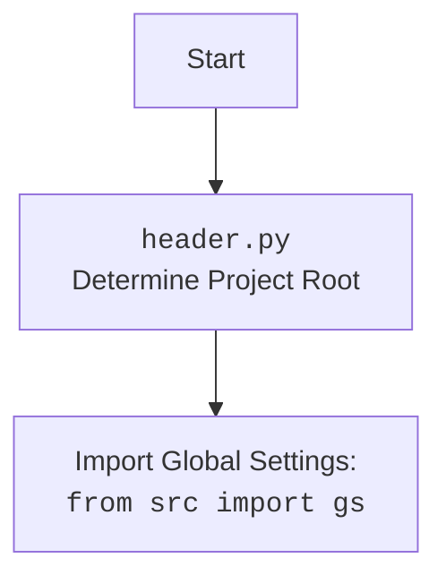

### **Системные инструкции для обработки кода проекта `hypotez`**

=========================================================================================

Описание функциональности и правил для генерации, анализа и улучшения кода. Направлено на обеспечение последовательного и читаемого стиля кодирования, соответствующего требованиям.

---

### **Основные принципы**

#### **1. Общие указания**:
- Соблюдай четкий и понятный стиль кодирования.
- Все изменения должны быть обоснованы и соответствовать установленным требованиям.

#### **2. Комментарии**:
- Используй `#` для внутренних комментариев.
- Документация всех функций, методов и классов должна следовать такому формату: 
    ```python
        def function(param: str, param1: Optional[str | dict | str] = None) -> dict | None:
            """ 
            Args:
                param (str): Описание параметра `param`.
                param1 (Optional[str | dict | str], optional): Описание параметра `param1`. По умолчанию `None`.
    
            Returns:
                dict | None: Описание возвращаемого значения. Возвращает словарь или `None`.
    
            Raises:
                SomeError: Описание ситуации, в которой возникает исключение `SomeError`.

            Ехаmple:
                >>> function('param', 'param1')
                {'param': 'param1'}
            """
    ```
- Комментарии и документация должны быть четкими, лаконичными и точными.

#### **3. Форматирование кода**:
- Используй одинарные кавычки. `a:str = 'value'`, `print('Hello World!')`;
- Добавляй пробелы вокруг операторов. Например, `x = 5`;
- Все параметры должны быть аннотированы типами. `def function(param: str, param1: Optional[str | dict | str] = None) -> dict | None:`;
- Не используй `Union`. Вместо этого используй `|`.

#### **4. Логирование**:
- Для логгирования Всегда Используй модуль `logger` из `src.logger.logger`.
- Ошибки должны логироваться с использованием `logger.error`.
Пример:
    ```python
        try:
            ...
        except Exception as ex:
            logger.error('Error while processing data', ех, exc_info=True)
    ```
#### **5 Не используй `Union[]` в коде. Вместо него используй `|`
Например:
```python
x: str | int ...
```


---

### **Основные требования**:

#### **1. Формат ответов в Markdown**:
- Все ответы должны быть выполнены в формате **Markdown**.

#### **2. Формат комментариев**:
- Используй указанный стиль для комментариев и документации в коде.
- Пример:

```python
from typing import Generator, Optional, List
from pathlib import Path


def read_text_file(
    file_path: str | Path,
    as_list: bool = False,
    extensions: Optional[List[str]] = None,
    chunk_size: int = 8192,
) -> Generator[str, None, None] | str | None:
    """
    Считывает содержимое файла (или файлов из каталога) с использованием генератора для экономии памяти.

    Args:
        file_path (str | Path): Путь к файлу или каталогу.
        as_list (bool): Если `True`, возвращает генератор строк.
        extensions (Optional[List[str]]): Список расширений файлов для чтения из каталога.
        chunk_size (int): Размер чанков для чтения файла в байтах.

    Returns:
        Generator[str, None, None] | str | None: Генератор строк, объединенная строка или `None` в случае ошибки.

    Raises:
        Exception: Если возникает ошибка при чтении файла.

    Example:
        >>> from pathlib import Path
        >>> file_path = Path('example.txt')
        >>> content = read_text_file(file_path)
        >>> if content:
        ...    print(f'File content: {content[:100]}...')
        File content: Example text...
    """
    ...
```
- Всегда делай подробные объяснения в комментариях. Избегай расплывчатых терминов, 
- таких как *«получить»* или *«делать»*. Вместо этого используйте точные термины, такие как *«извлечь»*, *«проверить»*, *«выполнить»*.
- Вместо: *«получаем»*, *«возвращаем»*, *«преобразовываем»* используй имя объекта *«функция получае»*, *«переменная возвращает»*, *«код преобразовывает»* 
- Комментарии должны непосредственно предшествовать описываемому блоку кода и объяснять его назначение.

#### **3. Пробелы вокруг операторов присваивания**:
- Всегда добавляйте пробелы вокруг оператора `=`, чтобы повысить читаемость.
- Примеры:
  - **Неправильно**: `x=5`
  - **Правильно**: `x = 5`

#### **4. Использование `j_loads` или `j_loads_ns`**:
- Для чтения JSON или конфигурационных файлов замените стандартное использование `open` и `json.load` на `j_loads` или `j_loads_ns`.
- Пример:

```python
# Неправильно:
with open('config.json', 'r', encoding='utf-8') as f:
    data = json.load(f)

# Правильно:
data = j_loads('config.json')
```

#### **5. Сохранение комментариев**:
- Все существующие комментарии, начинающиеся с `#`, должны быть сохранены без изменений в разделе «Улучшенный код».
- Если комментарий кажется устаревшим или неясным, не изменяйте его. Вместо этого отметьте его в разделе «Изменения».

#### **6. Обработка `...` в коде**:
- Оставляйте `...` как указатели в коде без изменений.
- Не документируйте строки с `...`.
```

#### **7. Аннотации**
Для всех переменных должны быть определены аннотации типа. 
Для всех функций все входные и выходные параметры аннотириваны
Для все параметров должны быть аннотации типа.


### **8. webdriver**
В коде используется webdriver. Он импртируется из модуля `webdriver` проекта `hypotez`
```python
from src.webdirver import Driver, Chrome, Firefox, Playwright, ...
driver = Driver(Firefox)

Пoсле чего может использоваться как

close_banner = {
  "attribute": null,
  "by": "XPATH",
  "selector": "//button[@id = 'closeXButton']",
  "if_list": "first",
  "use_mouse": false,
  "mandatory": false,
  "timeout": 0,
  "timeout_for_event": "presence_of_element_located",
  "event": "click()",
  "locator_description": "Закрываю pop-up окно, если оно не появилось - не страшно (`mandatory`:`false`)"
}

result = driver.execute_locator(close_banner)
```

### Анализ кода `hypotez/src/utils/convertors/_experiments/webp2png.py`

#### 1. Блок-схема:

```mermaid
graph TD
    A[Начало: __name__ == '__main__'] --> B{Определить каталоги для WebP и PNG изображений}
    B --> C{Задать webp_dir = gs.path.google_drive / 'kazarinov' / 'raw_images_from_openai'}
    C --> D{Задать png_dir = gs.path.google_drive / 'kazarinov' / 'converted_images'}
    D --> E{Вывести пути к каталогам webp_dir и png_dir}
    E --> F[Вызов convert_images(webp_dir, png_dir)]
    F --> G{Функция convert_images(webp_dir: Path, png_dir: Path)}
    G --> H{Получить список WebP файлов: webp_files = get_filenames(webp_dir)}
    H --> I{Цикл по WebP файлам: for webp in webp_files}
    I --> J{Определить путь для PNG файла: png = png_dir / f"{Path(webp).stem}.png"}
    J --> K{Определить полный путь к WebP файлу: webp_path = webp_dir / webp}
    K --> L{Конвертировать WebP в PNG: result = webp2png(webp_path, png)}
    L --> M{Вывести результат конвертации: print(result)}
    M --> I
    I -- Конец цикла --> N[Конец: convert_images]
    N --> O[Конец: __main__]
```

Примеры для каждого логического блока:

-   **A**: Начало скрипта.
-   **B**: Определение путей к директориям.
-   **C**: `webp_dir` задается как путь к директории с WebP изображениями. Пример: `/path/to/google_drive/kazarinov/raw_images_from_openai`.
-   **D**: `png_dir` задается как путь к директории для сохранения PNG изображений. Пример: `/path/to/google_drive/kazarinov/converted_images`.
-   **E**: Вывод путей к исходной и целевой директориям.
-   **F**: Вызов функции `convert_images` с параметрами `webp_dir` и `png_dir`.
-   **G**: Функция `convert_images` принимает пути к директориям WebP и PNG.
-   **H**: Получение списка WebP файлов с использованием функции `get_filenames`.
-   **I**: Начало цикла по каждому WebP файлу.
-   **J**: Формирование имени и пути для PNG файла на основе имени WebP файла.
-   **K**: Определение полного пути к WebP файлу.
-   **L**: Вызов функции `webp2png` для конвертации WebP в PNG.
-   **M**: Вывод результата конвертации (например, сообщения об успехе или ошибке).
-   **N**: Завершение функции `convert_images`.
-   **O**: Завершение скрипта.

#### 2. Диаграмма зависимостей:



Объяснение зависимостей:

-   `header`: Используется для определения корня проекта.
-   `pathlib`: Используется для работы с путями к файлам и директориям.
-   `src`: Общий пакет, содержащий модули проекта.
-   `src.gs`: Глобальные настройки проекта, содержащие пути и другие параметры.
-   `src.utils.convertors.webp2png`: Модуль, содержащий функцию `webp2png` для конвертации WebP в PNG.
-   `src.utils.file`: Модуль, содержащий функцию `get_filenames` для получения списка файлов в директории.

Дополнительно:



#### 3. Объяснение:

-   **Импорты**:
    -   `header`: Определяет корень проекта.
    -   `pathlib`: Модуль для работы с файловыми путями. Позволяет удобно манипулировать путями к директориям и файлам.
    -   `src`: Корневой пакет, содержащий модули проекта.
    -   `src.gs`: Глобальные настройки, которые могут включать пути к директориям (например, к Google Drive).
    -   `src.utils.convertors.webp2png`: Содержит функцию `webp2png`, выполняющую фактическую конвертацию WebP в PNG.
    -   `src.utils.file`: Модуль с утилитами для работы с файлами, в частности, функция `get_filenames` для получения списка имен файлов в указанной директории.
-   **Классы**:
    -   В данном коде классы не используются.
-   **Функции**:
    -   `convert_images(webp_dir: Path, png_dir: Path) -> None`:
        -   Аргументы:
            -   `webp_dir` (Path): Путь к директории с WebP изображениями.
            -   `png_dir` (Path): Путь к директории для сохранения PNG изображений.
        -   Возвращаемое значение: `None`.
        -   Назначение: Конвертирует все WebP изображения в указанной директории в PNG формат и сохраняет их в другую директорию.
        -   Пример:
            ```python
            convert_images(
                gs.path.google_drive / 'emil' / 'raw_images_from_openai',
                gs.path.google_drive / 'emil' / 'converted_images'
            )
            ```
-   **Переменные**:
    -   `webp_dir` (Path): Путь к директории с исходными WebP файлами.
    -   `png_dir` (Path): Путь к директории, куда сохраняются сконвертированные PNG файлы.
    -   `webp_files` (list): Список имен файлов WebP, полученных с помощью `get_filenames(webp_dir)`.
    -   `webp` (str): Имя текущего WebP файла в цикле.
    -   `png` (Path): Путь к PNG файлу, который будет создан.
    -   `webp_path` (Path): Полный путь к WebP файлу.
    -   `result` (Any): Результат выполнения функции `webp2png`.

Потенциальные ошибки и области для улучшения:

-   Отсутствует обработка исключений при конвертации WebP в PNG. Если `webp2png` завершится с ошибкой, скрипт просто выведет сообщение об ошибке, но продолжит работу.
-   Не предусмотрена проверка существования директорий `webp_dir` и `png_dir`.
-   В основном блоке `if __name__ == '__main__'` пути жестко закодированы. Было бы лучше сделать их параметрами командной строки.

Взаимосвязи с другими частями проекта:

-   Использует `gs.path.google_drive` для получения пути к директории Google Drive, что предполагает интеграцию с Google Drive.
-   Функция `get_filenames` используется для получения списка файлов в директории.
-   Функция `webp2png` выполняет фактическую конвертацию WebP в PNG.

```mermaid
flowchart TD
    Start --> A[<code>webp2png.py</code>]
    A --> B[<code>gs</code>]
    A --> C[<code>get_filenames</code>]
    A --> D[<code>webp2png</code>]
    B --> E[Global settings]
    C --> F[List of filenames]
    D --> G[Conversion process]