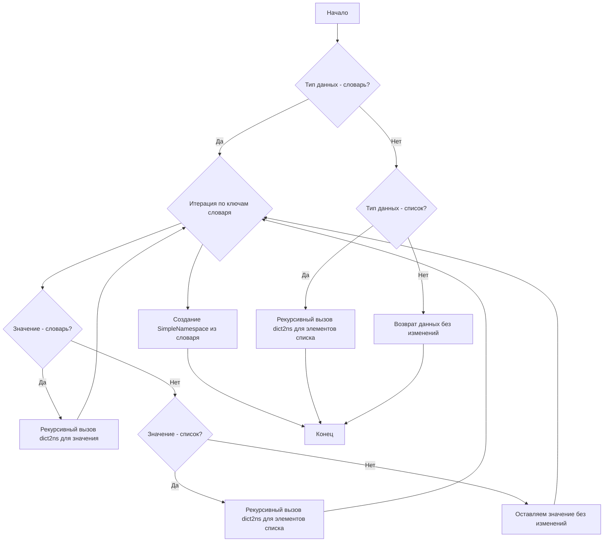

### **Системные инструкции для обработки кода проекта `hypotez`**

=========================================================================================

Описание функциональности и правил для генерации, анализа и улучшения кода. Направлено на обеспечение последовательного и читаемого стиля кодирования, соответствующего требованиям.

---

### **Основные принципы**

#### **1. Общие указания**:
- Соблюдай четкий и понятный стиль кодирования.
- Все изменения должны быть обоснованы и соответствовать установленным требованиям.

#### **2. Комментарии**:
- Используй `#` для внутренних комментариев.
- Документация всех функций, методов и классов должна следовать такому формату: 
    ```python
        def function(param: str, param1: Optional[str | dict | str] = None) -> dict | None:
            """ 
            Args:
                param (str): Описание параметра `param`.
                param1 (Optional[str | dict | str], optional): Описание параметра `param1`. По умолчанию `None`.
    
            Returns:
                dict | None: Описание возвращаемого значения. Возвращает словарь или `None`.
    
            Raises:
                SomeError: Описание ситуации, в которой возникает исключение `SomeError`.

            Ехаmple:
                >>> function('param', 'param1')
                {'param': 'param1'}
            """
    ```
- Комментарии и документация должны быть четкими, лаконичными и точными.

#### **3. Форматирование кода**:
- Используй одинарные кавычки. `a:str = 'value'`, `print('Hello World!')`;
- Добавляй пробелы вокруг операторов. Например, `x = 5`;
- Все параметры должны быть аннотированы типами. `def function(param: str, param1: Optional[str | dict | str] = None) -> dict | None:`;
- Не используй `Union`. Вместо этого используй `|`.

#### **4. Логирование**:
- Для логгирования Всегда Используй модуль `logger` из `src.logger.logger`.
- Ошибки должны логироваться с использованием `logger.error`.
Пример:
    ```python
        try:
            ...
        except Exception as ex:
            logger.error('Error while processing data', ех, exc_info=True)
    ```
#### **5 Не используй `Union[]` в коде. Вместо него используй `|`
Например:
```python
x: str | int ...
```


---

### **Основные требования**:

#### **1. Формат ответов в Markdown**:
- Все ответы должны быть выполнены в формате **Markdown**.

#### **2. Формат комментариев**:
- Используй указанный стиль для комментариев и документации в коде.
- Пример:

```python
from typing import Generator, Optional, List
from pathlib import Path


def read_text_file(
    file_path: str | Path,
    as_list: bool = False,
    extensions: Optional[List[str]] = None,
    chunk_size: int = 8192,
) -> Generator[str, None, None] | str | None:
    """
    Считывает содержимое файла (или файлов из каталога) с использованием генератора для экономии памяти.

    Args:
        file_path (str | Path): Путь к файлу или каталогу.
        as_list (bool): Если `True`, возвращает генератор строк.
        extensions (Optional[List[str]]): Список расширений файлов для чтения из каталога.
        chunk_size (int): Размер чанков для чтения файла в байтах.

    Returns:
        Generator[str, None, None] | str | None: Генератор строк, объединенная строка или `None` в случае ошибки.

    Raises:
        Exception: Если возникает ошибка при чтении файла.

    Example:
        >>> from pathlib import Path
        >>> file_path = Path('example.txt')
        >>> content = read_text_file(file_path)
        >>> if content:
        ...    print(f'File content: {content[:100]}...')
        File content: Example text...
    """
    ...
```
- Всегда делай подробные объяснения в комментариях. Избегай расплывчатых терминов, 
- таких как *«получить»* или *«делать»*. Вместо этого используйте точные термины, такие как *«извлечь»*, *«проверить»*, *«выполнить»*.
- Вместо: *«получаем»*, *«возвращаем»*, *«преобразовываем»* используй имя объекта *«функция получае»*, *«переменная возвращает»*, *«код преобразовывает»* 
- Комментарии должны непосредственно предшествовать описываемому блоку кода и объяснять его назначение.

#### **3. Пробелы вокруг операторов присваивания**:
- Всегда добавляйте пробелы вокруг оператора `=`, чтобы повысить читаемость.
- Примеры:
  - **Неправильно**: `x=5`
  - **Правильно**: `x = 5`

#### **4. Использование `j_loads` или `j_loads_ns`**:
- Для чтения JSON или конфигурационных файлов замените стандартное использование `open` и `json.load` на `j_loads` или `j_loads_ns`.
- Пример:

```python
# Неправильно:
with open('config.json', 'r', encoding='utf-8') as f:
    data = json.load(f)

# Правильно:
data = j_loads('config.json')
```

#### **5. Сохранение комментариев**:
- Все существующие комментарии, начинающиеся с `#`, должны быть сохранены без изменений в разделе «Улучшенный код».
- Если комментарий кажется устаревшим или неясным, не изменяйте его. Вместо этого отметьте его в разделе «Изменения».

#### **6. Обработка `...` в коде**:
- Оставляйте `...` как указатели в коде без изменений.
- Не документируйте строки с `...`.
```

#### **7. Аннотации**
Для всех переменных должны быть определены аннотации типа. 
Для всех функций все входные и выходные параметры аннотириваны
Для все параметров должны быть аннотации типа.


### **8. webdriver**
В коде используется webdriver. Он импртируется из модуля `webdriver` проекта `hypotez`
```python
from src.webdirver import Driver, Chrome, Firefox, Playwright, ...
driver = Driver(Firefox)

Пoсле чего может использоваться как

close_banner = {
  "attribute": null,
  "by": "XPATH",
  "selector": "//button[@id = 'closeXButton']",
  "if_list": "first",
  "use_mouse": false,
  "mandatory": false,
  "timeout": 0,
  "timeout_for_event": "presence_of_element_located",
  "event": "click()",
  "locator_description": "Закрываю pop-up окно, если оно не появилось - не страшно (`mandatory`:`false`)"
}

result = driver.execute_locator(close_banner)
```

### **Анализ кода `hypotez/src/utils/convertors/dict.py`**

#### **1. Блок-схема**



Пример для каждого блока:

*   **A (Начало)**: Начало работы функции `dict2ns`.
*   **B (Тип данных - словарь?)**: Если входные данные - словарь, переходим к следующему шагу.
    *   Пример: `data = {'key1': 'value1', 'key2': {'nested_key': 'nested_value'}}`
*   **C (Итерация по ключам словаря)**: Перебираем ключи в словаре.
    *   Пример: Перебираем ключи `'key1'` и `'key2'` в словаре `data`.
*   **D (Значение - словарь?)**: Проверяем, является ли значение по ключу словарем.
    *   Пример: `'value1'` не является словарем, `{'nested_key': 'nested_value'}` является словарем.
*   **E (Рекурсивный вызов `dict2ns` для значения)**: Если значение - словарь, вызываем `dict2ns` рекурсивно.
    *   Пример: `dict2ns({'nested_key': 'nested_value'})`
*   **F (Значение - список?)**: Проверяем, является ли значение по ключу списком.
    *    Пример: `data = {'key1': ['value1', 'value2']}`
*   **G (Рекурсивный вызов `dict2ns` для элементов списка)**: Если значение - список, вызываем `dict2ns` рекурсивно для каждого элемента списка.
    *   Пример: `dict2ns(['value1', 'value2'])`
*   **H (Оставляем значение без изменений)**: Если значение не является ни словарем, ни списком, оставляем его без изменений.
    *   Пример: `'value1'`
*   **I (Создание SimpleNamespace из словаря)**: После обработки всех значений создаем объект `SimpleNamespace` из словаря.
    *   Пример: `SimpleNamespace(key1='value1', key2=SimpleNamespace(nested_key='nested_value'))`
*   **J (Тип данных - список?)**: Если входные данные - список, переходим к следующему шагу.
    *   Пример: `data = ['value1', {'key': 'value2'}]`
*   **K (Рекурсивный вызов `dict2ns` для элементов списка)**: Рекурсивно вызываем `dict2ns` для каждого элемента списка.
    *   Пример: `[dict2ns('value1'), dict2ns({'key': 'value2'})]`
*   **L (Возврат данных без изменений)**: Если входные данные не являются ни словарем, ни списком, возвращаем их без изменений.
    *   Пример: `'value1'`
*   **M (Конец)**: Конец работы функции.

#### **2. Диаграмма**

```mermaid
graph TD
    A[dict2ns] --> B{isinstance(data, dict)?};
    B -- Yes --> C{Iterate through data.items()};
    C --> D{isinstance(value, dict)?};
    D -- Yes --> E[dict2ns(value)];
    D -- No --> F{isinstance(value, list)?};
    F -- Yes --> G[dict2ns(item) for item in value];
    F -- No --> H[Keep value as is];
    E --> C;
    G --> C;
    H --> C;
    C --> I[SimpleNamespace(**data)];
    B -- No --> J{isinstance(data, list)?};
    J -- Yes --> K[dict2ns(item) for item in data];
    J -- No --> L[Return data];
    I --> M[End];
    K --> M;
    L --> M;
    
    style A fill:#f9f,stroke:#333,stroke-width:2px
```

**Объяснение зависимостей в диаграмме:**

*   `dict2ns`: Главная функция, которая рекурсивно преобразует словари в объекты `SimpleNamespace`.
*   `isinstance(data, dict)`: Проверка, является ли входной параметр `data` словарем.
*   `Iterate through data.items()`: Цикл для перебора элементов словаря.
*   `isinstance(value, dict)`: Проверка, является ли значение словарем.
*   `dict2ns(value)`: Рекурсивный вызов функции `dict2ns` для вложенного словаря.
*   `isinstance(value, list)`: Проверка, является ли значение списком.
*   `dict2ns(item) for item in value`: Рекурсивный вызов функции `dict2ns` для каждого элемента списка.
*   `Keep value as is`: Оставляет значение без изменений, если оно не является ни словарем, ни списком.
*   `SimpleNamespace(**data)`: Создание объекта `SimpleNamespace` из словаря.
*   `isinstance(data, list)`: Проверка, является ли входной параметр `data` списком.
*   `dict2ns(item) for item in data`: Рекурсивный вызов функции `dict2ns` для каждого элемента списка.
*   `Return data`: Возвращает данные без изменений, если они не являются ни словарем, ни списком.

#### **3. Объяснение**

**Импорты:**

*   `import json`: Используется для работы с JSON-данными (не используется напрямую в предоставленном фрагменте, но может быть использован в других функциях модуля).
*   `import xml.etree.ElementTree as ET`: Используется для работы с XML-данными.  Позволяет создавать, манипулировать и парсить XML-документы.
*   `from types import SimpleNamespace`: Класс, позволяющий создавать объекты, атрибутам которых можно присваивать значения.  Используется для преобразования словарей в объекты, к которым можно обращаться через точечную нотацию (например, `obj.key`).
*   `from typing import Any, Dict, List`: Используется для аннотации типов.  `Any` означает, что переменная может быть любого типа, `Dict` - словарь, `List` - список.
*   `from pathlib import Path`: Используется для работы с путями к файлам и директориям.
*   `from xml.dom.minidom import getDOMImplementation`: Используется для создания XML-документов.
*   `from reportlab.lib.pagesizes import A4`: Импортирует формат страницы A4 из библиотеки `reportlab`. Используется для создания PDF-документов.
*   `from reportlab.pdfgen import canvas`: Импортирует класс `Canvas` из библиотеки `reportlab`, который используется для рисования на PDF-страницах.
*   `from src.utils.xls import save_xls_file`: Импортирует функцию `save_xls_file` из модуля `src.utils.xls`, которая используется для сохранения данных в формате XLS.

**Функции:**

*   `replace_key_in_dict(data: dict | list, old_key: str, new_key: str) -> dict`:
    *   **Аргументы:**
        *   `data (dict | list)`: Словарь или список, в котором нужно заменить ключ.
        *   `old_key (str)`: Ключ, который нужно заменить.
        *   `new_key (str)`: Новый ключ.
    *   **Возвращаемое значение:**
        *   `dict`: Обновленный словарь с замененными ключами.
    *   **Назначение:** Рекурсивно заменяет ключ `old_key` на `new_key` в словаре или списке.
    *   **Пример:**
        ```python
        data = {"old_key": "value"}
        updated_data = replace_key_in_dict(data, "old_key", "new_key")
        # updated_data станет {"new_key": "value"}
        ```

*   `dict2ns(data: Dict[str, Any] | List[Any]) -> Any`:
    *   **Аргументы:**
        *   `data (Dict[str, Any] | List[Any])`: Данные для преобразования (словарь или список).
    *   **Возвращаемое значение:**
        *   `Any`: Преобразованные данные в виде `SimpleNamespace` или списка `SimpleNamespace`.
    *   **Назначение:** Рекурсивно преобразует словари в объекты `SimpleNamespace`. Позволяет обращаться к элементам словаря через точечную нотацию.
    *   **Пример:**
        ```python
        data = {'key1': 'value1', 'key2': {'nested_key': 'nested_value'}}
        ns_data = dict2ns(data)
        # ns_data.key1 вернет 'value1'
        # ns_data.key2.nested_key вернет 'nested_value'
        ```

*   `dict2xml(data: Dict[str, Any], encoding: str = 'UTF-8') -> str`:
    *   **Аргументы:**
        *   `data (Dict[str, Any])`: Данные для преобразования в XML.
        *   `encoding (str, optional)`: Кодировка данных. По умолчанию `'UTF-8'`.
    *   **Возвращаемое значение:**
        *   `str`: XML-строка, представляющая входной словарь.
    *   **Назначение:** Преобразует словарь в XML-строку.
    *   **Пример:**
        ```python
        data = {'root': {'key1': 'value1', 'key2': 'value2'}}
        xml_string = dict2xml(data)
        # xml_string будет содержать XML-представление словаря
        ```

*   `dict2csv(data: dict | SimpleNamespace, file_path: str | Path) -> bool`:
    *   **Аргументы:**
        *   `data (dict | SimpleNamespace)`: Данные для сохранения в CSV-файл.
        *   `file_path (str | Path)`: Путь к CSV-файлу.
    *   **Возвращаемое значение:**
        *   `bool`: `True`, если файл успешно сохранен, `False` в противном случае.
    *   **Назначение:** Сохраняет словарь или `SimpleNamespace` в CSV-файл.  Использует функцию `save_csv_file` из другого модуля.
*   `dict2xls(data: dict | SimpleNamespace, file_path: str | Path) -> bool`:
    *   **Аргументы:**
        *   `data (dict | SimpleNamespace)`: Данные для сохранения в XLS-файл.
        *   `file_path (str | Path)`: Путь к XLS-файлу.
    *   **Возвращаемое значение:**
        *   `bool`: `True`, если файл успешно сохранен, `False` в противном случае.
    *   **Назначение:** Сохраняет словарь или `SimpleNamespace` в XLS-файл.  Использует функцию `save_xls_file` из модуля `src.utils.xls`.
*   `dict2html(data: dict | SimpleNamespace, encoding: str = 'UTF-8') -> str`:
    *   **Аргументы:**
        *   `data (dict | SimpleNamespace)`: Данные для преобразования в HTML.
        *   `encoding (str, optional)`: Кодировка данных. По умолчанию `'UTF-8'`.
    *   **Возвращаемое значение:**
        *   `str`: HTML-строка, представляющая входной словарь.
    *   **Назначение:** Преобразует словарь или `SimpleNamespace` в HTML-таблицу.
*   `dict2pdf(data: dict | SimpleNamespace, file_path: str | Path)`:
    *   **Аргументы:**
        *   `data (dict | SimpleNamespace)`: Данные для сохранения в PDF-файл.
        *   `file_path (str | Path)`: Путь к PDF-файлу.
    *   **Назначение:** Сохраняет словарь в PDF-файл.

**Переменные:**

*   Большинство переменных используются внутри функций как временные переменные для хранения и обработки данных.

**Потенциальные ошибки и области для улучшения:**

*   Функция `dict2xml` выбрасывает исключение `Exception('Only one root node allowed')`, если в словаре больше одного корневого элемента.  Это может быть ограничением в некоторых случаях.  Возможно, стоит предусмотреть обработку нескольких корневых элементов.
*   В функциях `dict2csv`, `dict2xls` используется вызов функций `save_csv_file` и `save_xls_file` из других модулей, но не показано, как они импортируются.  Необходимо убедиться, что импорт этих функций корректен.
*   В функции `dict2pdf` отсутствует обработка исключений.  В случае ошибки при создании или сохранении PDF-файла, исключение не будет обработано.

**Взаимосвязи с другими частями проекта:**

*   Модуль `src.utils.convertors.dict` зависит от модуля `src.utils.xls` (функция `save_xls_file`).
*   Этот модуль предоставляет функции для преобразования данных в различные форматы (XML, CSV, XLS, HTML, PDF), которые могут использоваться в других частях проекта для экспорта данных.
*   Функция `dict2ns` используется для преобразования словарей в объекты `SimpleNamespace`, что упрощает доступ к данным в других частях проекта.