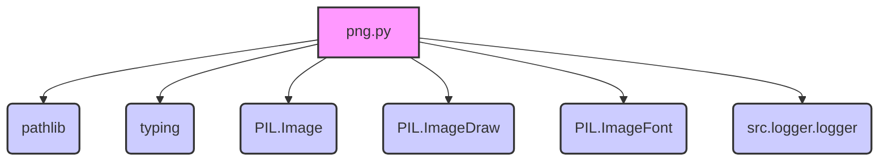

### **Системные инструкции для обработки кода проекта `hypotez`**

=========================================================================================

Описание функциональности и правил для генерации, анализа и улучшения кода. Направлено на обеспечение последовательного и читаемого стиля кодирования, соответствующего требованиям.

---

### **Основные принципы**

#### **1. Общие указания**:
- Соблюдай четкий и понятный стиль кодирования.
- Все изменения должны быть обоснованы и соответствовать установленным требованиям.

#### **2. Комментарии**:
- Используй `#` для внутренних комментариев.
- Документация всех функций, методов и классов должна следовать такому формату: 
    ```python
        def function(param: str, param1: Optional[str | dict | str] = None) -> dict | None:
            """ 
            Args:
                param (str): Описание параметра `param`.
                param1 (Optional[str | dict | str], optional): Описание параметра `param1`. По умолчанию `None`.
    
            Returns:
                dict | None: Описание возвращаемого значения. Возвращает словарь или `None`.
    
            Raises:
                SomeError: Описание ситуации, в которой возникает исключение `SomeError`.

            Ехаmple:
                >>> function('param', 'param1')
                {'param': 'param1'}
            """
    ```
- Комментарии и документация должны быть четкими, лаконичными и точными.

#### **3. Форматирование кода**:
- Используй одинарные кавычки. `a:str = 'value'`, `print('Hello World!')`;
- Добавляй пробелы вокруг операторов. Например, `x = 5`;
- Все параметры должны быть аннотированы типами. `def function(param: str, param1: Optional[str | dict | str] = None) -> dict | None:`;
- Не используй `Union`. Вместо этого используй `|`.

#### **4. Логирование**:
- Для логгирования Всегда Используй модуль `logger` из `src.logger.logger`.
- Ошибки должны логироваться с использованием `logger.error`.
Пример:
    ```python
        try:
            ...
        except Exception as ex:
            logger.error('Error while processing data', ех, exc_info=True)
    ```
#### **5 Не используй `Union[]` в коде. Вместо него используй `|`
Например:
```python
x: str | int ...
```


---

### **Основные требования**:

#### **1. Формат ответов в Markdown**:
- Все ответы должны быть выполнены в формате **Markdown**.

#### **2. Формат комментариев**:
- Используй указанный стиль для комментариев и документации в коде.
- Пример:

```python
from typing import Generator, Optional, List
from pathlib import Path


def read_text_file(
    file_path: str | Path,
    as_list: bool = False,
    extensions: Optional[List[str]] = None,
    chunk_size: int = 8192,
) -> Generator[str, None, None] | str | None:
    """
    Считывает содержимое файла (или файлов из каталога) с использованием генератора для экономии памяти.

    Args:
        file_path (str | Path): Путь к файлу или каталогу.
        as_list (bool): Если `True`, возвращает генератор строк.
        extensions (Optional[List[str]]): Список расширений файлов для чтения из каталога.
        chunk_size (int): Размер чанков для чтения файла в байтах.

    Returns:
        Generator[str, None, None] | str | None: Генератор строк, объединенная строка или `None` в случае ошибки.

    Raises:
        Exception: Если возникает ошибка при чтении файла.

    Example:
        >>> from pathlib import Path
        >>> file_path = Path('example.txt')
        >>> content = read_text_file(file_path)
        >>> if content:
        ...    print(f'File content: {content[:100]}...')
        File content: Example text...
    """
    ...
```
- Всегда делай подробные объяснения в комментариях. Избегай расплывчатых терминов, 
- таких как *«получить»* или *«делать»*. Вместо этого используйте точные термины, такие как *«извлечь»*, *«проверить»*, *«выполнить»*.
- Вместо: *«получаем»*, *«возвращаем»*, *«преобразовываем»* используй имя объекта *«функция получае»*, *«переменная возвращает»*, *«код преобразовывает»* 
- Комментарии должны непосредственно предшествовать описываемому блоку кода и объяснять его назначение.

#### **3. Пробелы вокруг операторов присваивания**:
- Всегда добавляйте пробелы вокруг оператора `=`, чтобы повысить читаемость.
- Примеры:
  - **Неправильно**: `x=5`
  - **Правильно**: `x = 5`

#### **4. Использование `j_loads` или `j_loads_ns`**:
- Для чтения JSON или конфигурационных файлов замените стандартное использование `open` и `json.load` на `j_loads` или `j_loads_ns`.
- Пример:

```python
# Неправильно:
with open('config.json', 'r', encoding='utf-8') as f:
    data = json.load(f)

# Правильно:
data = j_loads('config.json')
```

#### **5. Сохранение комментариев**:
- Все существующие комментарии, начинающиеся с `#`, должны быть сохранены без изменений в разделе «Улучшенный код».
- Если комментарий кажется устаревшим или неясным, не изменяйте его. Вместо этого отметьте его в разделе «Изменения».

#### **6. Обработка `...` в коде**:
- Оставляйте `...` как указатели в коде без изменений.
- Не документируйте строки с `...`.
```

#### **7. Аннотации**
Для всех переменных должны быть определены аннотации типа. 
Для всех функций все входные и выходные параметры аннотириваны
Для все параметров должны быть аннотации типа.


### **8. webdriver**
В коде используется webdriver. Он импртируется из модуля `webdriver` проекта `hypotez`
```python
from src.webdirver import Driver, Chrome, Firefox, Playwright, ...
driver = Driver(Firefox)

Пoсле чего может использоваться как

close_banner = {
  "attribute": null,
  "by": "XPATH",
  "selector": "//button[@id = 'closeXButton']",
  "if_list": "first",
  "use_mouse": false,
  "mandatory": false,
  "timeout": 0,
  "timeout_for_event": "presence_of_element_located",
  "event": "click()",
  "locator_description": "Закрываю pop-up окно, если оно не появилось - не страшно (`mandatory`:`false`)"
}

result = driver.execute_locator(close_banner)
```

## Анализ кода `hypotez/src/utils/convertors/png.py`

### 1. Блок-схема

```mermaid
graph LR
    A[Начало] --> B{Инициализация TextToImageGenerator};
    B --> C{Вызов generate_images(lines, output_dir, font, canvas_size, padding, background_color, text_color, log_level, clobber)};
    C --> D{Определение output_directory};
    D --> E{Настройка логирования setup_logging(log_level)};
    E --> F{Проверка и установка параметров canvas_size и padding по умолчанию};
    F --> G{Цикл по lines};
    G --> H{Формирование img_path};
    H --> I{Проверка существования файла и clobber};
    I -- Файл существует и clobber=False --> J[Логирование предупреждения];
    I -- Файл не существует или clobber=True --> K{Вызов generate_png(line, canvas_size, padding, background_color, text_color, font)};
    K --> L{Создание изображения img};
    L --> M{Сохранение изображения img.save(img_path)};
    M --> N{Добавление img_path в generated_images};
    N --> O{Конец цикла по lines};
    O --> P{Возврат generated_images};
    P --> Q[Конец];

    subgraph generate_png
        A1[Начало generate_png] --> B1{Создание нового изображения Image.new()};
        B1 --> C1{Создание объекта ImageDraw.Draw()};
        C1 --> D1{Определение размера шрифта get_font_size()};
        D1 --> E1{Вычисление позиции текста center_text_position()};
        E1 --> F1{Отрисовка текста draw.text()};
        F1 --> G1{Возврат изображения};
        G1 --> H1[Конец generate_png];
    end

    subgraph center_text_position
        A2[Начало center_text_position] --> B2{Определение размеров текста draw.textsize()};
        B2 --> C2{Вычисление координат для центрирования};
        C2 --> D2{Возврат координат};
        D2 --> E2[Конец center_text_position];
    end

    subgraph webp2png
        A3[Начало webp2png] --> B3{Открытие webp изображения Image.open()};
        B3 --> C3{Сохранение как png img.save()};
        C3 --> D3{Возврат True};
        D3 --> E3[Конец webp2png];
        B3 -- Ошибка --> F3[Обработка исключения];
        F3 --> G3{Вывод сообщения об ошибке};
        G3 --> H3{Возврат None};
    end
```

### 2. Диаграмма



**Объяснение зависимостей:**

-   `pathlib`: Используется для работы с путями к файлам и директориям. Это позволяет удобно манипулировать путями к выходным файлам PNG и проверять их существование.
-   `typing`: Используется для аннотации типов, что улучшает читаемость и помогает обнаруживать ошибки на этапе разработки.
-   `PIL.Image`: Основной модуль из Pillow (PIL) для работы с изображениями. Позволяет создавать новые изображения, открывать существующие, изменять их и сохранять.
-   `PIL.ImageDraw`: Модуль для рисования на изображениях. Используется для добавления текста на создаваемые PNG-изображения.
-   `PIL.ImageFont`: Модуль для работы со шрифтами. Позволяет выбирать шрифт и его размер для текста на изображениях.
-   `src.logger.logger`: Используется для логирования событий, таких как предупреждения о пропущенных файлах или ошибки во время конвертации.

### 3. Объяснение

**Импорты:**

-   `pathlib.Path`: Класс для представления путей к файлам и директориям. Используется для определения пути к выходной директории и файлам.
-   `typing.List`: Используется для аннотации типов, указывая, что переменная является списком.
-   `typing.Tuple`: Используется для аннотации типов, указывая, что переменная является кортежем.
-   `PIL.Image`: Модуль для работы с изображениями. Используется для создания, открытия и сохранения изображений.
-   `PIL.ImageDraw`: Модуль для рисования на изображениях. Используется для добавления текста на изображение.
-   `PIL.ImageFont`: Модуль для работы со шрифтами. Используется для выбора шрифта и размера текста.
-   `src.logger.logger`: Модуль логирования, используемый для записи информации о работе программы.

**Класс `TextToImageGenerator`:**

-   **Роль**: Класс предназначен для генерации PNG-изображений из текстовых строк.
-   **Атрибуты**:
    -   `default_output_dir (Path)`: Путь к директории вывода по умолчанию (./output).
    -   `default_canvas_size (Tuple[int, int])`: Размер холста по умолчанию (1024x1024).
    -   `default_padding (float)`: Отступ по умолчанию (10%).
    -   `default_background (str)`: Цвет фона по умолчанию ("white").
    -   `default_text_color (str)`: Цвет текста по умолчанию ("black").
    -   `default_log_level (str)`: Уровень логирования по умолчанию ("WARNING").
-   **Методы**:
    -   `__init__(self)`: Инициализирует класс значениями по умолчанию.
    -   `generate_images(self, lines, output_dir, font, canvas_size, padding, background_color, text_color, log_level, clobber) -> List[Path]`: Генерирует PNG-изображения для каждой строки текста.
        -   `lines (List[str])`: Список строк для генерации изображений.
        -   `output_dir (str | Path, optional)`: Директория для сохранения изображений.
        -   `font (str | ImageFont.ImageFont, optional)`: Шрифт для текста.
        -   `canvas_size (Tuple[int, int], optional)`: Размер холста.
        -   `padding (float, optional)`: Отступ.
        -   `background_color (str, optional)`: Цвет фона.
        -   `text_color (str, optional)`: Цвет текста.
        -   `log_level (int | str | bool, optional)`: Уровень логирования.
        -   `clobber (bool, optional)`: Перезаписывать существующие файлы.
        -   Возвращает список путей к созданным изображениям.
    -   `generate_png(self, text, canvas_size, padding, background_color, text_color, font) -> Image`: Создает одно PNG-изображение с заданным текстом.
        -   `text (str)`: Текст для рендеринга.
        -   `canvas_size (Tuple[int, int])`: Размер холста.
        -   `padding (float)`: Отступ.
        -   `background_color (str)`: Цвет фона.
        -   `text_color (str)`: Цвет текста.
        -   `font (str | ImageFont.ImageFont)`: Шрифт.
        -   Возвращает созданное изображение.
    -   `center_text_position(self, draw, text, font, canvas_size) -> Tuple[int, int]`: Вычисляет координаты для центрирования текста на холсте.
        -   `draw (ImageDraw.Draw)`: Объект для рисования.
        -   `text (str)`: Текст.
        -   `font (ImageFont.ImageFont)`: Шрифт.
        -   `canvas_size (Tuple[int, int])`: Размер холста.
        -   Возвращает координаты центра текста.
    -   `overlay_images(self, background_path: str | Path, overlay_path: str | Path, position: tuple[int, int] = (0, 0), alpha: float = 1.0) -> Image`:
        -   `background_path (str | Path)`: Путь к фоновому изображению.
        -   `overlay_path (str | Path)`: Путь к изображению для наложения.
        -   `position (tuple[int, int], optional)`: Позиция наложения. Defaults to (0, 0).
        -   `alpha (float, optional)`: Прозрачность наложения. Defaults to 1.0.
        -   Returns: The resulting image with the overlay.

**Функция `webp2png(webp_path: str, png_path: str) -> bool`:**

-   **Аргументы**:
    -   `webp_path (str)`: Путь к WEBP-изображению.
    -   `png_path (str)`: Путь для сохранения PNG-изображения.
-   **Возвращаемое значение**:
    -   `bool`: True, если конвертация прошла успешно, иначе None.
-   **Назначение**: Конвертирует WEBP-изображение в PNG-формат.

**Переменные:**

-   В основном используются внутри методов для хранения промежуточных значений, таких как пути к файлам, размеры холста, цвета и т.д.

**Потенциальные ошибки и области для улучшения:**

1.  **Обработка ошибок в `generate_images`**: Отсутствует обработка исключений при создании и сохранении изображений.
2.  **Управление шрифтами**: Сейчас шрифт задается строкой ("sans-serif"). Желательно добавить возможность указания пути к файлу шрифта.
3.  **Логирование**: Добавить больше информационных сообщений в процесс генерации изображений.
4.  **Валидация параметров**: Добавить проверку входных параметров, например, `canvas_size` и `padding`.

**Взаимосвязи с другими частями проекта:**

-   Использует модуль `src.logger.logger` для логирования, что позволяет интегрировать этот модуль в общую систему логирования проекта.
-   Функция `webp2png` не использует логирование.