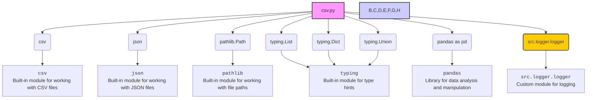

### **Системные инструкции для обработки кода проекта `hypotez`**

=========================================================================================

Описание функциональности и правил для генерации, анализа и улучшения кода. Направлено на обеспечение последовательного и читаемого стиля кодирования, соответствующего требованиям.

---

### **Основные принципы**

#### **1. Общие указания**:
- Соблюдай четкий и понятный стиль кодирования.
- Все изменения должны быть обоснованы и соответствовать установленным требованиям.

#### **2. Комментарии**:
- Используй `#` для внутренних комментариев.
- Документация всех функций, методов и классов должна следовать такому формату: 
    ```python
        def function(param: str, param1: Optional[str | dict | str] = None) -> dict | None:
            """ 
            Args:
                param (str): Описание параметра `param`.
                param1 (Optional[str | dict | str], optional): Описание параметра `param1`. По умолчанию `None`.
    
            Returns:
                dict | None: Описание возвращаемого значения. Возвращает словарь или `None`.
    
            Raises:
                SomeError: Описание ситуации, в которой возникает исключение `SomeError`.

            Ехаmple:
                >>> function('param', 'param1')
                {'param': 'param1'}
            """
    ```
- Комментарии и документация должны быть четкими, лаконичными и точными.

#### **3. Форматирование кода**:
- Используй одинарные кавычки. `a:str = 'value'`, `print('Hello World!')`;
- Добавляй пробелы вокруг операторов. Например, `x = 5`;
- Все параметры должны быть аннотированы типами. `def function(param: str, param1: Optional[str | dict | str] = None) -> dict | None:`;
- Не используй `Union`. Вместо этого используй `|`.

#### **4. Логирование**:
- Для логгирования Всегда Используй модуль `logger` из `src.logger.logger`.
- Ошибки должны логироваться с использованием `logger.error`.
Пример:
    ```python
        try:
            ...
        except Exception as ex:
            logger.error('Error while processing data', ех, exc_info=True)
    ```
#### **5 Не используй `Union[]` в коде. Вместо него используй `|`
Например:
```python
x: str | int ...
```


---

### **Основные требования**:

#### **1. Формат ответов в Markdown**:
- Все ответы должны быть выполнены в формате **Markdown**.

#### **2. Формат комментариев**:
- Используй указанный стиль для комментариев и документации в коде.
- Пример:

```python
from typing import Generator, Optional, List
from pathlib import Path


def read_text_file(
    file_path: str | Path,
    as_list: bool = False,
    extensions: Optional[List[str]] = None,
    chunk_size: int = 8192,
) -> Generator[str, None, None] | str | None:
    """
    Считывает содержимое файла (или файлов из каталога) с использованием генератора для экономии памяти.

    Args:
        file_path (str | Path): Путь к файлу или каталогу.
        as_list (bool): Если `True`, возвращает генератор строк.
        extensions (Optional[List[str]]): Список расширений файлов для чтения из каталога.
        chunk_size (int): Размер чанков для чтения файла в байтах.

    Returns:
        Generator[str, None, None] | str | None: Генератор строк, объединенная строка или `None` в случае ошибки.

    Raises:
        Exception: Если возникает ошибка при чтении файла.

    Example:
        >>> from pathlib import Path
        >>> file_path = Path('example.txt')
        >>> content = read_text_file(file_path)
        >>> if content:
        ...    print(f'File content: {content[:100]}...')
        File content: Example text...
    """
    ...
```
- Всегда делай подробные объяснения в комментариях. Избегай расплывчатых терминов, 
- таких как *«получить»* или *«делать»*. Вместо этого используйте точные термины, такие как *«извлечь»*, *«проверить»*, *«выполнить»*.
- Вместо: *«получаем»*, *«возвращаем»*, *«преобразовываем»* используй имя объекта *«функция получае»*, *«переменная возвращает»*, *«код преобразовывает»* 
- Комментарии должны непосредственно предшествовать описываемому блоку кода и объяснять его назначение.

#### **3. Пробелы вокруг операторов присваивания**:
- Всегда добавляйте пробелы вокруг оператора `=`, чтобы повысить читаемость.
- Примеры:
  - **Неправильно**: `x=5`
  - **Правильно**: `x = 5`

#### **4. Использование `j_loads` или `j_loads_ns`**:
- Для чтения JSON или конфигурационных файлов замените стандартное использование `open` и `json.load` на `j_loads` или `j_loads_ns`.
- Пример:

```python
# Неправильно:
with open('config.json', 'r', encoding='utf-8') as f:
    data = json.load(f)

# Правильно:
data = j_loads('config.json')
```

#### **5. Сохранение комментариев**:
- Все существующие комментарии, начинающиеся с `#`, должны быть сохранены без изменений в разделе «Улучшенный код».
- Если комментарий кажется устаревшим или неясным, не изменяйте его. Вместо этого отметьте его в разделе «Изменения».

#### **6. Обработка `...` в коде**:
- Оставляйте `...` как указатели в коде без изменений.
- Не документируйте строки с `...`.
```

#### **7. Аннотации**
Для всех переменных должны быть определены аннотации типа. 
Для всех функций все входные и выходные параметры аннотириваны
Для все параметров должны быть аннотации типа.


### **8. webdriver**
В коде используется webdriver. Он импртируется из модуля `webdriver` проекта `hypotez`
```python
from src.webdirver import Driver, Chrome, Firefox, Playwright, ...
driver = Driver(Firefox)

Пoсле чего может использоваться как

close_banner = {
  "attribute": null,
  "by": "XPATH",
  "selector": "//button[@id = 'closeXButton']",
  "if_list": "first",
  "use_mouse": false,
  "mandatory": false,
  "timeout": 0,
  "timeout_for_event": "presence_of_element_located",
  "event": "click()",
  "locator_description": "Закрываю pop-up окно, если оно не появилось - не страшно (`mandatory`:`false`)"
}

result = driver.execute_locator(close_banner)
```

### **Анализ кода `hypotez/src/utils/csv.py`**

#### **1. Блок-схема**

```mermaid
graph TD
    A[Начало] --> B{Функция: save_csv_file};
    B --> C{Проверка типа данных: data - list?};
    C -- Да --> D{Проверка: data не пустой?};
    C -- Нет --> E[Выброс исключения TypeError];
    D -- Да --> F{Преобразование file_path в Path};
    D -- Нет --> G[Выброс исключения ValueError];
    F --> H{Создание директории (если отсутствует)};
    H --> I{Открытие файла для записи/добавления};
    I --> J{Создание CSV writer};
    J --> K{Проверка: Режим записи 'w' или файл не существует?};
    K -- Да --> L[Запись заголовка];
    K -- Нет --> M[Пропуск записи заголовка];
    L --> N[Запись данных в файл];
    M --> N;
    N --> O{Успешно?};
    O -- Да --> P[Возврат True];
    O -- Нет --> Q{Логирование ошибки};
    Q --> R[Возврат False];
    B --> S{Функция: read_csv_file};
    S --> T{Открытие файла для чтения};
    T --> U{Чтение CSV};
    U --> V{Преобразование в список словарей};
    V --> W{Успешно?};
    W -- Да --> X[Возврат списка словарей];
    W -- Нет --> Y{Логирование ошибки};
    Y --> Z[Возврат None];
    B --> AA{Функция: read_csv_as_json};
    AA --> BB{Чтение CSV файла (read_csv_file)};
    BB --> CC{Проверка: Данные успешно прочитаны?};
    CC -- Да --> DD{Открытие JSON файла для записи};
    CC -- Нет --> EE[Возврат False];
    DD --> FF{Запись данных в JSON};
    FF --> GG{Успешно?};
    GG -- Да --> HH[Возврат True];
    GG -- Нет --> II{Логирование ошибки};
    II --> EE;
    B --> JJ{Функция: read_csv_as_dict};
    JJ --> KK{Открытие CSV файла для чтения};
    KK --> LL{Чтение данных из CSV};
    LL --> MM{Преобразование данных в словарь};
    MM --> NN{Успешно?};
    NN -- Да --> OO[Возврат словаря];
    NN -- Нет --> PP{Логирование ошибки};
    PP --> QQ[Возврат None];
     B --> RR{Функция: read_csv_as_ns};
    RR --> SS{Чтение CSV файла с помощью pandas};
    SS --> TT{Преобразование в список словарей};
    TT --> UU{Успешно?};
    UU -- Да --> VV[Возврат списка словарей];
    UU -- Нет --> WW{Логирование ошибки};
    WW --> XX[Возврат пустого списка];
```

#### **2. Диаграмма зависимостей**



**Объяснение зависимостей:**

-   `csv`: Встроенный модуль Python для работы с CSV-файлами. Используется для чтения и записи данных в формате CSV.
-   `json`: Встроенный модуль Python для работы с JSON-файлами. Используется для преобразования данных CSV в формат JSON.
-   `pathlib.Path`: Модуль `pathlib` предоставляет способ представления путей файловой системы.  `Path` используется для работы с путями к файлам и директориям.
-   `typing`: Модуль `typing` используется для аннотации типов, что улучшает читаемость и помогает обнаруживать ошибки на ранних этапах разработки.
-   `pandas`: Библиотека `pandas` используется для анализа и манипулирования данными, в частности для чтения CSV файлов в DataFrame и преобразования DataFrame в список словарей.
-   `src.logger.logger`: Пользовательский модуль логирования, используемый для записи информации об ошибках и других событиях.

#### **3. Объяснение**

**Импорты:**

*   `csv`: Используется для работы с CSV-файлами, включая чтение и запись.
*   `json`: Используется для работы с JSON-файлами, в частности для преобразования CSV в JSON.
*   `pathlib.Path`: Используется для представления путей к файлам и директориям в удобной форме.
*   `typing.List`, `typing.Dict`, `typing.Union`: Используются для аннотации типов, чтобы указать типы данных для списков, словарей и переменных, которые могут принимать значения разных типов.
*   `pandas as pd`: Используется для чтения CSV файлов в DataFrame и преобразования DataFrame в список словарей.
*   `src.logger.logger`:  Модуль `logger` из `src.logger.logger` используется для логирования ошибок и информации о работе функций.

**Функции:**

*   `save_csv_file(data: List[Dict[str, str]], file_path: Union[str, Path], mode: str = 'a', exc_info: bool = True) -> bool`:
    *   Аргументы:
        *   `data`: Список словарей, которые нужно сохранить в CSV-файл.
        *   `file_path`: Путь к CSV-файлу. Может быть строкой или объектом `Path`.
        *   `mode`: Режим открытия файла (`'a'` для добавления, `'w'` для перезаписи). По умолчанию `'a'`.
        *   `exc_info`:  Флаг, указывающий, нужно ли включать информацию об исключении в логи. По умолчанию `True`.
    *   Возвращает: `True`, если успешно, `False` в случае ошибки.
    *   Назначение: Сохраняет список словарей в CSV-файл. Если указан режим `'w'` или файл не существует, записывает заголовок. Использует `csv.DictWriter` для записи данных.
    *   Пример:

        ```python
        data = [{'name': 'John', 'age': '30'}, {'name': 'Jane', 'age': '25'}]
        file_path = 'data.csv'
        result = save_csv_file(data, file_path, mode='w')
        print(result)  # Вывод: True
        ```

*   `read_csv_file(file_path: Union[str, Path], exc_info: bool = True) -> List[Dict[str, str]] | None`:
    *   Аргументы:
        *   `file_path`: Путь к CSV-файлу. Может быть строкой или объектом `Path`.
        *   `exc_info`:  Флаг, указывающий, нужно ли включать информацию об исключении в логи. По умолчанию `True`.
    *   Возвращает: Список словарей, прочитанный из CSV-файла, или `None` в случае ошибки.
    *   Назначение: Читает CSV-файл и преобразует его содержимое в список словарей. Использует `csv.DictReader` для чтения данных.
    *   Пример:

        ```python
        file_path = 'data.csv'
        data = read_csv_file(file_path)
        print(data)  # Вывод: [{'name': 'John', 'age': '30'}, {'name': 'Jane', 'age': '25'}]
        ```

*   `read_csv_as_json(csv_file_path: Union[str, Path], json_file_path: Union[str, Path], exc_info: bool = True) -> bool`:
    *   Аргументы:
        *   `csv_file_path`: Путь к CSV-файлу. Может быть строкой или объектом `Path`.
        *   `json_file_path`: Путь к JSON-файлу, в который нужно сохранить данные. Может быть строкой или объектом `Path`.
        *   `exc_info`:  Флаг, указывающий, нужно ли включать информацию об исключении в логи. По умолчанию `True`.
    *   Возвращает: `True`, если преобразование и сохранение прошли успешно, `False` в случае ошибки.
    *   Назначение: Преобразует CSV-файл в JSON-файл. Сначала читает данные из CSV-файла с помощью `read_csv_file`, затем записывает их в JSON-файл с использованием `json.dump`.
    *   Пример:

        ```python
        csv_file_path = 'data.csv'
        json_file_path = 'data.json'
        result = read_csv_as_json(csv_file_path, json_file_path)
        print(result)  # Вывод: True
        ```

*   `read_csv_as_dict(csv_file: Union[str, Path]) -> dict | None`:
    *   Аргументы:
        *   `csv_file`: Путь к CSV-файлу. Может быть строкой или объектом `Path`.
    *   Возвращает: Словарь, представляющий содержимое CSV-файла, или `None` в случае ошибки.
    *   Назначение: Читает CSV-файл и преобразует его содержимое в словарь.  Ключом является "data", значением является список словарей.
    *   Пример:

        ```python
        csv_file = 'data.csv'
        data = read_csv_as_dict(csv_file)
        print(data)
        # Вывод: {'data': [{'name': 'John', 'age': '30'}, {'name': 'Jane', 'age': '25'}]}
        ```

*   `read_csv_as_ns(file_path: Union[str, Path]) -> List[dict]`:
    *   Аргументы:
        *   `file_path`: Путь к CSV-файлу. Может быть строкой или объектом `Path`.
    *   Возвращает: Список словарей, представляющий содержимое CSV-файла.
    *   Назначение: Читает CSV-файл с использованием библиотеки `pandas` и преобразует его содержимое в список словарей.
    *   Пример:

        ```python
        file_path = 'data.csv'
        data = read_csv_as_ns(file_path)
        print(data)
        # Вывод: [{'name': 'John', 'age': '30'}, {'name': 'Jane', 'age': '25'}]
        ```

**Переменные:**

*   `data`: Список словарей, используемый для хранения данных, прочитанных из CSV-файла или записываемых в него.
*   `file_path`, `csv_file_path`, `json_file_path`: Пути к файлам, используемые для указания местоположения CSV и JSON файлов.
*   `mode`: Режим открытия файла (например, `'r'` для чтения, `'w'` для записи, `'a'` для добавления).
*   `reader`: Объект `csv.DictReader`, используемый для чтения данных из CSV-файла в виде словарей.
*   `writer`: Объект `csv.DictWriter`, используемый для записи данных в CSV-файл из словарей.
*   `exc_info`: Флаг, указывающий, нужно ли включать информацию об исключении в логи.
*   `df`: Объект `pandas.DataFrame`, используемый для хранения данных из CSV-файла.

**Потенциальные ошибки и области для улучшения:**

*   В функциях `read_csv_as_json` и `read_csv_as_dict` не обрабатывается исключение `FileNotFoundError`. Желательно добавить обработку этого исключения для единообразия с функцией `read_csv_file`.
*   В функции `read_csv_as_dict` параметр `exc_info` не передается в вызов `logger.error`.

**Взаимосвязи с другими частями проекта:**

*   Модуль `src.logger.logger` используется для логирования ошибок и информации о работе функций. Это позволяет отслеживать проблемы и обеспечивает возможность аудита.

```mermaid
flowchart TD
    Start --> A[<code>src.logger.logger</code><br>Initialize Logger]

    A --> SetLevel[Set Logging Level]
    A --> AddHandlers[Add Handlers (e.g., FileHandler, StreamHandler)]

    SetLevel --> ConfigLogging[Configure Logging System]
    AddHandlers --> ConfigLogging

    ConfigLogging --> ExposeLogger[Expose Logger Instance]

    style Start fill:#f9f,stroke:#333,stroke-width:2px
    style A fill:#ccf,stroke:#333,stroke-width:2px
    style SetLevel fill:#ccf,stroke:#333,stroke-width:2px
    style AddHandlers fill:#ccf,stroke:#333,stroke-width:2px
    style ConfigLogging fill:#ccf,stroke:#333,stroke-width:2px
    style ExposeLogger fill:#ccf,stroke:#333,stroke-width:2px
```

**Объяснение `src.logger.logger`:**

*   Инициализирует систему логирования, устанавливает уровень логирования и добавляет обработчики для записи логов в файл и/или вывода в консоль.
*   Предоставляет единый экземпляр логгера для использования в других модулях проекта.