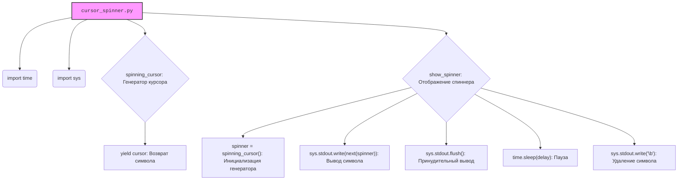

### **Системные инструкции для обработки кода проекта `hypotez`**

=========================================================================================

Описание функциональности и правил для генерации, анализа и улучшения кода. Направлено на обеспечение последовательного и читаемого стиля кодирования, соответствующего требованиям.

---

### **Основные принципы**

#### **1. Общие указания**:
- Соблюдай четкий и понятный стиль кодирования.
- Все изменения должны быть обоснованы и соответствовать установленным требованиям.

#### **2. Комментарии**:
- Используй `#` для внутренних комментариев.
- Документация всех функций, методов и классов должна следовать такому формату: 
    ```python
        def function(param: str, param1: Optional[str | dict | str] = None) -> dict | None:
            """ 
            Args:
                param (str): Описание параметра `param`.
                param1 (Optional[str | dict | str], optional): Описание параметра `param1`. По умолчанию `None`.
    
            Returns:
                dict | None: Описание возвращаемого значения. Возвращает словарь или `None`.
    
            Raises:
                SomeError: Описание ситуации, в которой возникает исключение `SomeError`.

            Ехаmple:
                >>> function('param', 'param1')
                {'param': 'param1'}
            """
    ```
- Комментарии и документация должны быть четкими, лаконичными и точными.

#### **3. Форматирование кода**:
- Используй одинарные кавычки. `a:str = 'value'`, `print('Hello World!')`;
- Добавляй пробелы вокруг операторов. Например, `x = 5`;
- Все параметры должны быть аннотированы типами. `def function(param: str, param1: Optional[str | dict | str] = None) -> dict | None:`;
- Не используй `Union`. Вместо этого используй `|`.

#### **4. Логирование**:
- Для логгирования Всегда Используй модуль `logger` из `src.logger.logger`.
- Ошибки должны логироваться с использованием `logger.error`.
Пример:
    ```python
        try:
            ...
        except Exception as ex:
            logger.error('Error while processing data', ех, exc_info=True)
    ```
#### **5 Не используй `Union[]` в коде. Вместо него используй `|`
Например:
```python
x: str | int ...
```


---

### **Основные требования**:

#### **1. Формат ответов в Markdown**:
- Все ответы должны быть выполнены в формате **Markdown**.

#### **2. Формат комментариев**:
- Используй указанный стиль для комментариев и документации в коде.
- Пример:

```python
from typing import Generator, Optional, List
from pathlib import Path


def read_text_file(
    file_path: str | Path,
    as_list: bool = False,
    extensions: Optional[List[str]] = None,
    chunk_size: int = 8192,
) -> Generator[str, None, None] | str | None:
    """
    Считывает содержимое файла (или файлов из каталога) с использованием генератора для экономии памяти.

    Args:
        file_path (str | Path): Путь к файлу или каталогу.
        as_list (bool): Если `True`, возвращает генератор строк.
        extensions (Optional[List[str]]): Список расширений файлов для чтения из каталога.
        chunk_size (int): Размер чанков для чтения файла в байтах.

    Returns:
        Generator[str, None, None] | str | None: Генератор строк, объединенная строка или `None` в случае ошибки.

    Raises:
        Exception: Если возникает ошибка при чтении файла.

    Example:
        >>> from pathlib import Path
        >>> file_path = Path('example.txt')
        >>> content = read_text_file(file_path)
        >>> if content:
        ...    print(f'File content: {content[:100]}...')
        File content: Example text...
    """
    ...
```
- Всегда делай подробные объяснения в комментариях. Избегай расплывчатых терминов, 
- таких как *«получить»* или *«делать»*. Вместо этого используйте точные термины, такие как *«извлечь»*, *«проверить»*, *«выполнить»*.
- Вместо: *«получаем»*, *«возвращаем»*, *«преобразовываем»* используй имя объекта *«функция получае»*, *«переменная возвращает»*, *«код преобразовывает»* 
- Комментарии должны непосредственно предшествовать описываемому блоку кода и объяснять его назначение.

#### **3. Пробелы вокруг операторов присваивания**:
- Всегда добавляйте пробелы вокруг оператора `=`, чтобы повысить читаемость.
- Примеры:
  - **Неправильно**: `x=5`
  - **Правильно**: `x = 5`

#### **4. Использование `j_loads` или `j_loads_ns`**:
- Для чтения JSON или конфигурационных файлов замените стандартное использование `open` и `json.load` на `j_loads` или `j_loads_ns`.
- Пример:

```python
# Неправильно:
with open('config.json', 'r', encoding='utf-8') as f:
    data = json.load(f)

# Правильно:
data = j_loads('config.json')
```

#### **5. Сохранение комментариев**:
- Все существующие комментарии, начинающиеся с `#`, должны быть сохранены без изменений в разделе «Улучшенный код».
- Если комментарий кажется устаревшим или неясным, не изменяйте его. Вместо этого отметьте его в разделе «Изменения».

#### **6. Обработка `...` в коде**:
- Оставляйте `...` как указатели в коде без изменений.
- Не документируйте строки с `...`.
```

#### **7. Аннотации**
Для всех переменных должны быть определены аннотации типа. 
Для всех функций все входные и выходные параметры аннотириваны
Для все параметров должны быть аннотации типа.


### **8. webdriver**
В коде используется webdriver. Он импртируется из модуля `webdriver` проекта `hypotez`
```python
from src.webdirver import Driver, Chrome, Firefox, Playwright, ...
driver = Driver(Firefox)

Пoсле чего может использоваться как

close_banner = {
  "attribute": null,
  "by": "XPATH",
  "selector": "//button[@id = 'closeXButton']",
  "if_list": "first",
  "use_mouse": false,
  "mandatory": false,
  "timeout": 0,
  "timeout_for_event": "presence_of_element_located",
  "event": "click()",
  "locator_description": "Закрываю pop-up окно, если оно не появилось - не страшно (`mandatory`:`false`)"
}

result = driver.execute_locator(close_banner)
```

## Анализ кода `hypotez/src/utils/cursor_spinner.py`

### 1. Блок-схема
```mermaid
graph TD
    A[Начало: Инициализация модуля] --> B{Определение функции spinning_cursor}
    B --> C{Функция spinning_cursor: Генератор символов курсора}
    C --> D{Цикл while True:}
    D --> E{Цикл for cursor in '|/-\\':}
    E --> F[yield cursor: Возврат текущего символа]
    F --> D
    B --> G{Определение функции show_spinner}
    G --> H{Функция show_spinner: Отображение спиннера}
    H --> I[Инициализация: spinner = spinning_cursor(), end_time = time.time() + duration]
    I --> J{Цикл while time.time() < end_time:}
    J --> K[sys.stdout.write(next(spinner)): Вывод символа спиннера]
    K --> L[sys.stdout.flush(): Принудительный вывод в консоль]
    L --> M[time.sleep(delay): Пауза]
    M --> N[sys.stdout.write('\b'): Удаление предыдущего символа]
    N --> J
    J -- time.time() >= end_time --> O[Конец цикла]
    A --> P{Условие if __name__ == "__main__":}
    P --> Q[Вызов show_spinner(duration=5.0, delay=0.1): Запуск спиннера на 5 секунд]
    Q --> R[print("\\nDone!"): Вывод сообщения о завершении]
    R --> S[Конец программы]
```

### 2. Диаграмма

**Объяснение зависимостей:**

- **time**: Используется для управления временем отображения спиннера, а именно для определения общей продолжительности работы спиннера (`duration`) и задержки между сменой символов (`delay`).
- **sys**: Используется для прямого взаимодействия с консолью, а именно для вывода символов спиннера (`sys.stdout.write`) и очистки экрана (`sys.stdout.flush`, `sys.stdout.write('\b')`).

### 3. Объяснение

- **Описание файла**: `hypotez/src/utils/cursor_spinner.py` предоставляет функциональность для отображения анимированного спиннера (индикатора загрузки) в консоли.

- **Импорты**:
    - `time`: Используется для работы со временем, в частности для задержки между сменой символов спиннера и определения времени окончания работы спиннера.
    - `sys`: Используется для прямого взаимодействия с консолью (стандартным потоком вывода).  Позволяет выводить символы и управлять отображением в консоли.

- **Функции**:
    - `spinning_cursor()`:
        - **Аргументы**: Отсутствуют.
        - **Возвращаемое значение**: Генератор, который последовательно выдаёт символы `|`, `/`, `-`, `\`.
        - **Назначение**:  Создаёт бесконечный цикл, генерирующий символы для анимации спиннера.  При каждом вызове `next()` возвращает следующий символ в последовательности.
        - **Пример**:
            ```python
            cursor = spinning_cursor()
            print(next(cursor))  # Выводит '|'
            print(next(cursor))  # Выводит '/'
            ```
    - `show_spinner(duration: float = 5.0, delay: float = 0.1)`:
        - **Аргументы**:
            - `duration (float)`:  Продолжительность отображения спиннера в секундах. Значение по умолчанию - 5.0.
            - `delay (float)`:  Задержка между сменой символов спиннера в секундах. Значение по умолчанию - 0.1.
        - **Возвращаемое значение**: Отсутствует (None).
        - **Назначение**: Отображает спиннер в консоли в течение заданного времени.  Использует `spinning_cursor()` для получения символов, `sys.stdout.write()` для их вывода, `sys.stdout.flush()` для принудительной отправки вывода в консоль, `time.sleep()` для создания задержки, и `sys.stdout.write('\b')` для удаления предыдущего символа, создавая эффект анимации.
        - **Пример**:
            ```python
            show_spinner(duration=3.0, delay=0.2) # Отображает спиннер в течение 3 секунд с задержкой 0.2 секунды между символами
            ```

- **Переменные**:
    - Внутри `show_spinner`:
        - `spinner`:  Экземпляр генератора `spinning_cursor()`. Используется для получения символов спиннера.
        - `end_time`: Время, когда спиннер должен прекратить отображение (текущее время + заданная продолжительность).
        - `cursor`: Переменная, которая принимает значения символов из генератора `spinning_cursor()`.

- **Потенциальные ошибки и области для улучшения**:
    - **Обработка исключений**:  В коде отсутствует обработка возможных исключений, например, если во время работы с `sys.stdout` возникнет ошибка.  Рекомендуется добавить блоки `try...except` для обработки таких ситуаций.
    - **Кроссплатформенность**:  Использование `\b` для удаления символов может работать не во всех консолях и операционных системах.  Для обеспечения кроссплатформенности можно использовать более универсальные методы очистки консоли.
    - **Логирование**:  В коде отсутствует логирование.  Добавление логирования может помочь в отладке и мониторинге работы спиннера.
    - **Прерывание спиннера**: Нет возможности прервать спиннер до истечения заданного времени. Можно добавить механизм для прерывания спиннера по сигналу (например, нажатию клавиши).

- **Взаимосвязь с другими частями проекта**:
    - Этот модуль является утилитой и может быть использован в любой части проекта, где требуется отображение индикатора загрузки в консоли.  Например, его можно использовать во время выполнения длительных операций, таких как скачивание данных, обработка файлов или сетевые запросы.