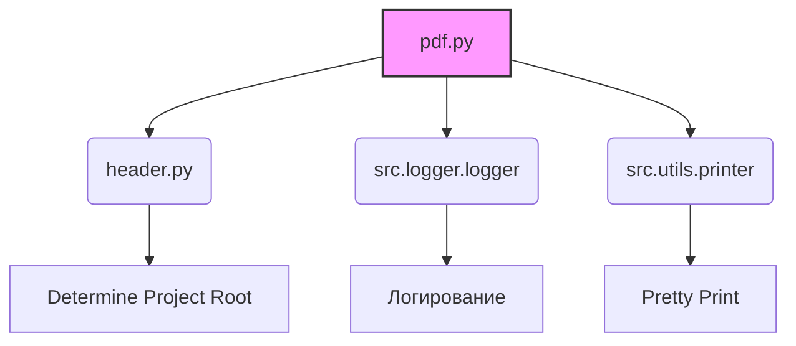
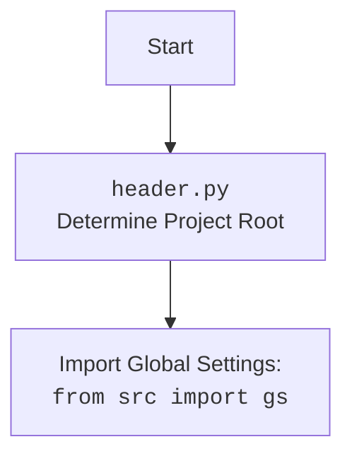

### **Системные инструкции для обработки кода проекта `hypotez`**

=========================================================================================

Описание функциональности и правил для генерации, анализа и улучшения кода. Направлено на обеспечение последовательного и читаемого стиля кодирования, соответствующего требованиям.

---

### **Основные принципы**

#### **1. Общие указания**:
- Соблюдай четкий и понятный стиль кодирования.
- Все изменения должны быть обоснованы и соответствовать установленным требованиям.

#### **2. Комментарии**:
- Используй `#` для внутренних комментариев.
- Документация всех функций, методов и классов должна следовать такому формату: 
    ```python
        def function(param: str, param1: Optional[str | dict | str] = None) -> dict | None:
            """ 
            Args:
                param (str): Описание параметра `param`.
                param1 (Optional[str | dict | str], optional): Описание параметра `param1`. По умолчанию `None`.
    
            Returns:
                dict | None: Описание возвращаемого значения. Возвращает словарь или `None`.
    
            Raises:
                SomeError: Описание ситуации, в которой возникает исключение `SomeError`.

            Ехаmple:
                >>> function('param', 'param1')
                {'param': 'param1'}
            """
    ```
- Комментарии и документация должны быть четкими, лаконичными и точными.

#### **3. Форматирование кода**:
- Используй одинарные кавычки. `a:str = 'value'`, `print('Hello World!')`;
- Добавляй пробелы вокруг операторов. Например, `x = 5`;
- Все параметры должны быть аннотированы типами. `def function(param: str, param1: Optional[str | dict | str] = None) -> dict | None:`;
- Не используй `Union`. Вместо этого используй `|`.

#### **4. Логирование**:
- Для логгирования Всегда Используй модуль `logger` из `src.logger.logger`.
- Ошибки должны логироваться с использованием `logger.error`.
Пример:
    ```python
        try:
            ...
        except Exception as ex:
            logger.error('Error while processing data', ех, exc_info=True)
    ```
#### **5 Не используй `Union[]` в коде. Вместо него используй `|`
Например:
```python
x: str | int ...
```


---

### **Основные требования**:

#### **1. Формат ответов в Markdown**:
- Все ответы должны быть выполнены в формате **Markdown**.

#### **2. Формат комментариев**:
- Используй указанный стиль для комментариев и документации в коде.
- Пример:

```python
from typing import Generator, Optional, List
from pathlib import Path


def read_text_file(
    file_path: str | Path,
    as_list: bool = False,
    extensions: Optional[List[str]] = None,
    chunk_size: int = 8192,
) -> Generator[str, None, None] | str | None:
    """
    Считывает содержимое файла (или файлов из каталога) с использованием генератора для экономии памяти.

    Args:
        file_path (str | Path): Путь к файлу или каталогу.
        as_list (bool): Если `True`, возвращает генератор строк.
        extensions (Optional[List[str]]): Список расширений файлов для чтения из каталога.
        chunk_size (int): Размер чанков для чтения файла в байтах.

    Returns:
        Generator[str, None, None] | str | None: Генератор строк, объединенная строка или `None` в случае ошибки.

    Raises:
        Exception: Если возникает ошибка при чтении файла.

    Example:
        >>> from pathlib import Path
        >>> file_path = Path('example.txt')
        >>> content = read_text_file(file_path)
        >>> if content:
        ...    print(f'File content: {content[:100]}...')
        File content: Example text...
    """
    ...
```
- Всегда делай подробные объяснения в комментариях. Избегай расплывчатых терминов, 
- таких как *«получить»* или *«делать»*
-  . Вместо этого используйте точные термины, такие как *«извлечь»*, *«проверить»*, *«выполнить»*.
- Вместо: *«получаем»*, *«возвращаем»*, *«преобразовываем»* используй имя объекта *«функция получае»*, *«переменная возвращает»*, *«код преобразовывает»* 
- Комментарии должны непосредственно предшествовать описываемому блоку кода и объяснять его назначение.

#### **3. Пробелы вокруг операторов присваивания**:
- Всегда добавляйте пробелы вокруг оператора `=`, чтобы повысить читаемость.
- Примеры:
  - **Неправильно**: `x=5`
  - **Правильно**: `x = 5`

#### **4. Использование `j_loads` или `j_loads_ns`**:
- Для чтения JSON или конфигурационных файлов замените стандартное использование `open` и `json.load` на `j_loads` или `j_loads_ns`.
- Пример:

```python
# Неправильно:
with open('config.json', 'r', encoding='utf-8') as f:
    data = json.load(f)

# Правильно:
data = j_loads('config.json')
```

#### **5. Сохранение комментариев**:
- Все существующие комментарии, начинающиеся с `#`, должны быть сохранены без изменений в разделе «Улучшенный код».
- Если комментарий кажется устаревшим или неясным, не изменяйте его. Вместо этого отметьте его в разделе «Изменения».

#### **6. Обработка `...` в коде**:
- Оставляйте `...` как указатели в коде без изменений.
- Не документируйте строки с `...`.
```

#### **7. Аннотации**
Для всех переменных должны быть определены аннотации типа. 
Для всех функций все входные и выходные параметры аннотириваны
Для все параметров должны быть аннотации типа.


### **8. webdriver**
В коде используется webdriver. Он импртируется из модуля `webdriver` проекта `hypotez`
```python
from src.webdirver import Driver, Chrome, Firefox, Playwright, ...
driver = Driver(Firefox)

Пoсле чего может использоваться как

close_banner = {
  "attribute": null,
  "by": "XPATH",
  "selector": "//button[@id = 'closeXButton']",
  "if_list": "first",
  "use_mouse": false,
  "mandatory": false,
  "timeout": 0,
  "timeout_for_event": "presence_of_element_located",
  "event": "click()",
  "locator_description": "Закрываю pop-up окно, если оно не появилось - не страшно (`mandatory`:`false`)"
}

result = driver.execute_locator(close_banner)
```

## Анализ кода `hypotez/src/utils/pdf.py`

### 1. Блок-схема

```mermaid
graph TD
    A[Начало] --> B{Выбор метода сохранения PDF};
    B -- pdfkit --> C[save_pdf_pdfkit];
    B -- fpdf --> D[save_pdf_fpdf];
    B -- weasyprint --> E[save_pdf_weasyprint];
    B -- xhtml2pdf --> F[save_pdf_xhtml2pdf];
    B -- dict2pdf --> G[dict2pdf];
    H[pdf_to_html] --> I[Извлечение текста из PDF];
    I --> J[Создание HTML-файла];
    C --> K{Успешно?};
    D --> L{Успешно?};
    E --> M{Успешно?};
    F --> N{Успешно?};
    G --> O{Успешно?};
    H --> P{Успешно?};
    K -- Да --> Q[Конец];
    K -- Нет --> R[Логирование ошибки];
    L -- Да --> Q;
    L -- Нет --> R;
    M -- Да --> Q;
    M -- Нет --> R;
    N -- Да --> Q;
    N -- Нет --> R;
    O -- Да --> Q;
    O -- Нет --> R;
    P -- Да --> Q;
    P -- Нет --> R;
    R --> Q;
    subgraph save_pdf_pdfkit
        S[Проверка наличия wkhtmltopdf_exe] --> T{Файл существует?};
        T -- Да --> U[Конфигурация pdfkit];
        T -- Нет --> V[Логирование ошибки];
        U --> W{Тип данных - строка?};
        W -- Да --> X[Преобразование HTML-контента в PDF];
        W -- Нет --> Y[Преобразование HTML-файла в PDF];
        X --> Z{Успешно?};
        Y --> Z;
        Z -- Да --> AA[Логирование успешного сохранения];
        AA --> BB[Возврат True];
        Z -- Нет --> CC[Обработка исключения];
        CC --> DD[Логирование ошибки];
        V --> DD;
        DD --> EE[Возврат False];
    end
     subgraph save_pdf_fpdf
        a[Инициализация FPDF] --> b[Создание PDF-документа];
        b --> c[Поиск fonts.json];
        c --> d{Файл существует?};
        d -- Да --> e[Чтение fonts.json];
        d -- Нет --> f[Логирование ошибки];
        e --> g[Добавление шрифтов];
        f --> g;
        g --> h[Установка шрифта];
        h --> i[Добавление данных];
        i --> j[Сохранение PDF];
        j --> k{Успешно?};
        k -- Да --> l[Логирование];
        l --> m[Возврат True];
        k -- Нет --> n[Логирование ошибки];
        n --> o[Возврат False];
    end
    subgraph save_pdf_weasyprint
        p[Инициализация HTML] --> q{Тип данных - строка?};
        q -- Да --> r[Запись HTML-строки в PDF];
        q -- Нет --> s[Запись HTML-файла в PDF];
        r --> t{Успешно?};
        s --> t;
        t -- Да --> u[Логирование];
        u --> v[Возврат True];
        t -- Нет --> w[Логирование ошибки];
        w --> x[Возврат False];
    end
    subgraph save_pdf_xhtml2pdf
        A1[Открытие PDF-файла для записи] --> B1{Тип данных - строка?};
        B1 -- Да --> C1[Кодирование в UTF-8];
        B1 -- Нет --> D1[Открытие HTML-файла для чтения];
        C1 --> E1[Создание PDF из строки];
        D1 --> F1[Чтение данных из файла];
        F1 --> E1;
        E1 --> G1{Успешно?};
        G1 -- Да --> H1[Логирование];
        H1 --> I1[Возврат True];
        G1 -- Нет --> J1[Логирование ошибки];
        J1 --> K1[Возврат False];
    end
    subgraph dict2pdf
        L1[Инициализация PDF-документа] --> M1[Определение размеров страницы];
        M1 --> N1[Установка шрифта];
        N1 --> O1[Перебор данных словаря];
        O1 --> P1[Формирование строки];
        P1 --> Q1[Добавление строки на страницу];
        Q1 --> R1{Место на странице?};
        R1 -- Нет --> S1[Создание новой страницы];
        S1 --> N1;
        R1 -- Да --> O1;
        O1 --> T1[Сохранение PDF];
    end
    subgraph html2pdf
      U1[Инициализация HTML] --> V1[Запись HTML в PDF];
        V1 --> W1{Успешно?};
        W1 -- Да --> X1[Возврат True];
        W1 -- Нет --> Y1[Логирование ошибки];
    end
```



### 2. Диаграмма



**Объяснение зависимостей:**

-   `pdf.py` зависит от `header.py` для определения корневого каталога проекта (`__root__`).
-   `pdf.py` зависит от `src.logger.logger` для логирования ошибок и информации.
-   `pdf.py` зависит от `src.utils.printer` для красивой печати (pprint).
-   `header.py` определяет корневой каталог проекта.
-   `src.logger.logger` предоставляет функциональность логирования.
-   `src.utils.printer` предоставляет функцию `pprint` для форматированного вывода.



### 3. Объяснение

#### Импорты:

*   `sys`: Предоставляет доступ к некоторым переменным и функциям, взаимодействующим с интерпретатором Python.
*   `os`: Предоставляет функции для взаимодействия с операционной системой, такие как работа с файловой системой.
*   `json`: Используется для работы с данными в формате JSON, например, для чтения конфигурационных файлов.
*   `pathlib.Path`: Предоставляет объектно-ориентированный способ работы с путями к файлам и каталогам.
*   `typing.Any`: Используется для обозначения типа переменной, которая может принимать любое значение.
*   `pdfkit`: Библиотека для преобразования HTML в PDF с использованием wkhtmltopdf.
*   `reportlab.pdfgen.canvas`: Модуль для создания PDF-файлов, позволяющий рисовать текст, фигуры и изображения.
*   `header`: Локальный модуль, вероятно, содержащий общие настройки и константы для проекта.
*   `header.__root__`: Путь к корневой директории проекта, используется для определения путей к файлам.
*   `src.logger.logger`: Модуль логирования для записи информации о работе программы и ошибок.
*   `src.utils.printer.pprint`: Функция для "красивого" вывода данных, облегчающая их чтение и отладку.

#### Классы:

*   `PDFUtils`:
    *   **Роль**: Предоставляет статические методы для сохранения HTML-контента в PDF с использованием различных библиотек.
    *   **Атрибуты**: Отсутствуют.
    *   **Методы**:
        *   `save_pdf_pdfkit(data: str | Path, pdf_file: str | Path) -> bool`: Сохраняет HTML в PDF с использованием `pdfkit`.
        *   `save_pdf_fpdf(data: str, pdf_file: str | Path) -> bool`: Сохраняет текст в PDF с использованием `FPDF`.
        *   `save_pdf_weasyprint(data: str | Path, pdf_file: str | Path) -> bool`: Сохраняет HTML в PDF с использованием `WeasyPrint`.
        *   `save_pdf_xhtml2pdf(data: str | Path, pdf_file: str | Path) -> bool`: Сохраняет HTML в PDF с использованием `xhtml2pdf`.
        *   `html2pdf(html_str: str, pdf_file: str | Path) -> bool | None`: Конвертирует HTML в PDF с использованием `WeasyPrint`.
        *   `pdf_to_html(pdf_file: str | Path, html_file: str | Path) -> bool`: Конвертирует PDF в HTML.
        *   `dict2pdf(data: Any, file_path: str | Path) -> None`: Конвертирует словарь в PDF.

#### Функции:

*   `PDFUtils.save_pdf_pdfkit(data: str | Path, pdf_file: str | Path) -> bool`:
    *   **Аргументы**:
        *   `data`: HTML-контент (строка) или путь к HTML-файлу (`Path`).
        *   `pdf_file`: Путь к PDF-файлу (`str` или `Path`).
    *   **Возвращаемое значение**: `True`, если PDF успешно сохранен, `False` в случае ошибки.
    *   **Назначение**: Сохраняет HTML-контент или файл в PDF, используя библиотеку `pdfkit`.
    *   **Пример**:
        ```python
        html_content = "<html><body><h1>Hello, World!</h1></body></html>"
        pdf_file = "output.pdf"
        result = PDFUtils.save_pdf_pdfkit(html_content, pdf_file)
        if result:
            print("PDF успешно сохранен")
        else:
            print("Ошибка при сохранении PDF")
        ```

*   `PDFUtils.save_pdf_fpdf(data: str, pdf_file: str | Path) -> bool`:
    *   **Аргументы**:
        *   `data`: Текст для сохранения в PDF (`str`).
        *   `pdf_file`: Путь к PDF-файлу (`str` или `Path`).
    *   **Возвращаемое значение**: `True`, если PDF успешно сохранен, `False` в случае ошибки.
    *   **Назначение**: Сохраняет текст в PDF, используя библиотеку `FPDF`.
    *   **Пример**:
        ```python
        text_data = "Hello, World!"
        pdf_file = "output_fpdf.pdf"
        result = PDFUtils.save_pdf_fpdf(text_data, pdf_file)
        if result:
            print("PDF успешно сохранен")
        else:
            print("Ошибка при сохранении PDF")
        ```

*   `PDFUtils.save_pdf_weasyprint(data: str | Path, pdf_file: str | Path) -> bool`:
    *   **Аргументы**:
        *   `data`: HTML-контент (строка) или путь к HTML-файлу (`Path`).
        *   `pdf_file`: Путь к PDF-файлу (`str` или `Path`).
    *   **Возвращаемое значение**: `True`, если PDF успешно сохранен, `False` в случае ошибки.
    *   **Назначение**: Сохраняет HTML-контент или файл в PDF, используя библиотеку `WeasyPrint`.

*   `PDFUtils.save_pdf_xhtml2pdf(data: str | Path, pdf_file: str | Path) -> bool`:
    *   **Аргументы**:
        *   `data`: HTML-контент (строка) или путь к HTML-файлу (`Path`).
        *   `pdf_file`: Путь к PDF-файлу (`str` или `Path`).
    *   **Возвращаемое значение**: `True`, если PDF успешно сохранен, `False` в случае ошибки.
    *   **Назначение**: Сохраняет HTML-контент или файл в PDF, используя библиотеку `xhtml2pdf`.

*    `PDFUtils.html2pdf(html_str: str, pdf_file: str | Path) -> bool | None`:
    *   **Аргументы**:
        *   `html_str`: HTML-контент (строка).
        *   `pdf_file`: Путь к PDF-файлу (`str` или `Path`).
    *   **Возвращаемое значение**: `True`, если PDF успешно сохранен, `None` в случае ошибки.
    *   **Назначение**: Конвертирует HTML-контент в PDF, используя библиотеку `WeasyPrint`.

*   `PDFUtils.pdf_to_html(pdf_file: str | Path, html_file: str | Path) -> bool`:
    *   **Аргументы**:
        *   `pdf_file`: Путь к PDF-файлу (`str` или `Path`).
        *   `html_file`: Путь к HTML-файлу (`str` или `Path`).
    *   **Возвращаемое значение**: `True`, если конвертация прошла успешно, `False` в случае ошибки.
    *   **Назначение**: Конвертирует PDF-файл в HTML-файл, извлекая текст из PDF и оборачивая его в HTML-теги.

*   `PDFUtils.dict2pdf(data: Any, file_path: str | Path) -> None`:
    *   **Аргументы**:
        *   `data`: Данные для сохранения в PDF (словарь или `SimpleNamespace`).
        *   `file_path`: Путь к PDF-файлу (`str` или `Path`).
    *   **Возвращаемое значение**: Отсутствует (`None`).
    *   **Назначение**: Сохраняет данные из словаря в PDF-файл, отображая каждую пару "ключ: значение" на отдельной строке.

#### Переменные:

*   `wkhtmltopdf_exe`: Путь к исполняемому файлу `wkhtmltopdf.exe`.
*   `fonts_file_path`: Путь к файлу `fonts.json`, содержащему информацию о шрифтах для `FPDF`.
*   `fonts`: Словарь, содержащий информацию о шрифтах, прочитанный из `fonts.json`.
*   `configuration`: Объект конфигурации для `pdfkit`, содержащий путь к `wkhtmltopdf.exe`.
*   `options`: Параметры для `pdfkit`, разрешающие доступ к локальным файлам.
*   `pdf`: Объект PDF-документа, созданный с использованием `FPDF` или `reportlab`.
*   `data_utf8`: HTML-контент, закодированный в UTF-8.
*   `source_data`: Данные, прочитанные из HTML-файла.
*   `width`, `height`: Ширина и высота страницы PDF (формат A4).
*   `x`, `y`: Координаты для размещения текста на странице PDF.
*   `A4`: Размеры страницы A4, импортированные из `reportlab.pdfbase.pagesizes`.

#### Потенциальные ошибки и области для улучшения:

1.  **Обработка исключений**:
    *   Во многих местах используется `except Exception as ex:`, что является слишком общим. Лучше перехватывать конкретные типы исключений, чтобы более точно обрабатывать ошибки.
    *   В некоторых функциях есть закомментированные блоки `except`. Следует их либо удалить, либо раскомментировать и доработать.
    *   В блоках `except` присутствует `...`, что указывает на необходимость доработки обработки ошибок. Необходимо добавить конкретную обработку, например, логирование или выброс исключения.
2.  **Использование `logger.error`**:
    *   В вызовах `logger.error` не всегда передается `exc_info=True` для получения полной трассировки стека. Это затрудняет отладку.
3.  **Аннотации типов**:
    *   В некоторых местах отсутствуют аннотации типов, что снижает читаемость и возможность статической проверки кода.
4.  **Кодировка**:
    *   В функции `save_pdf_xhtml2pdf` происходит преобразование кодировки в UTF-8, но не проверяется, является ли строка уже в UTF-8. Это может привести к двойному кодированию и ошибкам отображения.
5.  **Пути к файлам**:
    *   Пути к исполняемым файлам и файлам шрифтов жестко заданы. Лучше использовать переменные окружения или параметры конфигурации для гибкой настройки.
6.  **Использование сторонних библиотек**:
    *   Код использует несколько библиотек для работы с PDF (`pdfkit`, `FPDF`, `WeasyPrint`, `xhtml2pdf`, `pdfminer`, `reportlab`). Это может привести к увеличению размера зависимостей и конфликтам версий.
    *   Некоторые библиотеки могут потребовать дополнительной установки (например, `wkhtmltopdf` для `pdfkit`). Необходимо предоставить инструкции по установке зависимостей.
7.  **Устаревшие комментарии**:
    *   В коде есть комментарии, которые могут быть устаревшими или неактуальными. Следует их пересмотреть и обновить.

#### Взаимосвязи с другими частями проекта:

*   Модуль `pdf.py` использует модуль `header.py` для определения корневого каталога проекта. Это позволяет находить файлы конфигурации и исполняемые файлы, необходимые для работы с PDF.
*   Модуль `pdf.py` использует модуль `src.logger.logger` для логирования ошибок и информации. Это позволяет отслеживать работу программы и выявлять проблемы.
*   Модуль `pdf.py` использует модуль `src.utils.printer` для форматированного вывода данных. Это облегчает отладку и чтение информации о работе программы.