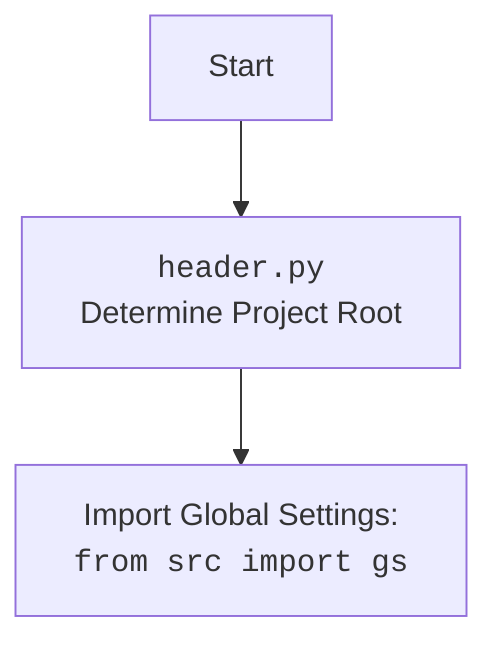

### **Системные инструкции для обработки кода проекта `hypotez`**

=========================================================================================

Описание функциональности и правил для генерации, анализа и улучшения кода. Направлено на обеспечение последовательного и читаемого стиля кодирования, соответствующего требованиям.

---

### **Основные принципы**

#### **1. Общие указания**:
- Соблюдай четкий и понятный стиль кодирования.
- Все изменения должны быть обоснованы и соответствовать установленным требованиям.

#### **2. Комментарии**:
- Используй `#` для внутренних комментариев.
- Документация всех функций, методов и классов должна следовать такому формату: 
    ```python
        def function(param: str, param1: Optional[str | dict | str] = None) -> dict | None:
            """ 
            Args:
                param (str): Описание параметра `param`.
                param1 (Optional[str | dict | str], optional): Описание параметра `param1`. По умолчанию `None`.
    
            Returns:
                dict | None: Описание возвращаемого значения. Возвращает словарь или `None`.
    
            Raises:
                SomeError: Описание ситуации, в которой возникает исключение `SomeError`.

            Ехаmple:
                >>> function('param', 'param1')
                {'param': 'param1'}
            """
    ```
- Комментарии и документация должны быть четкими, лаконичными и точными.

#### **3. Форматирование кода**:
- Используй одинарные кавычки. `a:str = 'value'`, `print('Hello World!')`;
- Добавляй пробелы вокруг операторов. Например, `x = 5`;
- Все параметры должны быть аннотированы типами. `def function(param: str, param1: Optional[str | dict | str] = None) -> dict | None:`;
- Не используй `Union`. Вместо этого используй `|`.

#### **4. Логирование**:
- Для логгирования Всегда Используй модуль `logger` из `src.logger.logger`.
- Ошибки должны логироваться с использованием `logger.error`.
Пример:
    ```python
        try:
            ...
        except Exception as ex:
            logger.error('Error while processing data', ех, exc_info=True)
    ```
#### **5 Не используй `Union[]` в коде. Вместо него используй `|`
Например:
```python
x: str | int ...
```


---

### **Основные требования**:

#### **1. Формат ответов в Markdown**:
- Все ответы должны быть выполнены в формате **Markdown**.

#### **2. Формат комментариев**:
- Используй указанный стиль для комментариев и документации в коде.
- Пример:

```python
from typing import Generator, Optional, List
from pathlib import Path


def read_text_file(
    file_path: str | Path,
    as_list: bool = False,
    extensions: Optional[List[str]] = None,
    chunk_size: int = 8192,
) -> Generator[str, None, None] | str | None:
    """
    Считывает содержимое файла (или файлов из каталога) с использованием генератора для экономии памяти.

    Args:
        file_path (str | Path): Путь к файлу или каталогу.
        as_list (bool): Если `True`, возвращает генератор строк.
        extensions (Optional[List[str]]): Список расширений файлов для чтения из каталога.
        chunk_size (int): Размер чанков для чтения файла в байтах.

    Returns:
        Generator[str, None, None] | str | None: Генератор строк, объединенная строка или `None` в случае ошибки.

    Raises:
        Exception: Если возникает ошибка при чтении файла.

    Example:
        >>> from pathlib import Path
        >>> file_path = Path('example.txt')
        >>> content = read_text_file(file_path)
        >>> if content:
        ...    print(f'File content: {content[:100]}...')
        File content: Example text...
    """
    ...
```
- Всегда делай подробные объяснения в комментариях. Избегай расплывчатых терминов, 
- таких как *«получить»* или *«делать»*. Вместо этого используйте точные термины, такие как *«извлечь»*, *«проверить»*, *«выполнить»*.
- Вместо: *«получаем»*, *«возвращаем»*, *«преобразовываем»* используй имя объекта *«функция получае»*, *«переменная возвращает»*, *«код преобразовывает»* 
- Комментарии должны непосредственно предшествовать описываемому блоку кода и объяснять его назначение.

#### **3. Пробелы вокруг операторов присваивания**:
- Всегда добавляйте пробелы вокруг оператора `=`, чтобы повысить читаемость.
- Примеры:
  - **Неправильно**: `x=5`
  - **Правильно**: `x = 5`

#### **4. Использование `j_loads` или `j_loads_ns`**:
- Для чтения JSON или конфигурационных файлов замените стандартное использование `open` и `json.load` на `j_loads` или `j_loads_ns`.
- Пример:

```python
# Неправильно:
with open('config.json', 'r', encoding='utf-8') as f:
    data = json.load(f)

# Правильно:
data = j_loads('config.json')
```

#### **5. Сохранение комментариев**:
- Все существующие комментарии, начинающиеся с `#`, должны быть сохранены без изменений в разделе «Улучшенный код».
- Если комментарий кажется устаревшим или неясным, не изменяйте его. Вместо этого отметьте его в разделе «Изменения».

#### **6. Обработка `...` в коде**:
- Оставляйте `...` как указатели в коде без изменений.
- Не документируйте строки с `...`.
```

#### **7. Аннотации**
Для всех переменных должны быть определены аннотации типа. 
Для всех функций все входные и выходные параметры аннотириваны
Для все параметров должны быть аннотации типа.


### **8. webdriver**
В коде используется webdriver. Он импртируется из модуля `webdriver` проекта `hypotez`
```python
from src.webdirver import Driver, Chrome, Firefox, Playwright, ...
driver = Driver(Firefox)

Пoсле чего может использоваться как

close_banner = {
  "attribute": null,
  "by": "XPATH",
  "selector": "//button[@id = 'closeXButton']",
  "if_list": "first",
  "use_mouse": false,
  "mandatory": false,
  "timeout": 0,
  "timeout_for_event": "presence_of_element_located",
  "event": "click()",
  "locator_description": "Закрываю pop-up окно, если оно не появилось - не страшно (`mandatory`:`false`)"
}

result = driver.execute_locator(close_banner)
```

### **Анализ кода: `hypotez/src/utils/powershell/examples/pprint/example_pprint.py`**

#### **1. Блок-схема**

```mermaid
graph TD
    A[Начало] --> B{Импорт модуля `header`}
    B -- Да --> C[Импорт `pretty_print` из `pprint`]
    B -- Нет --> C
    C --> D[Импорт `pprint` из `src.printer`]
    D --> E[Вызов `pprint("Hello, world!")`]
    E --> F[Конец]
```

**Пояснения:**

1.  **Начало**: Начало выполнения скрипта.
2.  **Импорт модуля `header`**: Проверяется, импортирован ли модуль `header`. Если да, переходим к следующему шагу.
3.  **Импорт `pretty_print` из `pprint`**: Импортируется функция `pprint` из стандартной библиотеки `pprint` и переименовывается в `pretty_print`.
4.  **Импорт `pprint` из `src.printer`**: Импортируется функция `pprint` из модуля `src.printer`.
5.  **Вызов `pprint("Hello, world!")`**: Вызывается функция `pprint` с аргументом "Hello, world!". Важно отметить, что в данном коде вызовется функция `pprint` из `src.printer`, так как она импортирована последней и переопределяет имя.
6.  **Конец**: Завершение выполнения скрипта.

#### **2. Диаграмма**

```mermaid
flowchart TD
    Start --> ImportHeader[<code>header.py</code><br>Determine Project Root]

    ImportHeader --> ImportPprint[Import Global Settings: <br><code>from src import gs</code>]
    ImportPprint --> ImportPrettyPrint[<code>from pprint import pprint as pretty_print</code>]
    ImportPrettyPrint --> ImportSrcPrinter[<code>from src.printer import pprint</code>]
    ImportSrcPrinter --> CallPprint[<code>pprint("Hello, world!")</code>]
    CallPprint --> End
```

**Пояснения:**

*   **`header.py`**: Определяет корень проекта.
*   **`from src import gs`**: Импортирует глобальные настройки.
*   **`from pprint import pprint as pretty_print`**: Импортирует функцию `pprint` из стандартной библиотеки и переименовывает её в `pretty_print`.
*   **`from src.printer import pprint`**: Импортирует функцию `pprint` из модуля `src.printer`.
*   **`pprint("Hello, world!")`**: Вызывает функцию `pprint` (из `src.printer`) для печати сообщения.



#### **3. Объяснение**

**Импорты:**

*   `header`: Вероятно, это модуль, который определяет корень проекта. Он не является стандартной библиотекой Python, и, скорее всего, это часть проекта `hypotez`.
*   `from pprint import pprint as pretty_print`: Импортирует функцию `pprint` из стандартной библиотеки `pprint` и переименовывает её в `pretty_print`. Это позволяет использовать функцию для "pretty printing" (аккуратного форматирования) данных.
*   `from src.printer import pprint`: Импортирует модуль `pprint` из `src.printer`. Вероятно, это модуль, содержащий кастомную реализацию функции `pprint`, специфичную для проекта `hypotez`.

**Функции:**

*   `pprint("Hello, world!")`: Вызывает функцию `pprint` для печати строки "Hello, world!". Важно, что в данном случае будет вызвана функция `pprint` из `src.printer`, так как она переопределила имя, импортированное из стандартной библиотеки.

**Переменные:**

*   В данном коде переменные явно не используются, но импортированные функции (`pretty_print` и `pprint`) являются переменными, содержащими ссылки на соответствующие функции.

**Потенциальные ошибки и области для улучшения:**

*   **Неоднозначность `pprint`**: Код импортирует `pprint` как из стандартной библиотеки, так и из `src.printer`, причем последняя импортированная функция переопределяет предыдущую. Это может привести к путанице и неясностям. Лучше явно указать, какую именно функцию `pprint` предполагается использовать, и избегать переопределения имен.
*   **Отсутствие документации модуля**: В начале файла есть множество пустых строк с комментариями для документации, но нет фактического описания модуля. Следует добавить описание назначения модуля, его основных функций и принципов работы.
*   **`...`**: В коде есть строки с `...`, что указывает на пропущенный код. Необходимо заполнить эти участки реальным кодом или удалить их, если они не нужны.

**Взаимосвязи с другими частями проекта:**

*   Модуль зависит от `header.py` (если он существует и корректно работает), который, вероятно, определяет корень проекта.
*   Модуль использует `src.printer.pprint`, что указывает на наличие кастомной реализации "pretty printing" в проекте `hypotez`.

Таким образом, код является примером использования функции "pretty printing" в проекте `hypotez`, но требует доработки для устранения неоднозначности и добавления документации.