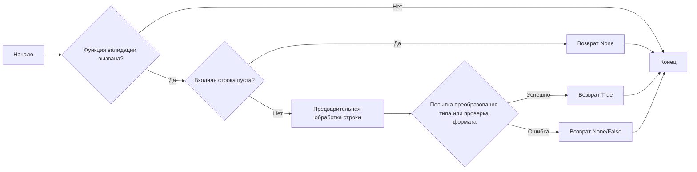
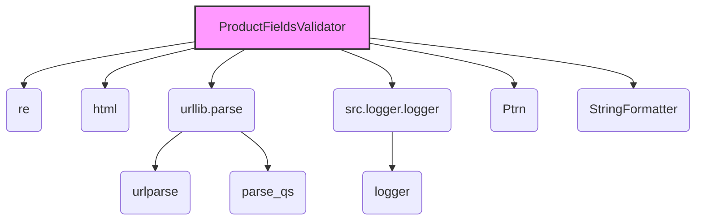

### **Системные инструкции для обработки кода проекта `hypotez`**

=========================================================================================

Описание функциональности и правил для генерации, анализа и улучшения кода. Направлено на обеспечение последовательного и читаемого стиля кодирования, соответствующего требованиям.

---

### **Основные принципы**

#### **1. Общие указания**:
- Соблюдай четкий и понятный стиль кодирования.
- Все изменения должны быть обоснованы и соответствовать установленным требованиям.

#### **2. Комментарии**:
- Используй `#` для внутренних комментариев.
- Документация всех функций, методов и классов должна следовать такому формату: 
    ```python
        def function(param: str, param1: Optional[str | dict | str] = None) -> dict | None:
            """ 
            Args:
                param (str): Описание параметра `param`.
                param1 (Optional[str | dict | str], optional): Описание параметра `param1`. По умолчанию `None`.
    
            Returns:
                dict | None: Описание возвращаемого значения. Возвращает словарь или `None`.
    
            Raises:
                SomeError: Описание ситуации, в которой возникает исключение `SomeError`.

            Ехаmple:
                >>> function('param', 'param1')
                {'param': 'param1'}
            """
    ```
- Комментарии и документация должны быть четкими, лаконичными и точными.

#### **3. Форматирование кода**:
- Используй одинарные кавычки. `a:str = 'value'`, `print('Hello World!')`;
- Добавляй пробелы вокруг операторов. Например, `x = 5`;
- Все параметры должны быть аннотированы типами. `def function(param: str, param1: Optional[str | dict | str] = None) -> dict | None:`;
- Не используй `Union`. Вместо этого используй `|`.

#### **4. Логирование**:
- Для логгирования Всегда Используй модуль `logger` из `src.logger.logger`.
- Ошибки должны логироваться с использованием `logger.error`.
Пример:
    ```python
        try:
            ...
        except Exception as ex:
            logger.error('Error while processing data', ех, exc_info=True)
    ```
#### **5 Не используй `Union[]` в коде. Вместо него используй `|`
Например:
```python
x: str | int ...
```


---

### **Основные требования**:

#### **1. Формат ответов в Markdown**:
- Все ответы должны быть выполнены в формате **Markdown**.

#### **2. Формат комментариев**:
- Используй указанный стиль для комментариев и документации в коде.
- Пример:

```python
from typing import Generator, Optional, List
from pathlib import Path


def read_text_file(
    file_path: str | Path,
    as_list: bool = False,
    extensions: Optional[List[str]] = None,
    chunk_size: int = 8192,
) -> Generator[str, None, None] | str | None:
    """
    Считывает содержимое файла (или файлов из каталога) с использованием генератора для экономии памяти.

    Args:
        file_path (str | Path): Путь к файлу или каталогу.
        as_list (bool): Если `True`, возвращает генератор строк.
        extensions (Optional[List[str]]): Список расширений файлов для чтения из каталога.
        chunk_size (int): Размер чанков для чтения файла в байтах.

    Returns:
        Generator[str, None, None] | str | None: Генератор строк, объединенная строка или `None` в случае ошибки.

    Raises:
        Exception: Если возникает ошибка при чтении файла.

    Example:
        >>> from pathlib import Path
        >>> file_path = Path('example.txt')
        >>> content = read_text_file(file_path)
        >>> if content:
        ...    print(f'File content: {content[:100]}...')
        File content: Example text...
    """
    ...
```
- Всегда делай подробные объяснения в комментариях. Избегай расплывчатых терминов, 
- таких как *«получить»* или *«делать»*
-  . Вместо этого используйте точные термины, такие как *«извлечь»*, *«проверить»*, *«выполнить»*.
- Вместо: *«получаем»*, *«возвращаем»*, *«преобразовываем»* используй имя объекта *«функция получае»*, *«переменная возвращает»*, *«код преобразовывает»* 
- Комментарии должны непосредственно предшествовать описываемому блоку кода и объяснять его назначение.

#### **3. Пробелы вокруг операторов присваивания**:
- Всегда добавляйте пробелы вокруг оператора `=`, чтобы повысить читаемость.
- Примеры:
  - **Неправильно**: `x=5`
  - **Правильно**: `x = 5`

#### **4. Использование `j_loads` или `j_loads_ns`**:
- Для чтения JSON или конфигурационных файлов замените стандартное использование `open` и `json.load` на `j_loads` или `j_loads_ns`.
- Пример:

```python
# Неправильно:
with open('config.json', 'r', encoding='utf-8') as f:
    data = json.load(f)

# Правильно:
data = j_loads('config.json')
```

#### **5. Сохранение комментариев**:
- Все существующие комментарии, начинающиеся с `#`, должны быть сохранены без изменений в разделе «Улучшенный код».
- Если комментарий кажется устаревшим или неясным, не изменяйте его. Вместо этого отметьте его в разделе «Изменения».

#### **6. Обработка `...` в коде**:
- Оставляйте `...` как указатели в коде без изменений.
- Не документируйте строки с `...`.
```

#### **7. Аннотации**
Для всех переменных должны быть определены аннотации типа. 
Для всех функций все входные и выходные параметры аннотириваны
Для все параметров должны быть аннотации типа.


### **8. webdriver**
В коде используется webdriver. Он импртируется из модуля `webdriver` проекта `hypotez`
```python
from src.webdirver import Driver, Chrome, Firefox, Playwright, ...
driver = Driver(Firefox)

Пoсле чего может использоваться как

close_banner = {
  "attribute": null,
  "by": "XPATH",
  "selector": "//button[@id = 'closeXButton']",
  "if_list": "first",
  "use_mouse": false,
  "mandatory": false,
  "timeout": 0,
  "timeout_for_event": "presence_of_element_located",
  "event": "click()",
  "locator_description": "Закрываю pop-up окно, если оно не появилось - не страшно (`mandatory`:`false`)"
}

result = driver.execute_locator(close_banner)
```

## Анализ кода `hypotez/src/utils/string/validator.py`

### 1. Блок-схема



**Примеры для каждого логического блока:**

-   **A (Начало):** Начало выполнения программы или вызов функции валидации.
-   **B (Функция валидации вызвана?):** Вызывается одна из функций `validate_price`, `validate_weight`, `validate_sku`, `validate_url` или `isint`.
-   **C (Входная строка пуста?):** Проверка, является ли входная строка пустой (`if not price:`).
    -   Пример: Если `price = ""`, то возвращается `None`.
-   **D (Возврат None):** Возврат `None`, если строка пуста.
-   **E (Предварительная обработка строки):** Очистка и форматирование строки.
    -   Пример: Удаление символов валюты из цены, удаление специальных символов из SKU.
-   **F (Попытка преобразования типа или проверка формата):** Попытка преобразования строки в число (`float(price)`) или проверка URL на соответствие схеме.
-   **G (Возврат True):** Возврат `True`, если строка успешно прошла валидацию.
-   **H (Возврат None/False):** Возврат `None` или `False` в случае ошибки при валидации.
-   **I (Конец):** Завершение выполнения функции.

### 2. Диаграмма зависимостей



**Объяснение зависимостей:**

-   `ProductFieldsValidator`: Класс, содержащий статические методы для валидации различных полей продукта (цена, вес, SKU, URL).
-   `re`: Модуль `re` используется для работы с регулярными выражениями при очистке и валидации данных. Он необходим для поиска и замены символов в строках, например, для удаления символов валюты из цены.
-   `html`: Модуль `html` импортирован, но не используется в предоставленном коде. Возможно, он предназначен для использования в других частях класса `ProductFieldsValidator` для обработки HTML-сущностей в строках.
-   `urllib.parse`: Модуль `urllib.parse` используется для парсинга URL-адресов. Он включает в себя функции `urlparse` и `parse_qs`.
    -   `urlparse`: Функция `urlparse` используется для разбора URL на составные части (схема, netloc, path, params, query, fragment). Это необходимо для проверки структуры URL.
    -   `parse_qs`: Функция `parse_qs` используется для разбора строки запроса URL. В данном коде она не используется, но импортирована, что может указывать на её использование в других частях класса `ProductFieldsValidator`.
-   `src.logger.logger`: Модуль `src.logger.logger` используется для логирования информации о работе валидатора. Это позволяет отслеживать ошибки и предупреждения, возникающие в процессе валидации.
    -   `logger`: Переменная `logger` представляет собой экземпляр логгера, который используется для записи сообщений в лог.
-   `Ptrn`: `Ptrn` используется для хранения скомпилированных регулярных выражений, применяемых при валидации.
-   `StringFormatter`: `StringFormatter` используется для форматирования строк, например, для удаления специальных символов или переносов строк.

### 3. Объяснение

#### Импорты:

-   `re`: Модуль для работы с регулярными выражениями. Используется для очистки и проверки строк.
-   `html`: Модуль для работы с HTML. В предоставленном коде не используется, но может быть полезен для обработки HTML-сущностей.
-   `urllib.parse`: Модуль для парсинга URL-адресов.
    -   `urlparse`: Функция для разбора URL на составные части.
    -   `parse_qs`: Функция для разбора параметров запроса в URL (не используется в предоставленном коде).
-   `typing.Union`: Используется для указания, что переменная может иметь один из нескольких типов.
-   `src.logger.logger`: Логирование событий и ошибок.
    -   `logger`: Экземпляр логгера.

#### Классы:

-   `ProductFieldsValidator`: Класс, содержащий статические методы для валидации различных полей продукта.
    -   Атрибуты: Отсутствуют.
    -   Методы:
        -   `validate_price(price: str) -> bool`: Валидирует цену.
        -   `validate_weight(weight: str) -> bool`: Валидирует вес.
        -   `validate_sku(sku: str) -> bool`: Валидирует артикул (SKU).
        -   `validate_url(url: str) -> bool`: Валидирует URL.
        -   `isint(s: str) -> bool`: Проверяет, является ли строка целым числом.

#### Функции:

-   `validate_price(price: str) -> bool`:
    -   Аргументы:
        -   `price` (str): Строка, представляющая цену.
    -   Возвращаемое значение:
        -   `bool`: `True`, если цена валидна, `None` в противном случае.
    -   Назначение: Валидация строки цены, удаление лишних символов, замена запятой на точку и проверка, что строка может быть преобразована в число с плавающей точкой.
    -   Пример:
        ```python
        price = "1 234,56 $"
        is_valid = ProductFieldsValidator.validate_price(price)
        print(is_valid)  # Вывод: True
        ```
-   `validate_weight(weight: str) -> bool`:
    -   Аргументы:
        -   `weight` (str): Строка, представляющая вес.
    -   Возвращаемое значение:
        -   `bool`: `True`, если вес валиден, `None` в противном случае.
    -   Назначение: Валидация строки веса, удаление лишних символов, замена запятой на точку и проверка, что строка может быть преобразована в число с плавающей точкой.
    -   Пример:
        ```python
        weight = "1 000,5 kg"
        is_valid = ProductFieldsValidator.validate_weight(weight)
        print(is_valid)  # Вывод: True
        ```
-   `validate_sku(sku: str) -> bool`:
    -   Аргументы:
        -   `sku` (str): Строка, представляющая артикул (SKU).
    -   Возвращаемое значение:
        -   `bool`: `True`, если SKU валиден, `None` в противном случае.
    -   Назначение: Валидация строки SKU, удаление специальных символов и переносов строк, проверка длины строки.
    -   Пример:
        ```python
        sku = "ABC-123"
        is_valid = ProductFieldsValidator.validate_sku(sku)
        print(is_valid)  # Вывод: True
        ```
-   `validate_url(url: str) -> bool`:
    -   Аргументы:
        -   `url` (str): Строка, представляющая URL.
    -   Возвращаемое значение:
        -   `bool`: `True`, если URL валиден, `None` в противном случае.
    -   Назначение: Валидация строки URL, добавление схемы `http://`, если она отсутствует, и проверка структуры URL.
    -   Пример:
        ```python
        url = "example.com"
        is_valid = ProductFieldsValidator.validate_url(url)
        print(is_valid)  # Вывод: True
        ```
-   `isint(s: str) -> bool`:
    -   Аргументы:
        -   `s` (str): Строка, которую нужно проверить.
    -   Возвращаемое значение:
        -   `bool`: `True`, если строка является целым числом, `None` в противном случае.
    -   Назначение: Проверка, может ли строка быть преобразована в целое число.
    -   Пример:
        ```python
        s = "123"
        is_int = ProductFieldsValidator.isint(s)
        print(is_int)  # Вывод: True
        ```

#### Переменные:

-   `price` (str): Входной параметр в функции `validate_price`, строка для валидации цены.
-   `weight` (str): Входной параметр в функции `validate_weight`, строка для валидации веса.
-   `sku` (str): Входной параметр в функции `validate_sku`, строка для валидации SKU.
-   `url` (str): Входной параметр в функции `validate_url`, строка для валидации URL.
-   `s` (str): Входной параметр в функции `isint`, строка для проверки на целое число.
-   `parsed_url`: Результат парсинга URL с использованием `urlparse`.

#### Потенциальные ошибки и области для улучшения:

-   **Отсутствие логирования**: В коде не используется логирование для записи ошибок или предупреждений. Рекомендуется добавить логирование с использованием `logger.error` и `logger.warning` для отслеживания проблем.
-   **Обработка исключений**: В функции `isint` исключение просто перехватывается и ничего не возвращается. Рекомендуется логировать исключение и возвращать `False`.
-   **Использование `None` вместо `False`**: Функции валидации возвращают `None` в случае неудачи. Рекомендуется возвращать `False` для большей ясности.
-   **Недостаточная документация**: Отсутствует подробное описание регулярных выражений, используемых в `Ptrn`.
-   **Зависимость от `Ptrn` и `StringFormatter`**: Код зависит от классов `Ptrn` и `StringFormatter`, которые не предоставлены в данном фрагменте. Необходимо убедиться, что эти классы доступны и корректно работают.
-   **Обработка HTML**: Импортирован модуль `html`, но не используется. Следует либо использовать его, либо удалить импорт.

#### Взаимосвязи с другими частями проекта:

-   Модуль `src.logger.logger` используется для логирования, что позволяет интегрировать этот модуль с системой мониторинга и отладки проекта.
-   Классы `Ptrn` и `StringFormatter` (не предоставлены) предположительно содержат общие функции для работы со строками и регулярными выражениями, которые могут использоваться и в других частях проекта.