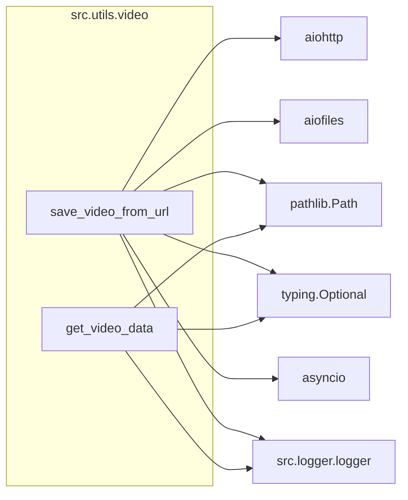

### **Системные инструкции для обработки кода проекта `hypotez`**

=========================================================================================

Описание функциональности и правил для генерации, анализа и улучшения кода. Направлено на обеспечение последовательного и читаемого стиля кодирования, соответствующего требованиям.

---

### **Основные принципы**

#### **1. Общие указания**:
- Соблюдай четкий и понятный стиль кодирования.
- Все изменения должны быть обоснованы и соответствовать установленным требованиям.

#### **2. Комментарии**:
- Используй `#` для внутренних комментариев.
- Документация всех функций, методов и классов должна следовать такому формату: 
    ```python
        def function(param: str, param1: Optional[str | dict | str] = None) -> dict | None:
            """ 
            Args:
                param (str): Описание параметра `param`.
                param1 (Optional[str | dict | str], optional): Описание параметра `param1`. По умолчанию `None`.
    
            Returns:
                dict | None: Описание возвращаемого значения. Возвращает словарь или `None`.
    
            Raises:
                SomeError: Описание ситуации, в которой возникает исключение `SomeError`.

            Ехаmple:
                >>> function('param', 'param1')
                {'param': 'param1'}
            """
    ```
- Комментарии и документация должны быть четкими, лаконичными и точными.

#### **3. Форматирование кода**:
- Используй одинарные кавычки. `a:str = 'value'`, `print('Hello World!')`;
- Добавляй пробелы вокруг операторов. Например, `x = 5`;
- Все параметры должны быть аннотированы типами. `def function(param: str, param1: Optional[str | dict | str] = None) -> dict | None:`;
- Не используй `Union`. Вместо этого используй `|`.

#### **4. Логирование**:
- Для логгирования Всегда Используй модуль `logger` из `src.logger.logger`.
- Ошибки должны логироваться с использованием `logger.error`.
Пример:
    ```python
        try:
            ...
        except Exception as ex:
            logger.error('Error while processing data', ех, exc_info=True)
    ```
#### **5 Не используй `Union[]` в коде. Вместо него используй `|`
Например:
```python
x: str | int ...
```


---

### **Основные требования**:

#### **1. Формат ответов в Markdown**:
- Все ответы должны быть выполнены в формате **Markdown**.

#### **2. Формат комментариев**:
- Используй указанный стиль для комментариев и документации в коде.
- Пример:

```python
from typing import Generator, Optional, List
from pathlib import Path


def read_text_file(
    file_path: str | Path,
    as_list: bool = False,
    extensions: Optional[List[str]] = None,
    chunk_size: int = 8192,
) -> Generator[str, None, None] | str | None:
    """
    Считывает содержимое файла (или файлов из каталога) с использованием генератора для экономии памяти.

    Args:
        file_path (str | Path): Путь к файлу или каталогу.
        as_list (bool): Если `True`, возвращает генератор строк.
        extensions (Optional[List[str]]): Список расширений файлов для чтения из каталога.
        chunk_size (int): Размер чанков для чтения файла в байтах.

    Returns:
        Generator[str, None, None] | str | None: Генератор строк, объединенная строка или `None` в случае ошибки.

    Raises:
        Exception: Если возникает ошибка при чтении файла.

    Example:
        >>> from pathlib import Path
        >>> file_path = Path('example.txt')
        >>> content = read_text_file(file_path)
        >>> if content:
        ...    print(f'File content: {content[:100]}...')
        File content: Example text...
    """
    ...
```
- Всегда делай подробные объяснения в комментариях. Избегай расплывчатых терминов, 
- таких как *«получить»* или *«делать»*
-  . Вместо этого используйте точные термины, такие как *«извлечь»*, *«проверить»*, *«выполнить»*.
- Вместо: *«получаем»*, *«возвращаем»*, *«преобразовываем»* используй имя объекта *«функция получае»*, *«переменная возвращает»*, *«код преобразовывает»* 
- Комментарии должны непосредственно предшествовать описываемому блоку кода и объяснять его назначение.

#### **3. Пробелы вокруг операторов присваивания**:
- Всегда добавляйте пробелы вокруг оператора `=`, чтобы повысить читаемость.
- Примеры:
  - **Неправильно**: `x=5`
  - **Правильно**: `x = 5`

#### **4. Использование `j_loads` или `j_loads_ns`**:
- Для чтения JSON или конфигурационных файлов замените стандартное использование `open` и `json.load` на `j_loads` или `j_loads_ns`.
- Пример:

```python
# Неправильно:
with open('config.json', 'r', encoding='utf-8') as f:
    data = json.load(f)

# Правильно:
data = j_loads('config.json')
```

#### **5. Сохранение комментариев**:
- Все существующие комментарии, начинающиеся с `#`, должны быть сохранены без изменений в разделе «Улучшенный код».
- Если комментарий кажется устаревшим или неясным, не изменяйте его. Вместо этого отметьте его в разделе «Изменения».

#### **6. Обработка `...` в коде**:
- Оставляйте `...` как указатели в коде без изменений.
- Не документируйте строки с `...`.
```

#### **7. Аннотации**
Для всех переменных должны быть определены аннотации типа. 
Для всех функций все входные и выходные параметры аннотириваны
Для все параметров должны быть аннотации типа.


### **8. webdriver**
В коде используется webdriver. Он импртируется из модуля `webdriver` проекта `hypotez`
```python
from src.webdirver import Driver, Chrome, Firefox, Playwright, ...
driver = Driver(Firefox)

Пoсле чего может использоваться как

close_banner = {
  "attribute": null,
  "by": "XPATH",
  "selector": "//button[@id = 'closeXButton']",
  "if_list": "first",
  "use_mouse": false,
  "mandatory": false,
  "timeout": 0,
  "timeout_for_event": "presence_of_element_located",
  "event": "click()",
  "locator_description": "Закрываю pop-up окно, если оно не появилось - не страшно (`mandatory`:`false`)"
}

result = driver.execute_locator(close_banner)
```

### Анализ кода `hypotez/src/utils/video.py`

#### 1. Блок-схема:

```mermaid
graph LR
    A[Начало: save_video_from_url] --> B{Создание асинхронной сессии aiohttp.ClientSession};
    B --> C{Выполнение GET запроса к URL};
    C --> D{Проверка статуса ответа (response.raise_for_status())};
    D -- Ошибка HTTP --> E[Логирование ошибки и возврат None];
    D -- Успех --> F{Создание родительских директорий для save_path (save_path.parent.mkdir)};
    F --> G{Открытие файла для записи в бинарном режиме (aiofiles.open)};
    G --> H{Чтение данных чанками (response.content.read)};
    H -- Данные есть --> I{Запись чанка в файл (file.write)};
    I --> H;
    H -- Нет данных --> J{Закрытие файла};
    J --> K{Проверка существования файла};
    K -- Файл не существует --> L[Логирование ошибки и возврат None];
    K -- Файл существует --> M{Проверка размера файла (save_path.stat().st_size)};
    M -- Размер файла равен 0 --> N[Логирование ошибки и возврат None];
    M -- Размер файла больше 0 --> O[Возврат save_path];

    P[Начало: get_video_data] --> Q{Проверка существования файла (file_path.exists())};
    Q -- Файл не существует --> R[Логирование ошибки и возврат None];
    Q -- Файл существует --> S{Открытие файла для чтения в бинарном режиме (open)};
    S --> T{Чтение данных из файла (file.read)};
    T --> U[Возврат данных];

    V[Начало: main] --> W{Определение URL и save_path};
    W --> X{Вызов save_video_from_url(url, save_path)};
    X --> Y{Проверка результата};
    Y -- Результат есть --> Z[Вывод сообщения об успешном сохранении];
```

#### 2. Диаграмма:



Объяснение зависимостей:
- `aiohttp`: Используется для выполнения асинхронных HTTP-запросов, в частности, для скачивания видео по URL.
- `aiofiles`: Используется для асинхронной работы с файлами, что позволяет не блокировать основной поток при записи скачанных данных на диск.
- `pathlib`:  Модуль `pathlib` используется для представления путей к файлам и директориям в объектно-ориентированном стиле, что упрощает работу с файловой системой.
- `typing`: Используется для аннотации типов, что улучшает читаемость и упрощает отладку кода.
- `asyncio`: Используется для организации асинхронного выполнения кода, позволяя одновременно выполнять несколько операций.
- `src.logger.logger`: Используется для логирования ошибок и отладочной информации.

#### 3. Объяснение:

- **Импорты**:
  - `aiohttp`:  Асинхронная HTTP клиентская библиотека. Позволяет выполнять асинхронные запросы к серверу для скачивания видео.
  - `aiofiles`: Асинхронная файловая библиотека. Используется для записи скачанных данных в файл асинхронно.
  - `pathlib`:  Предоставляет способ представления путей к файлам и директориям как объекты.
  - `typing`:  Обеспечивает поддержку аннотаций типов для улучшения читаемости и облегчения отладки. `Optional` указывает, что переменная может иметь значение определенного типа или `None`.
  - `asyncio`:  Библиотека для написания конкурентного кода с использованием синтаксиса async/await.
  - `src.logger.logger`:  Модуль логирования из проекта `hypotez`. Используется для записи информации об ошибках и других событиях.

- **Классы**:
  - В данном коде нет классов.

- **Функции**:
  - `save_video_from_url(url: str, save_path: str) -> Optional[Path]`:
    - Аргументы:
      - `url` (str): URL видео для скачивания.
      - `save_path` (str): Путь для сохранения скачанного видео.
    - Возвращаемое значение:
      - `Optional[Path]`: Объект `Path` к сохраненному файлу или `None` в случае ошибки.
    - Назначение:
      - Асинхронно скачивает видео с заданного URL и сохраняет его по указанному пути.
      - Обрабатывает возможные сетевые ошибки и ошибки файловой системы.
    - Пример:
      ```python
      import asyncio
      async def main():
          result = await save_video_from_url("https://example.com/video.mp4", "local_video.mp4")
          if result:
              print(f"Video saved to {result}")
      asyncio.run(main())
      ```
  - `get_video_data(file_name: str) -> Optional[bytes]`:
    - Аргументы:
      - `file_name` (str): Путь к видеофайлу для чтения.
    - Возвращаемое значение:
      - `Optional[bytes]`: Бинарные данные видеофайла или `None`, если файл не найден или произошла ошибка.
    - Назначение:
      - Читает бинарные данные видеофайла.
      - Обрабатывает исключения, если файл не существует или не может быть прочитан.
    - Пример:
      ```python
      data = get_video_data("local_video.mp4")
      if data:
          print(data[:10])  # Вывод первых 10 байт
      ```
 - `main() -> None`:
    - Аргументы:
      - Отсутствуют
    - Возвращаемое значение:
      - Отсутствует
    - Назначение:
      - Определяет URL и путь сохранения видео.
      - Запускает асинхронную функцию `save_video_from_url` через `asyncio.run`.
      - Выводит сообщение об успешном сохранении или информацию об ошибке.

- **Переменные**:
  - В функциях используются локальные переменные для хранения URL, пути сохранения, содержимого файла и т.д.  Все переменные аннотированы типами.

- **Потенциальные ошибки и области для улучшения**:
  - Отсутствует обработка случаев, когда размер скачиваемого видео превышает доступную память. Можно добавить лимит на размер скачиваемого файла или использовать потоковую обработку.
  - Не реализована проверка Content-Type ответа, чтобы убедиться, что скачивается действительно видеофайл.
  - Можно добавить возможность возобновления скачивания при обрыве соединения.

**Взаимосвязи с другими частями проекта**:
- `src.logger.logger`:  Этот модуль используется для логирования различных событий, таких как ошибки при скачивании или чтении видео. Логгирование помогает в отладке и мониторинге работы приложения.

Этот модуль предоставляет основные утилиты для работы с видео, такие как скачивание и чтение. Он может быть использован в других частях проекта, где требуется обработка видеофайлов.