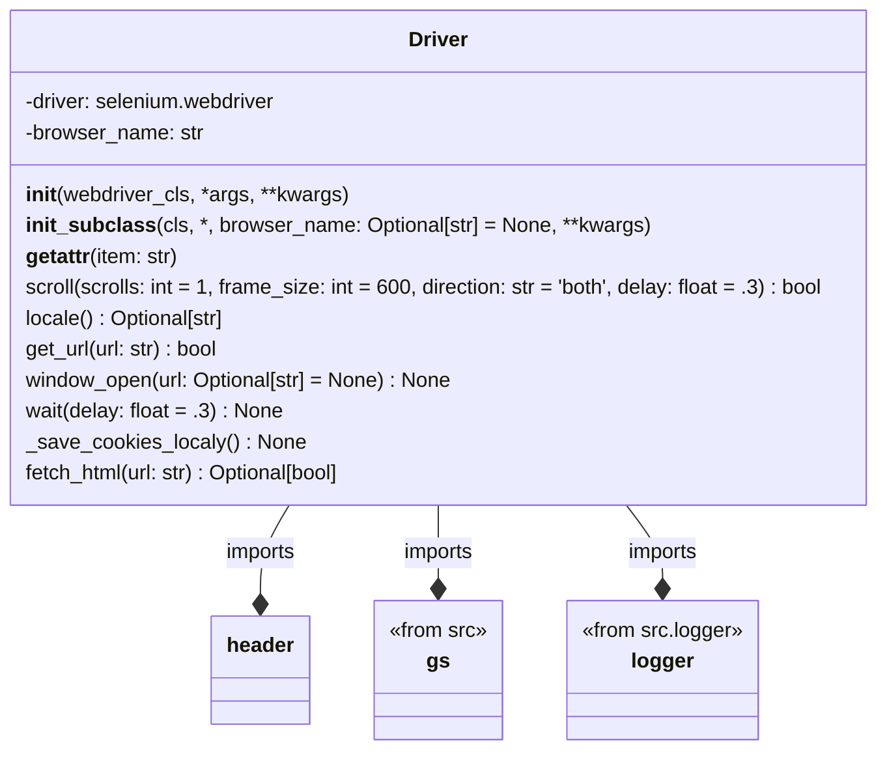
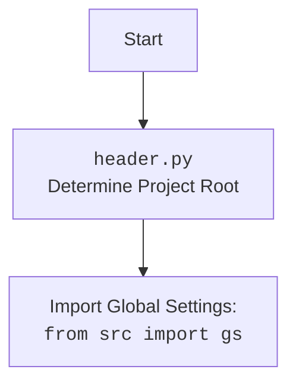

### **Улучшенный код**

## \\file /src/webdriver/driver.py
# -*- coding: utf-8 -*-
#! .pyenv/bin/python3
"""
Модуль для работы с веб-драйверами Selenium.
==============================================
Основное назначение класса `Driver` — обеспечение унифицированного интерфейса для работы с веб-драйверами Selenium.

Он предоставляет интерфейс для взаимодействия с  веб-браузерами, 
такими как Chrome, Firefox и Edge. Код вебдрайверов находится в подмодулях `chrome`, `firefox`, `edge`, `playwright` .
Файлы настроек для веб-браузеров находятся в: `chrome\\chrome.json`, `firefox\\firefox.json`, `edge\\edge.json`, `playwright\\playwright.json`.
Класс Driver упрощает задачи инициализации драйвера, навигации по URL, управления куками и обработки исключений.
"""

import copy
import pickle
import time
import re
from pathlib import Path
from typing import Optional
from selenium.webdriver.common.by import By
from selenium.common.exceptions import (
    InvalidArgumentException,
    ElementClickInterceptedException,
    ElementNotInteractableException,
    ElementNotVisibleException
)
import header
from src import gs

from src.logger.logger import logger
from src.logger.exceptions import ExecuteLocatorException, WebDriverException


class Driver:
    """
    Класс обеспечивает удобный интерфейс для работы с различными драйверами, такими как Chrome, Firefox и Edge.

    Attributes:
        driver (selenium.webdriver): Экземпляр Selenium WebDriver.
    """

    def __init__(self, webdriver_cls, *args, **kwargs):
        """
        Инициализирует экземпляр класса Driver.

        Args:
            webdriver_cls: Класс WebDriver, например Chrome или Firefox.
            args: Позиционные аргументы для драйвера.
            kwargs: Ключевые аргументы для драйвера.

        Raises:
            TypeError: Если `webdriver_cls` не является допустимым классом WebDriver.

        Example:
            >>> from selenium.webdriver import Chrome
            >>> driver = Driver(Chrome, executable_path='/path/to/chromedriver')
        """
        if not hasattr(webdriver_cls, 'get'):
            raise TypeError('`webdriver_cls` должен быть допустимым классом WebDriver.')
        self.driver = webdriver_cls(*args, **kwargs)

    def __init_subclass__(cls, *, browser_name: Optional[str] = None, **kwargs):
        """
        Автоматически вызывается при создании подкласса `Driver`.

        Args:
            browser_name: Имя браузера.
            kwargs: Дополнительные аргументы.

        Raises:
            ValueError: Если browser_name не указан.
        """
        super().__init_subclass__(**kwargs)
        if browser_name is None:
            raise ValueError(f'Класс {cls.__name__} должен указать аргумент `browser_name`.')
        cls.browser_name = browser_name

    def __getattr__(self, item: str):
        """
        Прокси для доступа к атрибутам драйвера.

        Args:
            item: Имя атрибута.

        Example:
            >>> driver.current_url
        """
        return getattr(self.driver, item)

    def scroll(self, scrolls: int = 1, frame_size: int = 600, direction: str = 'both', delay: float = .3) -> bool:
        """
        Прокручивает страницу в указанном направлении.

        Args:
            scrolls: Количество прокруток, по умолчанию 1.
            frame_size: Размер прокрутки в пикселях, по умолчанию 600.
            direction: Направление ('both', 'down', 'up'), по умолчанию 'both'.
            delay: Задержка между прокрутками, по умолчанию 0.3.

        Returns:
            True, если успешно, иначе False.

        Example:
            >>> driver.scroll(scrolls=3, direction='down')
        """
        def carousel(direction: str = '', scrolls: int = 1, frame_size: int = 600, delay: float = .3) -> bool:
            """
            Локальный метод для прокрутки экрана.

            Args:
                direction: Направление ('down', 'up').
                scrolls: Количество прокруток.
                frame_size: Размер прокрутки.
                delay: Задержка между прокрутками.

            Returns:
                True, если успешно, иначе False.
            """
            try:
                for _ in range(scrolls):
                    self.execute_script(f'window.scrollBy(0,{direction}{frame_size})')
                    self.wait(delay)
                return True
            except Exception as ex:
                logger.error('Ошибка при прокрутке', exc_info=ex)
                return False

        try:
            if direction == 'forward' or direction == 'down':
                return carousel('', scrolls, frame_size, delay)
            elif direction == 'backward' or direction == 'up':
                return carousel('-', scrolls, frame_size, delay)
            elif direction == 'both':
                return carousel('', scrolls, frame_size, delay) and carousel('-', scrolls, frame_size, delay)
        except Exception as ex:
            logger.error('Ошибка в функции прокрутки', ex)
            return False

    @property
    def locale(self) -> Optional[str]:
        """
        Определяет язык страницы на основе мета-тегов или JavaScript.

        Returns:
            Код языка, если найден, иначе None.

        Example:
            >>> lang = driver.locale
            >>> print(lang)  # 'en' или None
        """
        try:
            meta_language = self.find_element(By.CSS_SELECTOR, "meta[http-equiv='Content-Language']")
            return meta_language.get_attribute('content')
        except Exception as ex:
            logger.debug('Не удалось определить язык сайта из META', ex)
            try:
                return self.get_page_lang()
            except Exception as ex:
                logger.debug('Не удалось определить язык сайта из JavaScript', ex)
                return

    def get_url(self, url: str) -> bool:
        """
        Переходит по указанному URL и сохраняет текущий URL, предыдущий URL и куки.

        Args:
            url: URL для перехода.

        Returns:
            `True`, если переход успешен и текущий URL совпадает с ожидаемым, `False` в противном случае.

        Raises:
            WebDriverException: Если возникает ошибка с WebDriver.
            InvalidArgumentException: Если URL некорректен.
            Exception: Для любых других ошибок при переходе.
        """
        _previous_url: str = copy.copy(self.current_url)

        try:
            self.driver.get(url)
           
            attempts = 5
            while self.ready_state not in ('complete','interactive'):
                """ Ожидание завершения загрузки страницы """
                attempts -= 5
                if attempts < 0: # Если страница не загрузилась за 5 попыток, то цикл прерывается с выводом сообщения об ошибке
                    logger.error(f'Страница не загрузилась за 5 попыток: {url=}')
                    ...
                    break
                time.sleep(1)

            if url != _previous_url:
                self.previous_url = _previous_url

            self._save_cookies_localy()
            return True
            
        except WebDriverException as ex:
            logger.error('WebDriverException', ex)
            return False

        except InvalidArgumentException as ex:
            logger.error(f"InvalidArgumentException {url}", ex)
            return False
        except Exception as ex:
            logger.error(f'Ошибка при переходе по URL: {url}\n', ex)
            return False

    def window_open(self, url: Optional[str] = None) -> None:
        """Open a new tab in the current browser window and switch to it.

        Args:
            url: URL to open in the new tab. Defaults to `None`.
        """
        self.execute_script('window.open();')
        self.switch_to.window(self.window_handles[-1])
        if url:
            self.get(url)

    def wait(self, delay: float = .3) -> None:
        """
        Ожидает указанное количество времени.

        Args:
            delay: Время задержки в секундах. По умолчанию 0.3.

        Returns:
            None
        """
        time.sleep(delay)

    def _save_cookies_localy(self) -> None:
        """
        Сохраняет текущие куки веб-драйвера в локальный файл.

        Returns:
            None

        Raises:
            Exception: Если возникает ошибка при сохранении куки.
        """
        return True # <- ~~~~~~~~~~~~~~~~~~~~~~~~~~~~~ debug
        try:
            with open(gs.cookies_filepath, 'wb') as cookiesfile:
                pickle.dump(self.driver.get_cookies(), cookiesfile)
        except Exception as ex:
            logger.error('Ошибка при сохранении куки:', ex)

    def fetch_html(self, url: str) -> Optional[bool]:
        """
        Извлекает HTML-контент из файла или веб-страницы.

        Args:
            url: Путь к файлу или URL для извлечения HTML-контента.

        Returns:
            Возвращает `True`, если контент успешно получен, иначе `None`.

        Raises:
            Exception: Если возникает ошибка при извлечении контента.
        """
        if url.startswith('file://'):
            cleaned_url = url.replace('file://', '')
            match = re.search(r'[a-zA-Z]:[\\/].*', cleaned_url)
            if match:
                file_path = Path(match.group(0))
                if file_path.exists():
                    try:
                        with open(file_path, 'r', encoding='utf-8') as file:
                            self.html_content = file.read()
                        return True
                    except Exception as ex:
                        logger.error('Ошибка при чтении файла:', ex)
                        return False
                else:
                    logger.error('Локальный файл не найден:', file_path)
                    return False
            else:
                logger.error('Некорректный путь к файлу:', cleaned_url)
                return False
        elif url.startswith('http://') or url.startswith('https://'):
            try:
                if self.get_url(url):
                    self.html_content = self.page_source
                    return True
            except Exception as ex:
                logger.error(f"Ошибка при получении {url}:", ex)
                return False
        else:
            logger.error("Ошибка: Неподдерживаемый протокол для URL:", url)
            return False
```

### 1. **Блок-схема**:

```mermaid
graph TD
    A[Начало] --> B{Инициализация класса Driver};
    B --> C{Проверка типа webdriver_cls};
    C -- Недопустимый класс WebDriver --> D[Выброс исключения TypeError];
    C -- Допустимый класс WebDriver --> E[Инициализация экземпляра WebDriver];
    E --> F{Инициализация подкласса Driver};
    F --> G{Проверка browser_name};
    G -- Не указан browser_name --> H[Выброс исключения ValueError];
    G -- Указан browser_name --> I[Присваивание browser_name];
    I --> J{Проксирование атрибутов WebDriver};
    J --> K{Прокрутка страницы scroll()};
    K --> L{Определение языка страницы locale()};
    L --> M{Переход по URL get_url()};
    M --> N{Открытие нового окна window_open()};
    N --> O{Ожидание wait()};
    O --> P{Сохранение куки _save_cookies_localy()};
    P --> Q{Извлечение HTML-контента fetch_html()};
    Q --> R[Конец];
```

**Примеры для каждого логического блока:**

- **B**: `driver = Driver(Chrome, executable_path='/path/to/chromedriver')`
- **C**: Проверка, что `Chrome` имеет метод `get`.
- **E**: `self.driver = Chrome(executable_path='/path/to/chromedriver')`
- **G**: Проверка, что при создании подкласса `Driver` указан `browser_name`.
- **I**: `cls.browser_name = browser_name`
- **J**: `driver.current_url` (обращение к атрибуту `current_url` экземпляра `Chrome`).
- **K**: `driver.scroll(scrolls=3, direction='down')`
- **L**: `lang = driver.locale`
- **M**: `driver.get_url('https://www.example.com')`
- **N**: `driver.window_open('https://www.example.com')`
- **O**: `driver.wait(2)`
- **P**: `driver._save_cookies_localy()`
- **Q**: `driver.fetch_html('https://www.example.com')`

### 2. **Диаграмма**:



**Объяснение зависимостей:**

- `Driver` зависит от `header`, `gs` (global settings) и `logger`.
- `header` используется для определения корневой директории проекта.
- `gs` предоставляет доступ к глобальным настройкам, таким как `cookies_filepath`.
- `logger` используется для логирования ошибок и отладочной информации.
- `selenium.webdriver` используется для управления браузером.
- `selenium.common.exceptions` используется для обработки исключений, возникающих при работе с WebDriver.



### 3. **Объяснение**:

#### **Импорты**:
- `import copy`: Используется для создания копий объектов, в частности, URL.
- `import pickle`: Используется для сериализации и десериализации объектов Python, в данном случае, для сохранения и загрузки куки.
- `import time`: Используется для добавления задержек в процессе выполнения кода (например, при ожидании загрузки страницы).
- `import re`: Используется для работы с регулярными выражениями, например, при извлечении пути к файлу из URL.
- `from pathlib import Path`: Используется для работы с путями к файлам и директориям в операционной системе.
- `from typing import Optional`: Используется для указания, что переменная может иметь значение `None`.
- `from selenium.webdriver.common.by import By`: Используется для определения стратегий поиска элементов на веб-странице (например, по CSS-селектору).
- `from selenium.common.exceptions import ...`: Импортируются исключения, которые могут возникнуть при работе с WebDriver.
  - `InvalidArgumentException`: Возникает, когда передан некорректный аргумент, например, неверный URL.
  - `ElementClickInterceptedException`: Возникает, когда клик по элементу перехвачен другим элементом.
  - `ElementNotInteractableException`: Возникает, когда элемент не доступен для взаимодействия.
  - `ElementNotVisibleException`: Возникает, когда элемент не виден на странице.
- `import header`: Используется для определения корневой директории проекта.
- `from src import gs`: Импортирует глобальные настройки из пакета `src`.
- `from src.logger.logger import logger`: Импортирует объект `logger` для логирования событий.
- `from src.logger.exceptions import ExecuteLocatorException, WebDriverException`: Импортирует пользовательские исключения для обработки ошибок, связанных с выполнением локаторов и общих ошибок WebDriver.

#### **Классы**:
- **`Driver`**:
  - **Роль**: Обеспечивает унифицированный интерфейс для работы с веб-драйверами Selenium (Chrome, Firefox, Edge).
  - **Атрибуты**:
    - `driver` (`selenium.webdriver`): Экземпляр Selenium WebDriver.
    - `browser_name` (`str`): Имя браузера (определяется в подклассах).
  - **Методы**:
    - `__init__(self, webdriver_cls, *args, **kwargs)`: Инициализирует экземпляр класса Driver, принимая класс WebDriver в качестве аргумента.
    - `__init_subclass__(cls, *, browser_name: Optional[str] = None, **kwargs)`: Автоматически вызывается при создании подкласса `Driver`.
    - `__getattr__(self, item: str)`: Позволяет обращаться к атрибутам и методам драйвера Selenium напрямую через экземпляр класса `Driver`.
    - `scroll(self, scrolls: int = 1, frame_size: int = 600, direction: str = 'both', delay: float = .3) -> bool`: Прокручивает страницу в указанном направлении.
    - `locale(self) -> Optional[str]`: Определяет язык страницы на основе мета-тегов или JavaScript.
    - `get_url(self, url: str) -> bool`: Переходит по указанному URL и сохраняет текущий URL, предыдущий URL и куки.
    - `window_open(self, url: Optional[str] = None) -> None`: Открывает новое окно или вкладку в браузере.
    - `wait(self, delay: float = .3) -> None`: Приостанавливает выполнение кода на указанное время.
    - `_save_cookies_localy(self) -> None`: Сохраняет текущие куки веб-драйвера в локальный файл.
    - `fetch_html(self, url: str) -> Optional[bool]`: Извлекает HTML-контент из файла или веб-страницы.
  - **Взаимодействие с другими компонентами**:
    - Использует `header` для определения корневой директории проекта.
    - Использует `gs` для получения глобальных настроек, таких как путь к файлу для сохранения куки.
    - Использует `logger` для логирования ошибок и отладочной информации.
    - Использует `selenium.webdriver` для управления браузером.
    - Использует `selenium.common.exceptions` для обработки исключений, возникающих при работе с WebDriver.

#### **Функции**:
- `scroll` -> `carousel`: Локальный метод для прокрутки экрана. Принимает направление, количество прокруток, размер прокрутки и задержку.
- `locale`: Определяет язык страницы. Возвращает код языка или `None`. Использует CSS-селектор для поиска мета-тега `Content-Language`. Если мета-тег не найден, пытается определить язык с помощью JavaScript.
- `get_url`: Переходит по указанному URL. Возвращает `True`, если переход успешен, `False` в противном случае. Сохраняет предыдущий URL и куки.
- `window_open`: Открывает новое окно или вкладку в браузере.
- `wait`: Приостанавливает выполнение кода на указанное время.
- `_save_cookies_localy`: Сохраняет куки в локальный файл.
- `fetch_html`: Извлекает HTML-контент из файла или веб-страницы. Поддерживает протоколы `file://`, `http://` и `https://`.

#### **Переменные**:
- `driver` (`selenium.webdriver`): Экземпляр веб-драйвера.
- `url` (`str`): URL для перехода или путь к файлу.
- `delay` (`float`): Время задержки в секундах.
- `scrolls` (`int`): Количество прокруток.
- `frame_size` (`int`): Размер прокрутки в пикселях.
- `direction` (`str`): Направление прокрутки.
- `browser_name` (`str`): Имя браузера.

#### **Потенциальные ошибки и области для улучшения**:
- В методе `get_url` есть блок `while self.ready_state not in ('complete','interactive'):`, который пытается дождаться загрузки страницы. Однако, если страница не загружается, цикл прерывается с `...`. Необходимо добавить более надежную обработку этой ситуации, например, выбросить исключение или вернуть `False`.
- В методе `_save_cookies_localy` временно отключено сохранение куки (`return True # <- ~~~~~~~~~~~~~~~~~~~~~~~~~~~~~ debug`). Необходимо убедиться, что сохранение куки работает корректно, и включить его.
- В методе `fetch_html` отсутствует обработка относительных путей к файлам.

#### **Цепочка взаимосвязей с другими частями проекта**:
- Класс `Driver` является центральным компонентом для работы с веб-драйверами. Он используется другими модулями проекта для автоматизации взаимодействия с веб-страницами, сбора данных и выполнения других задач.
- `Driver` использует `gs` для получения глобальных настроек, которые могут влиять на его работу (например, путь к файлу для сохранения куки).
- `Driver` использует `logger` для логирования событий, что позволяет отслеживать его работу и выявлять ошибки.
- `header` используется для определения абсолютного пути к файлу.