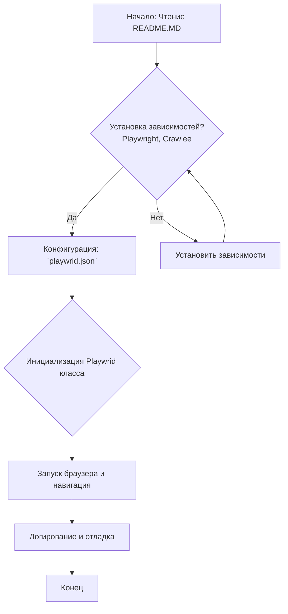

### **Системные инструкции для обработки кода проекта `hypotez`**

=========================================================================================

Описание функциональности и правил для генерации, анализа и улучшения кода. Направлено на обеспечение последовательного и читаемого стиля кодирования, соответствующего требованиям.

---

### **Основные принципы**

#### **1. Общие указания**:
- Соблюдай четкий и понятный стиль кодирования.
- Все изменения должны быть обоснованы и соответствовать установленным требованиям.

#### **2. Комментарии**:
- Используй `#` для внутренних комментариев.
- Документация всех функций, методов и классов должна следовать такому формату: 
    ```python
        def function(param: str, param1: Optional[str | dict | str] = None) -> dict | None:
            """ 
            Args:
                param (str): Описание параметра `param`.
                param1 (Optional[str | dict | str], optional): Описание параметра `param1`. По умолчанию `None`.
    
            Returns:
                dict | None: Описание возвращаемого значения. Возвращает словарь или `None`.
    
            Raises:
                SomeError: Описание ситуации, в которой возникает исключение `SomeError`.

            Ехаmple:
                >>> function('param', 'param1')
                {'param': 'param1'}
            """
    ```
- Комментарии и документация должны быть четкими, лаконичными и точными.

#### **3. Форматирование кода**:
- Используй одинарные кавычки. `a:str = 'value'`, `print('Hello World!')`;
- Добавляй пробелы вокруг операторов. Например, `x = 5`;
- Все параметры должны быть аннотированы типами. `def function(param: str, param1: Optional[str | dict | str] = None) -> dict | None:`;
- Не используй `Union`. Вместо этого используй `|`.

#### **4. Логирование**:
- Для логгирования Всегда Используй модуль `logger` из `src.logger.logger`.
- Ошибки должны логироваться с использованием `logger.error`.
Пример:
    ```python
        try:
            ...
        except Exception as ex:
            logger.error('Error while processing data', ех, exc_info=True)
    ```
#### **5 Не используй `Union[]` в коде. Вместо него используй `|`
Например:
```python
x: str | int ...
```


---

### **Основные требования**:

#### **1. Формат ответов в Markdown**:
- Все ответы должны быть выполнены в формате **Markdown**.

#### **2. Формат комментариев**:
- Используй указанный стиль для комментариев и документации в коде.
- Пример:

```python
from typing import Generator, Optional, List
from pathlib import Path


def read_text_file(
    file_path: str | Path,
    as_list: bool = False,
    extensions: Optional[List[str]] = None,
    chunk_size: int = 8192,
) -> Generator[str, None, None] | str | None:
    """
    Считывает содержимое файла (или файлов из каталога) с использованием генератора для экономии памяти.

    Args:
        file_path (str | Path): Путь к файлу или каталогу.
        as_list (bool): Если `True`, возвращает генератор строк.
        extensions (Optional[List[str]]): Список расширений файлов для чтения из каталога.
        chunk_size (int): Размер чанков для чтения файла в байтах.

    Returns:
        Generator[str, None, None] | str | None: Генератор строк, объединенная строка или `None` в случае ошибки.

    Raises:
        Exception: Если возникает ошибка при чтении файла.

    Example:
        >>> from pathlib import Path
        >>> file_path = Path('example.txt')
        >>> content = read_text_file(file_path)
        >>> if content:
        ...    print(f'File content: {content[:100]}...')
        File content: Example text...
    """
    ...
```
- Всегда делай подробные объяснения в комментариях. Избегай расплывчатых терминов, 
- таких как *«получить»* или *«делать»*. Вместо этого используйте точные термины, такие как *«извлечь»*, *«проверить»*, *«выполнить»*.
- Вместо: *«получаем»*, *«возвращаем»*, *«преобразовываем»* используй имя объекта *«функция получае»*, *«переменная возвращает»*, *«код преобразовывает»* 
- Комментарии должны непосредственно предшествовать описываемому блоку кода и объяснять его назначение.

#### **3. Пробелы вокруг операторов присваивания**:
- Всегда добавляйте пробелы вокруг оператора `=`, чтобы повысить читаемость.
- Примеры:
  - **Неправильно**: `x=5`
  - **Правильно**: `x = 5`

#### **4. Использование `j_loads` или `j_loads_ns`**:
- Для чтения JSON или конфигурационных файлов замените стандартное использование `open` и `json.load` на `j_loads` или `j_loads_ns`.
- Пример:

```python
# Неправильно:
with open('config.json', 'r', encoding='utf-8') as f:
    data = json.load(f)

# Правильно:
data = j_loads('config.json')
```

#### **5. Сохранение комментариев**:
- Все существующие комментарии, начинающиеся с `#`, должны быть сохранены без изменений в разделе «Улучшенный код».
- Если комментарий кажется устаревшим или неясным, не изменяйте его. Вместо этого отметьте его в разделе «Изменения».

#### **6. Обработка `...` в коде**:
- Оставляйте `...` как указатели в коде без изменений.
- Не документируйте строки с `...`.
```

#### **7. Аннотации**
Для всех переменных должны быть определены аннотации типа. 
Для всех функций все входные и выходные параметры аннотириваны
Для все параметров должны быть аннотации типа.


### **8. webdriver**
В коде используется webdriver. Он импртируется из модуля `webdriver` проекта `hypotez`
```python
from src.webdirver import Driver, Chrome, Firefox, Playwright, ...
driver = Driver(Firefox)

Пoсле чего может использоваться как

close_banner = {
  "attribute": null,
  "by": "XPATH",
  "selector": "//button[@id = 'closeXButton']",
  "if_list": "first",
  "use_mouse": false,
  "mandatory": false,
  "timeout": 0,
  "timeout_for_event": "presence_of_element_located",
  "event": "click()",
  "locator_description": "Закрываю pop-up окно, если оно не появилось - не страшно (`mandatory`:`false`)"
}

result = driver.execute_locator(close_banner)
```

## Анализ кода `hypotez/src/webdriver/playwright/README.MD`

### 1. Блок-схема



**Описание блок-схемы:**

1.  **Начало**: Описывает начало процесса, который начинается с чтения файла `README.MD`.
2.  **Установка зависимостей**: Проверяет, установлены ли необходимые библиотеки (Playwright, Crawlee). Если нет, переходит к шагу установки.
3.  **Конфигурация**: Настройка Playwright Crawler через файл `playwrid.json`.
4.  **Инициализация Playwrid класса**: Создание экземпляра класса `Playwrid` с возможностью передачи дополнительных параметров.
5.  **Запуск браузера и навигация**: Запуск браузера и переход на указанный URL.
6.  **Логирование и отладка**: Ведение логов для отслеживания ошибок и общей информации.
7.  **Конец**: Завершение процесса.

### 2. Диаграмма зависимостей

Данный `README.MD` файл не содержит кода, который можно представить в виде диаграммы зависимостей `mermaid`. Здесь описывается структура модуля, его конфигурация и использование, но нет импортов или зависимостей, которые можно визуализировать.

### 3. Объяснение

#### Общее описание

Файл `README.MD` предоставляет документацию для модуля `src.webdriver.playwright`, который является пользовательской реализацией веб-скрапера на основе библиотеки Playwright. Он описывает ключевые особенности, требования, конфигурацию и примеры использования данного модуля.

#### Основные разделы и их назначение

*   **module:: src.webdriver.playwright**: Указывает, что это документация для модуля `src.webdriver.playwright`.
*   **Playwright Crawler Module for Browser Automation**: Заголовок, описывающий назначение модуля.
*   **Key Features**: Перечисляет основные возможности модуля, такие как централизованная конфигурация, поддержка пользовательских опций, логирование и поддержка прокси.
*   **Requirements**: Описывает необходимые зависимости, такие как Python, Playwright и Crawlee, а также команды для их установки.
*   **Configuration**: Подробно описывает структуру файла конфигурации `playwrid.json` и параметры, которые можно настроить (тип браузера, headless режим, опции командной строки, user-agent, настройки прокси, viewport, timeout и игнорирование HTTPS ошибок).
*   **Usage**: Приводит пример использования класса `Playwrid` для инициализации браузера и навигации по сайту.
*   **Logging and Debugging**: Описывает использование модуля логирования `src.logger` для отслеживания ошибок и отладки.
*   **License**: Указывает на лицензию MIT, под которой распространяется проект.

#### Отсутствующие элементы, которые обычно объясняются в коде

Поскольку это файл `README.MD`, в нем нет кода, который можно было бы анализировать с точки зрения импортов, классов, функций и переменных. В данном файле описываются общие принципы работы и конфигурации модуля.

#### Возможные улучшения

*   **Более подробные примеры**: Добавить примеры использования различных конфигурационных параметров.
*   **Инструкции по обработке исключений**: Предоставить примеры обработки исключений, которые могут возникнуть при работе с Playwright.
*   **Описание API**: Краткое описание основных методов класса `Playwrid` и их параметров.