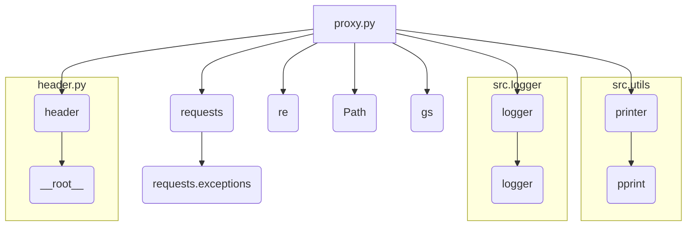
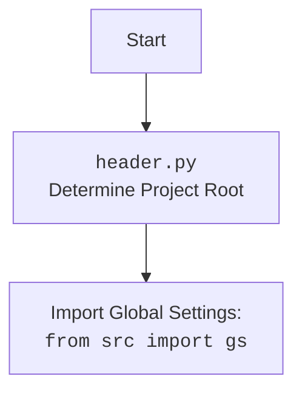

### **Системные инструкции для обработки кода проекта `hypotez`**

=========================================================================================

Описание функциональности и правил для генерации, анализа и улучшения кода. Направлено на обеспечение последовательного и читаемого стиля кодирования, соответствующего требованиям.

---

### **Основные принципы**

#### **1. Общие указания**:
- Соблюдай четкий и понятный стиль кодирования.
- Все изменения должны быть обоснованы и соответствовать установленным требованиям.

#### **2. Комментарии**:
- Используй `#` для внутренних комментариев.
- Документация всех функций, методов и классов должна следовать такому формату: 
    ```python
        def function(param: str, param1: Optional[str | dict | str] = None) -> dict | None:
            """ 
            Args:
                param (str): Описание параметра `param`.
                param1 (Optional[str | dict | str], optional): Описание параметра `param1`. По умолчанию `None`.
    
            Returns:
                dict | None: Описание возвращаемого значения. Возвращает словарь или `None`.
    
            Raises:
                SomeError: Описание ситуации, в которой возникает исключение `SomeError`.

            Ехаmple:
                >>> function('param', 'param1')
                {'param': 'param1'}
            """
    ```
- Комментарии и документация должны быть четкими, лаконичными и точными.

#### **3. Форматирование кода**:
- Используй одинарные кавычки. `a:str = 'value'`, `print('Hello World!')`;
- Добавляй пробелы вокруг операторов. Например, `x = 5`;
- Все параметры должны быть аннотированы типами. `def function(param: str, param1: Optional[str | dict | str] = None) -> dict | None:`;
- Не используй `Union`. Вместо этого используй `|`.

#### **4. Логирование**:
- Для логгирования Всегда Используй модуль `logger` из `src.logger.logger`.
- Ошибки должны логироваться с использованием `logger.error`.
Пример:
    ```python
        try:
            ...
        except Exception as ex:
            logger.error('Error while processing data', ех, exc_info=True)
    ```
#### **5 Не используй `Union[]` в коде. Вместо него используй `|`
Например:
```python
x: str | int ...
```


---

### **Основные требования**:

#### **1. Формат ответов в Markdown**:
- Все ответы должны быть выполнены в формате **Markdown**.

#### **2. Формат комментариев**:
- Используй указанный стиль для комментариев и документации в коде.
- Пример:

```python
from typing import Generator, Optional, List
from pathlib import Path


def read_text_file(
    file_path: str | Path,
    as_list: bool = False,
    extensions: Optional[List[str]] = None,
    chunk_size: int = 8192,
) -> Generator[str, None, None] | str | None:
    """
    Считывает содержимое файла (или файлов из каталога) с использованием генератора для экономии памяти.

    Args:
        file_path (str | Path): Путь к файлу или каталогу.
        as_list (bool): Если `True`, возвращает генератор строк.
        extensions (Optional[List[str]]): Список расширений файлов для чтения из каталога.
        chunk_size (int): Размер чанков для чтения файла в байтах.

    Returns:
        Generator[str, None, None] | str | None: Генератор строк, объединенная строка или `None` в случае ошибки.

    Raises:
        Exception: Если возникает ошибка при чтении файла.

    Example:
        >>> from pathlib import Path
        >>> file_path = Path('example.txt')
        >>> content = read_text_file(file_path)
        >>> if content:
        ...    print(f'File content: {content[:100]}...')
        File content: Example text...
    """
    ...
```
- Всегда делай подробные объяснения в комментариях. Избегай расплывчатых терминов, 
- таких как *«получить»* или *«делать»*. Вместо этого используйте точные термины, такие как *«извлечь»*, *«проверить»*, *«выполнить»*.
- Вместо: *«получаем»*, *«возвращаем»*, *«преобразовываем»* используй имя объекта *«функция получае»*, *«переменная возвращает»*, *«код преобразовывает»* 
- Комментарии должны непосредственно предшествовать описываемому блоку кода и объяснять его назначение.

#### **3. Пробелы вокруг операторов присваивания**:
- Всегда добавляйте пробелы вокруг оператора `=`, чтобы повысить читаемость.
- Примеры:
  - **Неправильно**: `x=5`
  - **Правильно**: `x = 5`

#### **4. Использование `j_loads` или `j_loads_ns`**:
- Для чтения JSON или конфигурационных файлов замените стандартное использование `open` и `json.load` на `j_loads` или `j_loads_ns`.
- Пример:

```python
# Неправильно:
with open('config.json', 'r', encoding='utf-8') as f:
    data = json.load(f)

# Правильно:
data = j_loads('config.json')
```

#### **5. Сохранение комментариев**:
- Все существующие комментарии, начинающиеся с `#`, должны быть сохранены без изменений в разделе «Улучшенный код».
- Если комментарий кажется устаревшим или неясным, не изменяйте его. Вместо этого отметьте его в разделе «Изменения».

#### **6. Обработка `...` в коде**:
- Оставляйте `...` как указатели в коде без изменений.
- Не документируйте строки с `...`.
```

#### **7. Аннотации**
Для всех переменных должны быть определены аннотации типа. 
Для всех функций все входные и выходные параметры аннотириваны
Для все параметров должны быть аннотации типа.


### **8. webdriver**
В коде используется webdriver. Он импртируется из модуля `webdriver` проекта `hypotez`
```python
from src.webdirver import Driver, Chrome, Firefox, Playwright, ...
driver = Driver(Firefox)

Пoсле чего может использоваться как

close_banner = {
  "attribute": null,
  "by": "XPATH",
  "selector": "//button[@id = 'closeXButton']",
  "if_list": "first",
  "use_mouse": false,
  "mandatory": false,
  "timeout": 0,
  "timeout_for_event": "presence_of_element_located",
  "event": "click()",
  "locator_description": "Закрываю pop-up окно, если оно не появилось - не страшно (`mandatory`:`false`)"
}

result = driver.execute_locator(close_banner)
```

## Анализ кода `hypotez/src/webdriver/proxy.py`

### 1. Блок-схема

```mermaid
graph LR
    A[Start] --> B{download_proxies_list()}
    B -- Success --> C{get_proxies_dict()}
    B -- Failure --> F[End: Прокси не загружены]
    C --> D{check_proxy(proxy)}
    D -- Proxy works --> E[Log: Прокси рабочий]
    D -- Proxy doesn't work --> G[Log: Прокси не рабочий]
    E --> H[End]
    G --> H
    H --> F
```

**Пример для каждого логического блока:**

*   **A (Start)**: Начало выполнения скрипта.
*   **B (download\_proxies\_list())**: Попытка загрузки списка прокси из URL.
    *   Пример: `download_proxies_list(url='https://raw.githubusercontent.com/proxifly/free-proxy-list/main/proxies/all/data.txt', save_path='/path/to/proxies.txt')`
*   **C (get\_proxies\_dict())**: Если загрузка успешна, парсинг списка прокси и распределение по типам (http, socks4, socks5).
    *   Пример: `proxies = get_proxies_dict(file_path='/path/to/proxies.txt')`
*   **D (check\_proxy(proxy))**: Проверка каждого прокси на работоспособность.
    *   Пример: `check_proxy(proxy={'protocol': 'http', 'host': '127.0.0.1', 'port': '8080'})`
*   **E (Log: Прокси рабочий)**: Логирование информации о рабочем прокси.
*   **G (Log: Прокси не рабочий)**: Логирование информации о нерабочем прокси.
*   **F (End: Прокси не загружены)**: Завершение скрипта, если прокси не были загружены.
*   **H (End)**: Завершение скрипта после проверки прокси.

### 2. Диаграмма



**Объяснение зависимостей:**

*   `requests`: Используется для выполнения HTTP-запросов для загрузки списка прокси и проверки их работоспособности. Импортируется модуль `requests.exceptions` для обработки исключений, связанных с запросами.
*   `re`: Используется для парсинга строк с прокси-адресами с помощью регулярных выражений.
*   `pathlib.Path`: Используется для определения путей к файлам, в частности к файлу со списком прокси.
*   `header`: Предположительно, содержит общие настройки и константы для проекта, в частности `__root__`, который определяет корень проекта.
*   `src.gs`: Импортируется для доступа к глобальным настройкам (global settings) проекта.
*   `src.utils.printer.pprint`: Используется для "pretty print" данных, возможно, для отладки или логирования.
*   `src.logger.logger`: Используется для логирования информации о процессе загрузки, парсинга и проверки прокси.

Дополнительный блок `mermaid` flowchart, объясняющий `header.py`:



### 3. Объяснение

**Импорты:**

*   `re`: Модуль для работы с регулярными выражениями, используется для парсинга строк прокси.
*   `requests`: Библиотека для отправки HTTP-запросов. Используется для загрузки списка прокси и проверки их работоспособности.
*   `requests.exceptions`: Подмодуль `requests`, содержащий исключения, которые могут возникнуть при выполнении запросов.
*   `pathlib.Path`: Класс для представления путей к файлам и директориям.
*   `typing`: Модуль для аннотации типов.
*   `header`: Локальный модуль, предположительно, содержащий общие переменные и настройки проекта, в частности `__root__`.
*   `header.__root__`: Переменная, представляющая корень проекта. Используется для определения пути к файлу `proxies.txt`.
*   `src.gs`: Модуль, содержащий глобальные настройки.
*   `src.utils.printer.pprint`: Функция для форматированного вывода данных.
*   `src.logger.logger`: Модуль для логирования.

**Функции:**

*   `download_proxies_list(url: str = url, save_path: Path = proxies_list_path) -> bool`:
    *   Аргументы:
        *   `url`: URL файла для загрузки (по умолчанию `url`, определенная в модуле).
        *   `save_path`: Путь для сохранения загруженного файла (по умолчанию `proxies_list_path`, определенный в модуле).
    *   Возвращаемое значение: `True` в случае успеха, `False` в случае ошибки.
    *   Назначение: Загружает файл со списком прокси с указанного URL и сохраняет его в указанный путь.
    *   Пример: `download_proxies_list(url='https://example.com/proxies.txt', save_path='/tmp/proxies.txt')`

*   `get_proxies_dict(file_path: Path = proxies_list_path) -> Dict[str, List[Dict[str, Any]]]`:
    *   Аргументы:
        *   `file_path`: Путь к файлу со списком прокси (по умолчанию `proxies_list_path`).
    *   Возвращаемое значение: Словарь, где ключи - типы прокси (`http`, `socks4`, `socks5`), а значения - списки словарей с информацией о каждом прокси (protocol, host, port).
    *   Назначение: Парсит файл со списком прокси и организует их в словарь по типам.
    *   Пример: `proxies = get_proxies_dict(file_path='/tmp/proxies.txt')`

*   `check_proxy(proxy: dict) -> bool`:
    *   Аргументы:
        *   `proxy`: Словарь с информацией о прокси (`host`, `port`, `protocol`).
    *   Возвращаемое значение: `True`, если прокси работает, `False` в противном случае.
    *   Назначение: Проверяет работоспособность прокси-сервера, отправляя через него запрос на `https://httpbin.org/ip`.
    *   Пример: `check_proxy({'protocol': 'http', 'host': '127.0.0.1', 'port': '8080'})`

**Переменные:**

*   `url: str`: URL, из которого загружается список прокси.
*   `proxies_list_path: Path`: Путь к файлу, в который сохраняется список прокси.

**Потенциальные ошибки и области для улучшения:**

*   В функциях `download_proxies_list` и `get_proxies_dict` присутствует `...` в блоках `except`, что означает, что обработка исключений неполная. Необходимо добавить логику обработки исключений (например, повторные попытки, логирование ошибки и т.д.).
*   В функции `get_proxies_dict` выполняется `download_proxies_list()` каждый раз при вызове.  Возможно, стоит вынести этот вызов в другое место, чтобы список прокси загружался только один раз.
*   Не используется функционал `src.gs`. Следует проверить, нужно ли использовать глобальные настройки в этом модуле.
*   `parse_proxies` вызывается в main, но она не определена нигде. Очевидно тут опечатка и имелось ввиду `get_proxies_dict`.

**Взаимосвязи с другими частями проекта:**

*   Модуль использует `header` для определения корневой директории проекта, что позволяет находить файл со списком прокси.
*   Модуль использует `src.logger.logger` для логирования информации о процессе загрузки, парсинга и проверки прокси.
*   Потенциально использует `src.gs` для получения глобальных настроек, хотя в текущей версии кода это не реализовано.
*   Результаты работы модуля (список прокси) могут использоваться другими модулями проекта, например, для настройки `webdriver` для обхода блокировок.