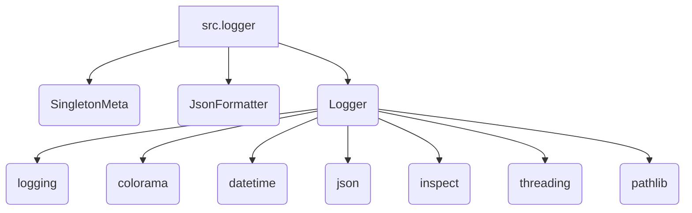

### Анализ кода модуля `hypotez/src/logger/README.MD`

Этот файл, `hypotez/src/logger/README.MD`, представляет собой документацию в формате Markdown для модуля `src.logger`. Он содержит обзор модуля, описание классов и функций, примеры использования и настройки логирования.

### 1. Блок-схема

Поскольку предоставленный код — это файл документации, а не исполняемый код Python, я создам блок-схему, отражающую структуру и назначение модуля `src.logger` в целом.

```mermaid
graph TD
    A[Начало: Описание модуля src.logger] --> B{Обзор: Назначение, классы, форматы};
    B --> C{Классы: SingletonMeta, JsonFormatter, Logger};
    C --> D{SingletonMeta: Реализация Singleton pattern};
    C --> E{JsonFormatter: Форматирование в JSON};
    C --> F{Logger: Основной класс логирования};
    F --> G{Инициализация логгеров (console, file, json)};
    F --> H{Настройка уровней логирования (DEBUG, INFO, ...)};
    F --> I{Определение форматов вывода (formatter)};
    F --> J{Методы логирования (info, error, debug, ...)};
    B --> K{Конфигурация: Уровни логирования, форматирование, цвета};
    B --> L{Примеры использования};
    L --> M[Инициализация логгера];
    L --> N[Логирование сообщений разных уровней];
    L --> O[Настройка цветов сообщений];
    K --> P[Завершение];
    J --> P;
    I --> P;
    D --> F;
    E --> F;
```

**Примеры для логических блоков:**

*   **A**: Начало документации модуля `src.logger`.
*   **B**: Описание модуля, перечисление основных классов и форматов логирования.
*   **C**: Перечисление классов, используемых в модуле.
*   **D**: Объяснение реализации паттерна Singleton.
*   **E**: Описание кастомного форматтера JSON.
*   **F**: Описание основного класса логгера `Logger`.
*   **G**: Инициализация логгеров (консольного, файлового, JSON).
*   **H**: Настройка уровней логирования (DEBUG, INFO, ERROR, и т. д.).
*   **I**: Определение форматтеров для вывода логов.
*   **J**: Описание методов логирования (`info`, `error`, `debug`, и т. д.).
*   **K**: Конфигурация уровней логирования, форматирования и цветов.
*   **L**: Примеры инициализации логгера и логирования сообщений.
*   **M**: Пример инициализации логгера: `logger: Logger = Logger()`
*   **N**: Примеры логирования сообщений разных уровней: `logger.info("Сообщение")`, `logger.error("Ошибка")`.
*   **O**: Пример настройки цветов сообщений: `logger.info("Сообщение", colors=(colorama.Fore.GREEN, colorama.Back.BLACK))`
*   **P**: Завершение документации.

### 2. Диаграмма



**Объяснение зависимостей:**

*   **`src.logger`**: Основной модуль логирования.

    *   Зависит от:
        *   `SingletonMeta`: Метакласс для реализации паттерна Singleton.
        *   `JsonFormatter`: Кастомный форматтер для логирования в JSON.
        *   `Logger`: Основной класс логгера.
*   **`Logger`**: Класс логгера.

    *   Зависит от:
        *   `logging`: Стандартная библиотека Python для логирования.
        *   `colorama`: Для добавления цветов в консольные логи.
        *   `datetime`: Для добавления информации о времени в логи.
        *   `json`: Для форматирования логов в JSON.
        *   `inspect`: Для получения информации о стеке вызовов и функциях.
        *   `threading`: Для обеспечения потокобезопасности.
        *   `pathlib`:  Для работы с путями файловой системы
        *    `header`: Для получения корневого пути проекта.
        *    `types.SimpleNamespace`: Для создания объектов на основе словаря

### 3. Объяснение

**Общее:**

Модуль `src.logger` предоставляет настраиваемую систему логирования для Python-проектов. Он позволяет записывать сообщения в консоль и файлы, поддерживая различные уровни детализации и форматы вывода. В частности, модуль реализует паттерн Singleton для обеспечения единственного экземпляра логгера в системе, а также поддерживает цветное выделение сообщений в консоли.

**Основные компоненты:**

*   **SingletonMeta**: Метакласс, обеспечивающий создание только одного экземпляра класса `Logger`.
*   **JsonFormatter**: Класс, форматирующий логи в формате JSON.
*   **Logger**: Основной класс, предоставляющий методы для записи логов с разным уровнем важности.

**Функции:**

*   `__init__`: Конструктор класса `Logger`, инициализирует основные параметры логирования (пути к файлам, уровни логирования, форматтеры).
*   `_configure_logger`: Функция, создающая и настраивающая отдельные логгеры для различных целей (консоль, файлы).
*   `initialize_loggers`: Функция, инициализирующая все логгеры (консольный и файловые) с определенными настройками.
*   `log`: Основная функция для записи логов с разными уровнями важности.
*   `info`, `success`, `warning`, `debug`, `error`, `critical`: Вспомогательные функции для записи логов с предопределенными уровнями и цветами.

**Переменные:**

*   **TEXT\_COLORS**: Словарь, содержащий соответствия между именами цветов и их кодами для текста.
*   **BG\_COLORS**: Словарь, содержащий соответствия между именами цветов и их кодами для фона.
*   **LOG\_SYMBOLS**: Словарь, содержащий соответствия между уровнями логирования и символами Unicode.

**Потенциальные ошибки и области для улучшения:**

*   **Отсутствие обработки исключений**:  В коде отсутствуют явные блоки `try...except` для обработки возможных исключений при создании файлов или при работе с файловой системой.
*   **Жестко заданные пути**: Пути к файлам логирования жестко заданы в коде. Было бы полезно сделать их конфигурируемыми.
* **Недостаточная гибкость в настройке форматов** В текущей реализации настройка форматов ограничена `JsonFormatter`. Было бы неплохо добавить возможность настройки форматов для других обработчиков

**Взаимосвязи с другими частями проекта:**

Модуль `src.logger` является центральным компонентом системы логирования в проекте `hypotez`. Другие модули и компоненты проекта используют класс `Logger` для записи сообщений о работе, ошибках и других событиях.