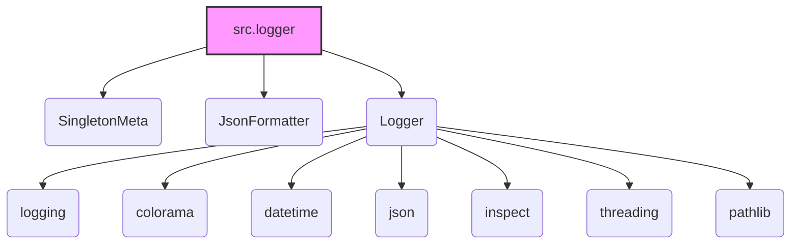

### Анализ кода модуля `hypotez/src/logger/README.MD`

```rst
.. module:: src.logger
```

Текстовый файл представляет собой документацию модуля `src.logger` на русском языке. Он описывает структуру, назначение и способы использования модуля. Также присутствуют ссылки на английскую версию документации и на корень проекта.

### 1. Блок-схема

Поскольку представлен файл с документацией, а не исполняемый код, блок-схема будет описывать структуру модуля и процесс логирования в целом.

```mermaid
graph TD
    A[Начало: Описание модуля src.logger] --> B{Инициализация Logger};
    B --> C{Настройка обработчиков (handlers): Console, File, JSON};
    C --> D{Установка уровней логирования (INFO, DEBUG, ERROR и т.д.)};
    D --> E{Форматирование сообщений: Текст, JSON};
    E --> F[Вызов метода логирования (info, debug, error, critical)];
    F --> G{Определение уровня сообщения};
    G --> H{Выбор соответствующего обработчика};
    H --> I[Форматирование сообщения];
    I --> J[Запись сообщения в лог];
    J --> K[Завершение];
```

**Примеры для каждого логического блока:**

*   **B (Инициализация Logger)**: Создание экземпляра класса Logger.
*   **C (Настройка обработчиков)**: Определение обработчиков для логирования в консоль, файл, JSON.
*   **D (Установка уровней логирования)**: Установка уровней важности для каждого обработчика (например, DEBUG для отладочного файла, ERROR для файла с ошибками).
*   **E (Форматирование сообщений)**: Определение формата вывода сообщений (текстовый, JSON).
*   **F (Вызов метода логирования)**: Вызов методов `info`, `debug`, `error` и т.д. для записи сообщения в лог.
*   **G (Определение уровня сообщения)**: Определение уровня важности сообщения (INFO, DEBUG, ERROR, CRITICAL).
*   **H (Выбор соответствующего обработчика)**: Выбор обработчиков, соответствующих уровню сообщения.
*   **I (Форматирование сообщения)**: Форматирование сообщения в соответствии с выбранным форматом (текст или JSON).
*   **J (Запись сообщения в лог)**: Запись отформатированного сообщения в соответствующий лог (консоль, файл).

### 2. Диаграмма



**Объяснение зависимостей:**

*   **`src.logger`**: Основной модуль логирования.

    *   Зависит от:
        *   `SingletonMeta`: Метакласс для реализации паттерна Singleton.
        *   `JsonFormatter`: Кастомный форматтер для логирования в JSON.
        *   `Logger`: Основной класс логгера.
*   **`Logger`**: Класс логгера.

    *   Зависит от:
        *   `logging`: Стандартная библиотека Python для логирования.
        *   `colorama`: Для добавления цветов в консольные логи.
        *   `datetime`: Для работы с датой и временем.
        *   `json`: Для работы с JSON-форматом.
        *   `inspect`: Для получения информации о стеке вызовов и функциях.
        *   `threading`: Для обеспечения потокобезопасности.
        *   `pathlib`: Для работы с путями к файлам.

### 3. Объяснение

**Общее:**

Модуль `src.logger` предоставляет настраиваемую систему логирования для Python-приложений в проекте `hypotez`. Основной целью является предоставление гибкого и удобного способа записи информации о работе приложения, обнаруженных ошибках и отладочной информации в различные места назначения (консоль, файлы различных уровней, JSON-файл).

**Основные компоненты:**

*   **SingletonMeta**: Метакласс, гарантирующий, что у класса `Logger` будет только один экземпляр.
*   **JsonFormatter**: Класс, предназначенный для форматирования сообщений журнала в формат JSON.
*   **Logger**: Основной класс, предоставляющий интерфейс для выполнения различных операций логирования.

**Функции:**

*   `_configure_logger(name: str, log_path: str, level: Optional[int] = logging.DEBUG, formatter: Optional[logging.Formatter] = None, mode: Optional[str] = 'a') -> logging.Logger`:
    *   **Аргументы:**

        *   `name` (str): Имя логгера.
        *   `log_path` (str): Путь к файлу логов.
        *   `level` (Optional[int]): Уровень логирования (например, `logging.DEBUG`). По умолчанию `logging.DEBUG`.
        *   `formatter` (Optional[logging.Formatter]): Кастомный форматтер (опционально).
        *   `mode` (Optional[str]): Режим работы с файлом, например, `'a'` для добавления в конец файла (по умолчанию).
    *   **Возвращает**:

        *   `logging.Logger`: Настроенный экземпляр логгера.
    *   **Назначение**:

        Конфигурирует и возвращает настроенный экземпляр логгера с заданным именем, уровнем, форматтером и режимом работы с файлом.

*   `initialize_loggers(info_log_path: Optional[str] = '', debug_log_path: Optional[str] = '', errors_log_path: Optional[str] = '', json_log_path: Optional[str] = '')`:
    *   **Аргументы:**

        *   `info_log_path` (Optional[str]): Путь к файлу для информационных логов.
        *   `debug_log_path` (Optional[str]): Путь к файлу для отладочных логов.
        *   `errors_log_path` (Optional[str]): Путь к файлу для логов ошибок.
        *   `json_log_path` (Optional[str]): Путь к файлу для логов в формате JSON.
    *   **Возвращает**:

        *   None
    *   **Назначение**:

        Инициализирует различные логгеры (консольный, файловые, JSON) с указанными путями и уровнями логирования.

*   `log(level, message, ex=None, exc_info=False, color=None)`:
    *   **Аргументы:**

        *   `level`: Уровень логирования (например, logging.INFO, logging.DEBUG).
        *   `message`: Сообщение для логирования.
        *   `ex`: Исключение для логирования (опционально).
        *   `exc_info`: Флаг, указывающий, нужно ли включать информацию об исключении (по умолчанию False).
        *   `color`: Кортеж, содержащий цвета текста и фона для консольного вывода (опционально).
    *   **Возвращает**:

        *   None
    *   **Назначение**:

        Общий метод для логирования сообщений на указанном уровне с возможным добавлением информации об исключении и цветовым форматированием.

*   `info(message, ex=None, exc_info=False, colors: Optional[tuple] = None)`:
    *   **Аргументы**:
        *   `message`: Текст сообщения.
        *   `ex`: Исключение для логирования (опционально).
        *   `exc_info`: Флаг, указывающий, нужно ли включать информацию об исключении (по умолчанию False).
        *   `colors`: Кортеж, содержащий цвета текста и фона для консольного вывода (опционально).
    *   **Возвращает**:
        *   None
    *   **Назначение**:

        Регистрирует сообщение с уровнем `INFO`.

*   `success(message, ex=None, exc_info=False, colors: Optional[tuple] = None)`:
     *   **Аргументы**:
        *   `message`: Текст сообщения.
        *   `ex`: Исключение для логирования (опционально).
        *   `exc_info`: Флаг, указывающий, нужно ли включать информацию об исключении (по умолчанию False).
        *   `colors`: Кортеж, содержащий цвета текста и фона для консольного вывода (опционально).
    *   **Возвращает**:
        *   None
    *   **Назначение**:

        Регистрирует сообщение с уровнем `SUCCESS`.
*   `warning(message, ex=None, exc_info=False, colors: Optional[tuple] = None)`:
     *   **Аргументы**:
        *   `message`: Текст сообщения.
        *   `ex`: Исключение для логирования (опционально).
        *   `exc_info`: Флаг, указывающий, нужно ли включать информацию об исключении (по умолчанию False).
        *   `colors`: Кортеж, содержащий цвета текста и фона для консольного вывода (опционально).
    *   **Возвращает**:
        *   None
    *   **Назначение**:

        Регистрирует сообщение с уровнем `WARNING`.

*   `debug(message, ex=None, exc_info=True, colors: Optional[tuple] = None)`:
     *   **Аргументы**:
        *   `message`: Текст сообщения.
        *   `ex`: Исключение для логирования (опционально).
        *   `exc_info`: Флаг, указывающий, нужно ли включать информацию об исключении (по умолчанию True).
        *   `colors`: Кортеж, содержащий цвета текста и фона для консольного вывода (опционально).
    *   **Возвращает**:
        *   None
    *   **Назначение**:

        Регистрирует сообщение с уровнем `DEBUG`.

*   `error(message, ex=None, exc_info=True, colors: Optional[tuple] = None)`:
     *   **Аргументы**:
        *   `message`: Текст сообщения.
        *   `ex`: Исключение для логирования (опционально).
        *   `exc_info`: Флаг, указывающий, нужно ли включать информацию об исключении (по умолчанию True).
        *   `colors`: Кортеж, содержащий цвета текста и фона для консольного вывода (опционально).
    *   **Возвращает**:
        *   None
    *   **Назначение**:

        Регистрирует сообщение с уровнем `ERROR`.

*   `critical(message, ex=None, exc_info=True, colors: Optional[tuple] = None)`:
     *   **Аргументы**:
        *   `message`: Текст сообщения.
        *   `ex`: Исключение для логирования (опционально).
        *   `exc_info`: Флаг, указывающий, нужно ли включать информацию об исключении (по умолчанию True).
        *   `colors`: Кортеж, содержащий цвета текста и фона для консольного вывода (опционально).
    *   **Возвращает**:
        *   None
    *   **Назначение**:

        Регистрирует сообщение с уровнем `CRITICAL`.

**Переменные:**

*   `TEXT_COLORS`: Словарь, содержащий соответствия между названиями цветов текста и кодами цветов `colorama`.
*   `BG_COLORS`: Словарь, содержащий соответствия между названиями цветов фона и кодами цветов `colorama`.
*   `LOG_SYMBOLS`: Словарь, содержащий соответствия между уровнями логирования и символами Unicode.
*    `logger`: Объект класса Logger, предназначенный для логирования
**Потенциальные ошибки и области для улучшения:**

*   **Обработка исключений**:  В коде не предусмотрена явная обработка исключений, которые могут возникнуть при создании файлов или при попытке записи в них.
*   **Недостаточная гибкость в настройке форматов** В текущей реализации настройка форматов ограничена `JsonFormatter`. Было бы неплохо добавить возможность настройки форматов для других обработчиков
*   **Конфигурируемость**: Пути к файлам логирования и параметры логирования заданы в коде. Следует пересмотреть возможность конфигурирования, например через переменные окружения или отдельные конфигурационные файлы
*  **Предустановка  `info_log_path`, `debug_log_path`, `errors_log_path`, `json_log_path`**  Все пути, куда записывается лог,  задаются при инициализации.  Отсутствует возможность изменить их.

**Взаимосвязи с другими частями проекта:**

Модуль `src.logger` является центральным компонентом подсистемы логирования в проекте `hypotez`.  Он используется для записи диагностической информации во всех частях приложения, предоставляя удобный и единообразный способ отслеживания работы системы, обнаружения и отладки ошибок.  Наличие модуля `header` говорит о том, что здесь приняты соглашения о стиле и структуре проекта