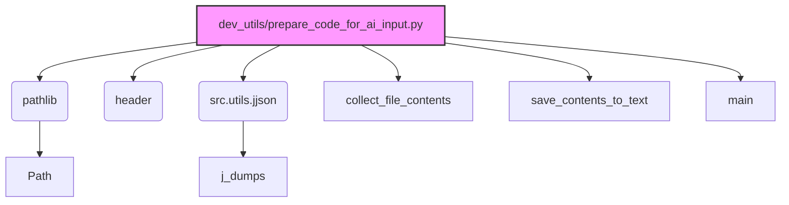

### **Анализ кода `hypotez/toolbox/prepare_code_for_ai_input.py.md`**

=========================================================================================

Описание функциональности и правил для генерации, анализа и улучшения кода. Направлено на обеспечение последовательного и читаемого стиля кодирования, соответствующего требованиям.

---

### **Основные принципы**

#### **1. Общие указания**:

*   Соблюдай четкий и понятный стиль кодирования.
*   Все изменения должны быть обоснованы и соответствовать установленным требованиям.

#### **2. Комментарии**:

*   Используй `#` для внутренних комментариев.
*   Документация всех функций, методов и классов должна следовать такому формату:

    ```python
    def function(param: str, param1: Optional[str | dict | str] = None) -> dict | None:
        """ 
        Args:
            param (str): Описание параметра `param`.
            param1 (Optional[str | dict | str], optional): Описание параметра `param1`. По умолчанию `None`.
    
        Returns:
            dict | None: Описание возвращаемого значения. Возвращает словарь или `None`.
    
        Raises:
            SomeError: Описание ситуации, в которой возникает исключение `SomeError`.

        Ехаmple:
            >>> function('param', 'param1')
            {'param': 'param1'}
        """
    ```

*   Комментарии и документация должны быть четкими, лаконичными и точными.

#### **3. Форматирование кода**:

*   Используй одинарные кавычки. `a:str = 'value'`, `print('Hello World!')`;
*   Добавляй пробелы вокруг операторов. Например, `x = 5`;
*   Все параметры должны быть аннотированы типами. `def function(param: str, param1: Optional[str | dict | str] = None) -> dict | None:`;
*   Не используй `Union`. Вместо этого используй `|`.

#### **4. Логирование**:

*   Для логгирования Всегда Используй модуль `logger` из `src.logger.logger`.
*   Ошибки должны логироваться с использованием `logger.error`.
    Пример:

    ```python
    try:
        ...
    except Exception as ex:
        logger.error('Error while processing data', ех, exc_info=True)
    ```

#### **5 Не используй `Union[]` в коде. Вместо него используй `|`**

Например:

```python
x: str | int ...
```

---

### **Основные требования**:

#### **1. Формат ответов в Markdown**:

*   Все ответы должны быть выполнены в формате **Markdown**.

#### **2. Формат комментариев**:

*   Используй указанный стиль для комментариев и документации в коде.
*   Пример:

```python
from typing import Generator, Optional, List
from pathlib import Path


def read_text_file(
    file_path: str | Path,
    as_list: bool = False,
    extensions: Optional[List[str]] = None,
    chunk_size: int = 8192,
) -> Generator[str, None, None] | str | None:
    """
    Считывает содержимое файла (или файлов из каталога) с использованием генератора для экономии памяти.

    Args:
        file_path (str | Path): Путь к файлу или каталогу.
        as_list (bool): Если `True`, возвращает генератор строк.
        extensions (Optional[List[str]]): Список расширений файлов для чтения из каталога.
        chunk_size (int): Размер чанков для чтения файла в байтах.

    Returns:
        Generator[str, None, None] | str | None: Генератор строк, объединенная строка или `None` в случае ошибки.

    Raises:
        Exception: Если возникает ошибка при чтении файла.

    Example:
        >>> from pathlib import Path
        >>> file_path = Path('example.txt')
        >>> content = read_text_file(file_path)
        >>> if content:
        ...    print(f'File content: {content[:100]}...')
        File content: Example text...
    """
    ...
```

*   Всегда делай подробные объяснения в комментариях. Избегай расплывчатых терминов,
*   таких как *«получить»* или *«делать»*
*    . Вместо этого используйте точные термины, такие как *«извлечь»*, *«проверить»*, *«выполнить»*.
*   Вместо: *«получаем»*, *«возвращаем»*, *«преобразовываем»* используй имя объекта *«функция получае»*, *«переменная возвращает»*, *«код преобразовывает»*
*   Комментарии должны непосредственно предшествовать описываемому блоку кода и объяснять его назначение.

#### **3. Пробелы вокруг операторов присваивания**:

*   Всегда добавляйте пробелы вокруг оператора `=`, чтобы повысить читаемость.
*   Примеры:

    *   **Неправильно**: `x=5`
    *   **Правильно**: `x = 5`

#### **4. Использование `j_loads` или `j_loads_ns`**:

*   Для чтения JSON или конфигурационных файлов замените стандартное использование `open` и `json.load` на `j_loads` или `j_loads_ns`.
*   Пример:

```python
# Неправильно:
with open('config.json', 'r', encoding='utf-8') as f:
    data = json.load(f)

# Правильно:
data = j_loads('config.json')
```

#### **5. Сохранение комментариев**:

*   Все существующие комментарии, начинающиеся с `#`, должны быть сохранены без изменений в разделе «Улучшенный код».
*   Если комментарий кажется устаревшим или неясным, не изменяйте его. Вместо этого отметьте его в разделе «Изменения».

#### **6. Обработка `...` в коде**:

*   Оставляйте `...` как указатели в коде без изменений.
*   Не документируйте строки с `...`.

```
#### **7. Аннотации**
```

*   Для всех переменных должны быть определены аннотации типа.
*   Для всех функций все входные и выходные параметры аннотириваны
*   Для все параметров должны быть аннотации типа.

### **8. webdriver**

В коде используется webdriver. Он импртируется из модуля `webdriver` проекта `hypotez`

```python
from src.webdirver import Driver, Chrome, Firefox, Playwright, ...

driver = Driver(Firefox)

Пoсле чего может использоваться как

close_banner = {
  "attribute": null,
  "by": "XPATH",
  "selector": "//button[@id = 'closeXButton']",
  "if_list": "first",
  "use_mouse": false,
  "mandatory": false,
  "timeout": 0,
  "timeout_for_event": "presence_of_element_located",
  "event": "click()",
  "locator_description": "Закрываю pop-up окно, если оно не появилось - не страшно (`mandatory`:`false`)"
}

result = driver.execute_locator(close_banner)
```
```

### **Анализ кода модуля `prepare_code_for_ai_input.py.md`**

#### **1. Блок-схема**

```mermaid
graph TD
    A[Начало] --> B{Указание исходной директории и целевой директории};
    B --> C{collect_file_contents(directory, target_directory)};
    C --> D{Итерация по элементам директории};
    D --> E{Элемент - директория?};
    E -- Да --> F{Исключена директория?};
    F -- Нет --> G[Рекурсивный вызов collect_file_contents()];
    F -- Да --> D;
    E -- Нет --> H{Элемент - файл с нужным расширением?};
    H -- Да --> I[Чтение содержимого файла];
    I --> J[Сохранение содержимого в словарь];
    H -- Нет --> D;
    D --> K{Итерация завершена?};
    K -- Да --> L[save_contents_to_text(contents, output_file)];
    K -- Нет --> D;
    L --> M{Открытие output_file для записи};
    M --> N{Итерация по словарю с содержимым файлов};
    N --> O[Запись пути файла и содержимого в output_file];
    O --> P{Разделитель между файлами};
    P --> N;
    N --> Q{Итерация завершена?};
    Q -- Да --> R[Завершение];
```

**Примеры для каждого логического блока:**

*   **A (Начало)**:
    *   Указание пути к директории `src` и целевой директории `prod`.
*   **C (collect\_file\_contents(directory, target\_directory))**:
    *   Вызов функции для сбора содержимого файлов.
*   **D (Итерация по элементам директории)**:
    *   Цикл `for item in directory.iterdir():`
*   **E (Элемент - директория?)**:
    *   Условие `if item.is_dir():`
*   **F (Исключена директория?)**:
    *   Условие `if item.name not in [...] and not item.name.startswith(...) and '*' not in item.name:`
*   **G (Рекурсивный вызов collect\_file\_contents())**:
    *   Вызов `collect_file_contents(item, target_directory)`
*   **H (Элемент - файл с нужным расширением?)**:
    *   Условие `if (item.suffix in [...] and not item.name.startswith(...) and '*' not in item.name and '(' not in item.name and ')' not in item.name):`
*   **I (Чтение содержимого файла)**:
    *   `with item.open('r', encoding='utf-8') as file: contents[str(item)] = file.read()`
*   **J (Сохранение содержимого в словарь)**:
    *   `contents[str(item)] = file.read()`
*   **L (save\_contents\_to\_text(contents, output\_file))**:
    *   Вызов функции для сохранения содержимого в файл.
*   **M (Открытие output\_file для записи)**:
    *   `with output_file.open('w', encoding='utf-8') as f:`
*   **N (Итерация по словарю с содержимым файлов)**:
    *   Цикл `for path, content in contents.items():`
*   **O (Запись пути файла и содержимого в output\_file)**:
    *   `f.write(f"File: {path}\n")` и `f.write(content)`
*   **P (Разделитель между файлами)**:
    *   `f.write("\\n" + "="*80 + "\\n\\n")`

### 2. Диаграмма



#### Объяснение зависимостей:

*   `pathlib`: Используется для работы с файловыми путями.
*   `header`: Предположительно, содержит информацию о проекте, включая корневой путь.
*   `src.utils.jjson`: Используется для сериализации данных в формате JSON.

### 3. Объяснение

#### Импорты:

*   `header`: Модуль, содержащий информацию о проекте, включая корневой путь.
*   `pathlib`: Модуль для работы с путями к файлам и директориям.
*   `src.utils.jjson`: Используется для записи структур данных в файл в формате JSON.

#### Функции:

*   `collect_file_contents(directory: Path, target_directory: Path) -> dict`:
    *   **Аргументы**:

        *   `directory` (Path): Путь к исходной директории для сканирования.
        *   `target_directory` (Path): Путь к целевой директории для сохранения итогового текстового файла.
    *   **Возвращает**:

        *   `dict`: Словарь, где ключами являются пути к файлам, а значениями - содержимое этих файлов.
    *   **Назначение**:

        Рекурсивно обходит указанную директорию, собирая содержимое файлов с определенными расширениями в словарь.
*   `save_contents_to_text(contents: dict, output_file: Path)`:
    *   **Аргументы**:

        *   `contents` (dict): Словарь с содержимым файлов.
        *   `output_file` (Path): Путь к выходному текстовому файлу.
    *   **Возвращает**:

        *   `None`
    *   **Назначение**:

        Сохраняет собранное содержимое файлов в один текстовый файл, добавляя разделители между файлами.
*   `main()`:
    *   **Аргументы**: Отсутствуют.
    *   **Возвращает**: `None`
    *   **Назначение**: Основная функция, запускающая процесс сбора содержимого файлов и сохранения его в текстовый файл.

#### Переменные:

*   `src_directory`: Путь к исходной директории.
*   `project_structure_directory`: Путь к целевой директории, в которой будет сохранен результат.
*   `output_file_path`: Путь к выходному текстовому файлу.
*    `file_contents`: словарь с содержимым файлов

#### Потенциальные ошибки и области для улучшения:

*   **Обработка исключений**: Код не содержит явной обработки исключений, что может привести к аварийному завершению в случае ошибок при чтении файлов или записи в файл.
*    **Отсутсвие логгирования**: в коде не используется logger, для более подробной отладки и мониторинга
*   **Жестко заданные пути**: Исходная и целевая директории заданы в коде, что ограничивает гибкость использования.
*   **Отсутствие конфигурации**: Нет возможности настройки фильтрации файлов (например, расширений).

#### Взаимосвязи с другими частями проекта:

*   Модуль использует модуль `header` для получения корневого пути проекта.
*   Предполагается использование модуля `src.utils.jjson`, который отсутствует в предоставленном коде, для сериализации данных в формате JSON (хотя в коде он используется только для импорта). Этот модуль может быть частью общей системы логирования или обработки JSON-данных в проекте.