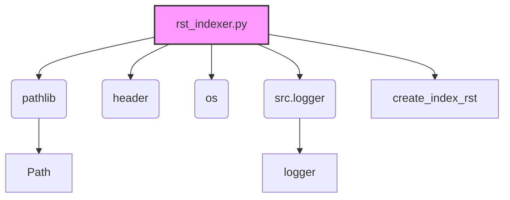

### Анализ кода `hypotez/toolbox/rst_indexer.py.md`

### 1. Блок-схема

```mermaid
graph TD
    A[Начало: Запуск скрипта] --> B{Определение пути к директории с исходным кодом};
    B --> C{Создание пути к директории docs и файлу index.rst};
    C --> D{Проверка существования директории docs};
    D -- Нет --> E[Создание директории docs];
    D -- Да --> F[Переход к созданию/обновлению index.rst];
    E --> F;
    F --> G[Открытие index.rst для записи];
    G --> H[Запись заголовка и toctree в файл];
    H --> I{Рекурсивный обход директории с исходным кодом};
    I --> J{Нахождение Python файлов (.py)};
    J --> K{Вычисление относительного пути к файлу};
    K --> L{Форматирование имени модуля для Sphinx};
    L --> M[Добавление отформатированного имени модуля в toctree];
    J --> N{Есть ли еще файлы для обработки?};
    N -- Да --> J;
    N -- Нет --> O{Найдены ли Python файлы?};
    O -- Да --> P[Запись в лог об успешном добавлении файлов];
    O -- Нет --> Q[Запись в файл "No modules found."];
    P --> R[Завершение: Файл index.rst создан/обновлен];
    Q --> R;
```

**Примеры для каждого блока:**

*   **B (Определение пути к директории с исходным кодом)**:

    *   `start_dir = "src/my_module"`
*   **C (Создание пути к директории docs и файлу index.rst)**:

    *   `docs_dir = start_path / 'docs'`
    *   `index_file_path = docs_dir / 'index.rst'`
*   **D (Проверка существования директории docs)**:

    *   `if not docs_dir.exists():`
*   **E (Создание директории docs)**:

    *   `docs_dir.mkdir(parents=True)`
*   **G (Открытие index.rst для записи)**:

    *   `with index_file_path.open('w', encoding='utf-8') as index_file:`
*   **H (Запись заголовка и toctree в файл)**:

    *   `index_file.write("Welcome to the Project\'s Documentation\\n")`
    *   `index_file.write(".. toctree::\\n")`
*   **J (Нахождение Python файлов (.py))**:

    *   `py_files = [f for f in files if f.endswith('.py') and '(' not in f and ')' not in f]`
*   **K (Вычисление относительного пути к файлу)**:

    *   `rel_root = Path(root).relative_to(start_path)`
*   **L (Форматирование имени модуля для Sphinx)**:

    *   `module_name = str(module_path).replace('.py', '').replace(os.sep, '.')`
*   **M (Добавление отформатированного имени модуля в toctree)**:

    *   `index_file.write(f"   {module_name}\\n")`
*   **Q (Запись в файл "No modules found.")**:

    *   `index_file.write("\\nNo modules found.\\n")`

### 2. Диаграмма



#### Объяснение зависимостей:

*   **pathlib**:  Используется для работы с путями к файлам и директориям.
*   **header**:  Используется для получения корневого пути проекта.
*   **os**:  Используется для взаимодействия с операционной системой, в частности, для рекурсивного обхода директорий.
*   **src.logger**:  Используется для логирования информации о процессе создания `index.rst`.

### 3. Объяснение

#### Импорты:

*   `pathlib`:  Модуль для работы с путями к файлам и директориям.
*   `header`: Модуль, определяющий корневой путь проекта.
*   `os`: Модуль для взаимодействия с операционной системой.
*   `src.logger`: Модуль для логирования событий и ошибок.

#### Функции:

*   `create_index_rst(start_dir: str) -> None`:

    *   **Аргументы**:

        *   `start_dir` (str): Корневая директория для обхода.
    *   **Возвращает**:

        *   `None`
    *   **Назначение**:

        Рекурсивно обходит поддиректории указанной директории, находит Python файлы и создает `index.rst` файл, содержащий список этих файлов в формате `toctree` для Sphinx.
*    **Как работает функция**:

Функция `create_index_rst` выполняет следующие шаги:

1.  Определяет пути к исходной директории, директории `docs` и файлу `index.rst`.
2.  Создает директорию `docs`, если она не существует.
3.  Открывает файл `index.rst` для записи.
4.  Записывает заголовок и структуру `toctree` в файл.
5.  Рекурсивно обходит все поддиректории, начиная с указанной.
6.  Находит все Python-файлы в каждой директории.
7.  Вычисляет относительный путь к каждому файлу и форматирует его имя для Sphinx.
8.  Добавляет отформатированное имя модуля в `toctree`.
9.  Если файлы не найдены, добавляет сообщение об этом в файл.
10. Закрывает файл.

#### Переменные:

*   `start_dir`: Путь к корневой директории, с которой начинается обход.
*   `docs_dir`: Путь к директории, где будет создан `index.rst`.
*   `index_file_path`: Путь к файлу `index.rst`.
*   `found_files`: Флаг, указывающий, были ли найдены Python файлы.
*   `py_files`: Список Python файлов в текущей директории.
*   `rel_root`: Относительный путь к текущей директории.
*    `module_name`: имя модуля
*    `ex`: Обработка исключения

#### Потенциальные ошибки и области для улучшения:

*   **Отсутствует обработка исключений**: Кроме общего блока `except Exception as ex:`, отсутствует более детальная обработка исключений, которые могут возникнуть при работе с файловой системой.
*    **Использование try ... except**: Используется `logger.error` , при возникновении ошибки в блоке `except Exception as ex:`,
*   **Жестко заданные пути**: Путь к директории `docs` жестко задан в коде. Было бы полезно сделать его более гибким.
*   **Неполная документация**: Описание некоторых переменных отсутствует.

#### Взаимосвязи с другими частями проекта:

*   Использует модуль `header` для получения корневого пути проекта.
*   Использует модуль `src.logger` для логирования.
*   Результатом работы скрипта является файл `index.rst`, который используется системой документации Sphinx.