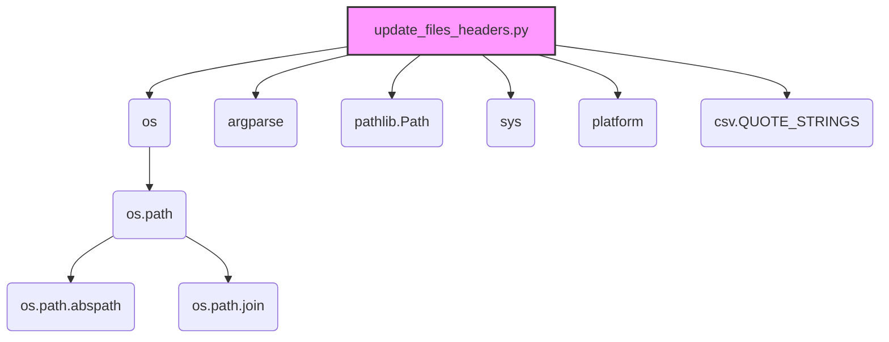

### Анализ кода модуля `hypotez/toolbox/update_files_headers.py.md`

#### 1. Блок-схема

```mermaid
graph TD
    A[Начало] --> B{Определение аргументов командной строки: force-update, clean, project}
    B -- clean=True --> C[Вызов функции traverse_and_clean(project_root)]
    B -- clean=False --> D[Вызов функции traverse_and_update(project_root, force_update)]
    C --> E[Функция traverse_and_clean: обход файлов и очистка заголовков]
    D --> F[Функция traverse_and_update: обход файлов и обновление заголовков]
    E --> G{Для каждого файла: вызов функции clean(file)}
    F --> H{Для каждого файла: вызов функции add_or_replace_file_header(file, project_root, force_update)}
    G --> I[Функция clean: удаление строк заголовков]
    H --> J[Функция add_or_replace_file_header: добавление или замена заголовков]
    I --> K[Запись отфильтрованных строк обратно в файл]
    J --> L[Определение необходимых строк заголовка]
    L --> M[Чтение строк файла]
    M --> N[Фильтрация существующих строк заголовка]
    N --> O{Необходимо обновление?};
    O -- Да --> P[Запись новых строк заголовка и отфильтрованных строк в файл]
    O -- Нет --> Q[Сообщение об отсутствии необходимости обновления]
    P --> R[Конец обработки файла]
    Q --> R
    K --> R
```

**Примеры для каждого логического блока:**

*   **B (Определение аргументов командной строки):**

    *   Пример 1: `python update_files_headers.py --force-update` (аргумент `force_update` установлен в `True`).
    *   Пример 2: `python update_files_headers.py --clean` (аргумент `clean` установлен в `True`).
    *   Пример 3: `python update_files_headers.py -p /path/to/project` (аргумент `project` указывает путь к корневой папке проекта).
*   **G (Для каждого файла: вызов функции `clean(file)`):**

    *   Пример: Если текущий файл `example.py`, то вызывается функция `clean("example.py")`.
*   **H (Для каждого файла: вызов функции `add_or_replace_file_header(file, project_root, force_update)`):**

    *   Пример: Если текущий файл `example.py`, корневая папка проекта `/path/to/project`, и `force_update` установлен в `True`, то вызывается функция `add_or_replace_file_header("example.py", "/path/to/project", True)`.
*   **O (Необходимо обновление?):**

    *   Пример 1: Если в файле отсутствуют строки заголовка, то `needs_update` будет `True`.
    *   Пример 2: Если содержимое строк заголовка не соответствует ожидаемому, то `needs_update` будет `True`.
    *   Пример 3: Если `force_update` установлен в `True`, то `needs_update` будет `True`.

### 2. Диаграмма



**Объяснение зависимостей:**

*   `os`:  Используется для взаимодействия с операционной системой, например, для работы с файловой системой (обход директорий, объединение путей).

    *   **os.path**: Подмодуль `os`, содержащий функции для манипулирования путями.

        *   **os.path.abspath**: Используется для получения абсолютного пути к папке проекта.
        *   **os.path.join**: Используется для объединения компонентов пути к файлу.
*   `argparse`: Используется для разбора аргументов командной строки, позволяя скрипту принимать параметры, такие как `--force-update` и `--clean`.
*   `pathlib.Path`: Предоставляет способ представления путей к файлам и каталогам в виде объектов, упрощая манипуляции с путями.
*   `sys`: Предоставляет доступ к некоторым переменным и функциям, взаимодействующим с интерпретатором Python, например, `sys.argv` для получения аргументов командной строки.
*   `platform`: Предоставляет информацию об операционной системе и платформе, на которой запущен скрипт (Windows, Linux и т. д.).
*   `csv.QUOTE_STRINGS`: Константа из модуля `csv`, которая, хотя и импортирована, не используется в предоставленном коде. Вероятно, это остаток от предыдущей версии скрипта или запланированная, но не реализованная функциональность.

### 3. Объяснение

**Импорты:**

*   `os`:  Для операций с файловой системой (обход директорий).
*   `argparse`: Для разбора аргументов командной строки.
*   `pathlib`: Для работы с путями.
*   `sys`: Для взаимодействия с интерпретатором.
*   `platform`: Для определения операционной системы.

**Переменные:**

*   `PROJECT_ROOT_FOLDER`: Имя директории, которая считается корневой папкой проекта ("..").
*   `EXCLUDE_DIRS`: Список директорий, которые исключаются из обхода (`venv`, `tmp`, `docs`, `data`, `__pycache__`).
*   `MODE`: Устанавливает режим работы проекта (`development`).

**Функции:**

*   `find_project_root(start_path: Path, project_root_folder: str) -> Path`:

    *   **Аргументы**:

        *   `start_path` (Path): Начальный путь для поиска корневой директории.
        *   `project_root_folder` (str): Имя корневой папки проекта.
    *   **Возвращает**:

        *   `Path`: Путь к корневой директории проекта.
    *   **Назначение**:

        Находит корневую директорию проекта, начиная с указанного пути и двигаясь вверх по дереву каталогов, пока не найдет папку с именем `project_root_folder`.
*   `get_interpreter_paths(project_root: Path) -> tuple`:

    *   **Аргументы**:

        *   `project_root` (Path): Корневой путь проекта.
    *   **Возвращает**:

        *   `tuple`: Пути к интерпретаторам Python для Windows и Linux/macOS.
    *   **Назначение**:

        Возвращает пути к интерпретаторам Python, которые обычно используются в виртуальном окружении (`venv`).
*   `add_or_replace_file_header(file_path: str, project_root: Path, force_update: bool)`:

    *   **Аргументы**:

        *   `file_path` (str): Путь к файлу для обработки.
        *   `project_root` (Path): Корневой путь проекта.
        *   `force_update` (bool): Флаг, указывающий, нужно ли принудительно обновить заголовок.
    *   **Возвращает**:

        *   `None`
    *   **Назначение**:

        Добавляет или заменяет заголовок, строки интерпретатора и docstring модуля в указанном Python-файле.
*   `clean(file_path: str)`:

    *   **Аргументы**:

        *   `file_path` (str): Путь к файлу для очистки.
    *   **Возвращает**:

        *   `None`
    *   **Назначение**:

        Удаляет указанные строки заголовка из файла и заменяет их пустыми строками.
*   `traverse_and_update(directory: Path, force_update: bool)`:

    *   **Аргументы**:

        *   `directory` (Path): Путь к директории для обхода.
        *   `force_update` (bool): Флаг, указывающий, нужно ли принудительно обновить заголовок.
    *   **Возвращает**:

        *   `None`
    *   **Назначение**:

        Обходит указанную директорию и обновляет заголовки во всех Python-файлах, вызывая функцию `add_or_replace_file_header` для каждого файла.
*   `traverse_and_clean(directory: Path)`:

    *   **Аргументы**:

        *   `directory` (Path): Путь к директории для обхода.
    *   **Возвращает**:

        *   `None`
    *   **Назначение**:

        Обходит указанную директорию и очищает указанные заголовки из всех Python-файлов, вызывая функцию `clean` для каждого файла.
*   `main()`:

    *   **Аргументы**:

        *   Отсутствуют.
    *   **Возвращает**:

        *   `None`
    *   **Назначение**:

        Главная функция, которая выполняет разбор аргументов командной строки и запускает соответствующие операции (обновление или очистку заголовков).

**Потенциальные ошибки и области для улучшения:**

*   **Жестко заданные пути**: Многие пути и строки (например, пути к интерпретаторам, строки для добавления в заголовок) жестко заданы в коде. Было бы полезно вынести их в конфигурационный файл или переменные окружения.
*   **Обработка исключений**: Кроме общей обработки `IOError`, отсутствует более детальная обработка исключений, которые могут возникнуть при работе с файловой системой или при разборе аргументов командной строки.
*   **Обработка пустых файлов**: В коде не предусмотрена обработка пустых файлов, что может привести к неожиданному поведению.
*   **Упрощение логики фильтрации строк**:  Логика фильтрации строк для определения необходимости обновления или очистки заголовков может быть упрощена и сделана более читаемой.
* **Отсутствие логирования с помощью `logger`**

**Взаимосвязи с другими частями проекта:**

*   Модуль использует `header` для получения корневого пути проекта, что предполагает наличие такого модуля в проекте.
*   Функция `clean` предназначена для очистки файлов, поэтому необходимо убедиться, что в коде используются те же строки (константы) для добавления заголовков в `add_or_replace_file_header`, так как иначе очистка не сработает.