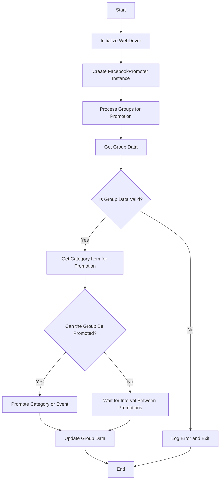

# Facebook Promoter Module Documentation

## Table of Contents

- [Overview](#overview)
- [Module Features](#module-features)
- [Requirements](#requirements)
- [Flowchart](#flowchart)
- [Usage](#usage)
  - [Example of Using the FacebookPromoter Class](#example-of-using-the-facebookpromoter-class)
- [Class Documentation](#class-documentation)
  - [`FacebookPromoter` Class](#facebookpromoter-class)
    - [Methods](#methods)
      - [`__init__(self, d: Driver, promoter: str, group_file_paths: Optional[list[str | Path] | str | Path] = None, no_video: bool = False)`](#initself-d-driver-promoter-str-group_file_paths-optionalliststr-path-str-path-none-no_video-bool-false)
      - [`promote(self, group: SimpleNamespace, item: SimpleNamespace, is_event: bool = False, language: str = None, currency: str = None) -> bool`](#promoteself-group-simplenamespace-item-simplenamespace-is_event-bool-false-language-str-none-currency-str-none)
      - [`log_promotion_error(self, is_event: bool, item_name: str)`](#log_promotion_errorself-is_event-bool-item_name-str)
      - [`update_group_promotion_data(self, group: SimpleNamespace, item_name: str, is_event: bool = False)`](#update_group_promotion_dataself-group-simplenamespace-item_name-str-is_event-bool-false)
      - [`process_groups(self, campaign_name: str = None, events: list[SimpleNamespace] = None, is_event: bool = False, group_file_paths: list[str] = None, group_categories_to_adv: list[str] = ['sales'], language: str = None, currency: str = None)`](#process_groupsself-campaign_name-str-none-events-listsimplenamespace-none-is_event-bool-false-group_file_paths-liststr-none-group_categories_to_adv-liststr-sales-language-str-none-currency-str-none)
      - [`get_category_item(self, campaign_name: str, group: SimpleNamespace, language: str, currency: str) -> SimpleNamespace`](#get_category_itemself-campaign_name-str-group-simplenamespace-language-str-currency-str)
      - [`check_interval(self, group: SimpleNamespace) -> bool`](#check_intervalself-group-simplenamespace)
      - [`validate_group(self, group: SimpleNamespace) -> bool`](#validate_groupself-group-simplenamespace)
- [License](#license)


## Overview

Модуль **Facebook Promoter** автоматизирует продвижение товаров и событий AliExpress в группах Facebook. Модуль обрабатывает публикацию промо-акций на Facebook, гарантируя, что категории и события рекламируются без дубликатов. Он использует WebDriver для автоматизации браузера для эффективной обработки промо-акций.

## Module Features

- Продвижение категорий и событий в группах Facebook.
- Избегание дублирования промо-акций путем отслеживания ранее рекламируемых элементов.
- Поддержка настройки данных о группах через файлы.
- Возможность отключения загрузки видео в промо-акциях.

## Requirements

- **Python** 3.x
- Необходимые библиотеки:
  - `random`
  - `datetime`
  - `pathlib`
  - `urllib.parse`
  - `types.SimpleNamespace`
  - `src` (custom module)

## Flowchart



## Usage

### Example of Using the FacebookPromoter Class

```python
from src.endpoints.advertisement.facebook.promoter import FacebookPromoter
from src.webdriver.driver import Driver
from src.utils.jjson import j_loads_ns

# Setup WebDriver instance (replace with actual WebDriver)
d = Driver()

# Create an instance of FacebookPromoter
promoter = FacebookPromoter(
    d=d, 
    promoter="aliexpress", 
    group_file_paths=["path/to/group/file1.json", "path/to/group/file2.json"]
)

# Start promoting products or events
promoter.process_groups(
    campaign_name="Campaign1",
    events=[], 
    group_categories_to_adv=["sales"],
    language="en",
    currency="USD"
)
```

## Class Documentation

### `FacebookPromoter` Class

Этот класс управляет процессом продвижения товаров и событий AliExpress в группах Facebook.

#### Methods

##### `__init__(self, d: Driver, promoter: str, group_file_paths: Optional[list[str | Path] | str | Path] = None, no_video: bool = False)`

Инициализирует Facebook promoter с необходимыми конфигурациями.

- **Args:**
    - `d (Driver)`: Экземпляр WebDriver для автоматизации.
    - `promoter (str)`: Название промоутера (например, "aliexpress").
    - `group_file_paths (Optional[list[str | Path] | str | Path])`: Пути к файлам с данными о группах.
    - `no_video (bool)`: Флаг для отключения видео в постах. По умолчанию `False`.

##### `promote(self, group: SimpleNamespace, item: SimpleNamespace, is_event: bool = False, language: str = None, currency: str = None) -> bool`

Продвигает категорию или событие в указанной группе Facebook.

- **Args:**
    - `group (SimpleNamespace)`: Данные о группе.
    - `item (SimpleNamespace)`: Элемент категории или события для продвижения.
    - `is_event (bool)`: Является ли элемент событием или нет.
    - `language (str)`: Язык продвижения.
    - `currency (str)`: Валюта для продвижения.

- **Returns:**
    - `bool`: Успешно ли прошло продвижение или нет.

##### `log_promotion_error(self, is_event: bool, item_name: str)`

Регистрирует ошибку, когда продвижение завершилось неудачей.

- **Args:**
    - `is_event (bool)`: Является ли элемент событием или нет.
    - `item_name (str)`: Название элемента.

##### `update_group_promotion_data(self, group: SimpleNamespace, item_name: str, is_event: bool = False)`

Обновляет данные о группе после продвижения, добавляя рекламируемый элемент в список рекламируемых категорий или событий.

- **Args:**
    - `group (SimpleNamespace)`: Данные о группе.
    - `item_name (str)`: Название элемента, который был рекламирован.
    - `is_event (bool)`: Является ли элемент событием или нет.

##### `process_groups(self, campaign_name: str = None, events: list[SimpleNamespace] = None, is_event: bool = False, group_file_paths: list[str] = None, group_categories_to_adv: list[str] = ['sales'], language: str = None, currency: str = None)`

Обрабатывает группы для текущей кампании или продвижения событий.

- **Args:**
    - `campaign_name (str)`: Название кампании.
    - `events (list[SimpleNamespace])`: Список событий для продвижения.
    - `is_event (bool)`: Продвигать ли события или категории.
    - `group_file_paths (list[str])`: Пути к файлам с данными о группах.
    - `group_categories_to_adv (list[str])`: Категории для продвижения.
    - `language (str)`: Язык продвижения.
    - `currency (str)`: Валюта для продвижения.

##### `get_category_item(self, campaign_name: str, group: SimpleNamespace, language: str, currency: str) -> SimpleNamespace`

Извлекает элемент категории для продвижения на основе кампании и промоутера.

- **Args:**
    - `campaign_name (str)`: Название кампании.
    - `group (SimpleNamespace)`: Данные о группе.
    - `language (str)`: Язык для продвижения.
    - `currency (str)`: Валюта для продвижения.

- **Returns:**
    - `SimpleNamespace`: Элемент категории для продвижения.

##### `check_interval(self, group: SimpleNamespace) -> bool`

Проверяет, достаточно ли времени прошло для продвижения в этой группе снова.

- **Args:**
    - `group (SimpleNamespace)`: Данные о группе.

- **Returns:**
    - `bool`: Доступна ли группа для продвижения.

##### `validate_group(self, group: SimpleNamespace) -> bool`

Проверяет данные о группе, чтобы убедиться, что у нее есть необходимые атрибуты.

- **Args:**
    - `group (SimpleNamespace)`: Данные о группе.

- **Returns:**
    - `bool`: Действительны ли данные о группе.

## License

Этот модуль является частью более крупного пакета **Facebook Promoter** и лицензирован под лицензией MIT.

```