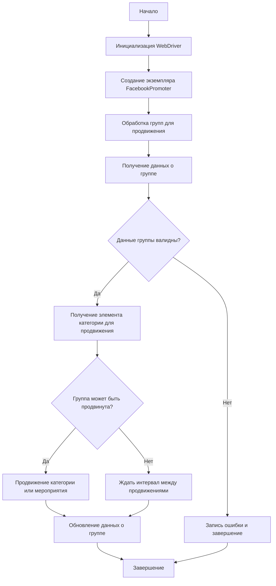

# Facebook Promoter Documentation

## Overview

The **Facebook Promoter** module automates the promotion of AliExpress products and events in Facebook groups. The module manages the posting of promotional materials on Facebook, avoiding duplication. WebDriver is used for browser automation to ensure effective promotion.

## Module Features

- Promotion of product categories and events in Facebook groups.
- Prevention of duplicate publications by tracking already published items.
- Configuration of group data through files.
- Ability to disable video uploads in publications.

## Requirements

- **Python** 3.x
- Required libraries:
  - `random`
  - `datetime`
  - `pathlib`
  - `urllib.parse`
  - `types.SimpleNamespace`
  - `src` (custom module)

## Usage

### Example of using the FacebookPromoter class

```python
from src.endpoints.advertisement.facebook.promoter import FacebookPromoter
from src.webdriver.driver import Driver
from src.utils.jjson import j_loads_ns

# Setting up a WebDriver instance (replace with your actual WebDriver)
d = Driver()

# Creating an instance of FacebookPromoter
promoter = FacebookPromoter(
    d=d,
    promoter="aliexpress",
    group_file_paths=["path/to/group/file1.json", "path/to/group/file2.json"]
)

# Starting the promotion of products or events
promoter.process_groups(
    campaign_name="Campaign1",
    events=[],
    group_categories_to_adv=["sales"],
    language="en",
    currency="USD"
)
```

## Class Documentation

### Class `FacebookPromoter`

This class manages the process of promoting AliExpress products and events in Facebook groups.



#### Methods

##### `__init__(self, d: Driver, promoter: str, group_file_paths: Optional[list[str | Path] | str | Path] = None, no_video: bool = False)`

Initializes the Facebook promoter with the necessary configurations.

- **Arguments:**
    - `d (Driver)`: WebDriver instance for automation.
    - `promoter (str)`: Promoter name (e.g., "aliexpress").
    - `group_file_paths (Optional[list[str | Path] | str | Path])`: Paths to files containing group data.
    - `no_video (bool)`: Flag to disable video uploads in publications. Defaults to `False`.

##### `promote(self, group: SimpleNamespace, item: SimpleNamespace, is_event: bool = False, language: str = None, currency: str = None) -> bool`

Promotes a category or event in the specified Facebook group.

- **Arguments:**
    - `group (SimpleNamespace)`: Group data.
    - `item (SimpleNamespace)`: Category or event to promote.
    - `is_event (bool)`: Whether the element is an event.
    - `language (str)`: Publication language.
    - `currency (str)`: Currency for promotion.

- **Returns:**
    - `bool`: Whether the promotion was successful.

##### `log_promotion_error(self, is_event: bool, item_name: str)`

Logs an error if the promotion failed.

- **Arguments:**
    - `is_event (bool)`: Whether the element is an event.
    - `item_name (str)`: Element name.

##### `update_group_promotion_data(self, group: SimpleNamespace, item_name: str, is_event: bool = False)`

Updates group data after promotion, adding the promoted element to the list of promoted categories or events.

- **Arguments:**
    - `group (SimpleNamespace)`: Group data.
    - `item_name (str)`: Name of the promoted element.
    - `is_event (bool)`: Whether the element is an event.

##### `process_groups(self, campaign_name: str = None, events: list[SimpleNamespace] = None, is_event: bool = False, group_file_paths: list[str] = None, group_categories_to_adv: list[str] = ['sales'], language: str = None, currency: str = None)`

Processes groups for the current campaign or event promotion.

- **Arguments:**
    - `campaign_name (str)`: Campaign name.
    - `events (list[SimpleNamespace])`: List of events to promote.
    - `is_event (bool)`: Whether to promote events or categories.
    - `group_file_paths (list[str])`: Paths to files containing group data.
    - `group_categories_to_adv (list[str])`: Categories to promote.
    - `language (str)`: Publication language.
    - `currency (str)`: Currency for promotion.

##### `get_category_item(self, campaign_name: str, group: SimpleNamespace, language: str, currency: str) -> SimpleNamespace`

Gets the category item for promotion based on the campaign and promoter.

- **Arguments:**
    - `campaign_name (str)`: Campaign name.
    - `group (SimpleNamespace)`: Group data.
    - `language (str)`: Language for publication.
    - `currency (str)`: Currency for publication.

- **Returns:**
    - `SimpleNamespace`: Category item for promotion.

##### `check_interval(self, group: SimpleNamespace) -> bool`

Checks whether enough time has passed to promote this group again.

- **Arguments:**
    - `group (SimpleNamespace)`: Group data.

- **Returns:**
    - `bool`: Whether the group can be promoted again.

##### `validate_group(self, group: SimpleNamespace) -> bool`

Validates group data to ensure its correctness.

- **Arguments:**
    - `group (SimpleNamespace)`: Group data.

- **Returns:**
    - `bool`: Whether the group data is correct.

## License

The module is part of the **Facebook Promoter** package and is licensed under the MIT license.