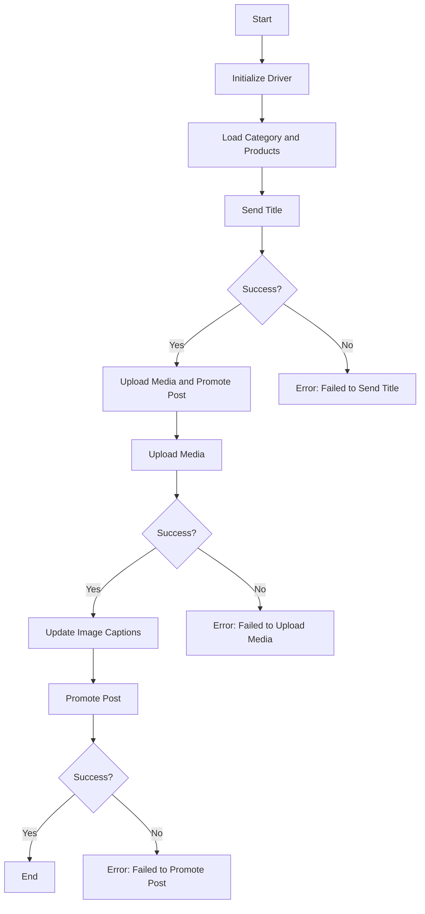

# Asynchronous Facebook Post Message Scenario

## Overview

This script is part of the `hypotez/src/endpoints/advertisement/facebook/scenarios` directory and is designed to automate the process of posting messages on Facebook. The script interacts with the Facebook page by using locators to perform various actions such as sending messages, uploading media files, and updating captions.

## Table of Contents

- [Overview](#overview)
- [Key Features](#key-features)
- [Module Structure](#module-structure)
- [Legend](#legend)
- [Functions](#functions)
  - [`post_title(d: Driver, category: SimpleNamespace) -> bool`](#post_titled-driver-category-simplenamespace--bool)
  - [`upload_media(d: Driver, products: List[SimpleNamespace], no_video: bool = False) -> bool`](#upload_mediad-driver-products-listsimplenamespace-no_video-bool--false--bool)
  - [`update_images_captions(d: Driver, products: List[SimpleNamespace], textarea_list: List[WebElement]) -> None`](#update_images_captionsd-driver-products-listsimplenamespace-textarea_list-listwebelement--none)
  - [`promote_post(d: Driver, category: SimpleNamespace, products: List[SimpleNamespace], no_video: bool = False) -> bool`](#promote_postd-driver-category-simplenamespace-products-listsimplenamespace-no_video-bool--false--bool)
- [Usage](#usage)
  - [Example](#example)
- [Dependencies](#dependencies)
- [Error Handling](#error-handling)
- [Contributing](#contributing)
- [License](#license)

## Key Features

1. **Sending Title and Description**: Sends the title and description of a campaign to the Facebook post message box.
2. **Uploading Media Files**: Uploads media files (images and videos) to the Facebook post and updates their captions.
3. **Promoting Post**: Manages the entire process of promoting a post with a title, description, and media files.

## Module Structure



## Legend

1. **Start**: Start of script execution.
2. **InitDriver**: Create an instance of the `Driver` class.
3. **LoadCategoryAndProducts**: Load category and product data.
4. **SendTitle**: Call the `post_title` function to send the title.
5. **CheckTitleSuccess**: Check if the title was sent successfully.
   - **Yes**: Proceed to upload media and promote the post.
   - **No**: Output error "Failed to send title".
6. **UploadMediaAndPromotePost**: Call the `promote_post` function.
7. **UploadMedia**: Call the `upload_media` function to upload media files.
8. **CheckMediaSuccess**: Check if media was uploaded successfully.
   - **Yes**: Proceed to update image captions.
   - **No**: Output error "Failed to upload media".
9. **UpdateCaptions**: Call the `update_images_captions` function to update captions.
10. **PromotePost**: Complete the post promotion process.
11. **CheckPromoteSuccess**: Check if the post was promoted successfully.
    - **Yes**: End of script execution.
    - **No**: Output error "Failed to promote post".

-----------------------

#### Functions

- **`post_title(d: Driver, category: SimpleNamespace) -> bool`**:
  - **Purpose**: Отправляет заголовок и описание кампании в поле сообщения публикации на Facebook.
  - **Parameters**:
    - `d`: Экземпляр класса `Driver`, используемый для взаимодействия с веб-страницей.
    - `category`: Категория, содержащая заголовок и описание, которые необходимо отправить.
  - **Returns**: `True`, если заголовок и описание были отправлены успешно, в противном случае `None`.

- **`upload_media(d: Driver, products: List[SimpleNamespace], no_video: bool = False) -> bool`**:
  - **Purpose**: Загружает медиафайлы в пост на Facebook и обновляет их подписи.
  - **Parameters**:
    - `d`: Экземпляр класса `Driver`, используемый для взаимодействия с веб-страницей.
    - `products`: Список продуктов, содержащих пути к медиафайлам.
    - `no_video`: Флаг, указывающий, следует ли пропускать загрузку видео.
  - **Returns**: `True`, если медиафайлы были загружены успешно, в противном случае `None`.

- **`update_images_captions(d: Driver, products: List[SimpleNamespace], textarea_list: List[WebElement]) -> None`**:
  - **Purpose**: Асинхронно добавляет описания к загруженным медиафайлам.
  - **Parameters**:
    - `d`: Экземпляр класса `Driver`, используемый для взаимодействия с веб-страницей.
    - `products`: Список продуктов с подробностями для обновления.
    - `textarea_list`: Список текстовых полей, в которые добавляются подписи.

- **`promote_post(d: Driver, category: SimpleNamespace, products: List[SimpleNamespace], no_video: bool = False) -> bool`**:
  - **Purpose**: Управляет процессом продвижения публикации с заголовком, описанием и медиафайлами.
  - **Parameters**:
    - `d`: Экземпляр класса `Driver`, используемый для взаимодействия с веб-страницей.
    - `category`: Детали категории, используемые для заголовка и описания публикации.
    - `products`: Список продуктов, содержащих медиафайлы и сведения, которые необходимо разместить.
    - `no_video`: Флаг, указывающий, следует ли пропускать загрузку видео.
  - **Returns**: `True`, если публикация была успешно продвинута, в противном случае `None`.

## Usage

To use this script, follow these steps:

1. **Initialize Driver**: Create an instance of the `Driver` class.
2. **Load Locators**: Load the locators from the JSON file.
3. **Call Functions**: Use the provided functions to send the title, upload media, and promote the post.

#### Example

```python
from src.webdriver.driver import Driver
from types import SimpleNamespace

# Initialize Driver
driver = Driver(...)

# Load category and products
category = SimpleNamespace(title="Campaign Title", description="Campaign Description")
products = [SimpleNamespace(local_image_path='path/to/image.jpg', ...)]

# Send title
post_title(driver, category)

# Upload media and promote post
await promote_post(driver, category, products)
```

## Dependencies

- `selenium`: For web automation.
- `asyncio`: For asynchronous operations.
- `pathlib`: For handling file paths.
- `types`: For creating simple namespaces.
- `typing`: For type annotations.

## Error Handling

The script includes robust error handling to ensure that the execution continues even if certain elements are not found or if there are issues with the web page. This is particularly useful for handling dynamic or unstable web pages.

## Contributing

Contributions to this script are welcome. Please ensure that any changes are well-documented and include appropriate tests.

## License

This script is licensed under the MIT License. See the `LICENSE` file for more details.