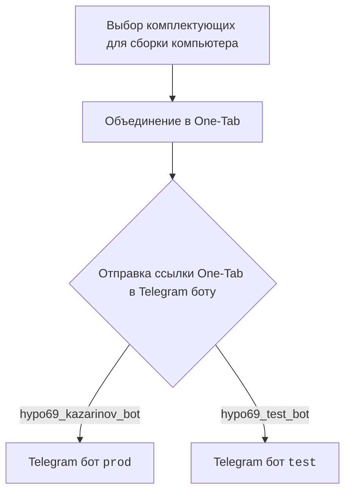
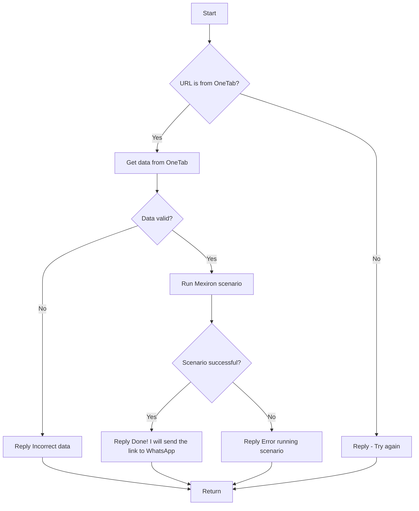

# Документация для модуля `src.endpoints.kazarinov`

## Обзор

Этот модуль содержит информацию о боте Kazarinov, используемом для создания PDF-отчетов Mexiron. Описывает взаимодействие между клиентом (Kazarinov) и ботом, а также схему работы бота.

## Более подробная информация

В модуле представлена информация о структуре взаимодействия между клиентом и Telegram-ботами (`prod` и `test`), а также диаграмма последовательности операций, выполняемых ботом для обработки URL-адресов OneTab, проверки данных и запуска сценариев Mexiron.

## Содержание

- [Схема взаимодействия](#схема-взаимодействия)
- [Схема работы бота](#схема-работы-бота)
- [Следующие шаги](#следующие-шаги)

## Схема взаимодействия

Описание взаимодействия между клиентом и Telegram-ботами.

## Схема работы бота

Описание последовательности операций, выполняемых ботом для обработки URL-адресов OneTab и запуска сценариев Mexiron.

## Следующие шаги

Ссылки на другие модули и файлы, связанные с Kazarinov bot и выполнением сценариев:

- [Kazarinov bot](https://github.com/hypo69/hypotez/blob/master/src/endpoints/kazarinov/kazarinov_bot.md)
- [Выполнение сценариев](https://github.com/hypo69/hypotez/blob/master/src/endpoints/kazarinov/scenarios/README.MD)