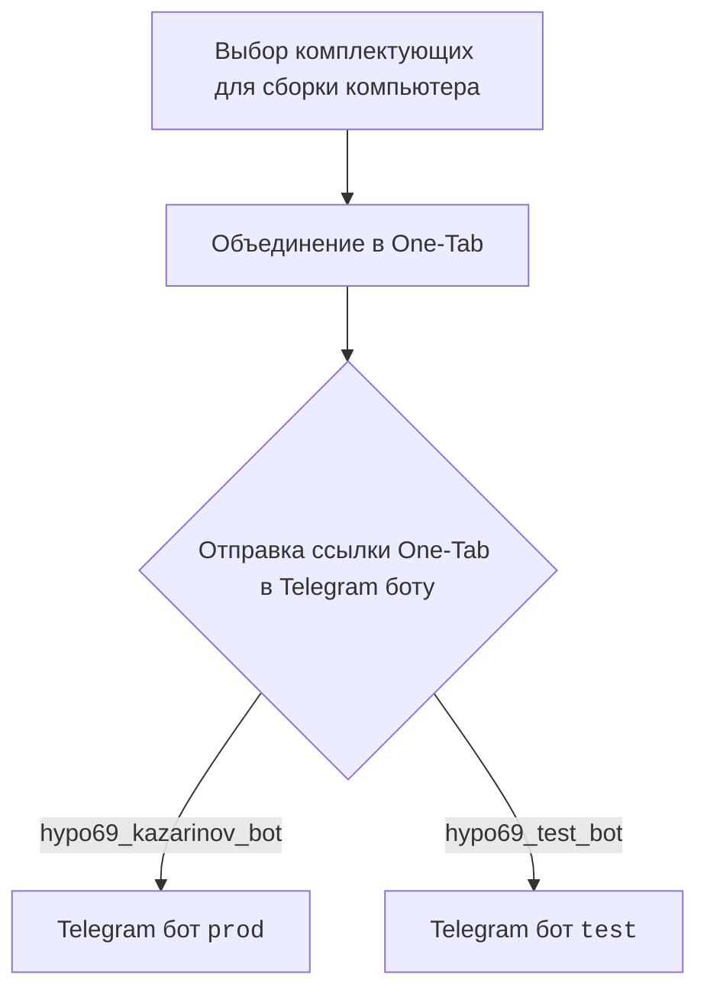
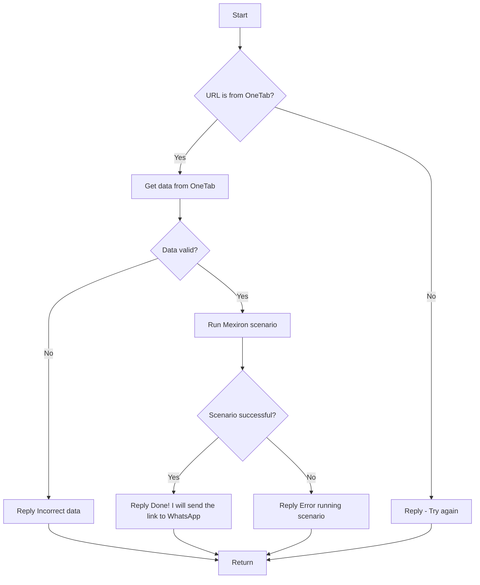

# Модуль Kazarinov PDF Mexiron Creator 

## Обзор

Данный модуль отвечает за создание PDF-файлов для онлайн-магазина Kazarinov с помощью сценария Mexiron. Сценарий используется для автоматизации процесса создания PDF-файлов, которые затем отправляются клиентам.

## Детали

Модуль взаимодействует с ботом в Telegram, который получает ссылки на страницы товаров из One-Tab. Ссылка отправляется в Telegram-бот, который, в свою очередь, извлекает данные о товаре из One-Tab и запускает сценарий Mexiron для генерации PDF-файла.

## Схема работы

**Клиентская сторона (Kazarinov):**

**Серверная сторона (код):**

## Kazarinov Telegram Bot

**Ссылки:**

- [One-Tab](https://one-tab.co.il)
- [Morlevi](https://morlevi.co.il)
- [Grand Avance](https://grandavance.co.il)
- [Ivory](https://ivory.co.il)
- [KSP](https://ksp.co.il)

## Дополнительная информация

### Бот обработчик

**Клиентская сторона (Kazarinov):**

- Выбор комплектующих для сборки компьютера
- Объединение комплектующих в One-Tab
- Отправка ссылки One-Tab в Telegram бот

**Серверная сторона (код):**

- Проверка URL на соответствие One-Tab
- Извлечение данных из One-Tab
- Проверка корректности полученных данных
- Запуск сценария Mexiron
- Отправка сообщения о успешном завершении или ошибке

## Следующие шаги

- [Kazarinov Bot](https://github.com/hypo69/hypotez/blob/master/src/endpoints/kazarinov/kazarinov_bot.md)
- [Исполнение сценария](https://github.com/hypo69/hypotez/blob/master/src/endpoints/kazarinov/scenarios/README.MD)