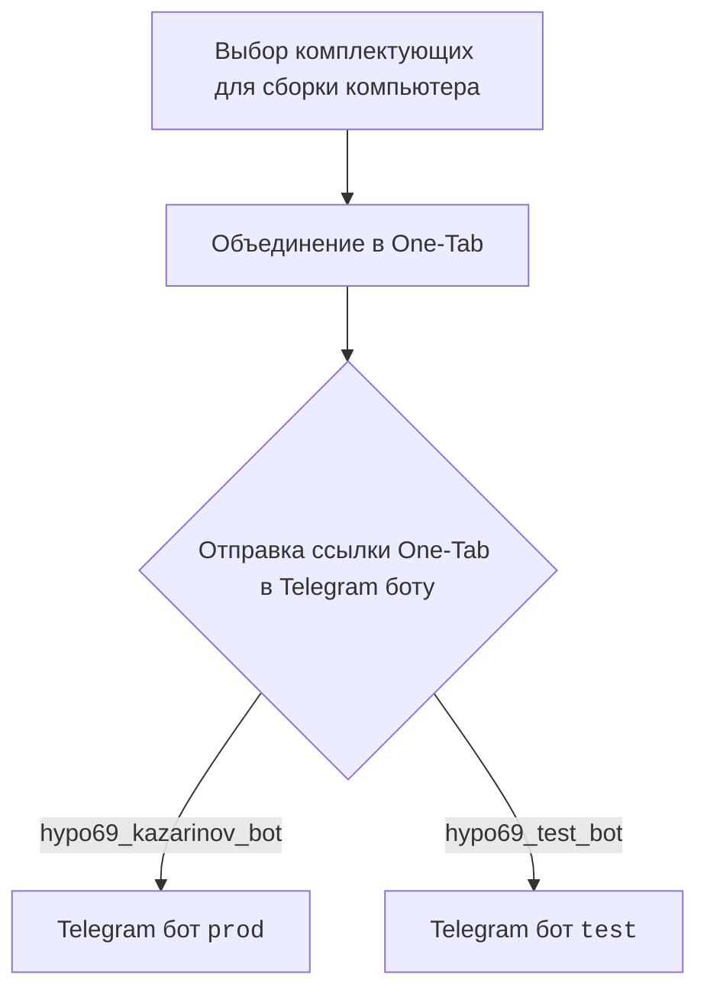
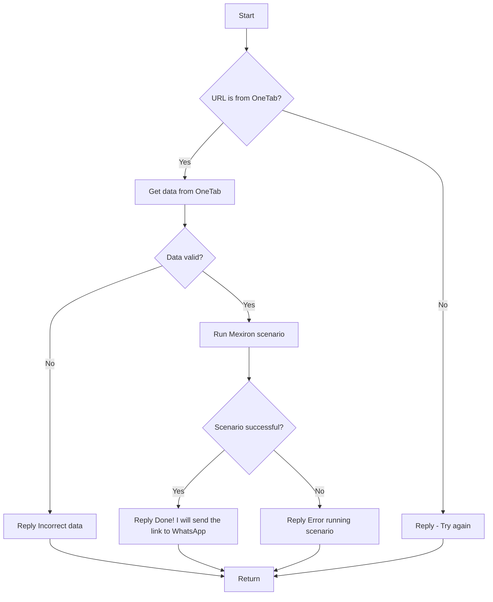

# Модуль `src.endpoints.kazarinov`

## Обзор

Данный модуль предназначен для создания прайс-листа для Казаринова. Он включает в себя работу с Telegram ботами и обработку сценариев для получения данных о комплектующих для сборки компьютера.

## Более детально

Модуль интегрирует взаимодействие клиентской части (выбор комплектующих, объединение в One-Tab) с серверной частью (Telegram боты `prod` и `test`) для автоматизации процесса создания прайс-листа. Используются различные веб-сайты (one-tab.co.il, morlevi.co.il, grandavance.co.il, ivory.co.il, ksp.co.il) для получения информации о товарах.

## Диаграммы

### Клиентская сторона

### Серверная сторона (код)

## Функциональность

- Обработка сообщений от Telegram ботов (`kazarinov_bot.handle_message()`).
- Запуск сценариев (`kazarinov.scenarios.run_scenario()`).
- Проверка валидности URL и данных, полученных из One-Tab.
- Запуск сценария Mexiron для обработки данных.
- Отправка уведомлений об успешном или неуспешном выполнении сценария.

## Ссылки

- [Казаринов бот](https://github.com/hypo69/hypotez/blob/master/src/endpoints/kazarinov/kazarinov_bot.ru.md)
- [Исполнение сценария](https://github.com/hypo69/hypotez/blob/master/src/endpoints/kazarinov/scenarios/readme.ru.md)