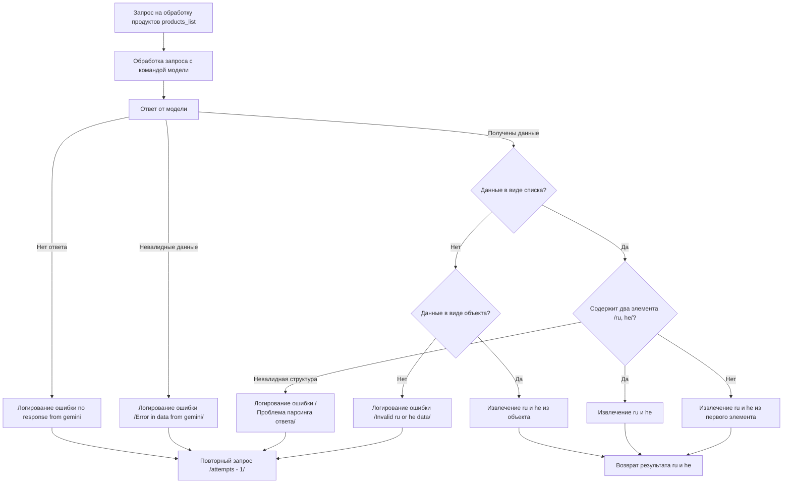

# Сценарии обработки продуктов в модуле `kazarinov`

## Обзор

Этот файл содержит описание сценариев обработки продуктов в модуле `kazarinov`. Он использует диаграмму Mermaid для визуализации процесса обработки продуктов.

## Детали

Сценарии обработки продуктов в модуле `kazarinov` основаны на взаимодействии с моделью Gemini. 

## Схема обработки продуктов

**Описание схемы:**

1. **Запрос на обработку продуктов `products_list`:**  Запрос отправляется в модуль `kazarinov` для обработки списка продуктов `products_list`.
2. **Обработка запроса с командой модели:** Модуль обрабатывает запрос и формирует команду для отправки в модель Gemini.
3. **Ответ от модели:**  Модель Gemini возвращает ответ на обработку продукта.
4. **Проверка на отсутствие ответа:** Проверяется наличие ответа от модели Gemini.
    - Если ответа нет, логируется ошибка `no response from gemini` и производится повторный запрос с уменьшением количества попыток `attempts`.
5. **Проверка на валидность данных:** Проверяется валидность данных, полученных от модели Gemini. 
    - Если данные невалидны, логируется ошибка `Error in data from gemini` и производится повторный запрос.
6. **Проверка на полученные данные:** Проверяется тип данных, полученных от модели Gemini.
    - Если данные в виде списка, то проверяется наличие двух элементов `ru` и `he`.
        - Если есть, извлекаются значения `ru` и `he`.
        - Если нет, извлекаются значения `ru` и `he` из первого элемента списка.
        - Если структура невалидна, логируется ошибка `Проблема парсинга ответа` и производится повторный запрос.
    - Если данные в виде объекта, то извлекаются значения `ru` и `he` из объекта.
    - Если тип данных не список и не объект, логируется ошибка `Invalid ru or he data` и производится повторный запрос.
7. **Возврат результата:**  Возвращаются значения `ru` и `he`, полученные из данных, обработанных моделью Gemini.