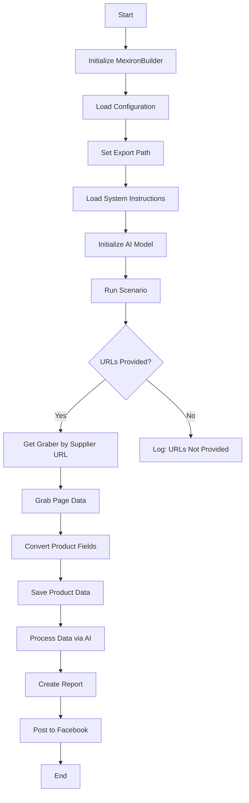

# Sergey Kazarinov's Mechiron Creation Script
## Overview

This script is part of the `hypotez/src/endpoints/kazarinov/scenarios` directory and is designed to automate the process of creating a "mechiron" for Sergey Kazarinov. The script extracts, parses, and processes product data from various suppliers, prepares the data, processes it through AI, and integrates with Facebook for product publication.

## Key Features

1. **Извлечение и парсинг данных**: Извлекает и анализирует данные о товарах от различных поставщиков.
2. **Обработка данных с помощью ИИ**: Обрабатывает извлеченные данные с помощью модели Google Generative AI.
3. **Хранение данных**: Сохраняет обработанные данные в файлы.
4. **Генерация отчетов**: Создает HTML и PDF отчеты из обработанных данных.
5. **Публикация на Facebook**: Публикует обработанные данные на Facebook.

## Module Flowchart



## Legend

1. **Start**: Начало выполнения скрипта.
2. **InitMexironBuilder**: Инициализация класса `MexironBuilder`.
3. **LoadConfig**: Загрузка конфигурации из JSON файла.
4. **SetExportPath**: Установка пути для экспорта данных.
5. **LoadSystemInstruction**: Загрузка системных инструкций для модели ИИ.
6. **InitModel**: Инициализация модели Google Generative AI.
7. **RunScenario**: Выполнение основного сценария.
8. **CheckURLs**: Проверка наличия URL для парсинга.
9. **GetGraber**: Получение соответствующего грабера для URL поставщика.
10. **GrabPage**: Извлечение данных страницы с помощью грабера.
11. **ConvertFields**: Преобразование полей товара в словарь.
12. **SaveData**: Сохранение данных о товаре в файл.
13. **ProcessAI**: Обработка данных о товаре с помощью модели ИИ.
14. **CreateReport**: Создание HTML и PDF отчетов из обработанных данных.
15. **PostFacebook**: Публикация обработанных данных на Facebook.
16. **End**: Окончание выполнения скрипта.

## Classes

### `MexironBuilder`

**Description**: Класс `MexironBuilder` является центральной точкой для управления процессом создания "мехирона" для Сергея Казаринова. Он объединяет различные модули, такие как драйвер Selenium, обработка данных с помощью ИИ, публикация на Facebook и генерация отчетов, для автоматизации всего процесса.

**Attributes**:

- `driver`: Экземпляр WebDriver Selenium.
- `export_path`: Путь для экспорта данных.
- `mexiron_name`: Название мехирона.
- `price`: Цена за обработку.
- `timestamp`: Отметка времени для процесса.
- `products_list`: Список обработанных данных о товарах.
- `model`: Модель Google Generative AI.
- `config`: Загруженная конфигурация из JSON файла.

**Methods**:

- **`__init__(self, driver: Driver, mexiron_name: Optional[str] = None)`**:
    - **Purpose**: Инициализирует класс `MexironBuilder` с необходимыми компонентами.
    - **Parameters**:
      - `driver`: Экземпляр WebDriver Selenium.
      - `mexiron_name`: Название мехирона.
- **`run_scenario(self, system_instruction: Optional[str] = None, price: Optional[str] = None, mexiron_name: Optional[str] = None, urls: Optional[str | List[str]] = None, bot = None) -> bool`**:
    - **Purpose**: Выполняет сценарий: парсинг товаров, обработка их с помощью ИИ и сохранение данных.
    - **Parameters**:
      - `system_instruction`: Системные инструкции для модели ИИ.
      - `price`: Цена за обработку.
      - `mexiron_name`: Название мехирона.
      - `urls`: URL страниц товаров.
    - **Returns**: `True`, если сценарий выполнен успешно, иначе `False`.

    - **Flowchart**:

        ```mermaid
        flowchart TD
        Start[Start] --> IsOneTab{URL is from OneTab?}
        IsOneTab -->|Yes| GetDataFromOneTab[Get data from OneTab]
        IsOneTab -->|No| ReplyTryAgain[Reply - Try again]
        GetDataFromOneTab --> IsDataValid{Data valid?}
        IsDataValid -->|No| ReplyIncorrectData[Reply Incorrect data]
        IsDataValid -->|Yes| RunMexironScenario[Run Mexiron scenario]
        RunMexironScenario --> IsGraberFound{Graber found?}
        IsGraberFound -->|Yes| StartParsing[Start parsing: <code>url</code>]
        IsGraberFound -->|No| LogNoGraber[Log: No graber for <code>url</code>]
        StartParsing --> IsParsingSuccessful{Parsing successful?}
        IsParsingSuccessful -->|Yes| ConvertProductFields[Convert product fields]
        IsParsingSuccessful -->|No| LogParsingFailed[Log: Failed to parse product fields]
        ConvertProductFields --> IsConversionSuccessful{Conversion successful?}
        IsConversionSuccessful -->|Yes| SaveProductData[Save product data]
        IsConversionSuccessful -->|No| LogConversionFailed[Log: Failed to convert product fields]
        SaveProductData --> IsDataSaved{Data saved?}
        IsDataSaved -->|Yes| AppendToProductsList[Append to products_list]
        IsDataSaved -->|No| LogDataNotSaved[Log: Data not saved]
        AppendToProductsList --> ProcessAIHe[AI processing lang = he]
        ProcessAIHe --> ProcessAIRu[AI processing lang = ru]
        ProcessAIRu --> SaveHeJSON{Save JSON for he?}
        SaveHeJSON -->|Yes| SaveRuJSON[Save JSON for ru]
        SaveHeJSON -->|No| LogHeJSONError[Log: Error saving he JSON]
        SaveRuJSON --> IsRuJSONSaved{Save JSON for ru?}
        IsRuJSONSaved -->|Yes| GenerateReports[Generate reports]
        IsRuJSONSaved -->|No| LogRuJSONError[Log: Error saving ru JSON]
        GenerateReports --> IsReportGenerationSuccessful{Report generation successful?}
        IsReportGenerationSuccessful -->|Yes| SendPDF[Send PDF via Telegram]
        IsReportGenerationSuccessful -->|No| LogPDFError[Log: Error creating PDF]
        SendPDF --> ReturnTrue[Return True]
        LogPDFError --> ReturnTrue[Return True]
        ReplyIncorrectData --> ReturnTrue[Return True]
        ReplyTryAgain --> ReturnTrue[Return True]
        LogNoGraber --> ReturnTrue[Return True]
        LogParsingFailed --> ReturnTrue[Return True]
        LogConversionFailed --> ReturnTrue[Return True]
        LogDataNotSaved --> ReturnTrue[Return True]
        LogHeJSONError --> ReturnTrue[Return True]
        LogRuJSONError --> ReturnTrue[Return True]
        ```

        - **Legend**

    1. **Start**: Начало выполнения сценария.

    2. **Проверка источника URL (IsOneTab)**:
       - Если URL из OneTab, данные извлекаются из OneTab.
       - Если URL не из OneTab, пользователю отправляется сообщение "Попробуйте еще раз".

    3. **Проверка корректности данных (IsDataValid)**:
       - Если данные неверны, пользователю отправляется сообщение "Неверные данные".
       - Если данные корректны, запускается сценарий Mexiron.

    4. **Поиск грабера (IsGraberFound)**:
       - Если грабер найден, начинается парсинг страницы.
       - Если грабер не найден, генерируется сообщение в журнале о том, что для данного URL грабера нет.

    5. **Парсинг страницы (StartParsing)**:
       - Если парсинг выполнен успешно, данные преобразуются в нужный формат.
       - Если парсинг завершился ошибкой, записывается ошибка в журнал.

    6. **Преобразование данных (ConvertProductFields)**:
       - Если преобразование прошло успешно, данные сохраняются.
       - Если преобразование завершилось ошибкой, записывается ошибка в журнал.

    7. **Сохранение данных (SaveProductData)**:
       - Если данные сохранены, они добавляются в список товаров.
       - Если данные не сохранены, записывается ошибка в журнал.

    8. **Обработка ИИ (ProcessAIHe, ProcessAIRu)**:
       - Данные обрабатываются ИИ для языков `he` (иврит) и `ru` (русский).

    9. **Сохранение JSON (SaveHeJSON, SaveRuJSON)**:
       - Результаты обработки сохраняются в формате JSON для каждого языка.
       - Если сохранение завершилось ошибкой, записывается ошибка в журнал.

    10. **Генерация отчетов (GenerateReports)**:
        - Создаются HTML и PDF отчеты для каждого языка.
        - Если генерация отчетов завершилась ошибкой, записывается ошибка в журнал.

    11. **Отправка PDF по Telegram (SendPDF)**:
        - PDF файлы отправляются по Telegram.
        - Если отправка завершилась ошибкой, записывается ошибка в журнал.

    12. **Завершение (ReturnTrue)**:
        - Сценарий заканчивается возвратом `True`.

    #### **Запись ошибок**:
- В каждом узле, где могут возникнуть ошибки, включены узлы для записи ошибок (например, `LogNoGraber`, `LogParsingFailed`, `LogHeJSONError` и т. д.).

- **`get_graber_by_supplier_url(self, url: str)`**:
    - **Purpose**: Возвращает соответствующий грабер для данного URL поставщика.
    - **Parameters**:
      - `url`: URL страницы поставщика.
    - **Returns**: Экземпляр грабера, если найден, иначе `None`.
- **`convert_product_fields(self, f: ProductFields) -> dict`**:
    - **Purpose**: Преобразует поля товара в словарь.
    - **Parameters**:
      - `f`: Объект, содержащий распарсенные данные о товаре.
    - **Returns**: Отформатированный словарь данных о товаре.
- **`save_product_data(self, product_data: dict)`**:
    - **Purpose**: Сохраняет данные о товаре в файл.
    - **Parameters**:
      - `product_data`: Отформатированные данные о товаре.
- **`process_llm(self, products_list: List[str], lang: str, attempts: int = 3) -> tuple | bool`**:
    - **Purpose**: Обрабатывает список товаров с помощью модели ИИ.
    - **Parameters**:
      - `products_list`: Список словарей данных о товарах в виде строк.
      - `attempts`: Количество попыток повторного запуска в случае неудачи.
    - **Returns**: Обработанный ответ в форматах `ru` и `he`.
- **`post_facebook(self, mexiron: SimpleNamespace) -> bool`**:
    - **Purpose**: Выполняет сценарий публикации на Facebook.
    - **Parameters**:
      - `mexiron`: Обработанные данные для публикации.
    - **Returns**: `True`, если публикация прошла успешно, иначе `False`.
- **`create_report(self, data: dict, html_file: Path, pdf_file: Path)`**:
    - **Purpose**: Создает HTML и PDF отчеты из обработанных данных.
    - **Parameters**:
      - `data`: Обработанные данные.
      - `html_file`: Путь для сохранения HTML отчета.
      - `pdf_file`: Путь для сохранения PDF отчета.

## Usage

To use this script, follow these steps:

1. **Initialize Driver**: Create an instance of the `Driver` class.
2. **Initialize MexironBuilder**: Create an instance of the `MexironBuilder` class with the driver.
3. **Run Scenario**: Call the `run_scenario` method with the necessary parameters.

#### Example

```python
from src.webdriver.driver import Driver
from src.endpoints.kazarinov.scenarios.scenario_pricelist import MexironBuilder

# Initialize Driver
driver = Driver(...)

# Initialize MexironBuilder
mexiron_builder = MexironBuilder(driver)

# Run Scenario
urls = ['https://example.com/product1', 'https://example.com/product2']
mexiron_builder.run_scenario(urls=urls)
```

## Dependencies

- `selenium`: For web automation.
- `asyncio`: For asynchronous operations.
- `pathlib`: For file path handling.
- `types`: For creating simple namespaces.
- `typing`: For type annotations.
- `src.ai.gemini`: For AI data processing.
- `src.suppliers.*.graber`: For data extraction from various suppliers.
- `src.endpoints.advertisement.facebook.scenarios`: For Facebook publication.

## Error Handling

The script includes robust error handling to ensure continued execution even if some elements are not found or if there are issues with the web page. This is particularly useful for handling dynamic or unstable web pages.

## Contribution

Contributions to this script are welcome. Please ensure that any changes are well-documented and include appropriate tests.

## License

This script is licensed under the MIT License. See the `LICENSE` file for details.