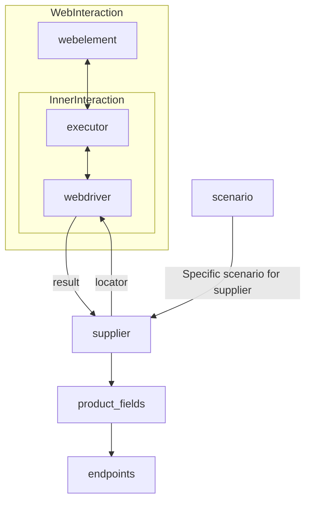

# Документация для модуля `suppliers`

## Обзор

Данный документ предназначен для разработчиков, работающих с проектом `hypotez`. Он содержит информацию о структуре и назначении модуля `suppliers`, а также описание класса `Supplier` и список реализованных поставщиков.

## Подробнее

Модуль `suppliers` предназначен для унификации работы с различными поставщиками данных и информации. Поставщиком может выступать производитель товара, данных или информации. Источниками поставщика могут быть целевые страницы сайтов, документы, базы данных или таблицы.

Основная цель модуля — свести взаимодействие с разными поставщиками к единому алгоритму действий внутри класса `Supplier`. Каждый поставщик имеет свой уникальный префикс, подробнее о которых можно узнать в [документации о префиксах](prefixes.md).

Класс `Supplier` является базовым классом для управления взаимодействиями с поставщиками. Он выполняет инициализацию, настройку, аутентификацию и запуск сценариев для различных источников данных, таких как `amazon.com`, `walmart.com`, `mouser.com` и `digikey.com`. Также предусмотрена возможность добавления дополнительных поставщиков.

## Классы

### `Supplier`

**Описание**: Базовый класс для всех поставщиков информации. В контексте кода `Supplier` — это поставщик информации. Поставщиком может быть производитель какого-либо товара, данных или информации. Источники поставщика — целевая страница сайта, документ, база данных, таблица. Класс сводит разных поставщиков к одинаковому алгоритму действий внутри класса. У каждого поставщика есть свой уникальный префикс.

**Назначение**: Класс `Supplier` служит основой для управления взаимодействиями с поставщиками. Он выполняет инициализацию, настройку, аутентификацию и запуск сценариев для различных источников данных, таких как `amazon.com`, `walmart.com`, `mouser.com` и `digikey.com`. Клиент может определить дополнительные поставщики.

**Принцип работы**:
- Класс предоставляет унифицированный интерфейс для взаимодействия с различными поставщиками.
- Он абстрагирует детали реализации каждого конкретного поставщика, позволяя работать с ними единообразно.
- Класс выполняет настройку и аутентификацию, а также запускает сценарии для получения данных от поставщиков.

## Список реализованных поставщиков

- [aliexpress](aliexpress/README.RU.MD) - Реализован в двух вариантах сценариев: `webdriver` и `api`
- [amazon](amazon/README.RU.MD) - `webdriver`
- [bangood](bangood/README.RU.MD) - `webdriver`
- [cdata](cdata/README.RU.MD) - `webdriver`
- [chat_gpt](chat_gpt/README.RU.MD) - Работа с чатом chatgpt (НЕ С МОДЕЛЬЮ!)
- [ebay](ebay/README.RU.MD) - `webdriver`
- [etzmaleh](etzmaleh/README.RU.MD) - `webdriver`
- [gearbest](gearbest/README.RU.MD) - `webdriver`
- [grandadvance](grandadvance/README.RU.MD) - `webdriver`
- [hb](hb/README.RU.MD) - `webdriver`
- [ivory](ivory/README.RU.MD) - `webdriver`
- [ksp](ksp/README.RU.MD) - `webdriver`
- [kualastyle](kualastyle/README.RU.MD) - `webdriver`
- [morlevi](morlevi/README.RU.MD) - `webdriver`
- [visualdg](visualdg/README.RU.MD) - `webdriver`
- [wallashop](wallashop/README.RU.MD) - `webdriver`
- [wallmart](wallmart/README.RU.MD) - `webdriver`

[Подробно о веб-драйвере class `Driver`](https://github.com/hypo69/hypotez/blob/master/docs/ru/src/webdriver/driver.py.md)

[Подробно о сценариях class `Scenario`](https://github.com/hypo69/hypotez/blob/master/docs/ru/src/scenario/executor.py.md)

[Подробно о локаторах](https://github.com/hypo69/hypotez/blob/master/docs/ru/src/suppliers/locator.ru.md)

## Схема взаимодействия

