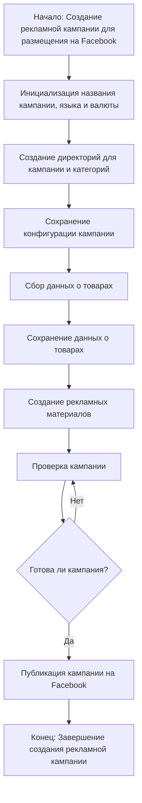

# Модуль `campaign`

## Обзор

Модуль `campaign` предназначен для управления процессом создания и публикации рекламных кампаний на Facebook. 

## Детали

Модуль `campaign` позволяет инициализировать параметры кампании (название, язык, валюта), создавать структуру директорий, сохранять конфигурации для новой кампании, собирать и сохранять данные о товарах через `ali` или `html`, генерировать рекламные материалы, проверять кампанию и публиковать ее на Facebook.

## Диаграмма рабочего процесса



## Примеры

```python
# Пример инициализации параметров кампании
campaign_name = 'Summer Sale'
campaign_language = 'ru'
campaign_currency = 'RUB'

# Пример создания директорий для кампании и категорий
campaign_directory = Path('campaigns/summer_sale')
campaign_directory.mkdir(parents=True, exist_ok=True)

# Пример сохранения конфигурации кампании
campaign_config = {
    'name': campaign_name,
    'language': campaign_language,
    'currency': campaign_currency
}
with open(campaign_directory / 'config.json', 'w', encoding='utf-8') as f:
    json.dump(campaign_config, f)

# Пример сбора данных о товарах из файла
product_data = []
with open('products.csv', 'r', encoding='utf-8') as f:
    reader = csv.DictReader(f)
    for row in reader:
        product_data.append(row)

# Пример сохранения данных о товарах
with open(campaign_directory / 'products.json', 'w', encoding='utf-8') as f:
    json.dump(product_data, f)

# Пример генерации рекламных материалов
ad_creatives = generate_ad_creatives(product_data)

# Пример проверки кампании
is_campaign_ready = check_campaign(campaign_directory)

# Пример публикации кампании на Facebook
if is_campaign_ready:
    publish_campaign(campaign_directory)
```