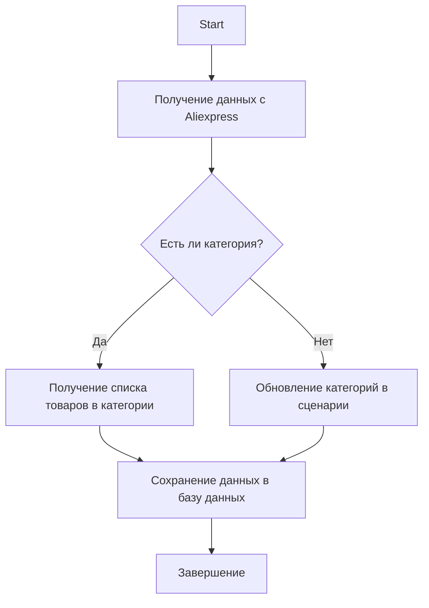

# AliExpress Category Management Module

## Overview

This module provides functionality for managing product categories on the AliExpress platform. It includes functions for retrieving product URLs from a category, updating categories based on data from the website, and performing database operations.

## Details

The module is designed to manage product categories on AliExpress. It includes the following key functions:

- Retrieving a list of products from a category.
- Updating categories in a scenario based on data from the website.
- Database operations for working with categories.



## Usage Example

### Retrieving a List of Products from a Category

```python
# Example using the `get_list_products_in_category` function
products = get_list_products_in_category(supplier)
```

### Updating Categories in a Scenario File

```python
# Example using the `update_categories_in_scenario_file` function
updated = update_categories_in_scenario_file(supplier, "scenario_file.json")
```

### Database Operations

```python
# Example using `DBAdaptor` for database operations
db = DBAdaptor()
db.select(cat_id=123)
db.insert()
db.update()
db.delete()
```

## Module Functions

### `get_list_products_in_category(s)`

Reads product URLs from a category page. If there are multiple pages with products, the function will scroll through all pages.

**Arguments:**

- `s` (`Supplier`): An instance of the supplier.

**Returns:**

- A list of product URLs in the category.

### `get_prod_urls_from_pagination(s)`

Collects product URLs from a category page with page scrolling.

**Arguments:**

- `s` (`Supplier`): An instance of the supplier.

**Returns:**

- A list of product URLs.

### `update_categories_in_scenario_file(s, scenario_filename)`

Checks for category changes on the website and updates the scenario file.

**Arguments:**

- `s` (`Supplier`): An instance of the supplier.
- `scenario_filename` (str): The name of the scenario file to update.

**Returns:**

- `True` if the update was successful.

### `get_list_categories_from_site(s, scenario_file, brand=\'\')`

Retrieves a list of categories from the website based on the scenario file.

**Arguments:**

- `s` (`Supplier`): An instance of the supplier.
- `scenario_file` (str): The name of the scenario file.
- `brand` (str, optional): An optional brand name.

**Returns:**

- A list of categories.

### Class `DBAdaptor`

Provides methods for performing database operations such as `SELECT`, `INSERT`, `UPDATE`, and `DELETE`.

**Methods:**

- `select(cat_id, parent_id, project_cat_id)`: Selects records from the database.
- `insert()`: Inserts new records into the database.
- `update()`: Updates records in the database.
- `delete()`: Deletes records from the database.

## Installation

To work with the module, you need to install dependent packages such as `requests` and configure the database connection through `gs.db_translations_credentials`.

### Dependencies:

- `requests`
- `src.utils.jjson`
- `src.db.manager_categories.suppliers_categories`

## Logging

The module uses logging through `src.logger`, which helps track errors and events during execution.

## Author

The module is developed for internal use within the project.