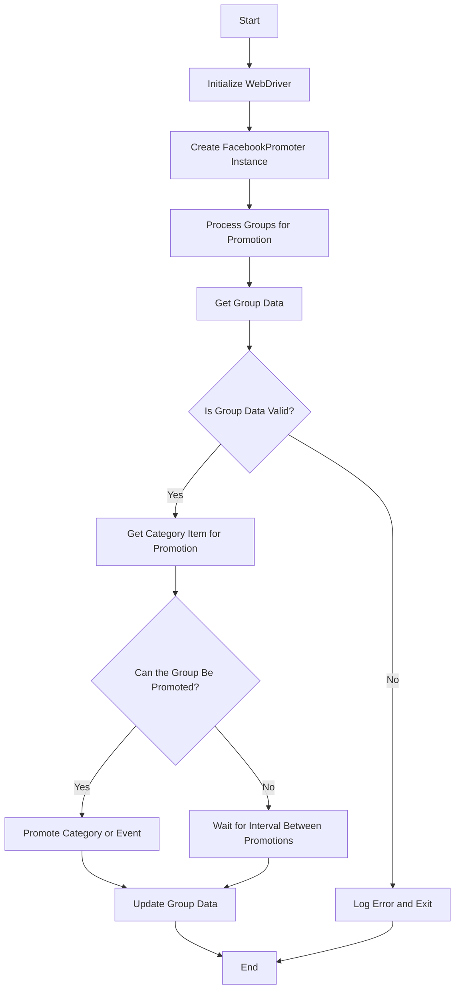

**Instructions for Generating Code Documentation**

1. **Analyze the Code**: Understand the logic and actions performed by the code snippet.

2. **Create a Step-by-Step Guide**:
    - **Description**: Explain what the code block does.
    - **Execution Steps**: Describe the sequence of actions in the code.
    - **Usage Example**: Provide a code example of how to use the snippet in the project.

3. **Example**:

How to Use This Code Block
=========================================================================================

Description
-------------------------
[Explanation of what the code does.]

Execution Steps
-------------------------
1. [Description of the first step.]
2. [Description of the second step.]
3. [Continue as needed...]

Usage Example
-------------------------

```python
    [Code usage example]
```

4. **Avoid Vague Terms** like "getting" or "doing". Be specific about what the code does, for example: "checks", "validates", or "sends".
```

## Facebook Promoter Module Documentation

## Overview

The **Facebook Promoter** module automates the promotion of AliExpress products and events within Facebook groups. The module handles posting promotions to Facebook, ensuring that categories and events are promoted without duplicates. It uses a WebDriver for browser automation to handle promotions efficiently.

## Module Features

- Promote categories and events to Facebook groups.
- Avoid duplicate promotions by tracking previously promoted items.
- Supports configuration of group data via files.
- Allows disabling video uploads in promotions.

## Requirements

- **Python** 3.x
- Required libraries:
  - `random`
  - `datetime`
  - `pathlib`
  - `urllib.parse`
  - `types.SimpleNamespace`
  - `src` (custom module)

## Flowchart



## Usage

### Example of Using the FacebookPromoter Class

```python
from src.endpoints.advertisement.facebook.promoter import FacebookPromoter
from src.webdriver.driver import Driver
from src.utils.jjson import j_loads_ns

# Setup WebDriver instance (replace with actual WebDriver)
d = Driver()

# Create an instance of FacebookPromoter
promoter = FacebookPromoter(
    d=d, 
    promoter="aliexpress", 
    group_file_paths=["path/to/group/file1.json", "path/to/group/file2.json"]
)

# Start promoting products or events
promoter.process_groups(
    campaign_name="Campaign1",
    events=[], 
    group_categories_to_adv=["sales"],
    language="en",
    currency="USD"
)
```

## Class Documentation

### `FacebookPromoter` Class

This class manages the promotion process for AliExpress products and events on Facebook groups.

#### Methods

##### `__init__(self, d: Driver, promoter: str, group_file_paths: Optional[list[str | Path] | str | Path] = None, no_video: bool = False)`

Initializes the Facebook promoter with necessary configurations.

- **Args:**
    - `d (Driver)`: WebDriver instance for automation.
    - `promoter (str)`: The name of the promoter (e.g., "aliexpress").
    - `group_file_paths (Optional[list[str | Path] | str | Path])`: File paths for group data.
    - `no_video (bool)`: Flag to disable videos in posts. Defaults to `False`.

##### `promote(self, group: SimpleNamespace, item: SimpleNamespace, is_event: bool = False, language: str = None, currency: str = None) -> bool`

Promotes a category or event in the specified Facebook group.

- **Args:**
    - `group (SimpleNamespace)`: Group data.
    - `item (SimpleNamespace)`: Category or event item to promote.
    - `is_event (bool)`: Whether the item is an event or not.
    - `language (str)`: The language of the promotion.
    - `currency (str)`: The currency for the promotion.

- **Returns:**
    - `bool`: Whether the promotion was successful or not.

##### `log_promotion_error(self, is_event: bool, item_name: str)`

Logs an error when a promotion fails.

- **Args:**
    - `is_event (bool)`: Whether the item is an event or not.
    - `item_name (str)`: The name of the item.

##### `update_group_promotion_data(self, group: SimpleNamespace, item_name: str, is_event: bool = False)`

Updates the group data after a promotion, adding the promoted item to the list of promoted categories or events.

- **Args:**
    - `group (SimpleNamespace)`: Group data.
    - `item_name (str)`: The name of the item that was promoted.
    - `is_event (bool)`: Whether the item is an event or not.

##### `process_groups(self, campaign_name: str = None, events: list[SimpleNamespace] = None, is_event: bool = False, group_file_paths: list[str] = None, group_categories_to_adv: list[str] = ['sales'], language: str = None, currency: str = None)`

Processes the groups for the current campaign or event promotion.

- **Args:**
    - `campaign_name (str)`: The name of the campaign.
    - `events (list[SimpleNamespace])`: List of events to promote.
    - `is_event (bool)`: Whether to promote events or categories.
    - `group_file_paths (list[str])`: File paths for group data.
    - `group_categories_to_adv (list[str])`: Categories to promote.
    - `language (str)`: The language of the promotion.
    - `currency (str)`: The currency for the promotion.

##### `get_category_item(self, campaign_name: str, group: SimpleNamespace, language: str, currency: str) -> SimpleNamespace`

Fetches the category item for promotion based on the campaign and promoter.

- **Args:**
    - `campaign_name (str)`: The name of the campaign.
    - `group (SimpleNamespace)`: Group data.
    - `language (str)`: The language for the promotion.
    - `currency (str)`: The currency for the promotion.

- **Returns:**
    - `SimpleNamespace`: The category item for promotion.

##### `check_interval(self, group: SimpleNamespace) -> bool`

Checks if enough time has passed for promoting this group again.

- **Args:**
    - `group (SimpleNamespace)`: Group data.

- **Returns:**
    - `bool`: Whether the group is eligible for promotion.

##### `validate_group(self, group: SimpleNamespace) -> bool`

Validates the group data to ensure it has the necessary attributes.

- **Args:**
    - `group (SimpleNamespace)`: Group data.

- **Returns:**
    - `bool`: Whether the group data is valid.

## License

This module is part of the larger **Facebook Promoter** package and is licensed under the MIT License.

```
You can copy this markdown content into a `promoter.md` file for documentation purposes.