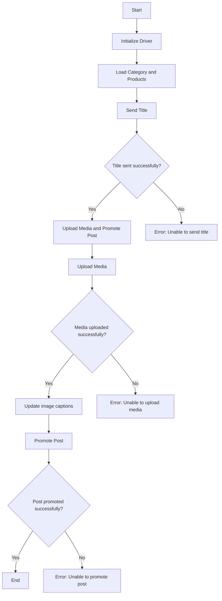

**Instructions for Generating Code Documentation**

1. **Analyze the Code**: Understand the logic and actions performed by the code snippet.

2. **Create a Step-by-Step Guide**:
    - **Description**: Explain what the code block does.
    - **Execution Steps**: Describe the sequence of actions in the code.
    - **Usage Example**: Provide a code example of how to use the snippet in the project.

3. **Example**:

How to Use This Code Block
=========================================================================================

Description
-------------------------
[Explanation of what the code does.]

Execution Steps
-------------------------
1. [Description of the first step.]
2. [Description of the second step.]
3. [Continue as needed...]

Usage Example
-------------------------

```python
    [Code usage example]
```

4. **Avoid Vague Terms** like "getting" or "doing". Be specific about what the code does, for example: "checks", "validates", or "sends".
```

```markdown
## Scenario for Asynchronous Post Publication on Facebook

### Overview

This script is part of the directory `hypotez/src/endpoints/advertisement/facebook/scenarios` and is designed to automate the process of publishing posts on Facebook. The script interacts with a Facebook page using locators to perform various actions, such as sending messages, uploading media files, and updating captions.

### Main Features

1. **Sending Header and Description**: Sends the header and description of the campaign to the message field on Facebook.
2. **Uploading Media Files**: Uploads media files (images and videos) to the Facebook post and updates their captions.
3. **Promoting the Post**: Manages the entire process of promoting the post with the header, description, and media files.

### Module Structure



### Legend

1. **Start**: Beginning of script execution.
2. **InitDriver**: Creating an instance of the `Driver` class.
3. **LoadCategoryAndProducts**: Loading category and product data.
4. **SendTitle**: Calling the `post_title` function to send the title.
5. **CheckTitleSuccess**: Checking if the title was sent successfully.
   - **Yes**: Proceed to uploading media and promoting the post.
   - **No**: Display error "Unable to send the title."
6. **UploadMediaAndPromotePost**: Calling the `promote_post` function.
7. **UploadMedia**: Calling the `upload_media` function to upload media files.
8. **CheckMediaSuccess**: Checking if the media was uploaded successfully.
   - **Yes**: Proceed to updating image captions.
   - **No**: Display error "Unable to upload media."
9. **UpdateCaptions**: Calling the `update_images_captions` function to update captions.
10. **PromotePost**: Completion of the post promotion process.
11. **CheckPromoteSuccess**: Checking if the post was promoted successfully.
    - **Yes**: End of script execution.
    - **No**: Display error "Unable to promote the post."
-----------------------

#### Functions

- **`post_title(d: Driver, category: SimpleNamespace) -> bool`**:
  - **Purpose**: Sends the header and description of the campaign to the message field on Facebook.
  - **Parameters**:
    - `d`: An instance of `Driver` for interaction with the webpage.
    - `category`: The category containing the header and description to send.
  - **Returns**: `True` if the header and description were successfully sent, otherwise `None`.

- **`upload_media(d: Driver, products: List[SimpleNamespace], no_video: bool = False) -> bool`**:
  - **Purpose**: Uploads media files to the Facebook post and updates their captions.
  - **Parameters**:
    - `d`: An instance of `Driver` for interaction with the webpage.
    - `products`: A list of products containing paths to media files.
    - `no_video`: A flag indicating whether to skip video uploads.
  - **Returns**: `True` if the media files were successfully uploaded, otherwise `None`.

- **`update_images_captions(d: Driver, products: List[SimpleNamespace], textarea_list: List[WebElement]) -> None`**:
  - **Purpose**: Asynchronously adds descriptions to uploaded media files.
  - **Parameters**:
    - `d`: An instance of `Driver` for interaction with the webpage.
    - `products`: A list of products with details for updates.
    - `textarea_list`: A list of text fields where captions are added.

- **`promote_post(d: Driver, category: SimpleNamespace, products: List[SimpleNamespace], no_video: bool = False) -> bool`**:
  - **Purpose**: Manages the process of promoting the post with the header, description, and media files.
  - **Parameters**:
    - `d`: An instance of `Driver` for interaction with the webpage.
    - `category`: Category details used for the post header and description.
    - `products`: A list of products containing media and details for publication.
    - `no_video`: A flag indicating whether to skip video uploads.
  - **Returns**: `True` if the post was successfully promoted, otherwise `None`.

### Usage

To use this script, follow these steps:

1. **Initialize Driver**: Create an instance of the `Driver` class.
2. **Load Locators**: Load locators from the JSON file.
3. **Call Functions**: Use the provided functions to send the header, upload media, and promote the post.

#### Example

```python
from src.webdriver.driver import Driver
from types import SimpleNamespace

# Initialize Driver
driver = Driver(...)

# Load category and products
category = SimpleNamespace(title="Campaign Header", description="Campaign Description")
products = [SimpleNamespace(local_image_path='path/to/image.jpg', ...)]

# Send title
post_title(driver, category)

# Upload media and promote post
await promote_post(driver, category, products)
```

### Dependencies

- `selenium`: For web automation.
- `asyncio`: For asynchronous operations.
- `pathlib`: For processing file paths.
- `types`: For creating simple namespaces.
- `typing`: For type annotations.

### Error Handling

The script includes robust error handling to ensure continued execution even if some elements are not found or if problems arise with the webpage. This is particularly helpful for handling dynamic or unstable webpages.

### Contributions

Contributions to this script are welcome. Please ensure that any changes are well-documented and include appropriate tests.

### License

This script is licensed under the MIT License. See the `LICENSE` file for details.