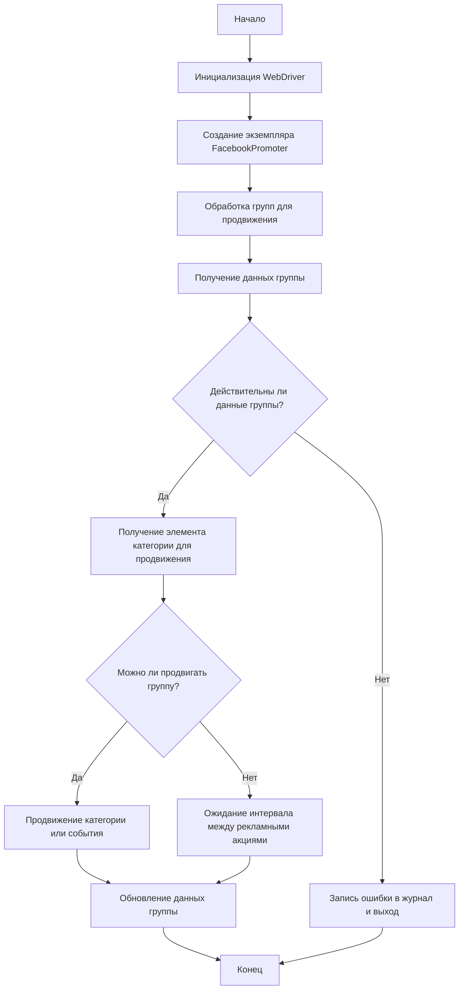

### **Анализ кода модуля `promoter`**

## Качество кода:

- **Соответствие стандартам**: 7/10
- **Плюсы**:
  - Четкая структура документации, охватывающая основные аспекты модуля.
  - Наличие блок-схемы (flowchart), упрощающей понимание логики работы модуля.
  - Примеры использования класса `FacebookPromoter`.
  - Подробное описание методов класса `FacebookPromoter` с указанием аргументов и возвращаемых значений.
- **Минусы**:
  - Отсутствие аннотаций типов в примере использования, что снижает читаемость и возможность проверки типов.
  - Не все методы класса `FacebookPromoter` содержат примеры использования, что затрудняет понимание их работы.
  - В тексте много английского. Весь текст надо перевести на русский.
  - Нет информации об используемой версии Python.
  - Нет информации об установке зависимостей.

## Рекомендации по улучшению:

1.  **Добавить аннотации типов в примере использования**:

    ```python
    from src.endpoints.advertisement.facebook.promoter import FacebookPromoter
    from src.webdriver.driver import Driver
    from src.utils.jjson import j_loads_ns

    # Setup WebDriver instance (replace with actual WebDriver)
    d = Driver(Firefox) # Тут надо указать тип драйвера

    # Create an instance of FacebookPromoter
    promoter = FacebookPromoter(
        d=d,
        promoter="aliexpress",
        group_file_paths=["path/to/group/file1.json", "path/to/group/file2.json"]
    )

    # Start promoting products or events
    promoter.process_groups(
        campaign_name="Campaign1",
        events=[],
        group_categories_to_adv=["sales"],
        language="en",
        currency="USD"
    )
    ```

2.  **Добавить примеры использования для каждого метода класса `FacebookPromoter`**:
   Пример:

```python
##### `validate_group(self, group: SimpleNamespace) -> bool`

    """
    Проверяет данные группы, чтобы убедиться, что у нее есть необходимые атрибуты.

    Args:
        group (SimpleNamespace): Данные группы.

    Returns:
        bool: Определяет, являются ли данные группы допустимыми.

    Example:
        >>> group_data = SimpleNamespace(id='12345', name='Test Group')
        >>> promoter = FacebookPromoter(d=None, promoter='test')
        >>> result = promoter.validate_group(group_data)
        >>> print(result)
        True
    """
```

3.  **Перевести весь текст на русский язык, включая заголовки, описания и комментарии**.

4.  **Добавить информацию об используемой версии Python и способах установки зависимостей**.

5.  **Улучшить удобочитаемость при помощи docstring**

## Оптимизированный код:

```markdown
# Документация модуля Facebook Promoter

## Обзор

Модуль **Facebook Promoter** автоматизирует продвижение товаров и событий AliExpress в группах Facebook. Модуль отвечает за размещение рекламных объявлений в Facebook, гарантируя, что категории и события продвигаются без дубликатов. Он использует WebDriver для автоматизации браузера, чтобы эффективно обрабатывать рекламные акции.

## Возможности модуля

- Продвижение категорий и событий в группах Facebook.
- Предотвращение дублирования рекламных акций путем отслеживания ранее продвигаемых элементов.
- Поддержка настройки данных группы через файлы.
- Возможность отключения загрузки видео в рекламных акциях.

## Требования

-   **Python** 3.x
-   Необходимые библиотеки:
    -   `random`
    -   `datetime`
    -   `pathlib`
    -   `urllib.parse`
    -   `types.SimpleNamespace`
    -   `src` (пользовательский модуль)

## Блок-схема



## Использование

### Пример использования класса FacebookPromoter

```python
from src.endpoints.advertisement.facebook.promoter import FacebookPromoter
from src.webdriver.driver import Driver
from src.utils.jjson import j_loads_ns

# Создание экземпляра WebDriver (замените фактическим WebDriver)
d = Driver(Firefox) # Тип драйвера - Firefox

# Создание экземпляра FacebookPromoter
promoter = FacebookPromoter(
    d=d,
    promoter="aliexpress",
    group_file_paths=["path/to/group/file1.json", "path/to/group/file2.json"]
)

# Начало продвижения товаров или событий
promoter.process_groups(
    campaign_name="Campaign1",
    events=[],
    group_categories_to_adv=["sales"],
    language="en",
    currency="USD"
)
```

## Документация класса

### Класс `FacebookPromoter`

Этот класс управляет процессом продвижения товаров и событий AliExpress в группах Facebook.

#### Методы

##### `__init__(self, d: Driver, promoter: str, group_file_paths: Optional[list[str | Path] | str | Path] = None, no_video: bool = False)`

```python
def __init__(self, d: Driver, promoter: str, group_file_paths: Optional[list[str | Path] | str | Path] = None, no_video: bool = False):
    """
    Инициализирует промоутер Facebook с необходимыми конфигурациями.

    Args:
        d (Driver): Экземпляр WebDriver для автоматизации.
        promoter (str): Название промоутера (например, "aliexpress").
        group_file_paths (Optional[list[str  |  Path]  |  str  |  Path]): Пути к файлам данных группы.
        no_video (bool): Флаг для отключения видео в постах. По умолчанию `False`.

    Example:
        >>> from src.webdriver.driver import Driver
        >>> d = Driver(Firefox)
        >>> promoter = FacebookPromoter(d=d, promoter='aliexpress', group_file_paths=['path/to/group/file1.json'])
    """
    ...
```

##### `promote(self, group: SimpleNamespace, item: SimpleNamespace, is_event: bool = False, language: str = None, currency: str = None) -> bool`

```python
def promote(self, group: SimpleNamespace, item: SimpleNamespace, is_event: bool = False, language: str = None, currency: str = None) -> bool:
    """
    Продвигает категорию или событие в указанной группе Facebook.

    Args:
        group (SimpleNamespace): Данные группы.
        item (SimpleNamespace): Элемент категории или события для продвижения.
        is_event (bool): Является ли элемент событием или нет.
        language (str): Язык продвижения.
        currency (str): Валюта для продвижения.

    Returns:
        bool: Была ли рекламная акция успешной или нет.

    Example:
        >>> from types import SimpleNamespace
        >>> group_data = SimpleNamespace(id='12345', name='Test Group')
        >>> item_data = SimpleNamespace(id='67890', name='Test Item')
        >>> promoter = FacebookPromoter(d=None, promoter='test')
        >>> result = promoter.promote(group_data, item_data)
        >>> print(result)
        False
    """
    ...
```

##### `log_promotion_error(self, is_event: bool, item_name: str)`

```python
def log_promotion_error(self, is_event: bool, item_name: str):
    """
    Регистрирует ошибку при сбое продвижения.

    Args:
        is_event (bool): Является ли элемент событием или нет.
        item_name (str): Название элемента.

    Example:
        >>> promoter = FacebookPromoter(d=None, promoter='test')
        >>> promoter.log_promotion_error(is_event=False, item_name='Test Item')
    """
    ...
```

##### `update_group_promotion_data(self, group: SimpleNamespace, item_name: str, is_event: bool = False)`

```python
def update_group_promotion_data(self, group: SimpleNamespace, item_name: str, is_event: bool = False):
    """
    Обновляет данные группы после продвижения, добавляя продвигаемый элемент в список продвигаемых категорий или событий.

    Args:
        group (SimpleNamespace): Данные группы.
        item_name (str): Название продвигаемого элемента.
        is_event (bool): Является ли элемент событием или нет.

    Example:
        >>> from types import SimpleNamespace
        >>> group_data = SimpleNamespace(promoted_categories=[], promoted_events=[])
        >>> promoter = FacebookPromoter(d=None, promoter='test')
        >>> promoter.update_group_promotion_data(group_data, item_name='Test Item', is_event=False)
        >>> print(group_data.promoted_categories)
        ['Test Item']
    """
    ...
```

##### `process_groups(self, campaign_name: str = None, events: list[SimpleNamespace] = None, is_event: bool = False, group_file_paths: list[str] = None, group_categories_to_adv: list[str] = ['sales'], language: str = None, currency: str = None)`

```python
def process_groups(self, campaign_name: str = None, events: list[SimpleNamespace] = None, is_event: bool = False, group_file_paths: list[str] = None, group_categories_to_adv: list[str] = ['sales'], language: str = None, currency: str = None):
    """
    Обрабатывает группы для текущей кампании или продвижения события.

    Args:
        campaign_name (str): Название кампании.
        events (list[SimpleNamespace]): Список событий для продвижения.
        is_event (bool): Продвигать события или категории.
        group_file_paths (list[str]): Пути к файлам данных группы.
        group_categories_to_adv (list[str]): Категории для продвижения.
        language (str): Язык продвижения.
        currency (str): Валюта для продвижения.

    Example:
        >>> promoter = FacebookPromoter(d=None, promoter='test')
        >>> promoter.process_groups(campaign_name='Test Campaign', group_categories_to_adv=['sales'])
    """
    ...
```

##### `get_category_item(self, campaign_name: str, group: SimpleNamespace, language: str, currency: str) -> SimpleNamespace`

```python
def get_category_item(self, campaign_name: str, group: SimpleNamespace, language: str, currency: str) -> SimpleNamespace:
    """
    Получает элемент категории для продвижения на основе кампании и промоутера.

    Args:
        campaign_name (str): Название кампании.
        group (SimpleNamespace): Данные группы.
        language (str): Язык для продвижения.
        currency (str): Валюта для продвижения.

    Returns:
        SimpleNamespace: Элемент категории для продвижения.

    Example:
        >>> from types import SimpleNamespace
        >>> group_data = SimpleNamespace(id='12345', name='Test Group')
        >>> promoter = FacebookPromoter(d=None, promoter='test')
        >>> item = promoter.get_category_item(campaign_name='Test Campaign', group=group_data, language='en', currency='USD')
        >>> print(item)
        None
    """
    ...
```

##### `check_interval(self, group: SimpleNamespace) -> bool`

```python
def check_interval(self, group: SimpleNamespace) -> bool:
    """
    Проверяет, прошло ли достаточно времени для повторного продвижения этой группы.

    Args:
        group (SimpleNamespace): Данные группы.

    Returns:
        bool: Может ли группа участвовать в продвижении.

    Example:
        >>> from types import SimpleNamespace
        >>> group_data = SimpleNamespace(last_promotion_time=datetime.datetime.now() - datetime.timedelta(days=1))
        >>> promoter = FacebookPromoter(d=None, promoter='test')
        >>> result = promoter.check_interval(group_data)
        >>> print(result)
        True
    """
    ...
```

##### `validate_group(self, group: SimpleNamespace) -> bool`

```python
def validate_group(self, group: SimpleNamespace) -> bool:
    """
    Проверяет данные группы, чтобы убедиться, что у нее есть необходимые атрибуты.

    Args:
        group (SimpleNamespace): Данные группы.

    Returns:
        bool: Определяет, являются ли данные группы допустимыми.

    Example:
        >>> from types import SimpleNamespace
        >>> group_data = SimpleNamespace(id='12345', name='Test Group')
        >>> promoter = FacebookPromoter(d=None, promoter='test')
        >>> result = promoter.validate_group(group_data)
        >>> print(result)
        True
    """
    ...
```

## Лицензия

Этот модуль является частью более крупного пакета **Facebook Promoter** и лицензирован в соответствии с лицензией MIT.