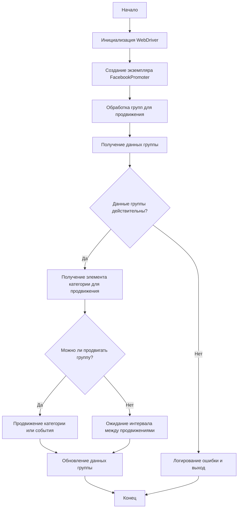

### **Анализ кода модуля `promoter.md`**

**Качество кода:**

- **Соответствие стандартам**: 7/10
- **Плюсы**:
  - Хорошая структурированность и подробное описание функциональности модуля.
  - Наличие блок-схемы для визуализации процесса продвижения.
  - Примеры использования класса `FacebookPromoter`.
  - Подробное описание методов класса `FacebookPromoter`.
- **Минусы**:
  - Отсутствуют примеры использования в docstring для методов.
  - Docstring написаны на английском языке.
  - Не указаны типы возвращаемых значений для некоторых методов в docstring.
  - Нет обработки исключений и логирования.

**Рекомендации по улучшению:**

1.  **Перевод на русский язык**:
    - Перевести все docstring и комментарии на русский язык.
2.  **Добавление примеров использования**:
    - Добавить примеры использования в docstring для каждого метода, чтобы облегчить понимание их работы.
3.  **Указание типов возвращаемых значений**:
    - Указать типы возвращаемых значений для всех методов в docstring.
4.  **Обработка исключений и логирование**:
    - Добавить обработку исключений и логирование для отслеживания ошибок и предупреждений.
5.  **Улучшение структуры docstring**:
    - Привести docstring к единому стилю, как указано в инструкции.

**Оптимизированный код:**

```markdown
# Документация модуля Facebook Promoter

## Обзор

Модуль **Facebook Promoter** автоматизирует продвижение товаров и событий AliExpress в группах Facebook. Модуль отвечает за размещение рекламных акций в Facebook, гарантируя, что категории и события продвигаются без дубликатов. Он использует WebDriver для автоматизации браузера, чтобы эффективно обрабатывать рекламные акции.

## Возможности модуля

- Продвижение категорий и событий в группах Facebook.
- Избежание дублирования рекламных акций путем отслеживания ранее продвигаемых элементов.
- Поддержка настройки данных группы через файлы.
- Возможность отключения загрузки видео в рекламных акциях.

## Требования

- **Python** 3.x
- Необходимые библиотеки:
  - `random`
  - `datetime`
  - `pathlib`
  - `urllib.parse`
  - `types.SimpleNamespace`
  - `src` (пользовательский модуль)

## Блок-схема


```mermaid
flowchart TD
    A[Начало] --> B[Инициализация WebDriver];
    B --> C[Создание экземпляра FacebookPromoter];
    C --> D[Обработка групп для продвижения];
    D --> E[Получение данных группы];
    E --> F{Данные группы действительны?};
    F -- Да --> G[Получение элемента категории для продвижения];
    F -- Нет --> H[Логирование ошибки и выход];
    G --> I{Можно ли продвигать группу?};
    I -- Да --> J[Продвижение категории или события];
    I -- Нет --> K[Ожидание интервала между продвижениями];
    J --> L[Обновление данных группы];
    K --> L;
    L --> M[Конец];
    H --> M;
```

## Использование

### Пример использования класса FacebookPromoter

```python
from src.endpoints.advertisement.facebook.promoter import FacebookPromoter
from src.webdriver.driver import Driver
from src.utils.jjson import j_loads_ns

# Создание инстанса драйвера (пример с Chrome)
d = Driver()

# Создание экземпляра FacebookPromoter
promoter = FacebookPromoter(
    d=d,
    promoter="aliexpress",
    group_file_paths=["path/to/group/file1.json", "path/to/group/file2.json"]
)

# Начало продвижения продуктов или событий
promoter.process_groups(
    campaign_name="Campaign1",
    events=[],
    group_categories_to_adv=["sales"],
    language="en",
    currency="USD"
)
```

## Документация класса

### Класс `FacebookPromoter`

Этот класс управляет процессом продвижения товаров и событий AliExpress в группах Facebook.

#### Методы

##### `__init__(self, d: Driver, promoter: str, group_file_paths: Optional[list[str | Path] | str | Path] = None, no_video: bool = False)`

```python
def __init__(self, d: Driver, promoter: str, group_file_paths: Optional[list[str | Path] | str | Path] = None, no_video: bool = False) -> None:
    """
    Инициализирует промоутер Facebook с необходимыми конфигурациями.

    Args:
        d (Driver): Экземпляр WebDriver для автоматизации.
        promoter (str): Имя промоутера (например, "aliexpress").
        group_file_paths (Optional[list[str | Path] | str | Path]): Пути к файлам данных группы.
        no_video (bool): Флаг для отключения видео в постах. По умолчанию `False`.

    Returns:
        None
    """
    ...
```

##### `promote(self, group: SimpleNamespace, item: SimpleNamespace, is_event: bool = False, language: str = None, currency: str = None) -> bool`

```python
def promote(self, group: SimpleNamespace, item: SimpleNamespace, is_event: bool = False, language: str = None, currency: str = None) -> bool:
    """
    Продвигает категорию или событие в указанной группе Facebook.

    Args:
        group (SimpleNamespace): Данные группы.
        item (SimpleNamespace): Элемент категории или события для продвижения.
        is_event (bool): Является ли элемент событием или нет.
        language (str): Язык продвижения.
        currency (str): Валюта для продвижения.

    Returns:
        bool: Успешно ли прошло продвижение или нет.

    Example:
        >>> group = SimpleNamespace(id='123', name='Test Group')
        >>> item = SimpleNamespace(title='Test Item', link='http://example.com')
        >>> promoter = FacebookPromoter(d=Driver(), promoter='test')
        >>> result = promoter.promote(group, item, is_event=False, language='ru', currency='USD')
        >>> print(result)
        False
    """
    ...
```

##### `log_promotion_error(self, is_event: bool, item_name: str)`

```python
def log_promotion_error(self, is_event: bool, item_name: str) -> None:
    """
    Логирует ошибку, когда продвижение не удается.

    Args:
        is_event (bool): Является ли элемент событием или нет.
        item_name (str): Название элемента.

    Returns:
        None
    """
    ...
```

##### `update_group_promotion_data(self, group: SimpleNamespace, item_name: str, is_event: bool = False)`

```python
def update_group_promotion_data(self, group: SimpleNamespace, item_name: str, is_event: bool = False) -> None:
    """
    Обновляет данные группы после продвижения, добавляя продвигаемый элемент в список продвигаемых категорий или событий.

    Args:
        group (SimpleNamespace): Данные группы.
        item_name (str): Название элемента, который был продвинут.
        is_event (bool): Является ли элемент событием или нет.

    Returns:
        None
    """
    ...
```

##### `process_groups(self, campaign_name: str = None, events: list[SimpleNamespace] = None, is_event: bool = False, group_file_paths: list[str] = None, group_categories_to_adv: list[str] = ['sales'], language: str = None, currency: str = None)`

```python
def process_groups(self, campaign_name: str = None, events: list[SimpleNamespace] = None, is_event: bool = False, group_file_paths: list[str] = None, group_categories_to_adv: list[str] = ['sales'], language: str = None, currency: str = None) -> None:
    """
    Обрабатывает группы для текущей кампании или продвижения событий.

    Args:
        campaign_name (str): Название кампании.
        events (list[SimpleNamespace]): Список событий для продвижения.
        is_event (bool): Продвигать события или категории.
        group_file_paths (list[str]): Пути к файлам данных группы.
        group_categories_to_adv (list[str]): Категории для продвижения.
        language (str): Язык продвижения.
        currency (str): Валюта для продвижения.

    Returns:
        None
    """
    ...
```

##### `get_category_item(self, campaign_name: str, group: SimpleNamespace, language: str, currency: str) -> SimpleNamespace`

```python
def get_category_item(self, campaign_name: str, group: SimpleNamespace, language: str, currency: str) -> SimpleNamespace:
    """
    Извлекает элемент категории для продвижения на основе кампании и промоутера.

    Args:
        campaign_name (str): Название кампании.
        group (SimpleNamespace): Данные группы.
        language (str): Язык для продвижения.
        currency (str): Валюта для продвижения.

    Returns:
        SimpleNamespace: Элемент категории для продвижения.
    """
    ...
```

##### `check_interval(self, group: SimpleNamespace) -> bool`

```python
def check_interval(self, group: SimpleNamespace) -> bool:
    """
    Проверяет, достаточно ли времени прошло для повторного продвижения этой группы.

    Args:
        group (SimpleNamespace): Данные группы.

    Returns:
        bool: Может ли группа быть продвинута.
    """
    ...
```

##### `validate_group(self, group: SimpleNamespace) -> bool`

```python
def validate_group(self, group: SimpleNamespace) -> bool:
    """
    Проверяет данные группы, чтобы убедиться, что у нее есть необходимые атрибуты.

    Args:
        group (SimpleNamespace): Данные группы.

    Returns:
        bool: Действительны ли данные группы.
    """
    ...
```

## Лицензия

Этот модуль является частью большего пакета **Facebook Promoter** и лицензируется в соответствии с лицензией MIT.