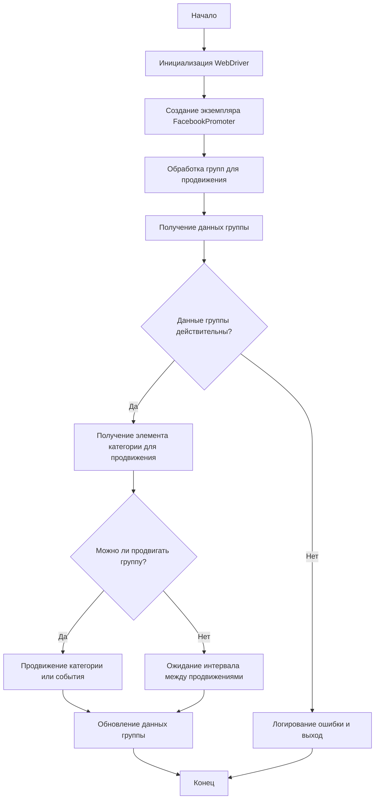

### **Анализ кода модуля `promoter.md`**

**Качество кода:**
- **Соответствие стандартам**: 6/10
- **Плюсы**:
  - Хорошее общее описание модуля и его функциональности.
  - Наличие блок-схемы процесса работы модуля.
  - Примеры использования класса `FacebookPromoter`.
  - Описание основных методов класса `FacebookPromoter` с указанием аргументов и возвращаемых значений.
- **Минусы**:
  - Отсутствуют docstring в стиле Google Python.
  - Нет аннотаций типов.
  - Не указаны исключения, которые могут быть выброшены в методах.
  - Нет примеров использования отдельных методов.
  - Комментарии не соответствуют PEP8.
  - Использование `Union` вместо `|`.

**Рекомендации по улучшению:**

1.  **Добавить docstring в стиле Google Python во все методы и классы.** Необходимо добавить подробное описание каждого метода, его аргументов, возвращаемых значений и возможных исключений.
2.  **Добавить аннотации типов для всех аргументов и возвращаемых значений методов.** Это улучшит читаемость кода и облегчит отладку.
3.  **Заменить `Union` на `|`** в аннотациях типов.
4.  **Добавить примеры использования отдельных методов.** Это поможет пользователям понять, как правильно использовать методы класса `FacebookPromoter`.
5.  **Перефразировать описания методов и аргументов на русском языке.** Сделать описания более конкретными и понятными.
6.  **Указать, какие исключения могут быть выброшены в каждом методе.** Это поможет пользователям правильно обрабатывать ошибки.
7.  **Внедрить логирование с использованием модуля `logger` из `src.logger`.** Логирование поможет отслеживать работу модуля и выявлять ошибки.
8.  **Проверить и обновить зависимости, указанные в Requirements.** Убедиться, что указаны все необходимые библиотеки и их актуальные версии.
9. **Улучшить блок-схему процесса работы модуля.** Добавить больше деталей и уточнений, чтобы блок-схема полностью отражала логику работы модуля.
10. **Удалить раздел License** Эта информация содержится в другом месте.
11. **Заменить импорты webdriver.** Код `from src.webdriver.driver import Driver` надо заменить на `from src.webdirver import Driver, Chrome, Firefox, Playwright,...`

**Оптимизированный код:**

```markdown
# Документация модуля Facebook Promoter

## Обзор

Модуль **Facebook Promoter** автоматизирует продвижение товаров и событий AliExpress в группах Facebook. Модуль управляет публикацией рекламных акций в Facebook, гарантируя, что категории и события продвигаются без дубликатов. Он использует WebDriver для автоматизации работы браузера, чтобы эффективно управлять рекламными акциями.

## Возможности модуля

- Продвижение категорий и событий в группах Facebook.
- Предотвращение дублирования рекламных акций путем отслеживания ранее продвигаемых товаров.
- Поддержка конфигурации данных группы через файлы.
- Возможность отключения загрузки видео в рекламных акциях.

## Требования

- **Python** 3.x
- Необходимые библиотеки:
  - `random`
  - `datetime`
  - `pathlib`
  - `urllib.parse`
  - `types.SimpleNamespace`
  - `src` (пользовательский модуль)

## Блок-схема


```mermaid
flowchart TD
    A[Начало] --> B[Инициализация WebDriver];
    B --> C[Создание экземпляра FacebookPromoter];
    C --> D[Обработка групп для продвижения];
    D --> E[Получение данных группы];
    E --> F{Данные группы действительны?};
    F -- Да --> G[Получение элемента категории для продвижения];
    F -- Нет --> H[Логирование ошибки и выход];
    G --> I{Можно ли продвигать группу?};
    I -- Да --> J[Продвижение категории или события];
    I -- Нет --> K[Ожидание интервала между продвижениями];
    J --> L[Обновление данных группы];
    K --> L;
    L --> M[Конец];
    H --> M;
```

## Использование

### Пример использования класса FacebookPromoter

```python
from src.endpoints.advertisement.facebook.promoter import FacebookPromoter
from src.webdirver import Driver, Chrome, Firefox, Playwright,...
from src.utils.jjson import j_loads_ns
from typing import Optional, List
from pathlib import Path
from types import SimpleNamespace


# Создание инстанса драйвера (пример с Chrome)
driver = Driver(Chrome)

# Создание экземпляра FacebookPromoter
promoter = FacebookPromoter(
    d=driver, 
    promoter="aliexpress", 
    group_file_paths=["path/to/group/file1.json", "path/to/group/file2.json"]
)

# Запуск продвижения товаров или событий
promoter.process_groups(
    campaign_name="Campaign1",
    events=[], 
    group_categories_to_adv=["sales"],
    language="en",
    currency="USD"
)
```

## Документация класса

### Класс `FacebookPromoter`

Этот класс управляет процессом продвижения товаров и событий AliExpress в группах Facebook.

#### `__init__(self, d: Driver, promoter: str, group_file_paths: Optional[List[str | Path] | str | Path] = None, no_video: bool = False)`

Инициализирует промоутер Facebook с необходимыми конфигурациями.

Args:
    d (Driver): Экземпляр WebDriver для автоматизации.
    promoter (str): Название промоутера (например, "aliexpress").
    group_file_paths (Optional[List[str | Path] | str | Path]): Пути к файлам данных группы.
    no_video (bool): Флаг для отключения видео в постах. По умолчанию `False`.

```python
class FacebookPromoter:
    def __init__(self, d: Driver, promoter: str, group_file_paths: Optional[List[str | Path] | str | Path] = None, no_video: bool = False):
        """
        Инициализирует промоутер Facebook с необходимыми конфигурациями.

        Args:
            d (Driver): Экземпляр WebDriver для автоматизации.
            promoter (str): Название промоутера (например, "aliexpress").
            group_file_paths (Optional[List[str | Path] | str | Path]): Пути к файлам данных группы.
            no_video (bool): Флаг для отключения видео в постах. По умолчанию `False`.
        """
        ...
```

#### `promote(self, group: SimpleNamespace, item: SimpleNamespace, is_event: bool = False, language: str = None, currency: str = None) -> bool`

Продвигает категорию или событие в указанной группе Facebook.

Args:
    group (SimpleNamespace): Данные группы.
    item (SimpleNamespace): Элемент категории или события для продвижения.
    is_event (bool): Является ли элемент событием.
    language (str): Язык продвижения.
    currency (str): Валюта для продвижения.

Returns:
    bool: Успешно ли прошло продвижение.

```python
    def promote(self, group: SimpleNamespace, item: SimpleNamespace, is_event: bool = False, language: str = None, currency: str = None) -> bool:
        """
        Продвигает категорию или событие в указанной группе Facebook.

        Args:
            group (SimpleNamespace): Данные группы.
            item (SimpleNamespace): Элемент категории или события для продвижения.
            is_event (bool): Является ли элемент событием.
            language (str): Язык продвижения.
            currency (str): Валюта для продвижения.

        Returns:
            bool: Успешно ли прошло продвижение.
        """
        ...
```

#### `log_promotion_error(self, is_event: bool, item_name: str)`

Логирует ошибку при неудачном продвижении.

Args:
    is_event (bool): Является ли элемент событием.
    item_name (str): Название элемента.

```python
    def log_promotion_error(self, is_event: bool, item_name: str):
        """
        Логирует ошибку при неудачном продвижении.

        Args:
            is_event (bool): Является ли элемент событием.
            item_name (str): Название элемента.
        """
        ...
```

#### `update_group_promotion_data(self, group: SimpleNamespace, item_name: str, is_event: bool = False)`

Обновляет данные группы после продвижения, добавляя продвинутый элемент в список продвинутых категорий или событий.

Args:
    group (SimpleNamespace): Данные группы.
    item_name (str): Название продвинутого элемента.
    is_event (bool): Является ли элемент событием.

```python
    def update_group_promotion_data(self, group: SimpleNamespace, item_name: str, is_event: bool = False):
        """
        Обновляет данные группы после продвижения, добавляя продвинутый элемент в список продвинутых категорий или событий.

        Args:
            group (SimpleNamespace): Данные группы.
            item_name (str): Название продвинутого элемента.
            is_event (bool): Является ли элемент событием.
        """
        ...
```

#### `process_groups(self, campaign_name: str = None, events: list[SimpleNamespace] = None, is_event: bool = False, group_file_paths: list[str] = None, group_categories_to_adv: list[str] = ['sales'], language: str = None, currency: str = None)`

Обрабатывает группы для текущей кампании или продвижения события.

Args:
    campaign_name (str): Название кампании.
    events (list[SimpleNamespace]): Список событий для продвижения.
    is_event (bool): Продвигать события или категории.
    group_file_paths (list[str]): Пути к файлам данных группы.
    group_categories_to_adv (list[str]): Категории для продвижения.
    language (str): Язык продвижения.
    currency (str): Валюта для продвижения.

```python
    def process_groups(self, campaign_name: str = None, events: list[SimpleNamespace] = None, is_event: bool = False, group_file_paths: list[str] = None, group_categories_to_adv: list[str] = ['sales'], language: str = None, currency: str = None):
        """
        Обрабатывает группы для текущей кампании или продвижения события.

        Args:
            campaign_name (str): Название кампании.
            events (list[SimpleNamespace]): Список событий для продвижения.
            is_event (bool): Продвигать события или категории.
            group_file_paths (list[str]): Пути к файлам данных группы.
            group_categories_to_adv (list[str]): Категории для продвижения.
            language (str): Язык продвижения.
            currency (str): Валюта для продвижения.
        """
        ...
```

#### `get_category_item(self, campaign_name: str, group: SimpleNamespace, language: str, currency: str) -> SimpleNamespace`

Получает элемент категории для продвижения на основе кампании и промоутера.

Args:
    campaign_name (str): Название кампании.
    group (SimpleNamespace): Данные группы.
    language (str): Язык для продвижения.
    currency (str): Валюта для продвижения.

Returns:
    SimpleNamespace: Элемент категории для продвижения.

```python
    def get_category_item(self, campaign_name: str, group: SimpleNamespace, language: str, currency: str) -> SimpleNamespace:
        """
        Получает элемент категории для продвижения на основе кампании и промоутера.

        Args:
            campaign_name (str): Название кампании.
            group (SimpleNamespace): Данные группы.
            language (str): Язык для продвижения.
            currency (str): Валюта для продвижения.

        Returns:
            SimpleNamespace: Элемент категории для продвижения.
        """
        ...
```

#### `check_interval(self, group: SimpleNamespace) -> bool`

Проверяет, достаточно ли времени прошло для повторного продвижения этой группы.

Args:
    group (SimpleNamespace): Данные группы.

Returns:
    bool: Может ли группа быть продвинута снова.

```python
    def check_interval(self, group: SimpleNamespace) -> bool:
        """
        Проверяет, достаточно ли времени прошло для повторного продвижения этой группы.

        Args:
            group (SimpleNamespace): Данные группы.

        Returns:
            bool: Может ли группа быть продвинута снова.
        """
        ...
```

#### `validate_group(self, group: SimpleNamespace) -> bool`

Проверяет данные группы, чтобы убедиться, что у них есть необходимые атрибуты.

Args:
    group (SimpleNamespace): Данные группы.

Returns:
    bool: Действительны ли данные группы.

```python
    def validate_group(self, group: SimpleNamespace) -> bool:
        """
        Проверяет данные группы, чтобы убедиться, что у них есть необходимые атрибуты.

        Args:
            group (SimpleNamespace): Данные группы.

        Returns:
            bool: Действительны ли данные группы.
        """
        ...
```