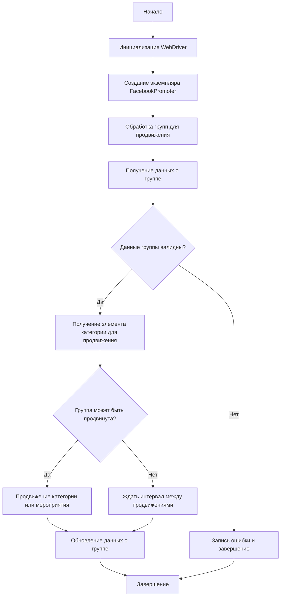

### **Анализ кода модуля `facebook/promoter.ru.md`**

## Качество кода:

- **Соответствие стандартам**: 7/10
- **Плюсы**:
  - Модуль содержит подробное описание функциональности и структуры класса `FacebookPromoter`.
  - Приведено описание основных методов класса и их аргументов.
  - Имеется наглядная схема процесса продвижения в виде flowchart.
- **Минусы**:
  - Отсутствует описание назначения модуля и структуры в начале файла.
  - Необходимо добавить примеры использования методов.
  - Не указаны типы данных в описаниях аргументов функций, в соотвествии с системными инструкциями.
  - Нет примеров кода.
  - Нет информации об используемом логгере, и веб драйвере.

## Рекомендации по улучшению:

1.  **Добавить заголовок и описание модуля**:
    - В начале файла добавить заголовок и краткое описание модуля, используя стиль, указанный в системных инструкциях.
    - Это поможет понять назначение модуля и его основные функции.
2.  **Добавить примеры использования методов**:
    - Для каждого метода класса `FacebookPromoter` добавить примеры использования, чтобы облегчить понимание их работы.
3.  **Указывать типы данных в описаниях аргументов функций**:
    - В документации к методам класса `FacebookPromoter` необходимо указать типы данных для аргументов, чтобы повысить читаемость и понимание кода.
4.  **Улучшить описание ошибок и логирование**:
    - Добавить информацию о том, как обрабатываются ошибки и как используется логирование.
    - Указать, что для логирования используется модуль `logger` из `src.logger`.
5.  **Документировать использование WebDriver**:
    - Добавить информацию об использовании WebDriver, указать, что он импортируется из `src.webdriver.driver` и как он используется в коде.
6.  **Добавить примеры кода**:
    - Включить примеры кода, демонстрирующие использование основных функций и классов модуля.
7.  **Привести docstring в соответствие со стандартом оформления**
    - Необходимо перевести docstring на русский язык
    - Необходимо привести оформление docstring в соответствие с инструкциями
8.  **Проверить и обновить информацию о лицензии**:
    - Убедиться, что информация о лицензии актуальна и соответствует действительности.

## Оптимизированный код:

```markdown
# Документация модуля Facebook Promoter
# ======================================

"""
Модуль Facebook Promoter автоматизирует продвижение товаров и мероприятий AliExpress в группах Facebook.
Модуль управляет публикациями рекламных материалов на Facebook, избегая дублирования.
Для эффективного продвижения используется WebDriver для автоматизации браузера.

Пример использования
----------------------

>>> from src.endpoints.advertisement.facebook.promoter import FacebookPromoter
>>> from src.webdriver.driver import Driver
>>> from src.utils.jjson import j_loads_ns
>>>
>>> # Настройка экземпляра WebDriver (замените на реальный WebDriver)
>>> d = Driver()
>>>
>>> # Создание экземпляра FacebookPromoter
>>> promoter = FacebookPromoter(
...     d=d,
...     promoter="aliexpress",
...     group_file_paths=["path/to/group/file1.json", "path/to/group/file2.json"]
... )
>>>
>>> # Начало продвижения товаров или мероприятий
>>> promoter.process_groups(
...     campaign_name="Campaign1",
...     events=[],
...     group_categories_to_adv=["sales"],
...     language="en",
...     currency="USD"
... )
"""

## Обзор

Модуль **Facebook Promoter** автоматизирует продвижение товаров и мероприятий AliExpress в группах Facebook. Модуль управляет публикациями рекламных материалов на Facebook, избегая дублирования. Для эффективного продвижения используется WebDriver для автоматизации браузера.

## Особенности модуля

- Продвижение категорий и мероприятий в группах Facebook.
- Избежание дублирования публикаций через отслеживание уже опубликованных элементов.
- Поддержка конфигурации данных групп через файлы.
- Возможность отключения загрузки видео в публикациях.

## Требования

- **Python** 3.x
- Необходимые библиотеки:
  - `random`
  - `datetime`
  - `pathlib`
  - `urllib.parse`
  - `types.SimpleNamespace`
  - `src` (пользовательский модуль)

## Использование

### Пример использования класса FacebookPromoter

```python
from src.endpoints.advertisement.facebook.promoter import FacebookPromoter
from src.webdriver.driver import Driver
from src.utils.jjson import j_loads_ns

# Настройка экземпляра WebDriver (замените на реальный WebDriver)
d = Driver()

# Создание экземпляра FacebookPromoter
promoter = FacebookPromoter(
    d=d, 
    promoter="aliexpress", 
    group_file_paths=["path/to/group/file1.json", "path/to/group/file2.json"]
)

# Начало продвижения товаров или мероприятий
promoter.process_groups(
    campaign_name="Campaign1",
    events=[], 
    group_categories_to_adv=["sales"],
    language="en",
    currency="USD"
)
```

## Документация классов

### Класс `FacebookPromoter`

Этот класс управляет процессом продвижения товаров и мероприятий AliExpress в группах Facebook.



#### Методы

##### `__init__(self, d: Driver, promoter: str, group_file_paths: Optional[list[str | Path] | str | Path] = None, no_video: bool = False)`

```python
    def __init__(self, d: Driver, promoter: str, group_file_paths: Optional[list[str | Path] | str | Path] = None, no_video: bool = False):
        """
        Инициализирует промоутер для Facebook с необходимыми конфигурациями.

        Args:
            d (Driver): Экземпляр WebDriver для автоматизации.
            promoter (str): Имя промоутера (например, "aliexpress").
            group_file_paths (Optional[list[str | Path] | str | Path]): Пути к файлам с данными групп.
            no_video (bool): Флаг для отключения видео в публикациях. По умолчанию False.

        Example:
            >>> from src.webdriver.driver import Driver
            >>> d = Driver()
            >>> promoter = FacebookPromoter(d=d, promoter="aliexpress", group_file_paths=["path/to/group/file1.json"])
        """
```

##### `promote(self, group: SimpleNamespace, item: SimpleNamespace, is_event: bool = False, language: str = None, currency: str = None) -> bool`

```python
    def promote(self, group: SimpleNamespace, item: SimpleNamespace, is_event: bool = False, language: str = None, currency: str = None) -> bool:
        """
        Продвигает категорию или мероприятие в указанной группе Facebook.

        Args:
            group (SimpleNamespace): Данные группы.
            item (SimpleNamespace): Категория или мероприятие для продвижения.
            is_event (bool): Является ли элемент мероприятием.
            language (str): Язык публикации.
            currency (str): Валюта для продвижения.

        Returns:
            bool: Успешно ли прошло продвижение.

        Example:
            >>> from types import SimpleNamespace
            >>> group_data = SimpleNamespace(id="123", name="Test Group")
            >>> item_data = SimpleNamespace(title="Test Item", url="http://example.com")
            >>> promoter = FacebookPromoter(d=Driver())
            >>> result = promoter.promote(group=group_data, item=item_data)
            >>> print(result)
            False
        """
```

##### `log_promotion_error(self, is_event: bool, item_name: str)`

```python
    def log_promotion_error(self, is_event: bool, item_name: str):
        """
        Записывает ошибку, если продвижение не удалось.

        Args:
            is_event (bool): Является ли элемент мероприятием.
            item_name (str): Название элемента.

        Example:
            >>> promoter = FacebookPromoter(d=Driver())
            >>> promoter.log_promotion_error(is_event=True, item_name="Test Event")
        """
```

##### `update_group_promotion_data(self, group: SimpleNamespace, item_name: str, is_event: bool = False)`

```python
    def update_group_promotion_data(self, group: SimpleNamespace, item_name: str, is_event: bool = False):
        """
        Обновляет данные группы после продвижения, добавляя продвигаемый элемент в список продвигаемых категорий или мероприятий.

        Args:
            group (SimpleNamespace): Данные группы.
            item_name (str): Название продвигаемого элемента.
            is_event (bool): Является ли элемент мероприятием.

        Example:
            >>> from types import SimpleNamespace
            >>> group_data = SimpleNamespace(promoted_items=[])
            >>> promoter = FacebookPromoter(d=Driver())
            >>> promoter.update_group_promotion_data(group=group_data, item_name="Test Item")
            >>> print(group_data.promoted_items)
            ['Test Item']
        """
```

##### `process_groups(self, campaign_name: str = None, events: list[SimpleNamespace] = None, is_event: bool = False, group_file_paths: list[str] = None, group_categories_to_adv: list[str] = ['sales'], language: str = None, currency: str = None)`

```python
    def process_groups(self, campaign_name: str = None, events: list[SimpleNamespace] = None, is_event: bool = False, group_file_paths: list[str] = None, group_categories_to_adv: list[str] = ['sales'], language: str = None, currency: str = None):
        """
        Обрабатывает группы для текущей кампании или продвижения мероприятия.

        Args:
            campaign_name (str): Название кампании.
            events (list[SimpleNamespace]): Список мероприятий для продвижения.
            is_event (bool): Является ли продвижение мероприятий или категорий.
            group_file_paths (list[str]): Пути к файлам с данными групп.
            group_categories_to_adv (list[str]): Категории для продвижения.
            language (str): Язык публикации.
            currency (str): Валюта для продвижения.

        Example:
            >>> promoter = FacebookPromoter(d=Driver())
            >>> promoter.process_groups(campaign_name="Test Campaign", group_file_paths=["path/to/group/file1.json"])
        """
```

##### `get_category_item(self, campaign_name: str, group: SimpleNamespace, language: str, currency: str) -> SimpleNamespace`

```python
    def get_category_item(self, campaign_name: str, group: SimpleNamespace, language: str, currency: str) -> SimpleNamespace:
        """
        Получает элемент категории для продвижения в зависимости от кампании и промоутера.

        Args:
            campaign_name (str): Название кампании.
            group (SimpleNamespace): Данные группы.
            language (str): Язык для публикации.
            currency (str): Валюта для публикации.

        Returns:
            SimpleNamespace: Элемент категории для продвижения.

        Example:
            >>> from types import SimpleNamespace
            >>> group_data = SimpleNamespace()
            >>> promoter = FacebookPromoter(d=Driver())
            >>> item = promoter.get_category_item(campaign_name="Test Campaign", group=group_data, language="en", currency="USD")
            >>> print(item)
            None
        """
```

##### `check_interval(self, group: SimpleNamespace) -> bool`

```python
    def check_interval(self, group: SimpleNamespace) -> bool:
        """
        Проверяет, прошло ли достаточно времени, чтобы снова продвигать эту группу.

        Args:
            group (SimpleNamespace): Данные группы.

        Returns:
            bool: Можно ли снова продвигать группу.

        Example:
            >>> from types import SimpleNamespace
            >>> group_data = SimpleNamespace(last_promotion_time=datetime.datetime.now())
            >>> promoter = FacebookPromoter(d=Driver())
            >>> result = promoter.check_interval(group=group_data)
            >>> print(result)
            True
        """
```

##### `validate_group(self, group: SimpleNamespace) -> bool`

```python
    def validate_group(self, group: SimpleNamespace) -> bool:
        """
        Проверяет данные группы, чтобы убедиться в их корректности.

        Args:
            group (SimpleNamespace): Данные группы.

        Returns:
            bool: Корректны ли данные группы.

        Example:
            >>> from types import SimpleNamespace
            >>> group_data = SimpleNamespace(id="123", name="Test Group")
            >>> promoter = FacebookPromoter(d=Driver())
            >>> result = promoter.validate_group(group=group_data)
            >>> print(result)
            True
        """
```

## Лицензия

Модуль является частью пакета **Facebook Promoter** и лицензируется по лицензии MIT.