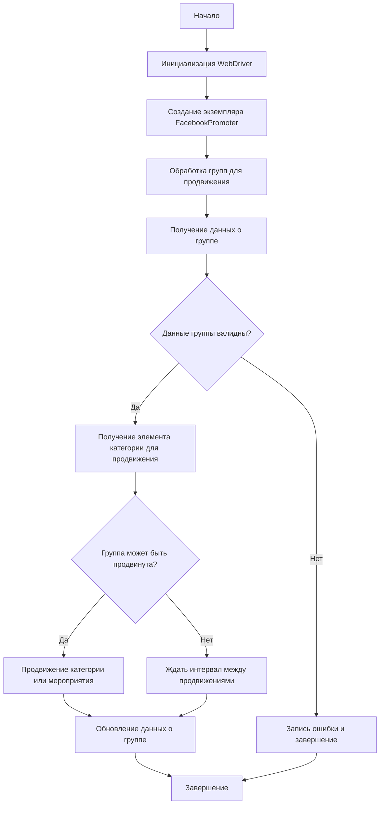

### **Анализ кода модуля `promoter.ru.md`**

## \file /hypotez/src/endpoints/advertisement/facebook/promoter.ru.md

**Качество кода**:

- **Соответствие стандартам**: 6/10
- **Плюсы**:
    - Описание модуля и его функциональности достаточно подробное.
    - Приведены примеры использования и структура классов.
    - Имеется блок-схема, визуализирующая логику работы модуля.
- **Минусы**:
    - Отсутствует единообразие в стиле документации (использование как обычного текста, так и Markdown).
    - Нет аннотаций типов в описании аргументов методов.
    - Отсутствует информация о возможных исключениях (`Raises`) в описаниях методов.
    - Нет структуры оформления, как в шаблоне.

**Рекомендации по улучшению**:

1.  **Приведение к единому стилю Markdown**:
    - Переформатировать текст в соответствии со стандартами Markdown, включая заголовки, списки и код.

2.  **Добавление аннотаций типов в документацию методов**:
    - Указывать типы данных для аргументов и возвращаемых значений в описаниях методов.

3.  **Добавление информации об исключениях**:
    - Включать информацию о возможных исключениях в описания методов.

4.  **Использовать docstring в коде**:
    - Весь код должен быть в docstring
    - Весь код должен быть отформатирован, как указано в шаблоне.

5.  **Улучшение комментариев**:
    - Сделай подробные объяснения в комментариях. Избегай расплывчатых терминов, таких как *«получить»* или *«делать»*. Вместо этого используйте точные термины, такие как *«извлечь»*, *«проверить»*, *«выполнить»*.
    - Вместо: *«получаем»*, *«возвращаем»*, *«преобразовываем»* используй имя объекта *«функция получае»*, *«переменная возвращает»*, *«код преобразовывает»*
    - Комментарии должны непосредственно предшествовать описываемому блоку кода и объяснять его назначение.

**Оптимизированный код**:

```markdown
# Документация модуля Facebook Promoter

## Обзор

Модуль **Facebook Promoter** автоматизирует продвижение товаров и мероприятий AliExpress в группах Facebook. Модуль управляет публикациями рекламных материалов на Facebook, избегая дублирования. Для эффективного продвижения используется WebDriver для автоматизации браузера.

## Особенности модуля

- Продвижение категорий и мероприятий в группах Facebook.
- Избежание дублирования публикаций через отслеживание уже опубликованных элементов.
- Поддержка конфигурации данных групп через файлы.
- Возможность отключения загрузки видео в публикациях.

## Требования

- **Python** 3.x
- Необходимые библиотеки:
    - `random`
    - `datetime`
    - `pathlib`
    - `urllib.parse`
    - `types.SimpleNamespace`
    - `src` (пользовательский модуль)

## Использование

### Пример использования класса FacebookPromoter

```python
from src.endpoints.advertisement.facebook.promoter import FacebookPromoter
from src.webdriver.driver import Driver
from src.utils.jjson import j_loads_ns

# Создание экземпляра WebDriver (замените на реальный WebDriver)
d = Driver()

# Создание экземпляра FacebookPromoter
promoter = FacebookPromoter(
    d=d,
    promoter="aliexpress",
    group_file_paths=["path/to/group/file1.json", "path/to/group/file2.json"]
)

# Начало продвижения товаров или мероприятий
promoter.process_groups(
    campaign_name="Campaign1",
    events=[],
    group_categories_to_adv=["sales"],
    language="en",
    currency="USD"
)
```

## Документация классов

### Класс `FacebookPromoter`

Этот класс управляет процессом продвижения товаров и мероприятий AliExpress в группах Facebook.



#### Методы

##### `__init__(self, d: Driver, promoter: str, group_file_paths: Optional[list[str | Path] | str | Path] = None, no_video: bool = False)`

```python
def __init__(self, d: Driver, promoter: str, group_file_paths: Optional[list[str | Path] | str | Path] = None, no_video: bool = False) -> None:
    """
    Инициализирует промоутер для Facebook с необходимыми конфигурациями.

    Args:
        d (Driver): Экземпляр WebDriver для автоматизации.
        promoter (str): Имя промоутера (например, "aliexpress").
        group_file_paths (Optional[list[str | Path] | str | Path], optional): Пути к файлам с данными групп. По умолчанию None.
        no_video (bool, optional): Флаг для отключения видео в публикациях. По умолчанию False.

    Raises:
        TypeError: Если `d` не является экземпляром класса `Driver`.
        ValueError: Если `promoter` не является строкой.

    Example:
        >>> from src.webdriver.driver import Driver
        >>> d = Driver()
        >>> promoter = FacebookPromoter(d=d, promoter='aliexpress', group_file_paths=['path/to/group/file1.json'])
    """
    ...
```

##### `promote(self, group: SimpleNamespace, item: SimpleNamespace, is_event: bool = False, language: str = None, currency: str = None) -> bool`

```python
def promote(self, group: SimpleNamespace, item: SimpleNamespace, is_event: bool = False, language: str = None, currency: str = None) -> bool:
    """
    Продвигает категорию или мероприятие в указанной группе Facebook.

    Args:
        group (SimpleNamespace): Данные группы.
        item (SimpleNamespace): Категория или мероприятие для продвижения.
        is_event (bool, optional): Является ли элемент мероприятием. По умолчанию False.
        language (str, optional): Язык публикации. По умолчанию None.
        currency (str, optional): Валюта для продвижения. По умолчанию None.

    Returns:
        bool: Успешно ли прошло продвижение.

    Raises:
        ValueError: Если `group` или `item` не являются экземплярами `SimpleNamespace`.
        Exception: Если во время продвижения возникла непредвиденная ошибка.

    Example:
        >>> from types import SimpleNamespace
        >>> group_data = SimpleNamespace(id='123', name='Test Group')
        >>> item_data = SimpleNamespace(id='456', title='Test Item')
        >>> promoter.promote(group=group_data, item=item_data, language='en', currency='USD')
        True
    """
    ...
```

##### `log_promotion_error(self, is_event: bool, item_name: str)`

```python
def log_promotion_error(self, is_event: bool, item_name: str) -> None:
    """
    Записывает ошибку, если продвижение не удалось.

    Args:
        is_event (bool): Является ли элемент мероприятием.
        item_name (str): Название элемента.

    Raises:
        ValueError: Если `item_name` не является строкой.
        Exception: Если произошла ошибка во время записи лога.

    Example:
        >>> promoter.log_promotion_error(is_event=False, item_name='Test Item')
    """
    ...
```

##### `update_group_promotion_data(self, group: SimpleNamespace, item_name: str, is_event: bool = False)`

```python
def update_group_promotion_data(self, group: SimpleNamespace, item_name: str, is_event: bool = False) -> None:
    """
    Обновляет данные группы после продвижения, добавляя продвигаемый элемент в список продвигаемых категорий или мероприятий.

    Args:
        group (SimpleNamespace): Данные группы.
        item_name (str): Название продвигаемого элемента.
        is_event (bool, optional): Является ли элемент мероприятием. По умолчанию False.

    Raises:
        ValueError: Если `group` не является экземпляром `SimpleNamespace` или `item_name` не является строкой.
        Exception: Если во время обновления данных группы возникла непредвиденная ошибка.

    Example:
        >>> from types import SimpleNamespace
        >>> group_data = SimpleNamespace(id='123', promoted_items=[])
        >>> promoter.update_group_promotion_data(group=group_data, item_name='Test Item')
    """
    ...
```

##### `process_groups(self, campaign_name: str = None, events: list[SimpleNamespace] = None, is_event: bool = False, group_file_paths: list[str] = None, group_categories_to_adv: list[str] = ['sales'], language: str = None, currency: str = None)`

```python
def process_groups(self, campaign_name: str = None, events: list[SimpleNamespace] = None, is_event: bool = False, group_file_paths: list[str] = None, group_categories_to_adv: list[str] = ['sales'], language: str = None, currency: str = None) -> None:
    """
    Обрабатывает группы для текущей кампании или продвижения мероприятия.

    Args:
        campaign_name (str, optional): Название кампании. По умолчанию None.
        events (list[SimpleNamespace], optional): Список мероприятий для продвижения. По умолчанию None.
        is_event (bool, optional): Является ли продвижение мероприятий или категорий. По умолчанию False.
        group_file_paths (list[str], optional): Пути к файлам с данными групп. По умолчанию None.
        group_categories_to_adv (list[str], optional): Категории для продвижения. По умолчанию ['sales'].
        language (str, optional): Язык публикации. По умолчанию None.
        currency (str, optional): Валюта для продвижения. По умолчанию None.

    Raises:
        ValueError: Если `group_categories_to_adv` не является списком или `campaign_name` не является строкой.
        FileNotFoundError: Если не найден ни один из файлов групп, указанных в `group_file_paths`.
        Exception: Если во время обработки групп возникла непредвиденная ошибка.

    Example:
        >>> promoter.process_groups(campaign_name='Campaign1', group_categories_to_adv=['sales'])
    """
    ...
```

##### `get_category_item(self, campaign_name: str, group: SimpleNamespace, language: str, currency: str) -> SimpleNamespace`

```python
def get_category_item(self, campaign_name: str, group: SimpleNamespace, language: str, currency: str) -> SimpleNamespace:
    """
    Получает элемент категории для продвижения в зависимости от кампании и промоутера.

    Args:
        campaign_name (str): Название кампании.
        group (SimpleNamespace): Данные группы.
        language (str): Язык для публикации.
        currency (str): Валюта для публикации.

    Returns:
        SimpleNamespace: Элемент категории для продвижения.

    Raises:
        ValueError: Если `campaign_name`, `language` или `currency` не являются строками, или если `group` не является экземпляром `SimpleNamespace`.
        LookupError: Если не удается найти элемент категории для продвижения.
        Exception: Если во время получения элемента категории возникла непредвиденная ошибка.

    Example:
        >>> from types import SimpleNamespace
        >>> group_data = SimpleNamespace(id='123', name='Test Group')
        >>> item = promoter.get_category_item(campaign_name='Campaign1', group=group_data, language='en', currency='USD')
        >>> print(item)
        Namespace(id='789', title='Sample Category')
    """
    ...
```

##### `check_interval(self, group: SimpleNamespace) -> bool`

```python
def check_interval(self, group: SimpleNamespace) -> bool:
    """
    Проверяет, прошло ли достаточно времени, чтобы снова продвигать эту группу.

    Args:
        group (SimpleNamespace): Данные группы.

    Returns:
        bool: Можно ли снова продвигать группу.

    Raises:
        ValueError: Если `group` не является экземпляром `SimpleNamespace`.
        Exception: Если во время проверки интервала возникла непредвиденная ошибка.

    Example:
        >>> from types import SimpleNamespace
        >>> group_data = SimpleNamespace(last_promotion_time=datetime.datetime.now())
        >>> promoter.check_interval(group=group_data)
        True
    """
    ...
```

##### `validate_group(self, group: SimpleNamespace) -> bool`

```python
def validate_group(self, group: SimpleNamespace) -> bool:
    """
    Проверяет данные группы, чтобы убедиться в их корректности.

    Args:
        group (SimpleNamespace): Данные группы.

    Returns:
        bool: Корректны ли данные группы.

    Raises:
        ValueError: Если `group` не является экземпляром `SimpleNamespace`.
        KeyError: Если в данных группы отсутствуют необходимые атрибуты.
        Exception: Если во время валидации группы возникла непредвиденная ошибка.

    Example:
        >>> from types import SimpleNamespace
        >>> group_data = SimpleNamespace(id='123', name='Test Group')
        >>> promoter.validate_group(group=group_data)
        True
    """
    ...
```

## Лицензия

Модуль является частью пакета **Facebook Promoter** и лицензируется по лицензии MIT.