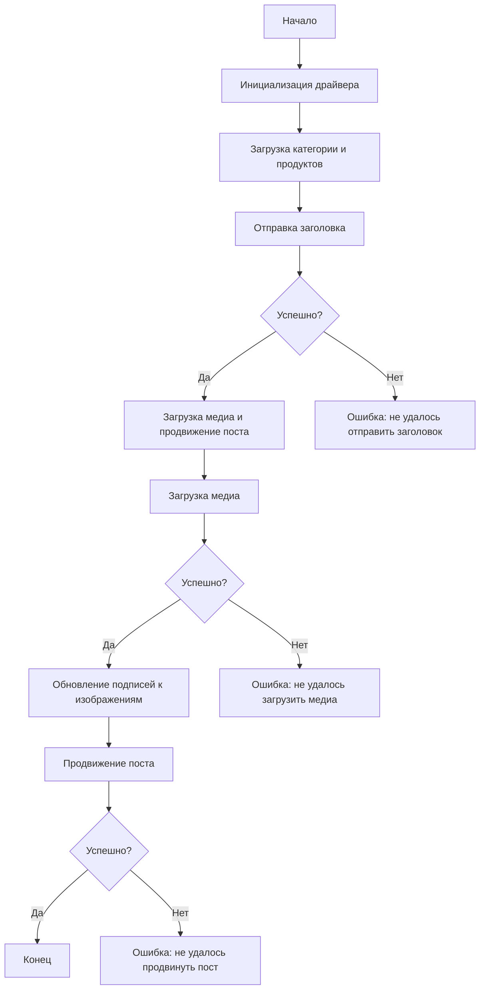

### **Анализ кода модуля `post_message_async.md`**

## \file /hypotez/src/endpoints/advertisement/facebook/scenarios/post_message_async.md

#### **Качество кода**:
- **Соответствие стандартам**: 7/10
- **Плюсы**:
  - Документация предоставляет общее описание функциональности и структуры модуля.
  - Описаны основные функции и их параметры.
  - Приведена схема работы скрипта в виде диаграммы Mermaid.
- **Минусы**:
  - Отсутствуют примеры использования каждой функции.
  - Не указаны возможные исключения, которые могут быть выброшены функциями.
  - Не все параметры функций имеют аннотации типов в описании.
  - Отсутствует описание обработки ошибок внутри функций.
  - В коде используются английские термины и названия, что не соответствует требованиям.

#### **Рекомендации по улучшению**:
1. **Документация модуля**:
   - Добавить заголовок модуля в формате, требуемом инструкцией, с описанием назначения модуля и примером использования.

2. **Функции**:
   - Добавить примеры использования каждой функции.
   - Указать возможные исключения, которые могут быть выброшены функциями.
   - Добавить аннотации типов для всех параметров в описании функций.
   - Описать обработку ошибок внутри функций.

3. **Общее**:
   - Перевести все комментарии и docstring на русский язык в формате UTF-8.

4. **Примеры**:
   - Добавить примеры инициализации `Driver` с использованием конкретного типа драйвера (Chrome, Firefox, Playwright).
   - Показать пример передачи данных в `SimpleNamespace`.

5. **Схема Mermaid**:
   - Убедиться, что схема отражает все возможные пути выполнения и обработки ошибок.

#### **Оптимизированный код**:

```markdown
### **Анализ кода модуля `post_message_async.md`**

## \file /hypotez/src/endpoints/advertisement/facebook/scenarios/post_message_async.md

### **Описание**

Модуль предназначен для автоматизации процесса отправки сообщений в Facebook. Он включает в себя функции для отправки заголовка и описания, загрузки медиафайлов и продвижения поста.

### **Основные компоненты**

- **`post_title`**: Отправляет заголовок и описание кампании в поле сообщения Facebook.
- **`upload_media`**: Загружает медиафайлы (изображения и видео) в пост Facebook.
- **`update_images_captions`**: Обновляет подписи к загруженным медиафайлам.
- **`promote_post`**: Управляет процессом продвижения поста с заголовком, описанием и медиафайлами.

### **Пример использования**

```python
from src.webdriver.driver import Driver
from types import SimpleNamespace

# Инициализация драйвера (пример с Firefox)
driver = Driver(Firefox)

# Загрузка данных для категории и продуктов
category = SimpleNamespace(title="Заголовок кампании", description="Описание кампании")
products = [SimpleNamespace(local_image_path='path/to/image.jpg', ...)]

# Отправка заголовка
post_title(driver, category)

# Загрузка медиа и продвижение поста
promote_post(driver, category, products)
```

---

## Асинхронный сценарий отправки сообщений в Facebook

### Обзор

Этот скрипт является частью директории `hypotez/src/endpoints/advertisement/facebook/scenarios` и предназначен для автоматизации процесса отправки сообщений в Facebook. Скрипт взаимодействует со страницей Facebook, используя локаторы для выполнения различных действий, таких как отправка сообщений, загрузка медиафайлов и обновление подписей.

### Основные особенности

1. **Отправка заголовка и описания**: Отправляет заголовок и описание кампании в поле сообщения Facebook.
2. **Загрузка медиафайлов**: Загружает медиафайлы (изображения и видео) в пост Facebook и обновляет их подписи.
3. **Продвижение поста**: Управляет всем процессом продвижения поста с заголовком, описанием и медиафайлами.

### Структура модуля



### Легенда

1. **Начало**: Начало выполнения скрипта.
2. **Инициализация драйвера**: Создание экземпляра класса `Driver`.
3. **Загрузка категории и продуктов**: Загрузка данных о категории и продуктах.
4. **Отправка заголовка**: Вызов функции `post_title` для отправки заголовка.
5. **Проверка успеха отправки заголовка**: Проверка, был ли успешно отправлен заголовок.
   - **Да**: Переход к загрузке медиа и продвижению поста.
   - **Нет**: Вывод ошибки "Не удалось отправить заголовок".
6. **Загрузка медиа и продвижение поста**: Вызов функции `promote_post`.
7. **Загрузка медиа**: Вызов функции `upload_media` для загрузки медиафайлов.
8. **Проверка успеха загрузки медиа**: Проверка, были ли успешно загружены медиафайлы.
   - **Да**: Переход к обновлению подписей к изображениям.
   - **Нет**: Вывод ошибки "Не удалось загрузить медиа".
9. **Обновление подписей к изображениям**: Вызов функции `update_images_captions` для обновления подписей.
10. **Продвижение поста**: Завершение процесса продвижения поста.
11. **Проверка успеха продвижения поста**: Проверка, был ли успешно продвинут пост.
    - **Да**: Конец выполнения скрипта.
    - **Нет**: Вывод ошибки "Не удалось продвинуть пост".

---

#### Функции

- **`post_title(d: Driver, category: SimpleNamespace) -> bool | None`**:
    - **Назначение**: Отправляет заголовок и описание кампании в поле сообщения Facebook.
    - **Аргументы**:
        - `d (Driver)`: Экземпляр класса `Driver`, используемый для взаимодействия с веб-страницей.
        - `category (SimpleNamespace)`: Категория, содержащая заголовок и описание для отправки.
    - **Возвращает**: `True`, если заголовок и описание были успешно отправлены, в противном случае `None`.
    - **Пример использования**:
    ```python
    driver = Driver(Chrome)
    category = SimpleNamespace(title='Заголовок', description='Описание')
    result = post_title(driver, category)
    if result:
        print('Заголовок успешно отправлен')
    else:
        print('Не удалось отправить заголовок')
    ```
    - **Возможные исключения**:
        - `NoSuchElementException`: Если не найден элемент на странице.
        - `TimeoutException`: Если превышено время ожидания элемента.

- **`upload_media(d: Driver, products: List[SimpleNamespace], no_video: bool = False) -> bool | None`**:
    - **Назначение**: Загружает медиафайлы в пост Facebook.
    - **Аргументы**:
        - `d (Driver)`: Экземпляр класса `Driver`, используемый для взаимодействия с веб-страницей.
        - `products (List[SimpleNamespace])`: Список продуктов, содержащих пути к медиафайлам.
        - `no_video (bool, optional)`: Флаг, указывающий, следует ли пропускать загрузку видео. По умолчанию `False`.
    - **Возвращает**: `True`, если медиафайлы были успешно загружены, в противном случае `None`.
    - **Пример использования**:
    ```python
    driver = Driver(Firefox)
    products = [SimpleNamespace(local_image_path='path/to/image.jpg')]
    result = upload_media(driver, products)
    if result:
        print('Медиафайлы успешно загружены')
    else:
        print('Не удалось загрузить медиафайлы')
    ```
    - **Возможные исключения**:
        - `NoSuchElementException`: Если не найден элемент на странице.
        - `TimeoutException`: Если превышено время ожидания элемента.
        - `FileNotFoundError`: Если не найден медиафайл по указанному пути.

- **`update_images_captions(d: Driver, products: List[SimpleNamespace], textarea_list: List[WebElement]) -> None`**:
    - **Назначение**: Асинхронно добавляет описания к загруженным медиафайлам.
    - **Аргументы**:
        - `d (Driver)`: Экземпляр класса `Driver`, используемый для взаимодействия с веб-страницей.
        - `products (List[SimpleNamespace])`: Список продуктов с деталями для обновления.
        - `textarea_list (List[WebElement])`: Список текстовых областей, в которые добавляются подписи.
    - **Возвращает**: `None`
    - **Пример использования**:
    ```python
    driver = Driver(Playwright)
    products = [SimpleNamespace(description='Описание изображения')]
    textarea_list = driver.find_elements(By.XPATH, '//textarea')
    update_images_captions(driver, products, textarea_list)
    ```
    - **Возможные исключения**:
        - `NoSuchElementException`: Если не найден элемент на странице.
        - `TimeoutException`: Если превышено время ожидания элемента.

- **`promote_post(d: Driver, category: SimpleNamespace, products: List[SimpleNamespace], no_video: bool = False) -> bool | None`**:
    - **Назначение**: Управляет процессом продвижения поста с заголовком, описанием и медиафайлами.
    - **Аргументы**:
        - `d (Driver)`: Экземпляр класса `Driver`, используемый для взаимодействия с веб-страницей.
        - `category (SimpleNamespace)`: Детали категории, используемые для заголовка и описания поста.
        - `products (List[SimpleNamespace])`: Список продуктов, содержащих медиа и детали для публикации.
        - `no_video (bool, optional)`: Флаг, указывающий, следует ли пропускать загрузку видео. По умолчанию `False`.
    - **Возвращает**: `True`, если пост был успешно продвинут, в противном случае `None`.
    - **Пример использования**:
    ```python
    driver = Driver(Chrome)
    category = SimpleNamespace(title='Заголовок', description='Описание')
    products = [SimpleNamespace(local_image_path='path/to/image.jpg')]
    result = promote_post(driver, category, products)
    if result:
        print('Пост успешно продвинут')
    else:
        print('Не удалось продвинуть пост')
    ```
    - **Возможные исключения**:
        - `NoSuchElementException`: Если не найден элемент на странице.
        - `TimeoutException`: Если превышено время ожидания элемента.

### Использование

Чтобы использовать этот скрипт, выполните следующие шаги:

1. **Инициализация драйвера**: Создайте экземпляр класса `Driver`.
2. **Загрузка локаторов**: Загрузите локаторы из JSON-файла.
3. **Вызов функций**: Используйте предоставленные функции для отправки заголовка, загрузки медиа и продвижения поста.

#### Пример

```python
from src.webdriver.driver import Driver
from types import SimpleNamespace

# Инициализация драйвера
driver = Driver(Chrome)

# Загрузка категории и продуктов
category = SimpleNamespace(title="Заголовок кампании", description="Описание кампании")
products = [SimpleNamespace(local_image_path='path/to/image.jpg', ...)]

# Отправка заголовка
post_title(driver, category)

# Загрузка медиа и продвижение поста
promote_post(driver, category, products)
```

### Зависимости

- `selenium`: Для автоматизации веб-интерфейса.
- `asyncio`: Для асинхронных операций.
- `pathlib`: Для обработки путей к файлам.
- `types`: Для создания простых пространств имен.
- `typing`: Для аннотаций типов.

### Обработка ошибок

Скрипт включает надежную обработку ошибок, чтобы гарантировать, что выполнение продолжается, даже если определенные элементы не найдены или есть проблемы с веб-страницей. Это особенно полезно для обработки динамических или нестабильных веб-страниц.

### Вклад

Вклад в этот скрипт приветствуется. Убедитесь, что любые изменения хорошо задокументированы и включают соответствующие тесты.

### Лицензия

Этот скрипт распространяется под лицензией MIT. Подробности см. в файле `LICENSE`.